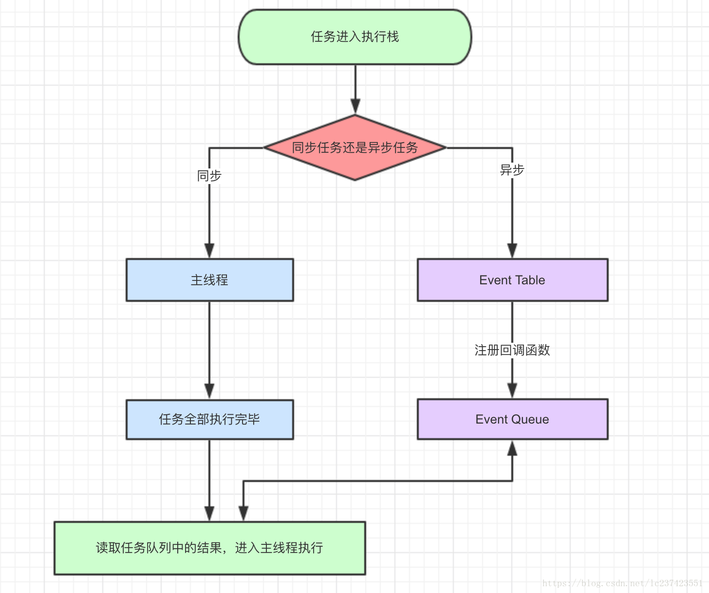

# js事件轮询、微任务和宏任务

<!-- TOC -->

- [js事件轮询、微任务和宏任务](#js事件轮询微任务和宏任务)
  - [事件循环与消息队列](#事件循环与消息队列)
  - [总结](#总结)
  - [追加 20190301](#追加-20190301)
    - [分别很么样的场景会形成macrotask和microtask呢？](#分别很么样的场景会形成macrotask和microtask呢)
    - [再根据线程来理解下：](#再根据线程来理解下)
    - [使用MutationObserver实现microtask](#使用MutationObserver实现microtask)

<!-- /TOC -->

JavaScript是单线程语言，也就是说同一个事件只能做一件事。JaVaScript的单线程，与它的用途有关，作为浏览器脚本语言，JavaScript的主要用途是与用户交互，以及操作DOM。这决定了它只能是单线程，否则会带来很多复杂的同步问题。为了利用多核CPU的计算能力，虽然HTML5提出了Web Worker，允许JavaScript脚本创建多个线程，但是子线程完全受主线程控制，且不得操作DOM和BOM。所以，依然没有改变JavaScript是单线程的本质。

为了解决单线程导致的线程等待资源，cpu空闲，而其他任务一直等待的问题。将所有的任务分为两种，`一种是同步任务`，`一种是异步任务`。
* **同步任务指的是，在主线程上排队执行的任务，只有前一个任务执行完毕，才能执行下一个任务。**
* **异步任务指的是，不进入主线程，而进入“任务队列”的任务，自由“任务队列”通知主线程，某个异步任务可以执行了，该任务才会进入主线程执行。**

主任务和任务队列示意图：

<div align="center"></div>

**执行过程：**
1. 所有的同步任务都在主线程上指向，形成一个执行栈
2. 主线程之外，还存在一个“任务队列”。只要异步任务有了运行结果，就在“任务队列”之中放置一个事件。
3. 一旦“执行栈”中的所有同步任务执行完毕，系统就会读取“任务队列”，将可执行的任务放在主线程执行。任务队列是一个先进先出的数据结构，排在前面的事件，优先被主线程读取。
4. 主线程不短重复上面的第三步。

只要主线程空了，就会去读取“任务队列”。   
Event Loop（事件轮询）   
主线程从“任务队列”中读取事件，这个过程是循环不断的，所以整个过程的这种运行机制又称为Event Loop（事件循环） 

<div align="center"></div> 

除了放置异步任务的队列，“任务队列还放置定时器”，即指定某些代码在多长时间之后执行。定时器功能的主要由setTimeout()和setInterval()这两个函数执行。setTimeout()只执行一次，setInterval()反复执行。

Node规定，process.nextTick和Promise的回调函数，追加在本轮循环，即同步任务一旦执行完成，就开始执行它们。而setTimeout、setInterval、setImmediate的回调函数，追加在次轮循环。

除了广义的同步任务和异步的任务，更精细的定义为：
1. **macro-task(宏任务)**：包括整体代码script、setTimeout，setInterval
2. **micro-task(微任务)**：Promise、process.nextTick

下面代码可以帮助理解上面的内容：
```js
console.log('1');
setTimeout(function() {
    console.log('2');
    process.nextTick(function() {
        console.log('3');
    })
    new Promise(function(resolve) {
        console.log('4');
        resolve();
    }).then(function() {
        console.log('5')
    })
})
process.nextTick(function() {
    console.log('6');
})
new Promise(function(resolve) {
    console.log('7');
    resolve();
}).then(function() {
    console.log('8')
})

setTimeout(function() {
    console.log('9');
    process.nextTick(function() {
        console.log('10');
    })
    new Promise(function(resolve) {
        console.log('11');
        resolve();
    }).then(function() {
        console.log('12')
    })
})
```

js代码都是从上到下，一行一行指向，首先遇到第一行console.log(‘1’)；执行输出1，然后第二行`setTimeout异步任务`，放入任务队列。下面遇到`promise.nextTick是微任务`放到本轮循环的结尾，之后遇到`new Promise`直接指向输出7，`then`被放到本轮循环的结尾，接着执行又遇到的`setTimeout`放到任务队列，本轮代码执行完，开始依次执行本轮结尾的代码，输出6,8。然后主线程的任务执行完毕，无任务队列中取出一个`setTimeout`放入主线程开始执行，输出2，然后遇到`process.nextTick`，放到本轮循环的结尾，执行`new Promise`输出4,`then`放入本轮循环结尾，主线程代码执行完，开始执行本轮结尾输出3,5。然后再去任务队列中取第二个`setTimeout`执行输出9,11,10,12。

所以输出的顺序为1，7，6，8，2，4，3，5，9，11，10，12。

因为settimeout是宏任务，虽然先执行的他，但是他被放到了宏任务的eventqueue里面，然后代码继续往下检查看有没有微任务，检测到Promise的then函数把他放入了微任务序列。等到主线进程的所有代码执行结束后。先从微任务queue里拿回掉函数，然后微任务queue空了后再从宏任务的queue拿函数。

在node环境下，process.nextTick的优先级高于Promise，也就是说：在宏任务结束后会先执行微任务队列中的nextTickQueue，然后才会执行微任务中的Promise。


请注意，node环境下的事件监听依赖libuv与前端环境不完全相同，输出顺序可能会有误差。

## 事件循环与消息队列
回到事件循环 event loop

其实 **事件循环** 机制和 **消息队列** 的维护是由事件触发线程控制的。

**事件触发线程** 同样是浏览器渲染引擎提供的，它会维护一个 **消息队列**。

JS引擎线程遇到异步（DOM事件监听、网络请求、setTimeout计时器等...），会交给相应的线程单独去维护异步任务，等待某个时机（计时器结束、网络请求成功、用户点击DOM），然后由 **事件触发线程** 将异步对应的 **回调函数** 加入到消息队列中，消息队列中的回调函数等待被执行。

同时，JS引擎线程会维护一个 **执行栈**，同步代码会依次加入执行栈然后执行，结束会退出执行栈。

如果执行栈里的任务执行完成，即执行栈为空的时候（即JS引擎线程空闲），事件触发线程才会从消息队列取出一个任务（即异步的回调函数）放入执行栈中执行。

> 消息队列是类似队列的数据结构，遵循先入先出(FIFO)的规则。

执行完了后，执行栈再次为空，事件触发线程会重复上一步操作，再取出一个消息队列中的任务，这种机制就被称为事件循环（event loop）机制。


## 总结

* 执行机制：
  1. 执行一个宏任务（栈中没有就从事件队列中获取）
  2. 执行过程中如果遇到微任务，就将它添加到微任务的任务队列中
  3. 宏任务执行完毕后，立即执行当前微任务队列中的所有微任务（依次执行）
  4. 当前宏任务执行完毕，开始检查渲染，然后GUI线程接管渲染
  5. 渲染完毕后，JS引擎线程继续，开始下一个宏任务（从宏任务队列中获取）


* JavaScript 是单线程语言，决定于它的设计最初是用来处理浏览器网页的交互。浏览器负责解释和执行 JavaScript 的线程只有一个（所有说是单线程），即JS引擎线程，但是浏览器同样提供其他线程，如：事件触发线程、定时器触发线程等。

* 异步一般是指：
  * 网络请求
  * 计时器
  * DOM事件监听

* 事件循环机制：
  * JS引擎线程会维护一个执行栈，同步代码会依次加入到执行栈中依次执行并出栈。
  * JS引擎线程遇到异步函数，会将异步函数交给相应的Webapi，而继续执行后面的任务。
  * Webapi会在条件满足的时候，将异步对应的回调加入到消息队列中，等待执行。
  * 执行栈为空时，JS引擎线程会去取消息队列中的回调函数（如果有的话），并加入到执行栈中执行。
  * 完成后出栈，执行栈再次为空，重复上面的操作，这就是事件循环(event loop)机制。


## 追加 20190301

JS中分为两种任务类型：`macrotask`和`microtask`，在ECMAScript中，`microtask`称为**jobs**，`macrotask`可称为**task**

它们的定义？区别？简单点可以按如下理解：

* macrotask（又称之为宏任务），可以理解是每次执行栈执行的代码就是一个宏任务（包括每次从事件队列中获取一个事件回调并放到执行栈中执行）
    - 每一个task会从头到尾将这个任务执行完毕，不会执行其它
    - 浏览器为了能够使得JS内部task与DOM任务能够有序的执行，会在一个task执行结束后，在下一个 task 执行开始前，对页面进行重新渲染 （`task->渲染->task->...`）

* microtask（又称为微任务），可以理解是在当前 task 执行结束后立即执行的任务
    - 也就是说，在当前task任务后，下一个task之前，在渲染之前
    - 所以它的响应速度相比setTimeout（setTimeout是task）会更快，因为无需等渲染
    - 也就是说，在某一个macrotask执行完后，就会将在它执行期间产生的所有microtask都执行完毕（在渲染前）

### 分别很么样的场景会形成macrotask和microtask呢？

* macrotask：主代码块，setTimeout，setInterval等（可以看到，事件队列中的每一个事件都是一个macrotask）
* microtask：Promise，process.nextTick等

**补充**：在node环境下，process.nextTick的优先级高于Promise，也就是可以简单理解为：在宏任务结束后会先执行微任务队列中的nextTickQueue部分，然后才会执行微任务中的Promise部分。

### 再根据线程来理解下：
* macrotask中的事件都是放在一个事件队列中的，而这个队列由事件触发线程维护
* microtask中的所有微任务都是添加到微任务队列（Job Queues）中，等待当前macrotask执行完毕后执行，而这个队列由**JS引擎线程维护** （这点由自己理解+推测得出，因为它是在主线程下无缝执行的）

所以，总结下运行机制：
* 执行一个宏任务（栈中没有就从事件队列中获取）
* 执行过程中如果遇到微任务，就将它添加到微任务的任务队列中
* 宏任务执行完毕后，立即执行当前微任务队列中的所有微任务（依次执行）
* 当前宏任务执行完毕，开始检查渲染，然后GUI线程接管渲染
* 渲染完毕后，JS线程继续接管，开始下一个宏任务（从事件队列中获取）

另外，请注意下`Promise`的`polyfill`与`官方版本`的区别：
* 官方版本中，是标准的microtask形式
* polyfill，一般都是通过setTimeout模拟的，所以是macrotask形式

请特别注意这两点区别

注意，有一些浏览器执行结果不一样（因为它们可能把microtask当成macrotask来执行了），
但是为了简单，这里不描述一些不标准的浏览器下的场景（但记住，有些浏览器可能并不标准）

### 使用MutationObserver实现microtask

`MutationObserver`可以用来实现`microtask`（**它属于microtask，优先级小于Promise，一般是Promise不支持时才会这样做**）

它是HTML5中的新特性，作用是：监听一个DOM变动，当DOM对象树发生任何变动时，Mutation Observer会得到通知

像以前的Vue源码中就是利用它来模拟nextTick的，具体原理是，创建一个TextNode并监听内容变化，然后要nextTick的时候去改一下这个节点的文本内容，
如下：（Vue的源码，未修改）
```js
var counter = 1
var observer = new MutationObserver(nextTickHandler)
var textNode = document.createTextNode(String(counter))

observer.observe(textNode, {
    characterData: true
})
timerFunc = () => {
    counter = (counter + 1) % 2
    textNode.data = String(counter)
}
```

[对应Vue源码链接](https://github.com/vuejs/vue/blob/9cfd63a7d08c1eba029c8bd7463b3047c3347826/src/core/util/env.js#L86-L95)
 
不过，现在的Vue（2.5+）的nextTick实现移除了MutationObserver的方式（据说是兼容性原因）， 取而代之的是使用MessageChannel （当然，默认情况仍然是Promise，不支持才兼容的）。

`MessageChannel`属于宏任务，优先级是：`MessageChannel->setTimeout`， 所以Vue（2.5+）内部的nextTick与2.4及之前的实现是不一样的，需要注意下。