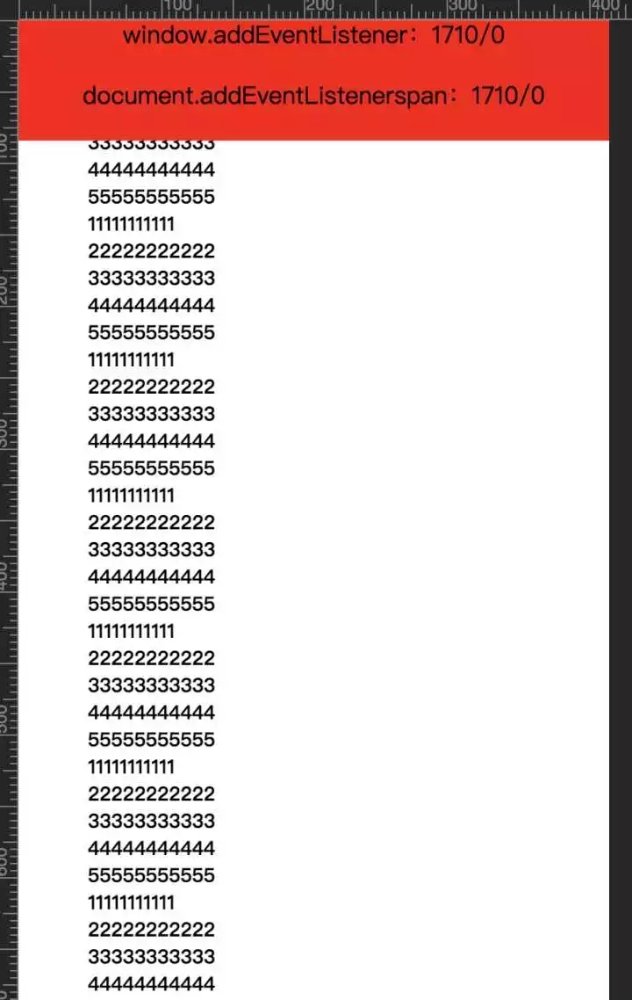
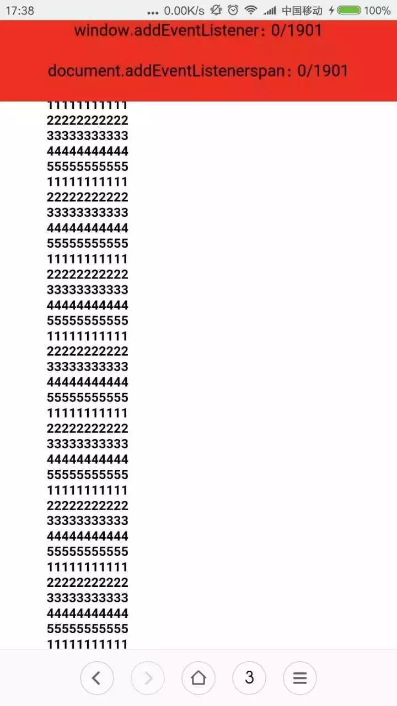

### 关于移动端,webview 监听滚动条的坑

最近接到一个需求，中途需要动态设置滚动条的scrolltop值，发现在PC上都没问题，然而上测试环境，各种问题，页面老是不按照设想的那样，最终发现是移动端对滚动条的处理不一致导致。

DEMO：
```js
window.onload = function() {
  window.addEventListener("scroll", function() {
		var a = document.documentElement.scrollTop;
		var b = document.body.scrollTop;

		document.getElementById("win").innerText = a + "/" + b;
  });

  document.addEventListener("scroll", function() {
		var a = document.documentElement.scrollTop;
		var b = document.body.scrollTop;
					
		document.getElementById("doc").innerText = a + "/" + b;
  })
}
```

监听滚动条事件
```html
<!DOCTYPE html>
<html>

	<head>
		<meta charset="UTF-8">
		<title></title>
		<link rel="stylesheet" href="css/reset.css" />
		<style type="text/css">
			body {
				width: 100%;
				height: auto;
				position: relative;
			}
			
			.main {
				width: 100%;
			}
			
			.fix {
				position: fixed;
				left: 0px;
				top: 0px;
				width: 100%;
				height: 200px; 
				background: red;
				text-align: center;
				line-height: 50px;
				font-size: 40px;
			}
		</style>

		<script type="text/javascript">
			window.onload = function() {
				window.addEventListener("scroll", function() {
					var a = document.documentElement.scrollTop;
					var b = document.body.scrollTop;

					document.getElementById("win").innerText = a + "/" + b;
				});

				document.addEventListener("scroll", function() {
					var a = document.documentElement.scrollTop;
					var b = document.body.scrollTop;
					
					document.getElementById("doc").innerText = a + "/" + b;
				})
			}
		</script>
	</head>

	<body>
		<div class="fix" id="fix">
			<h4>window.addEventListener：<span id="win"></span></h4><br />
			<h4>document.addEventListenerspan：<span id="doc"></span></h4>
		</div>

		<div class="main">
			<h1>11111111111</h1>
			<h1>22222222222</h1>
			<h1>33333333333</h1>
			<h1>44444444444</h1>
			<h1>55555555555</h1>
			<h1>11111111111</h1>
			<h1>22222222222</h1>
			<h1>33333333333</h1>
			<h1>44444444444</h1>
			<h1>55555555555</h1>
			<h1>11111111111</h1>
			<h1>22222222222</h1>
			<h1>33333333333</h1>
			<h1>44444444444</h1>
			<h1>55555555555</h1>
			<h1>11111111111</h1>
			<h1>22222222222</h1>
			<h1>33333333333</h1>
			<h1>44444444444</h1>
			<h1>55555555555</h1>
			<h1>11111111111</h1>
			<h1>22222222222</h1>
			<h1>33333333333</h1>
			<h1>44444444444</h1>
			<h1>55555555555</h1>
			<h1>11111111111</h1>
			<h1>22222222222</h1>
			<h1>33333333333</h1>
			<h1>44444444444</h1>
			<h1>55555555555</h1>
			<h1>11111111111</h1>
			<h1>22222222222</h1>
			<h1>33333333333</h1>
			<h1>44444444444</h1>
			<h1>55555555555</h1>
			<h1>11111111111</h1>
			<h1>22222222222</h1>
			<h1>33333333333</h1>
			<h1>44444444444</h1>
			<h1>55555555555</h1>
			<h1>11111111111</h1>
			<h1>22222222222</h1>
			<h1>33333333333</h1>
			<h1>44444444444</h1>
			<h1>55555555555</h1>
			<h1>11111111111</h1>
			<h1>22222222222</h1>
			<h1>33333333333</h1>
			<h1>44444444444</h1>
			<h1>55555555555</h1>
			<h1>11111111111</h1>
			<h1>22222222222</h1>
			<h1>33333333333</h1>
			<h1>44444444444</h1>
			<h1>55555555555</h1>
			<h1>11111111111</h1>
			<h1>22222222222</h1>
			<h1>33333333333</h1>
			<h1>44444444444</h1>
			<h1>55555555555</h1>
			<h1>11111111111</h1>
			<h1>22222222222</h1>
			<h1>33333333333</h1>
			<h1>44444444444</h1>
			<h1>55555555555</h1>
			<h1>11111111111</h1>
			<h1>22222222222</h1>
			<h1>33333333333</h1>
			<h1>44444444444</h1>
			<h1>55555555555</h1>
			<h1>11111111111</h1>
			<h1>22222222222</h1>
			<h1>33333333333</h1>
			<h1>44444444444</h1>
			<h1>55555555555</h1>
			<h1>11111111111</h1>
			<h1>22222222222</h1>
			<h1>33333333333</h1>
			<h1>44444444444</h1>
			<h1>55555555555</h1>
			<h1>11111111111</h1>
			<h1>22222222222</h1>
			<h1>33333333333</h1>
			<h1>44444444444</h1>
			<h1>55555555555</h1>
			<h1>11111111111</h1>
			<h1>22222222222</h1>
			<h1>33333333333</h1>
			<h1>44444444444</h1>
			<h1>55555555555</h1>
			<h1>11111111111</h1>
			<h1>22222222222</h1>
			<h1>33333333333</h1>
			<h1>44444444444</h1>
			<h1>55555555555</h1>
			<h1>11111111111</h1>
			<h1>22222222222</h1>
			<h1>33333333333</h1>
			<h1>44444444444</h1>
			<h1>55555555555</h1>
			<h1>11111111111</h1>
			<h1>22222222222</h1>
			<h1>33333333333</h1>
			<h1>44444444444</h1>
			<h1>55555555555</h1>
			<h1>11111111111</h1>
			<h1>22222222222</h1>
			<h1>33333333333</h1>
			<h1>44444444444</h1>
			<h1>55555555555</h1>
			<h1>11111111111</h1>
			<h1>22222222222</h1>
			<h1>33333333333</h1>
			<h1>44444444444</h1>
			<h1>55555555555</h1>
			<h1>11111111111</h1>
			<h1>22222222222</h1>
			<h1>33333333333</h1>
			<h1>44444444444</h1>
			<h1>55555555555</h1>
			<h1>11111111111</h1>
			<h1>22222222222</h1>
			<h1>33333333333</h1>
			<h1>44444444444</h1>
			<h1>55555555555</h1>
		</div>
	</body>

</html>
```

PC上：


手机上：


**所以移动端需要设置滚动条请使用**
```js
document.body.scrollTop
```

**PC上使用：**
```js
document.documentElement.scrollTop
```