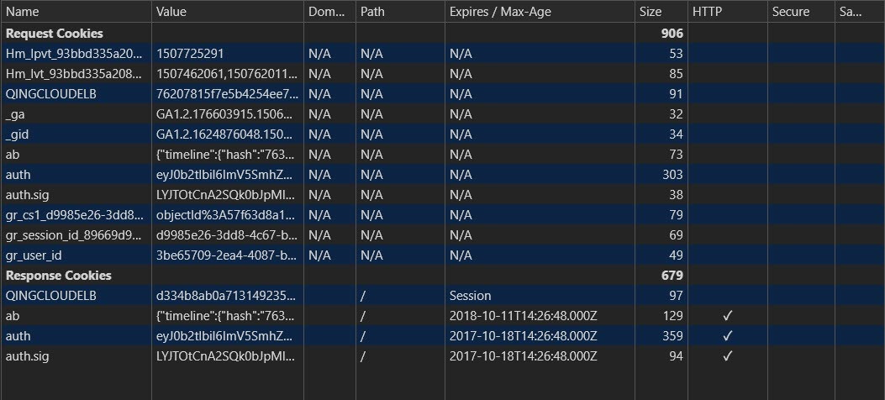

# cookie与session
<!-- TOC -->

- [cookie与session](#cookie与session)
  - [cookie](#cookie)
    - [cookie原理](#cookie原理)
    - [cookie的不可跨域名性](#cookie的不可跨域名性)
    - [cookie属性](#cookie属性)
      - [name](#name)
      - [value](#value)
      - [domain](#domain)
      - [path](#path)
      - [Expires/Max-Age](#ExpiresMax-Age)
      - [secure](#secure)
      - [HttpOnly](#HttpOnly)
    - [关于JavaScript操作cookie](#关于JavaScript操作cookie)
    - [服务端如何去设置cookie](#服务端如何去设置cookie)
    - [cookie与session](#cookie与session-1)
    - [session对浏览器的要求](#session对浏览器的要求)
    - [session中不使用cookie](#session中不使用cookie)
    - [cookie session 区别](#cookie-session-区别)
  - [session理解](#session理解)
    - [1. session的概念](#1-session的概念)
    - [2. cookie与session的关系](#2-cookie与session的关系)
    - [3. 创建 session和销毁session的时机](#3-创建-session和销毁session的时机)

<!-- /TOC -->

## cookie

### cookie原理

<div align="center"></div>

第一次访问网站的时候，浏览器发出请求，服务器响应请求后，会将 cookie 放入到响应请求中，在浏览器第二次发请求的时候，会把 cookie 带过去，服务端会辨别用户身份，当然服务器也可以修改 cookie 内容（后面会谈到这点）。cookie 的产生是通过扩展 HTTP 协议来实现的，服务器通过在 HTTP 响应头中加上一行特殊的指示以提示浏览器按照指示生成相应的 cookie。然而纯粹的客户端脚本如 JavaScript 也可以生成 cookie。而 cookie 的使用是由浏览器按照一定的原则在后台自动发送给服务器的。浏览器检查所有存储的 cookie ，如果某个 cookie 所声明的作用范围（这个作用范围由 cookie 的 path 和 domain 同时决定）大于等于将要请求的资源所在的位置，则把该 cookie 附在请求资源的 HTTP 请求头上发送给服务器。

### cookie的不可跨域名性
cookie具有不可跨域名性。根据 cookie 规范，浏览器访问 Google 只会携带 Google 的 cookie，而不会携带 Baidu 的 cookie。Google 也只能操作 Google 的 cookie，而不能操作 Baidu 的 cookie。

cookie 在客户端是由浏览器来管理的。浏览器能够保证 Google 只会操作 Google 的 cookie 而不会操作 Baidu的 cookie，从而保证用户的隐私安全。浏览器判断一个网站是否能操作另一个网站 cookie 的依据是域名。Google 与 Baidu 的域名不一样，因此 Google 不能操作 Baidu 的 cookie。

需要注意的是，虽然网站 images.google.com与网站 www.google.com 同属于Google，但是域名不一样，二者同样不能互相操作彼此的 cookie。

注意：用户登录网站 www.google.com 之后会发现访问 images.google.com 时登录信息仍然有效，而普通的 cookie 是做不到的。这是因为 Google在后端进行了相关处理。

### cookie属性
cookie 的属性比较多，我们可以看下下面这张图

<div align="center"></div>

#### name
这个显而易见，就是代表 cookie 的名字的意思，一个域名下绑定的 cookie ，name 不能相同，相同的 name 的值会被覆盖掉

#### value
这个就是每个 cookie 拥有的一个属性，它表示该属性的值

#### domain
这个是指的域名，这个代表的是，cookie 绑定的域名，如果没有设置，就会自动绑定到执行语句的当前域，还有值得注意的点，统一个域名下的二级域名也是不可以交换使用 cookie 的，比如，你设置 www.baidu.com 和 image.baidu.com ，依旧是不能公用的

#### path
path这个属性默认是/，当你设置成比如/blog的时候，其实它会给 “domain+path” 范围内绑定 cookie

#### Expires/Max-Age
该属性决定 cookie 的有效期，一般浏览器的 cookie 都是默认储存的，当关闭浏览器结束这个会话的时候，这个 cookie 也就会被删除，这就是上图中的—— session (会话储存)。

如果你想要 cookie 存在一段时间，那么你可以通过设置 Expires 属性为未来的一个时间节点，Expires 这个是代表当前时间的，这个属性已经逐渐被我们下面这个主人公所取代——Max-Age。

Max-Age，是以秒为单位的，Max-Age 为正数时，cookie 会在 Max-Age 秒之后被删除。在 Max-Age 之前 cookie 是保存到硬盘上，即使关闭浏览器后再次打开，这些 cookie 仍然有效直到超过设定的过期时间。存储在硬盘上的 cookie 可以在不同的浏览器进程间共享，比如两个 IE 窗口。当 Max-Age 为负数时，表示的是临时储存，不会生出 cookie 文件，只会存在浏览器内存中，且只会在打开的浏览器窗口或者子窗口有效，一旦浏览器关闭， cookie 就会消失，当 Max-Age 为 0 时，又会发生什么呢，删除 cookie ，因为cookie 机制本身没有设置删除 cookie ，失效的 cookie 会被浏览器自动从内存中删除，所以，它实现的就是让 cookie 失效。

#### secure
这个属性译为安全，http 不仅是无状态的，还是不安全的协议，容易被劫持。所以当这个属性设置为 true 时，此 cookie 只会在 https 和 ssl 等安全协议下传输。但需要强调一下这个属性并不能对客户端的cookie进行加密，不能保证绝对的安全性

#### HttpOnly
这个属性是面试的时候常考的，如果这个属性设置为 `true`，就不能通过 JavaScript 脚本来获取 cookie 的值，能有效的防止xss 攻击,看 MDN 的官方文档：
> 为避免跨域脚本 (`XSS`) 攻击，通过JavaScript的 `Document.cookie API`无法访问有`HttpOnly` 标记的Cookie，Cookie只需要发送给服务端。如果包含服务端session信息的Cookie不想被客户端Javascript使用，那么就需要使用`HttpOnly` 标记

### 关于JavaScript操作cookie
`document.cookie` 可以对 `cookie` 进行读写：
```js
console.log(document.cookie);	//读取浏览器中的cookie
document.cookie='myname=liuzhiyu;path=/;domain=.baidu.com';	//	写入 cookie
```

### 服务端如何去设置cookie
<div align="center"></div>

服务端就是通过 `setCookie` 来设置 `cookie` 的，注意点，要设置多个 cookie 时，得多写几个 setCookie ，我们还可以从上图看到，请求可以携带 cookie 给后端。

### cookie与session
本片开头已说过 HTTP 是一个不保存状态的协议。session 是服务器端使用的一种记录客户端状态的机制，不同的是 cookie 保存在客户端浏览器中，而 session 保存在服务器上。客户端浏览器访问服务器的时候，服务器把客户端信息以某种形式记录在服务器上。这就是 session。客户端浏览器再次访问时只需要从该 session 中查找该客户的状态就可以了。如果说 `cookie 机制是通过检查客户身上的“通行证”来确定客户身份的话，那么 session 机制就是通过检查服务器上的“客户明细表”来确认客户身份。session 相当于程序在服务器上建立的一份客户档案，客户来访的时候只需要查询客户档案表就可以了`。

### session对浏览器的要求
虽然 session 保存在服务器中，对客户端是透明的，它的正常运行仍然需要客户端浏览器的支持。这是因为 session 需要使用 cookie 作为识别标志。HTTP 协议是无状态的，session 不能依据 HTTP 连接来判断是否为同一客户，因此服务器向客户端浏览器发送一个名为 JSESSIONID 的 cookie，它的值为该 session 的 id。session 依据该cookie 来识别是否为同一用户。该 cookie 为服务器自动生成的，它的 MaxAge 属性一般为–1，表示仅当前浏览器内有效，并且各浏览器窗口间不共享，关闭浏览器就会失效。

### session中不使用cookie
URL 地址重写是对客户端不支持 cookie 的解决方案。URL 地址重写的原理是将该用户 session 的 id 信息重写到 URL 地址中。服务器能够解析重写后的 URL 获取 session 的 id。这样即使客户端不支持 cookie，也可以使用 session 来记录用户状态。

### cookie session 区别
1. cookie 数据存放在客户的浏览器上，session数据放在服务器上
2. cookie 不是很安全，别人可以分析存放在本地的 COOKIE 并进行 COOKIE 欺骗考虑到安全应当使用 session
3. session 会在一定时间内保存在服务器上。当访问增多，会比较占用你服务器的性能考虑到减轻服务器性能方面，应当使用 COOKIE
4. 单个 cookie 保存的数据不能超过 4K，很多浏览器都限制一个站点最多保存20个 cookie。
   
鉴于上述区别我们建议
1. 将登陆信息等重要信息存放为 SESSION
2. 其他信息如果需要保留，可以放在 COOKIE 中

-----------

## session理解

### 1. session的概念
session 是服务器端使用的一种记录客户端状态的机制，不同的是 cookie 保存在客户端浏览器中，而 session 保存在服务器上。客户端浏览器访问服务器的时候，服务器把客户端信息以某种形式记录在服务器上。这就是 session。客户端浏览器再次访问时只需要从该 session 中查找该客户的状态就可以了

### 2. cookie与session的关系
cookie和session的方案虽然分别属于客户端和服务端，但是服务端的session的实现对客户端的cookie有依赖关系的；步骤大概如下：
* 服务端执行Session机制
* 生成对应而唯一的session_id(通过对这个session_id的解析和处理，服务端可以找到，该session保存的文件；再从文件中提取出session的信息)
* 服务端会将这个session_id发送给客户端
* 客户端接受到session_id,以cookie作为保存的容器保存起来
* 客户端在每次请求的时候都会带这个session_id给服务端
* 服务端自行解析session

注意：session保存信息的手段是多种的：`缓存`，`数据库`，`文件`等；但是`默认是文件`形式保存。。

### 3. 创建 session和销毁session的时机
1. 创建session的时候会附带着创建一个cookie，它的MaxAge为-1，也就是说只能存在于内存中。当浏览器端禁用cookie时，这个cookie依然会被创建。
2. 当浏览器提交的请求中有jsessionid参数或cookie报头时，容器不再新建session，而只是找到先前的session进行关联。这里又分为两种情况：  
    1. 使用jsessionid。该值若能与现有的session对应，就不创建新的session，否则，仍然创建新的session。
    2. 使用cookie。该值若能与现有的session对应，也不创建新的session；但若没有session与之对应（就如上面的重启服务器之后）容器会根据cookie信息恢复这个与之对应的session，就好像是以前有过一样。
3. session何时被销毁？   
   当我们关闭浏览器，再打开它，连接服务器时，服务器端会分配一个新的session，也就是说会启动一个新的会话。那么原来的session是不是被销毁了呢？我做了个小实验：

创建一个session：
```js
//启动session的初始化
session_start();
//注册session变量，并且赋值
$_SESSION["username"] = "hello"
//输出生成的session_id
echo session_id();
```

访问页面创建session,获取session_id,关闭浏览器;

根据session_id创建session对象
```js
//上面输出的session_id
$session_id = "qpk6onnn3husvotnke030ftcm4";
session_id($session_id);
session_start();
echo $_SESSION["username"];
```

结果可以取出 "hello"

由此可以看出: 

当浏览器关闭时，原session并没有被销毁（destory方法没有执行），而是等到timeout到期，才销毁这个session。关闭浏览器只是在客户端的内存中清除了与原会话相关的cookie，再次打开浏览器进行连接时，浏览器无法发送cookie信息，所以服务器会认为是一个新的会话。因此，如果有某些与session关联的资源想在关闭浏览器时就进行清理（如临时文件等），那么应该发送特定的请求到服务器端，而不是等到session的自动清理。