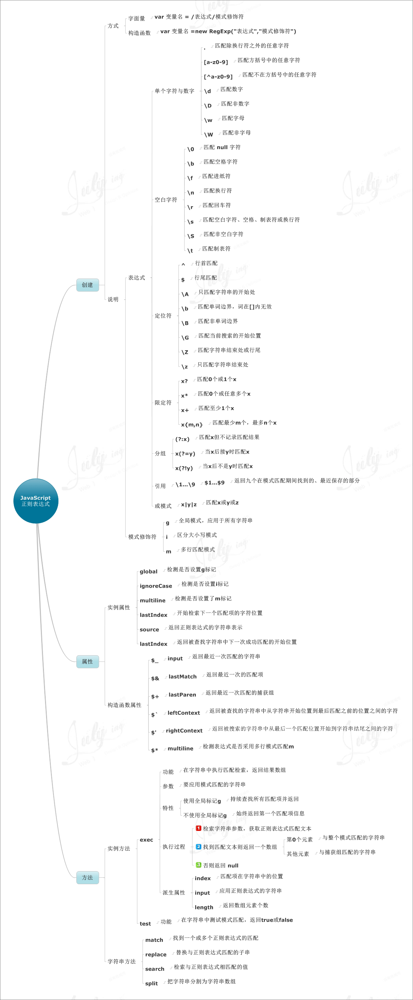

# RegExp
<!-- TOC -->

- [RegExp](#RegExp)
  - [一些常用正则验证](#一些常用正则验证)
    - [验证数字的正则表达式集](#验证数字的正则表达式集)
    - [金额最多保留两位小数 && . -> 0.](#金额最多保留两位小数-----0)
      - [ant mobile InputItem](#ant-mobile-InputItem)
      - [ant design FormItem](#ant-design-FormItem)
  - [正则进阶之路](#正则进阶之路)
    - [1、获取链接 https://www.baidu.com?name=jawil&age=23 name的value值](#1获取链接-httpswwwbaiducomnamejawilage23-name的value值)
    - [2. 数字格式化问题，1234567890 --> 1,234,567,890](#2-数字格式化问题1234567890----1234567890)
    - [3、去掉字符串左右两边的空格，" jaw il " --> “jaw il”](#3去掉字符串左右两边的空格-jaw-il-----jaw-il)
    - [4、判断一个数是否是质数 3 --> true](#4判断一个数是否是质数-3----true)
    - [5、字符串数组去重 ["a","b","c","a","b","c"] --> ["a","b","c"]](#5字符串数组去重-abcabc----abc)
  - [一张图快速入门正则表达式：](#一张图快速入门正则表达式)

<!-- /TOC -->


## 一些常用正则验证

### 验证数字的正则表达式集 

1. 验证数字：^[0-9]*$ 
2. 验证n位的数字：^\d{n}$ 
3. 验证至少n位数字：^\d{n,}$ 
4. 验证m-n位的数字：^\d{m,n}$ 
5. 验证零和非零开头的数字：^(0|[1-9][0-9]*)$ 
6. 验证有两位小数的正实数：^[0-9]+(.[0-9]{2})?$ 
7. 验证有1-3位小数的正实数：^[0-9]+(.[0-9]{1,3})?$ 
8. 验证非零的正整数：^\+?[1-9][0-9]*$ 
9. 验证非零的负整数：^\-[1-9][0-9]*$ 
10. 验证非负整数（正整数 + 0） ^\d+$ 
11. 验证非正整数（负整数 + 0） ^((-\d+)|(0+))$ 
12. 验证长度为3的字符：^.{3}$ 
13. 验证由26个英文字母组成的字符串：^[A-Za-z]+$ 
14. 验证由26个大写英文字母组成的字符串：^[A-Z]+$ 
15. 验证由26个小写英文字母组成的字符串：^[a-z]+$ 
16. 验证由数字和26个英文字母组成的字符串：^[A-Za-z0-9]+$ 
17. 验证由数字、26个英文字母或者下划线组成的字符串：^\w+$ 
18. 验证用户密码:^[a-zA-Z]\w{5,17}$ 正确格式为：以字母开头，长度在6-18之间，只能包含字符、数字和下划线。 
19. 验证是否含有 ^%&',;=?$\" 等字符：[^%&',;=?$\x22]+ 
20. 验证汉字：^[\u4e00-\u9fa5],{0,}$ 
21. 验证Email地址：/^([a-zA-Z0-9]+[_|\_|\.]?)*[a-zA-Z0-9]+@([a-zA-Z0-9]+[_|\_|\.]?)*[a-zA-Z0-9]+\.[a-zA-Z]{2,3}$/
22. 验证InternetURL：^http://([\w-]+\.)+[\w-]+(/[\w-./?%&=]*)?$ ；^[a-zA-z]+://(w+(-w+)*)(.(w+(-w+)*))*(?S*)?$ 
23. 验证电话号码：^(\(\d{3,4}\)|\d{3,4}-)?\d{7,8}$：--正确格式为：XXXX-XXXXXXX，XXXX-XXXXXXXX，XXX-XXXXXXX，XXX-XXXXXXXX，XXXXXXX，XXXXXXXX。 
24. 验证身份证号（15位或18位数字）：^\d{15}|\d{}18$ 
25. 验证一年的12个月：^(0?[1-9]|1[0-2])$ 正确格式为：“01”-“09”和“1”“12” 
26. 验证一个月的31天：^((0?[1-9])|((1|2)[0-9])|30|31)$ 正确格式为：01、09和1、31。 
27. 整数：^-?\d+$ 
28. 非负浮点数（正浮点数 + 0）：^\d+(\.\d+)?$ 
29. 正浮点数 ^(([0-9]+\.[0-9]*[1-9][0-9]*)|([0-9]*[1-9][0-9]*\.[0-9]+)|([0-9]*[1-9][0-9]*))$ 
30. 非正浮点数（负浮点数 + 0） ^((-\d+(\.\d+)?)|(0+(\.0+)?))$ 
31. 负浮点数 ^(-(([0-9]+\.[0-9]*[1-9][0-9]*)|([0-9]*[1-9][0-9]*\.[0-9]+)|([0-9]*[1-9][0-9]*)))$ 
32. 浮点数 ^(-?\d+)(\.\d+)?$

###  金额最多保留两位小数 && . -> 0.

> /^\d{1,}\.{0,1}\d{0,2}$/

> /^([1-9]\d*|0)(\.\d{1,2})?$/

#### ant mobile InputItem

```js
const isIPhone = new RegExp('\\biPhone\\b|\\biPod\\b', 'i').test(window.navigator.userAgent);
let moneyKeyboardWrapProps;
if (isIPhone) {
  moneyKeyboardWrapProps = {
    onTouchStart: e => e.preventDefault(),
  };
}

<InputItem
    {...getFieldProps('money', {
        normalize: (v, prev) => {
            if (v && !/^(([1-9]\d*)|0)(\.\d{0,2}?)?$/.test(v)) {
                if (v === '.') {
                return '0.';
                }
                return prev;
            }
            return v;
        },
        rules: [
            { required: true, message: '请输入' },
            {validator(rule, value, callback, source, options){
                let errors = [];
                const reg = /^([1-9]\d*|0)(\.\d{1,2})?$/;
                if(!reg.test(value)){
                    callback('mileage is error');
                }else {
                    callback(errors);
                }
            }}
        ],
    })}
    type={type}
    placeholder="money format"
    ref={el => this.inputRef = el}
    onVirtualKeyboardConfirm={v => console.log('onVirtualKeyboardConfirm:', v)}
    clear
    moneyKeyboardWrapProps={moneyKeyboardWrapProps}
>数字键盘</InputItem>
```

#### ant design FormItem

```jsx
<FormItem label="车辆成交价(元)" labelCol={{ span: 4 }} wrapperCol={{ span: 10 }}>
    {getFieldDecorator('vehiclePrice', {initialValue: yixindata.salePrice?yixindata.salePrice:_vehiclePrice,
        rules: [{ required: true, message: '请输入车辆成交价', pattern: /^\d{1,}\.{0,1}\d{0,2}$/},]})(
        <Input  placeholder="请输入车辆成交价" disabled={yixindata.salePrice?istrue:false}/>
    )}
</FormItem>
```


## 正则进阶之路

### 1、获取链接 https://www.baidu.com?name=jawil&age=23 name的value值

<b>非正则实现：</b>
```js
function getParamName(attr) {

  let search = window.location.search // "?name=jawil&age=23"

  let param_str = search.split('?')[1] // "name=jawil&age=23"

  let param_arr = param_str.split('&') // ["name=jawil", "age=23"]

  let filter_arr = param_arr.filter(ele => { // ["name=jawil"]
    return ele.split('=')[0] === attr
  })

  return decodeURIComponent(filter_arr[0].split('=')[1])
}

console.log(getParamName('name')) // "jawil"
```

<b>用正则实现：</b>
```js
function getParamName(attr) {

  let match = RegExp(`[?&]${attr}=([^&]*)`) //分组运算符是为了把结果存到exec函数返回的结果里
    .exec(window.location.search)
  //["?name=jawil", "jawil", index: 0, input: "?name=jawil&age=23"]
  return match && decodeURIComponent(match[1].replace(/\+/g, ' ')) // url中+号表示空格,要替换掉
}
  
console.log(getParamName('name'))  // "jawil"
```


### 2. 数字格式化问题，1234567890 --> 1,234,567,890

<b>非正则实现：</b>
```js
let test = '1234567890'

function formatCash(str) {
  let arr = []

  for (let i = 1; i < str.length; i++) {
    if (str.length % 3 && i == 1)
      arr.push(str.substr(0, str.length % 3))

    if (i % 3 === 0)
      arr.push(str.substr(i - 2, 3))

  }

  return arr.join(',')
}

console.log(formatCash(test)) // 1,234,567,890
```

<b>用正则实现：</b>
```js
let test1 = '1234567890'
let format = test1.replace(/\B(?=(\d{3})+(?!\d))/g, ',')

console.log(format) // 1,234,567,890
```

下面简单分析下正则`/\B(?=(\d{3})+(?!\d))/g`：
1. /\B(?=(\d{3})+(?!\d))/g：正则匹配边界\B，边界后面必须跟着(\d{3})+(?!\d);
2. (\d{3})+：必须是1个或多个的3个连续数字;
3. (?!\d)：第2步中的3个数字不允许后面跟着数字;
4. (\d{3})+(?!\d)：所以匹配的边界后面必须跟着3*n（n>=1）的数字。
最终把匹配到的所有边界换成,即可达成目标。


### 3、去掉字符串左右两边的空格，" jaw il " --> “jaw il”

<b>非正则实现：</b>
```js
function trim(str) {
    let start, end
    for (let i = 0; i < str.length; i++) {
        if (str[i] !== ' ') {
            start = i
            break
        }
    }
    for (let i = str.length - 1; i > 0; i--) {
        if (str[i] !== ' ') {
            end = i
            break
        }
    }

    return str.substring(start, end + 1)
}


let str = "  jaw il "
console.log(trim(str)) // "jaw il"
```

<b>用正则实现：</b>
```js
function trim(str) {
    return str.replace(/(^\s*)|(\s*$)/g, "")
}

let str = "  jaw il "
console.log(trim(str)) // "jaw il"
```

### 4、判断一个数是否是质数 3 --> true
> 质数又称素数。指在一个大于1的自然数中，除了1和此整数自身外，没法被其他自然数整除的数。

<b>非正则实现：</b>
```js
function isPrime(num){
    // 不是数字或者数字小于2
    if(typeof num !== "number" || !Number.isInteger(num)){　　　　　　
    // Number.isInterget 判断是否为整数
        return false
    }

    //2是质数
    if(num == 2){
        return true
    }else if(num % 2 == 0){  //排除偶数
        return false
    }
    //依次判断是否能被奇数整除，最大循环为数值的开方
    let squareRoot = Math.sqrt(num)
    //因为2已经验证过，所以从3开始；且已经排除偶数，所以每次加2
    for(let i = 3; i <= squareRoot; i += 2) {
      if (num % i === 0) {
         return false
      }
    }
    return true
}

console.log(isPrime(19)) // true
```

<b>用正则实现：</b>
```js
function isPrime(num) {
return !/^1?$|^(11+?)\1+$/.test(Array(num+1).join('1'))
}

console.log(isPrime(19)) // true
```
要使用这个正规则表达式，你需要把自然数转成多个1的字符串，如：2 要写成 “11”， 3 要写成 “111”, 17 要写成“11111111111111111”，这种工作使用一些脚本语言可以轻松的完成，JS实现也很简单，我用`Array(num+1).join('1')`这种方式实现了一下。

一开始我对这个表达式持怀疑态度，但仔细研究了一下这个表达式，发现是非常合理的，下面，让我带你来细细剖析一下是这个表达式的工作原理。

首先，我们看到这个表达式中有“|”，也就是说这个表达式可以分成两个部分：`/^1?$/` 和 `/^(11+?)\1+$/`

* 第一部分：<b>/^1?$/</b>， 这个部分相信不用我多说了，其表示匹配“空串”以及字串中只有一个“1”的字符串。
* 第二部分：<b>/^(11+?)\1+$/</b> ，这个部分是整个表达式的关键部分。其可以分成两个部分，(11+?) 和 \1+$ ，前半部很简单了，匹配以“11”开头的并重复0或n个1的字符串，后面的部分意思是把前半部分作为一个字串去匹配还剩下的字符串1次或多次（这句话的意思是——剩余的字串的1的个数要是前面字串1个数的整数倍）。

可见这个正规则表达式是取非素数，要得到素数还得要对整个表达式求反。通过上面的分析，我们知道，第二部分是最重要的，对于第二部分，举几个例子，

<b>示例一：判断自然数8。</b>我们可以知道，8转成我们的格式就是“11111111”，对于 `(11+?)` ，其匹配了“11”，于是还剩下“111111”，而 `\1+$` 正好匹配了剩下的“111111”，因为，“11”这个模式在“111111”出现了三次，符合模式匹配，返回true。所以，匹配成功，于是这个数不是质数。

<b>示例二：判断自然数11。</b>转成我们需要的格式是“11111111111”（11个1），对于 `(11+?)` ，其匹配了“11”（前两个1），还剩下“111111111”（九个1），而 `\1+$ `无法为“11”匹配那“九个1”，因为“11”这个模式并没有在“九个1”这个串中正好出现N次。于是，我们的正则表达式引擎会尝试下一种方法，先匹配“111”（前三个1），然后把“111”作为模式去匹配剩下的“11111111”（八个1），很明显，那“八个1”并没有匹配“三个1”多次。所以，引擎会继续向下尝试……直至尝试所有可能都无法匹配成功。所以11是素数。

通过示例二，我们可以得到这样的等价数算算法，正则表达式会匹配这若干个1中有没有出现“二个1”的整数倍，“三个1”的整数倍，“四个1”的整数倍……，而，这正好是我们需要的算素数的算法。现在大家明白了吧。


### 5、字符串数组去重 ["a","b","c","a","b","c"] --> ["a","b","c"]
这里只考虑最简单字符串的数组去重，暂不考虑，对象，函数，NaN等情况，这种用正则实现起来就吃力不讨好了。

<b>非正则实现：</b>
```js
// ES6 
let str_arr=["a","b","c","a","b","c"]

function unique(arr){
  return [...new Set(arr)]
}

console.log(unique(str_arr)) // ["a","b","c"]


// ES5 
var str_arr = ["a", "b", "c", "a", "b", "c"]

function unique(arr) {
    return arr.filter(function(ele, index, array) {
        return array.indexOf(ele) === index
    })
}

console.log(unique(str_arr)) // ["a","b","c"]


// ES3
var str_arr = ["a", "b", "c", "a", "b", "c"]

function unique(arr) {
    var obj = {},
        array = []

    for (var i = 0, len = arr.length; i < len; i++) {
        var key = arr[i] + typeof arr[i]
        if (!obj[key]) {
            obj[key] = true
            array.push(arr[i])
        }
    }
    return array
}

console.log(unique(str_arr)) // ["a","b","c"]
```

<b>正则实现：</b>
```js
var str_arr = ["a", "b", "c", "a", "b", "c"]

function unique(arr) {
    return arr.sort().join(",,").
    replace(/(,|^)([^,]+)(,,\2)+(,|$)/g, "$1$2$4").
    replace(/,,+/g, ",").
    replace(/,$/, "").
    split(",")
}

console.log(unique(str_arr)) // ["a","b","c"]
```

## 一张图快速入门正则表达式：
