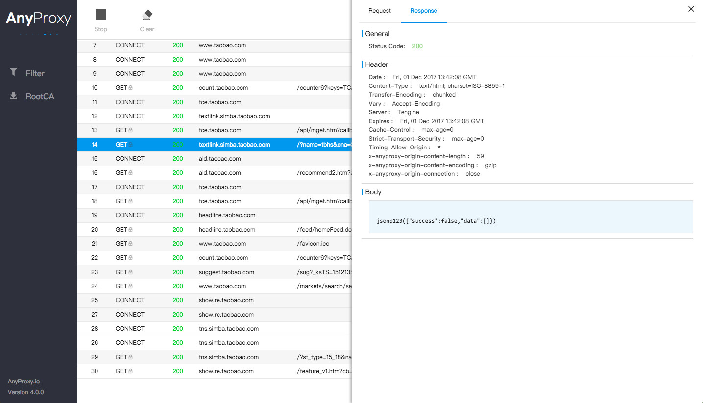

前端使用AnyProxy
====

业界的代理工具已经不少了，windows有`fiddler`，mac有`charles`【收费】，跨平台的有腾讯alloy team出品的`liver pool`。满足特定功能的民间产品更是层出不穷，如代理线上combo文件的flex-combo，clam中的doji等等。

AnyProxy是阿里巴巴基于 Node.js 开发的一款开源代理服务器。做为`中间代理服务器`，它可以收集所有经过它的http请求流量（包括https明文内容）；它提供了友好的web界面，便于直观的查看经过它的http请求；同时它支持二次开发，可以用javascript控制整个代理的全部流程，便于前端调试和收集http请求页面内容。它可以用于移动app和移动web页面调试、 抓取。

[简介 · AnyProxy：http://anyproxy.io/cn/](http://anyproxy.io/cn/)

github：[alibaba/anyproxy](https://github.com/alibaba/anyproxy)

### 安装和启动AnyProxy：
```bash
npm install -g anyproxy 

# 启动
# 命令行启动AnyProxy，默认端口号8001
anyproxy 
```

* 启动后将终端http代理服务器配置为127.0.0.1:8001即可
* 访问http://127.0.0.1:8002 ，web界面上能看到所有的请求信息

通过上面命令启动AnyProxy代理监听服务服务后，AnyProxy会打开两个端口：

* 8001端口：即代理服务端口， 本机的IP和8001用于设置代理，如：127.0.0.1:8001
* 8002端口：AnyProxy的web界面，通过浏览器打开http://127.0.0.1:8002的形式，即可查看所有经过AnyProxy代理的http请求。

### 其他命令
* 配置启动端口，如1080端口启动
```
anyproxy --port 1080 
```



### 作为npm模块使用
AnyProxy可以作为一个npm模块使用，整合进其他工具。

> 如要启用https解析，请在代理服务器启动前自行调用`AnyProxy.utils.certMgr`相关方法生成证书，并引导用户信任安装。或引导用户使用`anyproxy-ca`方法。

* 引入
```
npm i anyproxy --save 
```

* 使用举例
```js
const AnyProxy = require('anyproxy');
const options = {
  port: 8001,
  rule: require('myRuleModule'),
  webInterface: {
    enable: true,
    webPort: 8002,
    wsPort: 8003,
  },
  throttle: 10000,
  forceProxyHttps: false,
  silent: false
};
const proxyServer = new AnyProxy.ProxyServer(options);

proxyServer.on('ready', () => { /* */ });
proxyServer.on('error', (e) => { /* */ });
proxyServer.start();

//when finished
proxyServer.close(); 
```