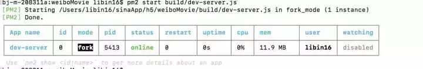
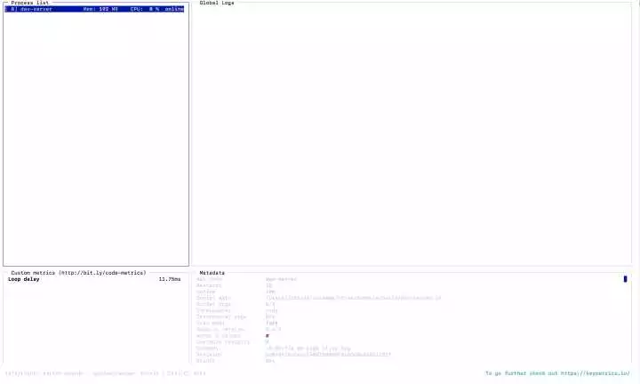

# Node进程管理器PM2

<!-- TOC -->

- [Node进程管理器PM2](#Node进程管理器PM2)
  - [使用技巧和需要注意的地方](#使用技巧和需要注意的地方)
    - [1、基本指令](#1基本指令)
    - [2、查看服务进程数](#2查看服务进程数)
    - [3、 是否需要nginx](#3-是否需要nginx)
    - [4、fork与cluster启动模式](#4fork与cluster启动模式)
    - [5、pm2的监控](#5pm2的监控)
    - [6、日志问题](#6日志问题)
    - [7、高级用法](#7高级用法)
    - [8、稳定运行建议](#8稳定运行建议)
    - [9、自动化部署](#9自动化部署)
  - [使用pm2启动Vue项目](#使用pm2启动Vue项目)
    - [启动项目](#启动项目)
    - [常使用命令:](#常使用命令)

<!-- /TOC -->

1. [pm2官网](http://pm2.keymetrics.io/)
2. [pm2 github](https://github.com/Unitech/pm2)

## 使用技巧和需要注意的地方
`PM2`是一个带有**负载均衡**功能的`Node`应用的进程管理器。`PM2`可以利用服务器上的**所有CPU**，并保证进程永远都活着，**0秒的重载**，部署管理**多个Node项目**。`PM2`是`Node`线上部署完美的管理工具。

### 1、基本指令
```bash
npm install pm2 -g ： 全局安装。

pm2 start app.js ： 启动服务，入口文件是app.js。

pm2 start app.js -i [n] --name [name] ： 启动n个进程，名字命名为name。

npm restart  [name or id] ： 重启服务。

npm reload  [name or id] ： 和rastart功能相同，但是可以实现0s的无缝衔接；如果有nginx的使用经验，可以
对比nginx reload指令。

pm2 start app.js --max_memory_restart 1024M ： 当内存超过1024M时自动重启。 如果工程中有比较棘手的内
存泄露问题，这个算是一个折中方案。

pm2 monit ： 对服务进行监控。
```

### 2、查看服务进程数
至于要启动几个进程，可以通过服务器的内核数进行确定，几个内核就启动几个服务。指令如下：
```bash
# 查看物理CPU个数
  cat /proc/cpuinfo| grep "physical id" | sort| uniq | wc -l

# 查看每个物理CPU中core的个数(即核数)
cat /proc/cpuinfo| grep "cpu cores"| uniq

# 查看逻辑CPU的个数
cat /proc/cpuinfo| grep "processor"| wc -l
```
当然可以启动多个端口，一个端口号对应一个服务，这样的话就需要nignx来做负载均衡了。


### 3、 是否需要nginx
nginx可以做的事情主要有两个：
> 1. 反向代理，实现简单的负载均衡： 如果有多台服务器或者一台服务器多个端口，可以考虑用nginx。
> 2. 静态资源缓存：把一些静态资源（如静态页面，js等资源文件）放到nginx里，可以极大的提高服务的性能。

### 4、fork与cluster启动模式
开发环境中多以`fork`的方式启动，生产环境中多用`cluster`方式启动  
上面的示例图中可以看一“watching”一项，这个项默认是disabled，可以通过如下命令开启
```
pm2 start app.js --name m --watch
```
**建议：这个适合在开发时用，可以省不少时间，生产环境下最好不要用**

> 1. cluster是fork的派生，cluster支持所有cluster拥有的特性；
> 2. fork不支持socket地址端口复用，cluster支持地址端口复用。因为只有node的cluster模块支持socket选项SO_REUSEADDR；

`fork不可以启动多个实例进程，cluster可以启动多个实例。但node的child_process.fork是可以实现启动多个进程的，但是为什么没有实现呢？就个人理解，node多为提供网络服务，启动多个实例需要地址端口复用，此时便可使用cluster模式实现，但fork模式并不支持地址端口复用，多实例进程启动会产生异常错误。但对于常驻任务脚本而言，不需要提供网络服务，此时多进程启动可以实现，同时也提高了任务处理效率。对于上述需求，可以两种方式实现，一是配置app0,app1,app2方式启动多个进程，二是通过应用实例自身调用child_process.fork多进程编程实现；`

fork模式可以应用于其他语言，如php，python，perl，ruby，bash，coffee， 而cluster只能应用于node;

fork不支持定时重启，cluster支持定时重启。定时重启也就是配置中的cron_restart配置项。

### 5、pm2的监控
pm2的监控有两种方式：
1. **cli方式监控**
    pm2 monit是专门用来监控的命令，监控项包括cpu与内存  
    缺点monit展示内容太过粗糙，不够详细

2. **pm2 list展示当前所有pm2的管理项目**
    可以查看出每个进程的运行状态。
    如果需要更详细的监控内容，对于cli而言一般都是可以实现的。
    这种监控方式的缺点：
    > a. 不够直观，需要自己去执行命令并分析结果；   
    > b. 不便于多台服务器的应用监控管理； 

### 6、日志问题
日志系统对于任意应用而言，通常都是必不可少的一个辅助功能。pm2的相关文件默认存放于$HOME/.pm2/目录下，其日志主要有两类：
1. pm2自身的日志，存放于$HOME/.pm2/pm2.log；
2. pm2所管理的应用的日志，存放于$HOME/.pm2/logs/目录下，标准谁出日志存放于${APP_NAME}_out.log，标准错误日志存放于${APP_NAME}_error.log；

这里之所以把日志单独说明一下是因为，如果程序开发不严谨，为了调试程序，导致应用产生大量标准输出，使服务器本身记录大量的日志，导致服务磁盘满载问题。一般而言，pm2管理的应用本身都有自己日志系统，所以对于这种不必要的输出内容需禁用日志，重定向到/dev/null。

与crontab比较，也有类似情况，crontab自身日志，与其管理的应用本身的输出。应用脚本输出一定需要重定向到/dev/null，因为该输出内容会以邮件的形式发送给用户，内容存储在邮件文件，会产生意向不到的结果，或会导致脚本压根不被执行；

### 7、高级用法
pm2支持配置文件启动：  
pm2 ecosystem： 生成配置文件ecosystem.json  
pm2 startOrRestart /file/path/ecosystem.json : 通过配置文件启动服务

如下是开发时ecosystem.json的内容：
```js
{
  /**
   * Application configuration section
   * http://pm2.keymetrics.io/docs/usage/application-declaration/
   * 多个服务，依次放到apps对应的数组里
   */
  apps: [
    // First application
    {
      name: "nova",
      max_memory_restart: "300M",
      script: "/root/nova/app.js",
      out_file: "/logs/nova_out.log",
      error_file: "/logs/nova_error.log",
      instances: 4,
      exec_mode: "cluster",
      env: {
        NODE_ENV: "production"
      }
    }
  ];
}
```

上述采用cluster模式启动了4个服务进程；如果服务占用的内存超过300M，会自动进行重启。
```bash
配置项

name  应用进程名称；

script  启动脚本路径；

cwd  应用启动的路径，关于script与cwd的区别举例说明：在/home/polo/目录下运行/data/release/node/
index.js，此处script为/data/release/node/index.js，cwd为/home/polo/；

args  传递给脚本的参数；

interpreter  指定的脚本解释器；

interpreter_args  传递给解释器的参数；

instances  应用启动实例个数，仅在cluster模式有效，默认为fork；

exec_mode  应用启动模式，支持fork和cluster模式；

watch  监听重启，启用情况下，文件夹或子文件夹下变化应用自动重启；

ignore_watch  忽略监听的文件夹，支持正则表达式；

max_memory_restart  最大内存限制数，超出自动重启；

env  环境变量，object类型，如{"NODE_ENV":"production", "ID": "42"}；

log_date_format  指定日志日期格式，如YYYY-MM-DD HH:mm:ss；

error_file  记录标准错误流，$HOME/.pm2/logs/XXXerr.log)，代码错误可在此文件查找；

out_file  记录标准输出流，$HOME/.pm2/logs/XXXout.log)，如应用打印大量的标准输出，会导致pm2日志过大；

min_uptime  应用运行少于时间被认为是异常启动；

max_restarts  最大异常重启次数，即小于min_uptime运行时间重启次数；

autorestart  默认为true, 发生异常的情况下自动重启；

cron_restart  crontab时间格式重启应用，目前只支持cluster模式；

force  默认false，如果true，可以重复启动一个脚本。pm2不建议这么做；

restart_delay  异常重启情况下，延时重启时间；
```

### 8、稳定运行建议
PM2是一款非常优秀的Node进程管理工具，它有着丰富的特性：能够充分利用多核CPU且能够负载均衡、能够帮助应用在崩溃后、指定时间(cluster model)和超出最大内存限制等情况下实现自动重启。

个人几点看法保证常驻应用进程稳定运行：
1. 定时重启，应用进程运行时间久了或许总会产生一些意料之外的问题，定时可以规避一些不可测的情况；
2. 最大内存限制，根据观察设定合理内存限制，保证应用异常运行；
3. 合理min_uptime，min_uptime是应用正常启动的最小持续运行时长，超出此时间则被判定为异常启动；
4. 设定异常重启延时restart_delay，对于异常情况导致应用停止，设定异常重启延迟可防止应用在不可测情况下不断重启的导致重启次数过多等问题；
5. 设置异常重启次数，如果应用不断异常重启，并超过一定的限制次数，说明此时的环境长时间处于不可控状态，服务器异常。此时便可停止尝试，发出错误警告通知等。

关于pm2的使用，主要还是运用于常驻脚本。

### 9、自动化部署
通过shell脚本实现资源拉取、服务重启、nginx缓存更新等操作，再配合pm2的监控功能，就初步达到了一个后端工程部署的标配了。


## 使用pm2启动Vue项目
主要特性：
> 内建负载均衡（使用Node cluster 集群模块）  
> 后台运行  
> 0秒停机重载，我理解大概意思是维护升级的时候不需要停机.  
> 具有Ubuntu和CentOS 的启动脚本  
> 停止不稳定的进程（避免无限循环）  
> 控制台检测  
> 提供 HTTP API 
> 远程控制和实时的接口API ( Nodejs 模块,允许和PM2进程管理器交互 )  

### 启动项目
Vue项目,进入项目目录
```bash
$ pm2 start build/dev-server.js
```

列出由pm2管理的所有进程信息,还会显示一个进程会被启动多少次，因为没处理的异常。
```bash
$ pm2 list
$ pm2 monit # 监视每个node进程的CPU和内存的使用情况
```

### 常使用命令:
```bash
$ pm2 logs 显示所有进程日志
$ pm2 stop all 停止所有进程
$ pm2 restart all 重启所有进程
$ pm2 reload all 0秒停机重载进程 (用于 NETWORKED 进程)
$ pm2 stop 0 停止指定的进程
$ pm2 restart 0 重启指定的进程
$ pm2 startup 产生 init 脚本 保持进程活着
$ pm2 web 运行健壮的 computer API endpoint
$ pm2 delete 0 杀死指定的进程
$ pm2 delete all 杀死全部进程 
```

用法
```bash
# 用法
$ npm install pm2 -g     # 命令行安装 pm2 
$ pm2 start app.js -i 4 #后台运行pm2，启动4个app.js 
                                # 也可以把'max' 参数传递给 start
                                # 正确的进程数目依赖于Cpu的核心数目
$ pm2 start app.js --name my-api # 命名进程
$ pm2 list               # 显示所有进程状态
$ pm2 monit              # 监视所有进程
$ pm2 logs               #  显示所有进程日志
$ pm2 stop all           # 停止所有进程
$ pm2 restart all        # 重启所有进程
$ pm2 reload all         # 0秒停机重载进程 (用于 NETWORKED 进程)
$ pm2 stop 0             # 停止指定的进程
$ pm2 restart 0          # 重启指定的进程
$ pm2 startup            # 产生 init 脚本 保持进程活着
$ pm2 web                # 运行健壮的 computer API endpoint (http://localhost:9615)
$ pm2 delete 0           # 杀死指定的进程
$ pm2 delete all         # 杀死全部进程

# 运行进程的不同方式：
$ pm2 start app.js -i max  # 根据有效CPU数目启动最大进程数目
$ pm2 start app.js -i 3      # 启动3个进程
$ pm2 start app.js -x        #用fork模式启动 app.js 而不是使用 cluster
$ pm2 start app.js -x -- -a 23   # 用fork模式启动 app.js 并且传递参数 (-a 23)
$ pm2 start app.js --name serverone  # 启动一个进程并把它命名为 serverone
$ pm2 stop serverone       # 停止 serverone 进程
$ pm2 start app.json        # 启动进程, 在 app.json里设置选项
$ pm2 start app.js -i max -- -a 23                   #在--之后给 app.js 传递参数
$ pm2 start app.js -i max -e err.log -o out.log  # 启动 并 生成一个配置文件
你也可以执行用其他语言编写的app  ( fork 模式):
$ pm2 start my-bash-script.sh    -x --interpreter bash
$ pm2 start my-python-script.py -x --interpreter python

0秒停机重载:
这项功能允许你重新载入代码而不用失去请求连接。
注意：
仅能用于web应用
运行于Node 0.11.x版本
运行于 cluster 模式（默认模式）
$ pm2 reload all

CoffeeScript:
$ pm2 start my_app.coffee  #这就是全部

PM2准备好为产品级服务了吗？
只需在你的服务器上测试
$ git clone https://github.com/Unitech/pm2.git
$ cd pm2
$ npm install  # 或者 npm install --dev ，如果devDependencies 没有安装
$ npm test
```

pm2 list  
列出由pm2管理的所有进程信息，还会显示一个进程会被启动多少次，因为没处理的异常。



pm2 monit  
监视每个node进程的CPU和内存的使用情况。  

