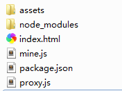

Node.js配合node-http-proxy解决本地开发ajax跨域问题
====

## 用到的技术：
1. nodejs搭建本地http服务器
2. 应用node-http-proxy，做接口url的转发

## 具体方法：
1. node.js搭建本地http服务器参考了shawn.xie的[《nodejs搭建本地http服务器》](https://www.cnblogs.com/shawn-xie/archive/2013/06/06/3121173.html)

2. node.js做转发使用node-http-proxy实现，[官方文档](https://github.com/nodejitsu/node-http-proxy#using-https)

3. 操作方法参考了：http://hao.jser.com/archive/10394/?utm_source=tuicool&utm_medium=referral

4. 下面是我自己的实战操作

### 项目准备
1. npm初始化
  ```bash
  npm init
  ```
2. 安装node-http-proxy模块
  ```bash
  npm install http-proxy --save-dev
  ```
3. 项目结构   



下面的例子中，我们把html文件直接放在根目录'./'，也可以指定一个网站目录，在proxy.js中可以自定义

### 配置HTTP服务器和PROXY转发
```js
var PORT = 3000;

var http = require('http');
var url=require('url');
var fs=require('fs');
var mine=require('./mine').types;
var path=require('path');
var httpProxy = require('http-proxy');

var proxy = httpProxy.createProxyServer({
    target: 'http://192.168.10.38:8180/',   //接口地址
    // 下面的设置用于https
    // ssl: {
    //     key: fs.readFileSync('server_decrypt.key', 'utf8'),
    //     cert: fs.readFileSync('server.crt', 'utf8')
    // },
    // secure: false
});

proxy.on('error', function(err, req, res){
    res.writeHead(500, {
        'content-type': 'text/plain'
    });
    console.log(err);
    res.end('Something went wrong. And we are reporting a custom error message.');
});

var server = http.createServer(function (request, response) {
    var pathname = url.parse(request.url).pathname;
    //var realPath = path.join("main-pages", pathname); // 指定根目录
    var realPath = path.join("./", pathname);
    console.log(pathname);
    console.log(realPath);
    var ext = path.extname(realPath);
    ext = ext ? ext.slice(1) : 'unknown';

    //判断如果是接口访问，则通过proxy转发
    if(pathname.indexOf("mspj-mall-admin") > 0){
        proxy.web(request, response);
        return;
    }

    fs.exists(realPath, function (exists) {
        if (!exists) {
            response.writeHead(404, {
                'Content-Type': 'text/plain'
            });

            response.write("This request URL " + pathname + " was not found on this server.");
            response.end();
        } else {
            fs.readFile(realPath, "binary", function (err, file) {
                if (err) {
                    response.writeHead(500, {
                        'Content-Type': 'text/plain'
                    });
                    response.end(err);
                } else {
                    var contentType = mine[ext] || "text/plain";
                    response.writeHead(200, {
                        'Content-Type': contentType
                    });
                    response.write(file, "binary");
                    response.end();
                }
            });
        }
    });
});
server.listen(PORT);
console.log("Server runing at port: " + PORT + ".");
```

### MINE.JS
这里参考shawn.xie的源码，补充了几个字体文件的mime。
```js
exports.types = {
  "css": "text/css",
  "gif": "image/gif",
  "html": "text/html",
  "ico": "image/x-icon",
  "jpeg": "image/jpeg",
  "jpg": "image/jpeg",
  "js": "text/javascript",
  "json": "application/json",
  "pdf": "application/pdf",
  "png": "image/png",
  "svg": "image/svg+xml",
  "swf": "application/x-shockwave-flash",
  "tiff": "image/tiff",
  "txt": "text/plain",
  "wav": "audio/x-wav",
  "wma": "audio/x-ms-wma",
  "wmv": "video/x-ms-wmv",
  "xml": "text/xml",
  "woff": "application/x-woff",
  "woff2": "application/x-woff2",
  "tff": "application/x-font-truetype",
  "otf": "application/x-font-opentype",
  "eot": "application/vnd.ms-fontobject"
};
```

以上就是全部源码

然后把项目中的接口地址改成http://localhost:3000/......

### 启动nodejs服务
启动cmd，定位到项目目录，运行
```bash
node proxy.js
```
访问：
```
http://localhost:3000/index.html
```

可以看到项目中调用的http://localhost:3000/.....  都会从http://192.168.10.38:8180/...... 获取数据，然后转发到本地。

这样就不存在跨域了。