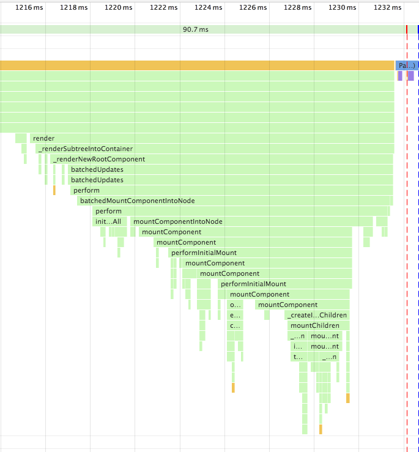

React 生命周期分析
===
<!-- TOC -->

- [V16 生命周期函数用法建议](#v16-生命周期函数用法建议)

<!-- /TOC -->
在 V16 版本中引入了 Fiber 机制。这个机制一定程度上的影响了部分生命周期的调用，并且也引入了新的 2 个 API 来解决问题。

在之前的版本中，如果你拥有一个很复杂的复合组件，然后改动了最上层组件的 state，那么调用栈可能会很长



调用栈过长，再加上中间进行了复杂的操作，就可能导致长时间阻塞主线程，带来不好的用户体验。Fiber 就是为了解决该问题而生。

Fiber 本质上是一个虚拟的堆栈帧，新的调度器会按照优先级自由调度这些帧，从而将之前的同步渲染改成了异步渲染，在不影响体验的情况下去分段计算更新。


对于如何区别优先级，React 有自己的一套逻辑。对于动画这种实时性很高的东西，也就是 16 ms 必须渲染一次保证不卡顿的情况下，React 会每 16 ms（以内） 暂停一下更新，返回来继续渲染动画。

对于异步渲染，现在渲染有两个阶段：`reconciliation` 和 `commit` 。前者过程是可以打断的，后者不能暂停，会一直更新界面直到完成。

**Reconciliation 阶段**
- componentWillMount
- componentWillReceiveProps
- shouldComponentUpdate
- componentWillUpdate

**Commit 阶段**
- componentDidMount
- componentDidUpdate
- componentWillUnmount

因为 `reconciliation` 阶段是可以被打断的，所以 `reconciliation` 阶段会执行的生命周期函数就可能会出现调用多次的情况，从而引起 Bug。所以对于 `reconciliation` 阶段调用的几个函数，除了 `shouldComponentUpdate` 以外，其他都应该避免去使用，并且 V16 中也引入了新的 API 来解决这个问题。

`getDerivedStateFromProps` 用于替换 `componentWillReceiveProps` ，该函数会在初始化和 `update` 时被调用

```js
class ExampleComponent extends React.Component {
  // Initialize state in constructor,
  // Or with a property initializer.
  state = {}

  static getDerivedStateFromProps(nextProps, prevState) {
    if (prevState.someMirroredValue !== nextProps.someValue) {
      return {
        derivedData: computeDerivedState(nextProps),
        someMirroredValue: nextProps.someValue
      }
    }

    // Return null to indicate no change to state.
    return null
  }
}
```

`getSnapshotBeforeUpdate` 用于替换 `componentWillUpdate` ，该函数会在 `update` 后 DOM 更新前被调用，用于读取最新的 DOM 数据。

## V16 生命周期函数用法建议
```js
class ExampleComponent extends React.Component {
  // 用于初始化 state
  constructor() {}
  // 用于替换 `componentWillReceiveProps` ，该函数会在初始化和 `update` 时被调用
  // 因为该函数是静态函数，所以取不到 `this`
  // 如果需要对比 `prevProps` 需要单独在 `state` 中维护
  static getDerivedStateFromProps(nextProps, prevState) {}
  // 判断是否需要更新组件，多用于组件性能优化
  shouldComponentUpdate(nextProps, nextState) {}
  // 组件挂载后调用
  // 可以在该函数中进行请求或者订阅
  componentDidMount() {}
  // 用于获得最新的 DOM 数据
  getSnapshotBeforeUpdate() {}
  // 组件即将销毁
  // 可以在此处移除订阅，定时器等等
  componentWillUnmount() {}
  // 组件销毁后调用
  componentDidUnMount() {}
  // 组件更新后调用
  componentDidUpdate() {}
  // 渲染组件函数
  render() {}
  // 以下函数不建议使用
  UNSAFE_componentWillMount() {}
  UNSAFE_componentWillUpdate(nextProps, nextState) {}
  UNSAFE_componentWillReceiveProps(nextProps) {}
}
```