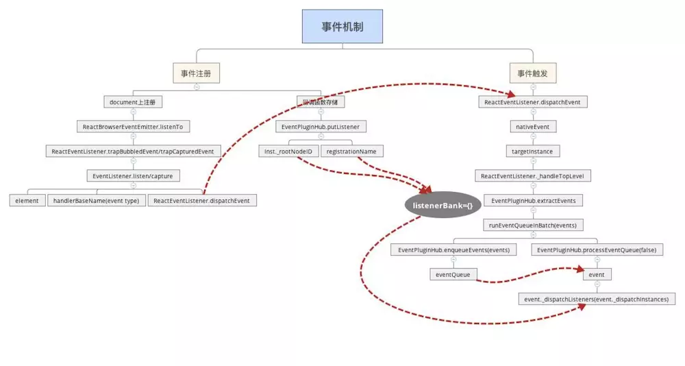

React事件机制
===
<!-- TOC -->

- [React事件机制](#React事件机制)
  - [React事件系统](#React事件系统)
    - [1.事件注册](#1事件注册)
    - [2、事件存储](#2事件存储)
    - [3、事件执行](#3事件执行)
      - [3.1 事件分发](#31-事件分发)
      - [3.2生成合成事件](#32生成合成事件)
      - [3.3批量处理回调函数](#33批量处理回调函数)
  - [Jquery事件机制](#Jquery事件机制)

<!-- /TOC -->
主要包含事件注册、触发以及回调函数的存储，最后会讲述一下Jquery事件机制与React事件机制的相同之处。
React事件机制不是原生的那一套，React组件上声明的事件没有绑定在React组件对应的原生DOM节点上，而是绑定在document节点上，触发的事件是对原生事件的包装。

## React事件系统


React内部事件系统实现可以分为两个阶段：事件注册、事件触发，涉及的主要类如下：
- ReactEventListener：负责事件注册和事件分发。React将DOM事件全都注册到document节点上，事件分发主要调用dispatchEvent进行，从事件触发组件开始，向父元素遍历。
- ReactEventEmitter：负责每个组件上事件的执行。
- EventPluginHub：负责回调函数的存储

JSX中声明一个React事件，比如：
```js
render() {
  return (
    <button onClick={this.handleClick}>点击</button>
  )
}
```

用户点击button按钮触发click事件后，DOM将event传给ReactEventListener，它将事件分发到当前组件及以上的父组件。然后ReactEventEmitter对每个组件进行事件的执行，先构造React合成事件，然后以队列的方式调用JSX中声明的callback。
备注：以下代码逻辑大部分写在注释里面

### 1.事件注册
要从组件创建和更新的入口方法说起，ReactDOMComponent在进行组件加载时入口方法为mountComponent、更新时入口方法为updateComponent，这两个方法都会调用_updateDOMProperties方法，对JSX中声明的组件属性进行处理，源码如下：
```js
ReactDOMComponent.Mixin = {
  /**
   * lastProp则表示上一次的属性
   * nextProp表示要创建或者更新的属性
   */
  _updateDOMProperties: function (lastProps, nextProps, transaction) {
    ... 
    // 如果是props这个对象直接声明的属性，不是从原型链中继承来的，则处理它
    else if (registrationNameModules.hasOwnProperty(propKey)) {
        // 对于mountComponent，lastProp为null。updateComponent二者都不为null。  unmountComponent则nextProp为null
        if (nextProp) {
          // mountComponent和updateComponent中，enqueuePutListener注册事件
          enqueuePutListener(this, propKey, nextProp, transaction);
        } else if (lastProp) {
          // unmountComponent中，删除注册的listener，防止内存泄漏
          deleteListener(this, propKey);
        }
    }
  }
}
```

_updateDOMProperties中调用enqueuePutListener注册事件，下面来看enqueuePutListener，它负责两件事：在document上注册JSX中声明的事件；采用事务队列的方式存储注册事件，源码如下：
```js
/**
 * inst: React Component对象
 * registrationName: React合成事件名，如onClick
 * listener: React事件回调方法，如onClick=callback中的callback
 * transaction: mountComponent或updateComponent所处的事务流，React都是基于事务流的
 */
function enqueuePutListener(inst, registrationName, listener, transaction) {
  if (transaction instanceof ReactServerRenderingTransaction) {
    return;
  }
  var containerInfo = inst._hostContainerInfo;
  var isDocumentFragment = containerInfo._node && containerInfo._node.nodeType === DOC_FRAGMENT_TYPE;
  // 找到document
  var doc = isDocumentFragment ? containerInfo._node : containerInfo._ownerDocument;
  // 注册事件，将事件注册到document上
  listenTo(registrationName, doc);
  // 存储事件,放入事务队列中
  transaction.getReactMountReady().enqueue(putListener, {
    inst: inst,
    registrationName: registrationName,
    listener: listener
  });
}
```

上面调用listenTo方法来注册事件，接下来看listenTo方法 ，源码如下：
```js
//ReactBrowserEventEmitter.js
listenTo: function (registrationName, contentDocumentHandle) {
  ...
  if (...) {
    //注册冒泡事件
    ReactBrowserEventEmitter.ReactEventListener.trapBubbledEvent(...);
  } else if (...) {
    //注册捕获事件
    ReactBrowserEventEmitter.ReactEventListener.trapCapturedEvent(...);
  }
  ...
}
```

listenTo解决了不同浏览器间捕获和冒泡不兼容的问题，事件回调方法在冒泡阶段被触发，如果我们想让它在捕获阶段触发，需要在事件名加上capture，比如冒泡阶段触发，点击事件写成onClick，在捕获阶段触发需要写成onCaptureClick。
接下来主要看trapBubbledEvent方法，源码如下：
```js
//ReactEventListener.js
var ReactEventListener = {
  ...
  trapBubbledEvent: function (topLevelType, handlerBaseName, element) {
    ...
    return EventListener.listen(
        element, //绑定到的DOM节点，即document
        handlerBaseName,  //事件类型
        ReactEventListener.dispatchEvent.bind(null, topLevelType)  //callback，document上的原生事件触发后的回调函数，不包含任何的事物处理，只起到事件分发的作用
      );
  },
  trapCapturedEvent: function (topLevelType, handlerBaseName, element) {
    var handler = ReactEventListener.dispatchEvent.bind(null, topLevelType);
    return EventListener.capture(element, handlerBaseName, handler);
  }
  //在listen方法中，终于发现了熟悉的addEventListener这个原生事件注册方法
  listen: function listen(target, eventType, callback) {
    if (target.addEventListener) {
      // 将原生事件添加到target这个dom上,也就是document上。
      // 这就是只有document这个DOM节点上有原生事件的原因
      target.addEventListener(eventType, callback, false);
      return {
        // 删除事件,这个由React自己回调,不需要调用者来销毁。但仅仅对于React合成事件才行
        remove: function remove() {
          target.removeEventListener(eventType, callback, false);
        }
      };
    } else if (target.attachEvent) {
      // attach和detach的方式
      target.attachEvent('on' + eventType, callback);
      return {
        remove: function remove() {
          target.detachEvent('on' + eventType, callback);
        }
      };
    }
  },
  //事件分发，document不管注册的是什么事件，都执行统一的回调函数 handleTopLevelImpl
  dispatchEvent: function (topLevelType, nativeEvent) {
    ...
    ReactUpdates.batchedUpdates(handleTopLevelImpl, bookKeeping);
    ...
  }
}
function handleTopLevelImpl(bookKeeping) {
  ...
  ReactEventListener._handleTopLevel(bookKeeping.topLevelType, targetInst, bookKeeping.nativeEvent, getEventTarget(bookKeeping.nativeEvent));
  ...
}
```

事件注册说完了， 接下来说事件存储

### 2、事件存储
事件存储由EventPluginHub负责，它的入口在上面讲到的enqueuePutListener中的putListener方法，源码如下：
```js
/**
   * EventPluginHub用来存储React事件, 将listener存储到`listenerBank[registrationName][key]`
   *
   * @param {object} inst: 事件源
   * @param {string} 事件属性，比如onClick
   * @param {function} callback
   */
  //
  putListener: function (inst, registrationName, listener) {

    // 用来标识注册了事件,比如onClick的React对象。key的格式为'.nodeId', 只用知道它可以标示哪个React对象就可以了
    var key = getDictionaryKey(inst);
    var bankForRegistrationName = listenerBank[registrationName] || (listenerBank[registrationName] = {});
    // 将listener事件回调方法存入listenerBank[registrationName][key]中,比如listenerBank['onclick'][nodeId]
    // 所有React组件对象定义的所有React事件都会存储在listenerBank中
    bankForRegistrationName[key] = listener;
  },

var getDictionaryKey = function (inst) {
  return '.' + inst._rootNodeID;
};
```

React中的所有事件的回调函数均存储在listenerBank对象里，根据事件类型、component对象的_rootNodeID为两个key，来存储对应的回调函数。比如nodeId组件上注册的onClick事件最后存储在`listenerBank.onclick[nodeId]`中。
事件注册完后，就可以依据事件委托进行事件执行，接下来说事件执行。

### 3、事件执行
注册事件中已经提到，几乎所有的事件都注册在document上，document上的事件回调函数只有一个： ReactEventListener.dispatchEvent，进行相关的分发。

#### 3.1 事件分发
源码如下
```js
var ReactEventListener = {
  // topLevelType：事件名
  // nativeEvent: 用户触发click等事件时，浏览器传递的原生事件
  dispatchEvent: function (topLevelType, nativeEvent) {
    ...
   // 放入批处理队列中,React事件流也是一个消息队列的方式
    ReactUpdates.batchedUpdates(handleTopLevelImpl, bookKeeping);
    ...
  }
}
//handleTopLevelImpl才是事件分发的真正执行者，它是事件分发的核心，体现了React事件分发的特点
function handleTopLevelImpl(bookKeeping) {
  //根据原生的事件对象，找到事件触发的dom元素以及该dom对应的component对象
  var nativeEventTarget = getEventTarget(bookKeeping.nativeEvent);
  var targetInst = ReactDOMComponentTree.getClosestInstanceFromNode(nativeEventTarget);
 // 执行事件回调前,先由当前组件向上遍历它的所有父组件。得到ancestors这个数组。
  // 因为事件回调中可能会改变Virtual DOM结构,所以要先遍历好组件层级
  var ancestor = targetInst;
  do {
    bookKeeping.ancestors.push(ancestor);
    ancestor = ancestor && findParent(ancestor);
  } while (ancestor);

  // 从当前组件向父组件遍历,依次执行注册的回调方法. 我们遍历构造ancestors数组时,是从当前组件向父组件回溯的,故此处事件回调也是这个顺序
  // 这个顺序就是冒泡的顺序,并且我们发现不能通过stopPropagation来阻止'冒泡'。
  for (var i = 0; i < bookKeeping.ancestors.length; i++) {
    targetInst = bookKeeping.ancestors[i];
     // _handleTopLevel是初始化时用ReactEventEmitterMixin注入进来的
    ReactEventListener._handleTopLevel(bookKeeping.topLevelType, targetInst, bookKeeping.nativeEvent, getEventTarget(bookKeeping.nativeEvent));
  }
}

// ReactEventEmitterMixin.js
// ReactEventEmitterMixin一方面生成合成的事件对象，另一方面批量执行定义的回调函数
var ReactEventEmitterMixin = {
  // handleTopLevel方法是事件回调函数调用的核心。DOM事件绑定在了document原生对象上,每次事件触发,都会调用到handleTopLevel
  handleTopLevel: function (...) {
    // 利用浏览器回传的原生事件构造出React合成事件。不同的eventType的合成事件可能不同
    var events = EventPluginHub.extractEvents(...); 
    //采用队列的方式处理回调函数
    runEventQueueInBatch(events); 
  }
}
//进行批量更新
function runEventQueueInBatch(events) {
  EventPluginHub.enqueueEvents(events);
  EventPluginHub.processEventQueue(false);
}
```

从上面的事件分发中可见，React自身实现了一套冒泡机制。从触发事件的对象开始，向父元素回溯，依次调用它们注册的事件callback。

上面的代码提到批量处理回调函数时要把事件传进去，react中的事件对象不是原生的事件对象，而是经过处理后的对象，接下来看一下如何生成合成事件。

#### 3.2生成合成事件
生成合成事件，源码如下：
```js
// EventPluginHub.js
var EventPluginHub = {
  extractEvents: function (...) {
    var events;
    // EventPluginHub可以存储React合成事件的callback,也存储了一些plugin,这些plugin在EventPluginHub初始化时注册的
    var plugins = EventPluginRegistry.plugins;
    for (var i = 0; i < plugins.length; i++) {
      var possiblePlugin = plugins[i];
      if (possiblePlugin) {
        // 根据eventType构造不同的合成事件SyntheticEvent
        var extractedEvents = possiblePlugin.extractEvents(topLevelType, targetInst, nativeEvent, nativeEventTarget);
        if (extractedEvents) {
          // 将构造好的合成事件extractedEvents添加到events数组中,这样就保存了所有plugin构造的合成事件
          events = accumulateInto(events, extractedEvents);
        }
      }
    }
    return events;
  }
}
```

上面提到系统启动过程中注入(injection)过来plugins，代码如下：
```js
// react-dom模块的入口文件ReactDOM.js:
var ReactDefaultInjection = require('./ReactDefaultInjection');
ReactDefaultInjection.inject();
...
// ReactDefaultInjection.js
module.exports = {
  inject: inject
};
function inject() {
  ...
  ReactInjection.EventPluginHub.injectEventPluginsByName({
    SimpleEventPlugin: SimpleEventPlugin,
    EnterLeaveEventPlugin: EnterLeaveEventPlugin,
    ChangeEventPlugin: ChangeEventPlugin,
    SelectEventPlugin: SelectEventPlugin,
    BeforeInputEventPlugin: BeforeInputEventPlugin
  });
  ...
}
```

默认情况下，react注入了五种事件plugin，针对不同的事件，得到不同的合成事件，下面看一下最常见的 SimpleEventPlugin 如何生成它对应的React合成事件，代码如下：
```js
// 根据不同事件类型,比如click,focus构造不同的合成事件SyntheticEvent, 如SyntheticKeyboardEvent SyntheticFocusEvent
extractEvents: function (topLevelType, targetInst, nativeEvent, nativeEventTarget) {
    var dispatchConfig = topLevelEventsToDispatchConfig[topLevelType];
    if (!dispatchConfig) {
      return null;
    }
    var EventConstructor;

   // 根据事件类型，采用不同的SyntheticEvent来构造不同的合成事件
    switch (topLevelType) {
      ... // 仅以blur和focus为例
      case 'topBlur':
      case 'topFocus':
        EventConstructor = SyntheticFocusEvent;
        break;
      ... 
    }

    // 从event对象池中取出合成事件对象
    var event = EventConstructor.getPooled(dispatchConfig, targetInst, nativeEvent, nativeEventTarget);
   //用于从EventPluginHub中获取回调函数
    EventPropagators.accumulateTwoPhaseDispatches(event);
    return event;
},
```

上面提到调用EventPropagators.accumulateTwoPhaseDispatches(event)从EventPluginHub中获取回调函数，如何获取具体的回调函数，如下：
```js
// EventPropagators.js
function accumulateTwoPhaseDispatches(events) {
  forEachAccumulated(events, accumulateTwoPhaseDispatchesSingle);
}
function accumulateTwoPhaseDispatchesSingle(event) {
  if (event && event.dispatchConfig.phasedRegistrationNames) {
    EventPluginUtils.traverseTwoPhase(event._targetInst, accumulateDirectionalDispatches, event);
  }
}
function accumulateDirectionalDispatches(inst, phase, event) {
  var listener = listenerAtPhase(inst, event, phase);
  if (listener) {
    event._dispatchListeners = accumulateInto(event._dispatchListeners, listener);
    event._dispatchInstances = accumulateInto(event._dispatchInstances, inst);
  }
}
var getListener = EventPluginHub.getListener;
function listenerAtPhase(inst, event, propagationPhase) {
  var registrationName = event.dispatchConfig.phasedRegistrationNames[propagationPhase];
  return getListener(inst, registrationName);
}
// EventPluginHub.js
getListener: function (inst, registrationName) {
  var bankForRegistrationName = listenerBank[registrationName];
  var key = getDictionaryKey(inst);
  return bankForRegistrationName && bankForRegistrationName[key];
},
```

#### 3.3批量处理回调函数
回调函数拿到了，继续3.1中的采用队列的方式处理回调函数，react会进行批量处理具体的回调函数，回调函数的执行为两步，源码如下：
```js
function runEventQueueInBatch(events) {
   // 第一步：将events事件放入队列中
   EventPluginHub.enqueueEvents(events);
   // 第二部：处理队列中的事件,包括之前未处理完的。先入先处理原则
   EventPluginHub.processEventQueue(false);
}
```

第一步源码如下：
```js
var eventQueue = null;
var EventPluginHub = {
  enqueueEvents: function (events) {
    if (events) {
      eventQueue = accumulateInto(eventQueue, events);
    }
  },
  processEventQueue: function (simulated) {
    var processingEventQueue = eventQueue;
    ...
    forEachAccumulated(processingEventQueue, executeDispatchesAndReleaseSimulated);
    ...
  },
}

function accumulateInto(current, next) {

  if (current == null) {
    return next;
  }

  // 将next添加到current中,返回一个包含他们两个的新数组
  // 如果next是数组,current不是数组,采用push方法,否则采用concat方法
  // 如果next不是数组,则返回一个current和next构成的新数组
  if (Array.isArray(current)) {
    if (Array.isArray(next)) {
      current.push.apply(current, next);
      return current;
    }
    current.push(next);
    return current;
  }

  if (Array.isArray(next)) {
    return [current].concat(next);
  }

  return [current, next];
}
```

第二步事件执行的入口方法为executeDispatchesAndReleaseTopLevel，代码如下：
```js
var executeDispatchesAndReleaseTopLevel = function (e) {
  return executeDispatchesAndRelease(e, false);
};
var executeDispatchesAndRelease = function (event, simulated) {
  if (event) {
    //进行事件分发
    EventPluginUtils.executeDispatchesInOrder(event, simulated);

    if (!event.isPersistent()) {
       // 处理完,则release掉event对象,采用对象池方式,减少GC
      // React帮我们处理了合成事件的回收机制，不需要我们关心。但要注意，如果使用了DOM原生事件，则要自己回收
      event.constructor.release(event);
    }
  }
};
// EventPluginUtils.js
// 事件处理的核心
function executeDispatchesInOrder(event, simulated) {
  var dispatchListeners = event._dispatchListeners;
  var dispatchInstances = event._dispatchInstances;
 if (Array.isArray(dispatchListeners)) {
    // 如果有多个listener,则遍历执行数组中event
    for (var i = 0; i < dispatchListeners.length; i++) {
      // 如果isPropagationStopped设成true了,则停止事件传播,退出循环。
      if (event.isPropagationStopped()) {
        break;
      }
      // 执行event的分发,从当前触发事件元素向父元素遍历
      // event为浏览器上传的原生事件
      // dispatchListeners[i]为JSX中声明的事件callback
      // dispatchInstances[i]为对应的React Component 
      executeDispatch(event, simulated, dispatchListeners[i], dispatchInstances[i]);
    }
  } else if (dispatchListeners) {
    // 如果只有一个listener,则直接执行事件分发
    executeDispatch(event, simulated, dispatchListeners, dispatchInstances);
  }
  // 处理完event,重置变量。因为使用的对象池,故必须重置,这样才能被别人复用
  event._dispatchListeners = null;
  event._dispatchInstances = null;
}
```

## Jquery事件机制
Jquery事件机制中也会调用原生的注册事件和删除事件，回调函数存储跟React的回调函数存储类似，可以阅读代码，感受一下事件机制的相通之处，源码如下：
```js
jQuery.fn.extend( {
  on: function (types, selector, data, fn) {
    // on 又依托于全局的 on 函数
    return on(this, types, selector, data, fn);
  }
} );

//on函数
function on( elem, types, selector, data, fn, one ) {
  var origFn, type;

  // 支持 object 的情况
  if ( typeof types === "object" ) {

    // ( types-Object, selector, data )
    if ( typeof selector !== "string" ) {

      // ( types-Object, data )
      data = data || selector;
      selector = undefined;
    }
    // 一次执行 object 的每一个
    for ( type in types ) {
      on( elem, type, selector, data, types[ type ], one );
    }
    return elem;
  }
  // 参数为两个的情况
  if ( data == null && fn == null ) {

    // ( types, fn )
    fn = selector;
    data = selector = undefined;
  } else if ( fn == null ) {
    if ( typeof selector === "string" ) {

      // ( types, selector, fn )
      fn = data;
      data = undefined;
    } else {

      // ( types, data, fn )
      fn = data;
      data = selector;
      selector = undefined;
    }
  }
  if ( fn === false ) {
    // returnFalse 是一个返回 false 的函数
    fn = returnFalse;
  } else if ( !fn ) {
    return elem;
  }

  if ( one === 1 ) {
    origFn = fn;
    fn = function( event ) {

      // Can use an empty set, since event contains the info
      jQuery().off( event );
      return origFn.apply( this, arguments );
    };

    // Use same guid so caller can remove using origFn
    fn.guid = origFn.guid || ( origFn.guid = jQuery.guid++ );
  }
  return elem.each( function() {
    // 关键
    jQuery.event.add( this, types, fn, data, selector );
  } );
}

//off函数
jQuery.fn.off = function (types, selector, fn) {
  var handleObj, type;
  if (types && types.preventDefault && types.handleObj) {
    // ( event )  dispatched jQuery.Event
    handleObj = types.handleObj;
    jQuery(types.delegateTarget).off(
      handleObj.namespace ? handleObj.origType + "." + handleObj.namespace : handleObj.origType,
      handleObj.selector,
      handleObj.handler
    );
    return this;
  }
  if (typeof types === "object") {
    // ( types-object [, selector] )
    for (type in types) {
      this.off(type, selector, types[type]);
    }
    return this;
  }
  if (selector === false || typeof selector === "function") {
    // ( types [, fn] )
    fn = selector;
    selector = undefined;
  }
  if (fn === false) {
    fn = returnFalse;
  }
  return this.each(function() {
    // 关键
    jQuery.event.remove(this, types, fn, selector);
  });
}
```
