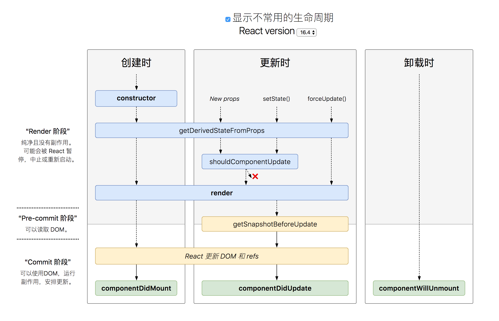

# 《React进阶之路》 - 笔记
<!-- TOC -->

- [《React进阶之路》 - 笔记](#React进阶之路---笔记)
  - [1、简介](#1简介)
  - [2、React PropTypes 定义组件的属性类型和默认属性](#2React-PropTypes-定义组件的属性类型和默认属性)
  - [3、组件的生命周期](#3组件的生命周期)
    - [3.1 < React 16](#31--React-16)
    - [3.2 React 16.3](#32-React-163)
      - [生命周期的变化](#生命周期的变化)
      - [Fiber 架构](#Fiber-架构)
  - [4、事件处理](#4事件处理)
  - [5、React 16 新特性](#5React-16-新特性)
    - [5.1 render新的返回类型](#51-render新的返回类型)
    - [5.2 错误处理](#52-错误处理)
    - [5.3 Portals](#53-Portals)
    - [5.4 自定义DOM属性](#54-自定义DOM属性)
    - [5.5 API 的变化](#55-API-的变化)
      - [被拆开的 componentWillReceiveProps](#被拆开的-componentWillReceiveProps)
      - [5.5.1 getDerivedStateFromProps](#551-getDerivedStateFromProps)
      - [5.5.2 componentDidUpdate()](#552-componentDidUpdate)
      - [5.5.3 getSnapshotBeforeUpdate()](#553-getSnapshotBeforeUpdate)
      - [5.5.4 Ref](#554-Ref)
  - [6、优化组件](#6优化组件)
  - [7、React.memo](#7Reactmemo)
  - [8、高阶组件（HOC）](#8高阶组件HOC)
    - [8.1 高阶组件的基本形式](#81-高阶组件的基本形式)
    - [8.2 用高阶组件抽取共同逻辑](#82-用高阶组件抽取共同逻辑)
    - [8.3 高阶组件的高级用法](#83-高阶组件的高级用法)
    - [8.4 链式调用高阶组件](#84-链式调用高阶组件)
    - [8.5 不要滥用高阶组件](#85-不要滥用高阶组件)
  - [9、render props 模式](#9render-props-模式)
    - [9.1 render props](#91-render-props)
    - [9.2 传递 props](#92-传递-props)
    - [9.3 不局限于 children](#93-不局限于-children)
    - [9.4 依赖注入](#94-依赖注入)
    - [9.5 render props 和高阶组件的比较](#95-render-props-和高阶组件的比较)
    - [9.6 小结](#96-小结)
  - [10、 提供者模式](#10-提供者模式)
    - [10.1 问题场景](#101-问题场景)
    - [10.2 提供者模式](#102-提供者模式)
    - [10.3 如何实现提供者模式](#103-如何实现提供者模式)
    - [10.4 React v16.3.0 之前的提供者模式](#104-React-v1630-之前的提供者模式)
    - [10.5 React v16.3.0 之后的提供者模式](#105-React-v1630-之后的提供者模式)
    - [10.6 两种提供者模式实现方式的比较](#106-两种提供者模式实现方式的比较)
    - [10.7 小结](#107-小结)
  - [11、MVC/MVVM/Flux](#11MVCMVVMFlux)
    - [11.1 MVC](#111-MVC)
      - [11.1.1 MVC模式中的3种角色](#1111-MVC模式中的3种角色)
    - [11.2 MVVM的演变](#112-MVVM的演变)
    - [11.3 MVC的问题](#113-MVC的问题)
    - [11.4 Flux](#114-Flux)
  - [12、PureComponent](#12PureComponent)
  - [13、Redux 中间件和异步](#13Redux-中间件和异步)
    - [13.1 react-redux](#131-react-redux)

<!-- /TOC -->

## 1、简介
React 通过引入`虚拟DOM`、`状态`、`单项数据流`等设计理念，形成以组件为核心，用组件搭建UI的开发模式，理顺了UI的开发过程，完美的将数据、组件状态和UI映射到一起，极大地提高了开发大型Web应用的效率

**React特点可以归结为以下四点**
1. 声明式的视图层
2. 简单的更新流程
3. 灵活的渲染实现
4. 高效的DOM操作

## 2、React PropTypes 定义组件的属性类型和默认属性
在React 16版本之后, `PropTypes` 从react包 换到了`prop-types `包中,所以想要使用PropTypes 需要这样:

> yarn add prop-types

在需要引入的地方使用:
```js
import PropTypes from 'prop-types';
```

组件属性类型和PropTypes属性的对应关系

| 类型 | PropTypes对应关系|
| ---- | ------ |
| String | PropTypes.string |
| Number | PropTypes.number |
| Boolean | PropTypes.bool |
| Function | PropTypes.func |
| Object | PropTypes.object |
| Array | PropTypes.array |
| Symbol | PropTypes.symbol |
| Element(React元素) | PropTypes.element |
| Node(可被渲染的节点：数字、字符串、React元素或由这些类型的数据组成的数组) | PropTypes.node |

当使用`PropTypes.object` 或 `PropTypes.array` 校验属性类型时， 我们只知道这个属性是一个对象或一个数组，至于对象的结构或数组元素的类型是什么样的，依然无从得知， 这种情况下更好的做法是使用 `PropTypes.shape` 或 `PropTypes.arrayOf` ， 例如
```js
style: PropTypes.shape({
  color: PropTypes.string,
  fontSize: PropTypes.number
}),
sequence: PropTypes.arrayOf(PropTypes.number)
```

表示`style`是一个对象，对象有`color`和`fontSize`两个属性，`color`是字符串类型，`fontSize`是数字类型；
`sequence`是一个数组，数组的元素是数字


验证组件实例的属性是否符合要求
```js
Todo.propTypes = { //isRequired  代表该参数是必须的
    remove: PropTypes.func.isRequired,  //必须而且必须是函数
    todo: PropTypes.object,     //非必须 可传可不传
    title: PropTypes.string.isRequired, 
};
var data = 123;
render( 
  <Todo title={data} />,  //此处验证不会通过
  document.body
);
```

组件的属性可以接收任意的值，数字，函数，字符串等
```js
// 可以声明 prop 为指定的 JS 基本类型。默认
// 情况下没有isRequired，这些 prop 都是可传可不传的。
    optionalArray: React.PropTypes.array,
    optionalBool: React.PropTypes.bool,
    optionalFunc: React.PropTypes.func,
    optionalNumber: React.PropTypes.number,
    optionalObject: React.PropTypes.object,
    optionalString: React.PropTypes.string,
    optionalSymbol: PropTypes.symbol,

// 所有可以被渲染的对象：数字，
// 字符串，DOM 元素或包含这些类型的数组。
    optionalNode: React.PropTypes.node,

// React 元素
    optionalElement: React.PropTypes.element,

// 用 JS 的 instanceof 操作符声明 prop 为类的实例。
    optionalMessage: React.PropTypes.instanceOf(Message),

// 用 enum 来限制 prop 只接受指定的值。 可以限制属性值是某个特定值之一
    optionalEnum: React.PropTypes.oneOf(['News', 'Photos']),

// 指定的多个对象类型中的一个 限制它为列举类型之一的对象
    optionalUnion: React.PropTypes.oneOfType([
      React.PropTypes.string,
      React.PropTypes.number,
      React.PropTypes.instanceOf(Message)
    ]),

// 指定类型组成的数组 一个指定元素类型的数组
    optionalArrayOf: React.PropTypes.arrayOf(React.PropTypes.number),

// 指定类型的属性构成的对象 一个指定类型的对象
    optionalObjectOf: React.PropTypes.objectOf(React.PropTypes.number),

// 特定形状参数的对象 一个指定属性及其类型的对象
    optionalObjectWithShape: React.PropTypes.shape({
      color: React.PropTypes.string,
      fontSize: React.PropTypes.number
    }),
  
// 你也可以在任何 PropTypes 属性后面加上 `isRequired` 
  // 后缀，这样如果这个属性父组件没有提供时，会打印警告信息
  requiredFunc: PropTypes.func.isRequired,

  // 任意类型的数据
  requiredAny: PropTypes.any.isRequired,

// 自定义验证器。如果验证失败需要返回一个 Error 对象。不要直接
// 使用 `console.warn` 或抛异常，因为这样 `oneOfType` 会失效。
    customProp: function(props, propName, componentName) {
      if (!/matchme/.test(props[propName])) {
        return new Error('Validation failed!');
      }
    }
    
  // 不过你可以提供一个自定义的 `arrayOf` 或 `objectOf` 
  // 验证器，它应该在验证失败时返回一个 Error 对象。 它被用
  // 于验证数组或对象的每个值。验证器前两个参数的第一个是数组
  // 或对象本身，第二个是它们对应的键。
  customArrayProp: PropTypes.arrayOf(function(propValue, key, componentName, location, propFullName) {
    if (!/matchme/.test(propValue[key])) {
      return new Error(
        'Invalid prop `' + propFullName + '` supplied to' +
        ' `' + componentName + '`. Validation failed.'
      );
    }
  })

```

限制单个子元素
通过PropTypes.element你可以指定只能有一个子元素被作为children传递给一个组件。
```js
import PropTypes from 'prop-types';
class MyComponent extends React.Component {
  render() {
    // This must be exactly one element or it will warn.
    const children = this.props.children;
    return (
      <div>
        {children}
      </div>
    );
  }
}

MyComponent.propTypes = {
  children: PropTypes.element.isRequired
};
```

默认prop值
可以定义props的默认值通过分配特殊的defaultProps属性：
```js
class Greeting extends React.Component {
  render() {
    return (
      <h1>Hello, {this.props.name}</h1>
    );
  }
}

// 为属性指定默认值
Greeting.defaultProps = {
  name: 'Stranger'
};

// 渲染"Hello, Stranger":
ReactDOM.render(
  <Greeting />,
  document.getElementById('example')
);
```

如果你在使用像 transform-class-properties 的 Babel 转换器，你也可以在React 组件类中声明 defaultProps 作为静态属性。这个语法还没有最终通过，在浏览器中需要一步编译工作。更多信息，查看类字段提议。
```js
class Greeting extends React.Component {
  static defaultProps = {
    name: 'stranger'
  }

  render() {
    return (
      <div>Hello, {this.props.name}</div>
    )
  }
}
```

## 3、组件的生命周期

### 3.1 < React 16
1. 挂载阶段
    1. constructor
    2. componentWillMount
    3. render
    4. componentDidMount
2. 更新阶段
    1. componentWillReceiveProps(nextProps)
    2. shouldComponentUpdate(nextProps, nextState)
    3. componentWillUpdate(nextProps, nextState)
    4. render
    5. componentDidUpdate(prevProps, prevState)
3. 卸载阶段
    componentWillUnmount


### 3.2 React 16.3

#### 生命周期的变化

<div align="center"></div>

#### Fiber 架构
生命周期函数的更改是因为 16.3 采用了 Fiber 架构，在新的 Fiber 架构中，组件的更新分为了两个阶段：

1. render phase：这个阶段决定究竟哪些组件会被更新。
2. commit phase：这个阶段是 React 开始执行更新（比如插入，移动，删除节点）。

commit phase 的执行很快，但是真实 DOM 的更新很慢，所以 React 在更新的时候会暂停再恢复组件的更新以免长时间的阻塞浏览器，这就意味着 render phase 可能会被执行多次（因为有可能被打断再重新执行）。

* `constructor`
* `componentWillMount`
* `componentWillReceiveProps`
* `componentWillUpdate`
* `getDerivedStateFromProps`
* `shouldComponentUpdate`
* `render`
* `setState` updater functions (the first argument)

这些生命周期都属于 render phase，上面已经说了，render phase 可能被多次执行，所以要避免在 render phase 中的生命周期函数中引入副作用。但是 16.3 之前的生命周期很容易引入副作用，所以 16.3 之后引入新的生命周期来限制开发者引入副作用。

## 4、事件处理
React中的事件是合成事件，并不是原生的DOM事件。React根据W3C规范定义了一套兼容各个浏览器的事件对象。
在DOM事件中，可以通过处理函数返回false来阻止事件的默认行为，但在React事件中，必须显示地调用事件对象的`preventDefault`方法来阻止事件的默认行为， 除了这一点外，DOM事件和React事件在使用上并无差别，如果在某些场景下必须使用DOM提供的原生事件，可以通过React事件对象的`nativeEvent`属性获取

React事件处理函数的写法主要有三种方式
1. 使用箭头函数
2. 使用组件方法
    使用bind会创建一个新的函数，因此这种写法依然存在每次render都会创建一个新函数的问题
3. 属性初始化语法（property initializer syntax）
    使用 ES7 的property initializers 会自动为class中定义的方法绑定this


## 5、React 16 新特性

### 5.1 render新的返回类型
React 16之前， render方法必须返回单个元素，现在，render方法支持两种新的返回类型： `数组(由React元素组成)` 和 `字符串`

定义一个 ListComponent 组件，它的render方法返回数组
```jsx
import React, { Component } from "react";

export default class App extends Component {
  render() {
    return [
      <ul>
        <ListComponent />
      </ul>,
      <StringComponent />
    ];
  }
}

class ListComponent extends Component {
  render() {
    return [
      <li key="A">First item</li>,
      <li key="B">Second item</li>,
      <li key="C">Third item</li>
    ];
  }
}

class StringComponent extends Component {
  render() {
    return "Just a strings";
  }
}
```

### 5.2 错误处理

React 16 之前，组件在运行期间如果执行出错，就会阻塞整个应用的渲染，这时候只能刷新页面才能恢复应用。

React 16 引入了新的错误处理机制，默认情况下，当组件中抛出错误时，这个组件会从组件树中卸载，从而避免整个应用的崩溃。这种方式比起之前的处理方式有所进步，但用户体验依然不够好。

React 16 还提供了一种更加友好的错误处理方式 -- `错误边界（Error Boundaries)`， 
错误边界是能够捕获子组件的错误并对其做优雅处理的组件。 优雅的处理可以是输出错误日志、显示出错提示等，显然这比直接写在组件要更加友好

定义了 `componentDidCatch(error, info)` 这个方法的组件将成为一个错误边界，现在我们创建一个组件`ErrorBoundary`
```jsx
import React, { Component } from "react";

const Profile = ({ user }) => <div>name: {user.name}</div>;

class ErrorBoundary extends Component {
  constructor(props) {
    super(props);
    this.state = { hasError: false };
  }

  componentDidCatch(err, info) {
    // 显示错误UI
    this.setState({ hasError: true });
    // 同时输出错误日志
    console.log(err, info);
  }

  render() {
    if (this.state.hasError) {
      return <h1>Oops, something went wrong!</h1>;
    }
    return this.props.children;
  }
}

class App extends Component {
  constructor(props) {
    super(props);
    this.state = {
      user: { name: "react" }
    };
  }

  // 将user置为null，模拟异常
  onClick = () => {
    this.setState({ user: null });
  };

  render() {
    return (
      <div>
        <ErrorBoundary>
          <Profile user={this.state.user} />
        </ErrorBoundary>
        <button onClick={this.onClick}>更新</button>
      </div>
    );
  }
}

export default App;
```

### 5.3 Portals
React 16的`Portals`特性让我们可以把组件渲染到当前组件树以外的DOM节点上，这个特性典型的应用场景是渲染应用的全局弹框，使用Portals后，任意组件都可以将弹窗组件渲染到根节点上，以方便弹框的显示。

`Portals`的实现以来ReactDOM的一个新的API:
> ReactDOM.createPortal(child, container)

第一个参数`child`是可以被渲染的React节点，例如`React元素、由React元素组成的数组、字符串`等， `container`是一个DOM元素，child将被挂载到这个DOM节点

我们创建一个Modal组件，Modal使用 `ReactDOM.createPortal()` 在DOM根节点上创建一个弹框：
```jsx
import React, { Component } from "react";
import ReactDOM from "react-dom";

class Modal extends Component {
  constructor(props) {
    super(props);
    // 根节点下创建一个div节点
    this.container = document.createElement("div");
    document.body.appendChild(this.container);
  }

  componentWillUnmount() {
    document.body.removeChild(this.container);
  }

  render() {
    // 创建的DOM树挂载到this.container指向的div节点下面
    return ReactDOM.createPortal(
      <div className="modal">
        <span className="close" onClick={this.props.onClose}>
          &times;
        </span>
        <div className="content">{this.props.children}</div>
      </div>,
      this.container
    );
  }
}


// APP
class App extends Component {
  constructor(props) {
    super(props);
    this.state = { showModal: true };
  }

  // 关闭弹框
  closeModal = () => {
    this.setState({ showModal: false });
  };

  render() {
    return (
      <div>
        <h2>Dashboard</h2>
        {this.state.showModal && (
          <Modal onClose={this.closeModal}>Modal Dialog </Modal>
        )}
      </div>
    );
  }
}

export default App;
```

### 5.4 自定义DOM属性
React 16 之前会忽略不识别的 HTML和SVG属性，现在React会把不识别的属性传递给DOM元素

例如， React 16 之前，下面的React元素
`<div custom-attribute="something" />`
在浏览器中渲染出的DOM节点为：`<div />`
而React 16渲染出的DOM节点为：`<div custom-attribute="something" />`

### 5.5 API 的变化
#### 被拆开的 componentWillReceiveProps

#### 5.5.1 getDerivedStateFromProps

react 16.3 新加入的 API，对标的是之前的 componentWillReceiveProps，在一个组件已经实例化后，re-render 之前被调用。这个新的生命周期具有如下特点：

* **无副作用** —— 因为是处于 Fiber 的 render 阶段，所以有可能会被多次执行。所以 API 被设计为了静态函数，无法访问到实例的方法，也没有 ref 来操作 DOM，这就避免了实例方法带来副作用的可能性。但是依旧可以从 props 中获得方法触发副作用，所以在执行可能触发副作用的函数前要三思。
* **只用来更新 state** —— 其实看名字也可以知道，这个生命周期唯一的作用就是从 nextProps 和 prevState 中衍生出一个新的 state。

虽然 getDerivedStateFromProps 对标的是 componentWillReceiveProps，但是 componentWillReceiveProps 作为 16.3 之前的“大杂烩“周期，各种脏活累活都能干。在 16.3 之后 componentWillReceiveProps 要通过 getDerivedStateFromProps 与 componentDidUpdate 合力才能替代。之所以要分拆 componentWillReceiveProps，我个人认为有两方面的原因：

1. Fiber 架构导致组件的更新被随时打断再重来，所以 componentWillReceiveProps 可能会被执行多次，但是无法阻止开发者在 componentWillReceiveProps 中引入副作用（事实上 componentWillReceiveProps 是开发者最喜欢引入副作用的生命周期），所以只能将这个 API 拆成在 render phase 中的纯函数 getDerivedStateFromProps 和在 commit phase 中的 componentDidUpdate 来让组件更好预测和维护。
2. [这篇文章](https://zhuanlan.zhihu.com/p/36062486) 中一针见血得指出：
   > **React 团队试图通过框架级别的 API 来约束或者说帮助开发者写出可维护性更佳的 JavaScript 代码**
   
   
   框架最大的特点就是“限制”，通过这么一个限制重重的静态生命周期不让你调用实例方法，就给你 props 和 prevState 让你来 derived state，甚至连这个生命周期的都是一反常态的用一个具体的行为而不是用一个更新过程的时间节点来命名，就是让开发者只做 derived state 这个行为，并且通过返回值来更新 state 可以保证只更新一次 state（以前的 componentWillReceiveProps 是通过  batchUpdate 来保证只更新一次）。

不过官方并不推荐使用 getDerivedStateFromProps，倒不是 getDerivedStateFromProps 这个 API 带来的问题，而是 **derived state** 带来的问题，之前的 componentWillReceiveProps 也有这个问题。

derived state 会造成不只一个 source of truth，我们都知道，React 的哲学是 `view = f(data)`，但是当有两个 data 去表征同一个参数造成 view 的修改时就有麻烦了，所以在使用 getDerivedStateFromProps 之前一定要想好是否可以直接使用 props。

getDerivedStateFromProps 作为一个静态函数是不能访问实例属性的，如果需要通过实例方法和 state 或者 props 来计算一个值在 render 周期中使用的 state，那么最好的方法是直接在 render 中计算出这个值然后直接使用，因为这会是一个纯函数的操作。这从侧面反映出来，这次生命周期的升级通过添加限制在一定程度上规范了生命周期的使用。

#### 5.5.2 componentDidUpdate()
那么，之前的副作用在要放在哪里呢？答案就是 componentDidUpdate。

不过这又带来了一个问题，在之前版本的生命周期中，开发者最喜欢使用 componentWillReceiveProps 的一个原因就是 componentWillReceiveProps 不会引起 re-render，而 componentDidUpdate 中 setState，会再次引发一轮的 re-render。

所以我们要尽量避免在 componentDidUpdate 中 setState，而是提前到 getDerivedStateFromProps，将网络操作的副作用放在 componentDidUpdate 中，一方面网络总是有一定延迟的，不管放在哪个生命周期中都会引发 re-render，另一方面是 componentDidUpdate 中 DOM 已经更新。

将通过 props 或 state 计算的衍生数据放在 render 中，一方面符合 render 的纯函数理念，另一方面减少了产生新的 truth of source 的概率。

#### 5.5.3 getSnapshotBeforeUpdate()
getSnapshotBeforeUpdate 处于 render phase 和 commit phase 的中间，不过准确的说是处于 commit phase 的阶段，因为它只会被执行一次，在 react 修改 DOM 之前会被紧挨着调用，所以在这个生命周期能够获取这一次更新前的 DOM 的信息。这个生命周期返回的值将作为 componentDidUpdate 的第三个参数。

#### 5.5.4 Ref
在 React16 新版本中，新引入了 React.createRef 与 React.forwardRef 两个 API，有计划移除老的 string ref，使 ref 的使用更加便捷与明确。如果你的应用已经升级到 React16.3+ 版本，那就放心大胆使用 React.createRef 吧，如果暂时没有的话，建议使用 callback ref 来代替 string ref。

[详细说明](https://github.com/Jingce-lu/mystudy/blob/more/2019/0426%20-%20Ref.md)

## 6、优化组件
当打开一个页面，input 输入框自动获取光标，这会大大提升用户体验。

比如打开一个注册页面，光标自动获取到用户名输入栏。

有人在写这个组件的时候会想到，为 input 绑定一个 id，然后通过 `document.getElementById('user-name-input').focus()` 来实现。

但我认为这并不是一个很好的方式，我有一个更好的实现方式:
```js
class Input extends Component {
  focus() {
    this.el.focus();
  }

  render() {
    return (
      <input
        ref={el=> { this.el = el; }}
      />
    );
  }
}
```
ok，一个拥有 `focus()` 方法的 `Input` 组件完成了。

在父组件中，我们可以调到子组件的 `focus()` 方法：
```js
class SignInModal extends Component {
  componentDidMount() {
    this.InputComponent.focus();
  }

  render() {
    return (
      <div>
        <label>User name: </label>
        <Input
          ref={comp => { this.InputComponent = comp; }}
        />
      </div>
    )
  }
}
```
注意，当您在一个组件上使用 `ref` 时，它是对组件(而不是底层元素)的引用，因此您可以访问它的方法。

## 7、React.memo
虽然 `PureComponent` 可以提高组件渲染性能，但是它也不是没有代价的，它逼迫我们必须把组件实现为 class，不能用纯函数来实现组件。

如果你使用 React v16.6.0 之后的版本，可以使用一个新功能 React.memo 来完美实现 React 组件，上面的 Joke 组件可以这么写：
```jsx
const Joke = React.memo(({ value }) => (
    <div>
        
        {value || 'loading...' }
    </div>
));
```

React.memo 既利用了 shouldComponentUpdate，又不要求我们写一个 class，这也体现出 React 逐步向完全函数式编程前进。

> React.memo()可以满足创建纯函数而不是一个类的需求。 React.memo()可接受2个参数，第一个参数为纯函数的组件，第二个参数用于对比props控制是否刷新，与shouldComponentUpdate()功能类似。


## 8、高阶组件（HOC）
在开发 React 组件过程中，很容易发现这样一种现象，某些功能是多个组件通用的，如果每个组件都重复实现这样的逻辑，肯定十分浪费，而且违反了 **“不要重复自己”（DRY，Don't Repeat Yourself)** 的编码原则，我们肯定想要把这部分共用逻辑提取出来重用。

我们说过，在 React 的世界里，组件是第一公民，首先想到的是当然是把共用逻辑提取为一个 React 组件。不过，有些情况下，这些共用逻辑还没法成为一个独立组件，换句话说，这些共用逻辑单独无法使用，它们只是对其他组件的功能加强。

举个例子，对于很多网站应用，有些模块都需要在用户已经登录的情况下才显示。比如，对于一个电商类网站，“退出登录”按钮、“购物车”这些模块，就只有用户登录之后才显示，对应这些模块的 React 组件如果连“只有在登录时才显示”的功能都重复实现，那就浪费了。

这时候，我们就可以利用 **“高阶组件（HoC）”** 这种模式来解决问题。

### 8.1 高阶组件的基本形式
“高阶组件”名为“组件”，其实并不是一个组件，而是一个 **函数**，只不过这个函数比较特殊，它接受至少一个 React 组件为参数，并且能够返回一个全新的 React 组件作为结果，当然，这个新产生的 React 组件是对作为参数的组件的包装，所以，有机会赋予新组件一些增强的“神力”。

一个最简单的高阶组件是这样的形式：
```javascript
const withDoNothing = (Component) => {
  const NewComponent = (props) => {
    return <Component {...props} />;
  };
  return NewComponent;
};
```
上面的函数 `withDoNothing` 就是一个高阶组件，作为一项业界通用的代码规范，高阶组件的命名一般都带 `with` 前缀，命名中后面的部分代表这个高阶组件的功能。

就如同 withDoNothing 这个名字所说的一样，这个高阶组件什么都没做，但是从中可以看出高阶组件的基本代码套路。

1. 高阶组件不能去修改作为参数的组件，高阶组件必须是一个纯函数，不应该有任何副作用。
1. 高阶组件返回的结果必须是一个新的 React 组件，这个新的组件的 JSX 部分肯定会包含作为参数的组件。
1. 高阶组件一般需要把传给自己的 props 转手传递给作为参数的组件。

### 8.2 用高阶组件抽取共同逻辑
接下来，我们对 withDoNothing 进行一些改进，让它实现“只有在登录时才显示”这个功能。

假设我们已经有一个函数 `getUserId` 能够从 cookies 中读取登录用户的 ID，如果用户未登录，这个 `getUserId` 就返回空，那么“退出登录按钮“就需要这么写：
```javascript
const LogoutButton = () => {
  if (getUserId()) {
    return ...; // 显示”退出登录“的JSX
  } else {
    return null;
  }
};
```
同样，购物车的代码就是这样：
```javascript
const ShoppintCart = () => {
  if (getUserId()) {
    return ...; // 显示”购物车“的JSX
  } else {
    return null;
  }
};
```
上面两个组件明显有重复的代码，我们可以把重复代码抽取出来，形成 withLogin 这个高阶组件，代码如下：
```javascript
const withLogin = (Component) => {
  const NewComponent = (props) => {
    if (getUserId()) {
      return <Component {...props} />;
    } else {
      return null;
    }
  }

  return NewComponent;
};
```
如此一来，我们就只需要这样定义 `LogoutButton` 和 `ShoppintCart：`
```javascript
const LogoutButton = withLogin((props) => {
  return ...; // 显示”退出登录“的JSX
});

const ShoppingCart = withLogin(() => {
  return ...; // 显示”购物车“的JSX
});
```
你看，我们避免了重复代码，以后如果要修改对用户是否登录的判断逻辑，也只需要修改 withLogin，而不用修改每个 React 组件。

### 8.3 高阶组件的高级用法
高阶组件只需要返回一个 React 组件即可，没人规定高阶组件只能接受一个 React 组件作为参数，完全可以传入多个 React 组件给高阶组件。

比如，我们可以改进上面的 withLogin，让它接受两个 React 组件，根据用户是否登录选择渲染合适的组件。
```javascript
const withLoginAndLogout = (ComponentForLogin, ComponentForLogout) => {
  const NewComponent = (props) => {
    if (getUserId()) {
      return <ComponentForLogin {...props} />;
    } else {
      return <ComponentForLogout{...props} />;
    }
  }
  return NewComponent;
};
```
有了上面的 `withLoginAndLogout`，就可以产生根据用户登录状态显示不同的内容。
```javascript
const TopButtons = withLoginAndLogout(
  LogoutButton,
  LoginButton
);
```

### 8.4 链式调用高阶组件
高阶组件最巧妙的一点，是可以链式调用。

假设，你有三个高阶组件分别是 `withOne`、`withTwo` 和 `withThree`，那么，如果要赋予一个组件 X 某个高阶组件的超能力，那么，你要做的就是挨个使用高阶组件包装，代码如下：
```javascript
const X1 = withOne(X);
const X2 = withTwo(X1);
const X3 = withThree(X2);
const SuperX = X3; //最终的SuperX具备三个高阶组件的超能力
```
很自然，我们可以避免使用中间变量 X1 和 X2，直接连续调用高阶组件，如下：
```javascript
const SuperX = withThree(withTwo(withOne(X)));
```
对于 X 而言，它被高阶组件包装了，至于被一个高阶组件包装，还是被 N 个高阶组件包装，没有什么差别。而高阶组件本身就是一个纯函数，纯函数是可以组合使用的，所以，我们其实可以把多个高阶组件组合为一个高阶组件，然后用这一个高阶组件去包装X，代码如下：
```javascript
const hoc = compose(withThree, withTwo, withOne);
const SuperX = hoc(X);
```
在上面代码中使用的 `compose`，是函数式编程中很基础的一种方法，作用就是把多个函数组合为一个函数，在很多开源的代码库中都可以看到，下面是一个参考实现：
```javascript
export default function compose(...funcs) {
  if (funcs.length === 0) {
    return arg => arg
  }

  if (funcs.length === 1) {
    return funcs[0]
  }

  return funcs.reduce((a, b) => (...args) => a(b(...args)))
}
```
React 组件可以当做积木一样组合使用，现在有了 compose，我们就可以把高阶组件也当做积木一样组合，进一步重用代码。

假如一个应用中多个组件都需要同样的多个高阶组件包装，那就可以用 compose 组合这些高阶组件为一个高阶组件，这样在使用多个高阶组件的地方实际上就只需要使用一个高阶组件了。

### 8.5 不要滥用高阶组件
高阶组件虽然可以用一种可重用的方式扩充现有 React 组件的功能，但高阶组件并不是绝对完美的。

首先，高阶组件不得不处理 `displayName`，不然 debug 会很痛苦。当 React 渲染出错的时候，靠组件的 displayName 静态属性来判断出错的组件类，而高阶组件总是创造一个新的 React 组件类，所以，每个高阶组件都需要处理一下 displayName。

如果要做一个最简单的什么增强功能都没有的高阶组件，也必须要写下面这样的代码：
```javascript
const withExample = (Component) => {
  const NewComponent = (props) => {
    return <Component {...props} />;
  }
  
  NewComponent.displayName = `withExample(${Component.displayName || Component.name || 'Component'})`;
  
  return NewCompoennt;
};
```
每个高阶组件都这么写，就会非常的麻烦。

对于 React 生命周期函数，高阶组件不用怎么特殊处理，但是，如果内层组件包含定制的静态函数，这些静态函数的调用在 React 生命周期之外，那么高阶组件就必须要在新产生的组件中增加这些静态函数的支持，这更加麻烦。

其次，高阶组件支持嵌套调用，这是它的优势。但是如果真的一大长串高阶组件被应用的话，当组件出错，你看到的会是一个超深的 stack trace，十分痛苦。

最后，使用高阶组件，一定要非常小心，要避免重复产生 React 组件，比如，下面的代码是有问题的：

```javascript
const Example = () => {
  const EnhancedFoo = withExample(Foo);
  return <EnhancedFoo />
}
```
像上面这样写，每一次渲染 Example，都会用高阶组件产生一个新的组件，虽然都叫做 EnhancedFoo，但是对 React 来说是一个全新的东西，在重新渲染的时候不会重用之前的虚拟 DOM，会造成极大的浪费。

正确的写法是下面这样，自始至终只有一个 EnhancedFoo 组件类被创建：
```javascript
const EnhancedFoo = withExample(Foo);

const Example = () => {
  return <EnhancedFoo />
}
```
总之，高阶组件是重用代码的一种方式，但并不是唯一方式，在下一小节，我们会介绍一种更加精妙的方式。


## 9、render props 模式

### 9.1 render props

所谓 render props，指的是让 React 组件的 props 支持函数这种模式。因为作为 props 传入的函数往往被用来渲染一部分界面，所以这种模式被称为 render props。

一个最简单的 render props 组件 `RenderAll`，代码如下：
```javascript
const RenderAll = (props) => {
  return(
     <React.Fragment>
     	{props.children(props)}
     </React.Fragment>
  );
};
```
这个 RenderAll 预期子组件是一个函数，它所做的事情就是把子组件当做函数调用，调用参数就是传入的 props，然后把返回结果渲染出来，除此之外什么事情都没有做。

使用 RenderAll 的代码如下：
```javascript
<RenderAll>
	{() => <h1>hello world</h1>}
</RenderAll>
```
可以看到，RenderAll 的子组件，也就是夹在 RenderAll 标签之间的部分，其实是一个函数。这个函数渲染出 `<h1>hello world</h1>`，这就是上面使用 RenderAll 渲染出来的结果。

当然，这个 RenderAll 没做任何实际工作，接下来我们看 render props 真正强悍的使用方法。

### 9.2 传递 props

和高阶组件一样，render props 可以做很多的定制功能，我们还是以根据是否登录状态来显示一些界面元素为例，来实现一个 render props。

下面是实现 render props 的 `Login` 组件，可以看到，render props 和高阶组件的第一个区别，就是 render props 是真正的 React 组件，而不是一个返回 React 组件的函数。

```javascript
const Login = (props) => {
  const userName = getUserName();

  if (userName) {
    const allProps = {userName, ...props};
    return (
      <React.Fragment>
        {props.children(allProps)}
      </React.Fragment>
    );
  } else {
    return null;
  }
};
```
当用户处于登录状态，`getUserName` 返回当前用户名，否则返回空，然后我们根据这个结果决定是否渲染 `props.children` 返回的结果。

当然，render props 完全可以决定哪些 props 可以传递给 props.children，在 Login 中，我们把 `userName` 作为增加的 props 传递给下去，这样就是 Login 的增强功能。

一个使用上面 Login 的 JSX 代码示例如下：
```javascript
<Login>
    {({userName}) => <h1>Hello {userName}</h1>}
</Login>
```
对于名为“程墨Morgan”的用户登录，上面的 JSX 会产生 `<h1>Hello 程墨Morgan</h1>`。

### 9.3 不局限于 children

在上面的例子中，作为 render 方法的 props 就是 `children`，在我写的[《深入浅出React和Redux》](https://link.juejin.im/?target=https%3A%2F%2Fzhuanlan.zhihu.com%2Fp%2F26648239)中，将这种模式称为“以函数为子组件（function as child）”的模式，这可以算是 render props 的一种具体形式，也就利用 `children` 这个 props 来作为函数传递。

实际上，render props 这个模式不必局限于 children 这一个 props，任何一个 props 都可以作为函数，也可以利用多个 props 来作为函数。

我们来扩展 Login，不光在用户登录时显示一些东西，也可以定制用户没有登录时显示的东西，我们把这个组件叫做 `Auth`，对应代码如下：
```javascript
const Auth = (props) => {
  const userName = getUserName();

  if (userName) {
    const allProps = {userName, ...props};
    return (
      <React.Fragment>
        {props.login(allProps)}
      </React.Fragment>
    );
  } else {
    <React.Fragment>
      {props.nologin(props)}
    </React.Fragment>
  }
};
```
使用 Auth 的话，可以分别通过 `login` 和 `nologin` 两个 props 来指定用户登录或者没登录时显示什么，用法如下：
```javascript
<Auth
    login={({userName}) => <h1>Hello {userName}</h1>}
    nologin={() => <h1>Please login</h1>}
  />
```

### 9.4 依赖注入

render props 其实就是 React 世界中的 **“依赖注入”（Dependency Injection)**。

所谓依赖注入，指的是解决这样一个问题：逻辑 A 依赖于逻辑 B，如果让 A 直接依赖于 B，当然可行，但是 A 就没法做得通用了。依赖注入就是把 B 的逻辑以函数形式传递给 A，A 和 B 之间只需要对这个函数接口达成一致就行，如此一来，再来一个逻辑 C，也可以用一样的方法重用逻辑 A。

在上面的代码示例中，`Login` 和 `Auth` 组件就是上面所说的逻辑 A，而传递给组件的函数类型 props，就是逻辑 B 和 C。

### 9.5 render props 和高阶组件的比较

我们来比对一下这两种重用 React 组件逻辑的模式。

首先，render props 模式的应用，就是做一个 React 组件，而高阶组件，虽然名为“组件”，其实只是一个产生 React 组件的函数。

render props 不像上一小节中介绍的高阶组件有那么多毛病，如果说 render props 有什么缺点，那就是 render props 不能像高阶组件那样链式调用，当然，这并不是一个致命缺点。

render props 相对于高阶组件还有一个显著优势，就是对于新增的 props 更加灵活。还是以登录状态为例，假如我们扩展 withLogin 的功能，让它给被包裹的组件传递用户名这个 props，代码如下：
```javascript
const withLogin = (Component) => {
  const NewComponent = (props) => {
    const userName= getUserName();
    if (userName) {
      return <Component {...props} userName={userName}/>;
    } else {
      return null;
    }
  }

  return NewComponent;
};
```
这就要求被 withLogin 包住的组件要接受 `userName` 这个props。可是，假如有一个现成的 React 组件不接受 userName，却接受名为 `name` 的 props 作为用户名，这就麻烦了。我们就不能直接用 withLogin 包住这个 React 组件，还要再造一个组件来做 `userName` 到 `name` 的映射，十分费事。

对于应用 render props 的 Login，就不存在这个问题，接受 `name` 不接受 `userName` 是吗？这样写就好了：
```javascript
<Login>
  {
    (props) => {
      const {userName} = props;
      return <TheComponent {...props} name={userName} />
    }
  }
</Login>
```
所以，当需要重用 React 组件的逻辑时，建议首先看这个功能是否可以抽象为一个简单的组件；如果行不通的话，考虑是否可以应用 render props 模式；再不行的话，才考虑应用高阶组件模式。

这并不表示高阶组件无用武之地，在后续章节，我们会对 render props 和高阶组件分别讲解具体的实例。

### 9.6 小结
在这一小节中，我们介绍了 render props 这种模式，也将 render props 和高阶组件两种模式进行了比较。

读者应该要明白:

1. render props 的形式；
1. render props 其实就是“依赖注入”；
1. 如何利用 render props 实现共享组件之间的逻辑。


## 10、 提供者模式
介绍 React 中的 “**提供者模式**”（**Provider Pattern**）

### 10.1 问题场景

在 React 中，props 是组件之间通讯的主要手段，但是，有一种场景单纯靠 props 来通讯是不恰当的，那就是两个组件之间间隔着多层其他组件，下面是一个简单的组件树示例图：


在上图中，组件 A 需要传递信息给组件 X，如果通过 props 的话，那么从顶部的组件 A 开始，要把 props 传递给组件 B，然后组件 B 传递给组件 D，最后组件 D 再传递给组件 X。

其实组件 B 和组件 D 完全用不上这些 props，但是又被迫传递这些 props，这明显不合理，要知道组件树的结构会变化的，将来如果组件 B 和组件 D 之间再插入一层新的组件，这个组件也需要传递这个 props，这就麻烦无比。

可见，对于跨级的信息传递，我们需要一个更好的方法。

在 React 中，解决这个问题应用的就是“提供者模式”。

### 10.2 提供者模式

虽然这个模式叫做“提供者模式”，但是其实有两个角色，一个叫“提供者”（Provider），另一个叫“消费者”（Consumer），这两个角色都是 React 组件。其中“提供者”在组件树上居于比较靠上的位置，“消费者”处于靠下的位置。在上面的组件树中，组件 A 可以作为提供者，组件 X 就是消费者。

既然名为“提供者”，它可以提供一些信息，而且这些信息在它之下的所有组件，无论隔了多少层，都可以直接访问到，而不需要通过 props 层层传递。

避免 props 逐级传递，即是提供者的用途。

### 10.3 如何实现提供者模式

实现提供者模式，需要 React 的 `Context` 功能，可以说，提供者模式只不过是让 `Context` 功能更好用一些而已。

**所谓 `Context` 功能，就是能够创造一个“上下文”，在这个上下文笼罩之下的所有组件都可以访问同样的数据**。

在 React v16.3.0 之前，React 虽然提供了 Context 功能，但是官方文档上都建议尽量不要使用，因为对应的 API 他们并不满意，觉得迟早要废弃掉。即使如此，依然有很多库和应用使用 Context 功能，可见对这个需求的呼声有多大。

当 React 发布 v16.3.0 时，终于提供了“正式版本”的 Context 功能 API，和之前的有很大不同，当然，这也带来一些问题，我在后面会介绍。

提供者模式的一个典型用例就是实现 **“样式主题”（Theme）**，由顶层的提供者确定一个主题，下面的样式就可以直接使用对应主题里的样式。这样，当需要切换样式时，只需要修改提供者就行，其他组件不用修改。

为了方便比对，这里我会介绍提供者模式用不同 Context API 的实现方法。不过，你如果完全不在意老版本 React 如何实现的，可以略过下面一段。

### 10.4 React v16.3.0 之前的提供者模式

在 React v16.3.0 之前，要实现提供者，就要实现一个 React 组件，不过这个组件要做两个特殊处理。

1. 需要实现 `getChildContext` 方法，用于返回“上下文”的数据；
1. 需要定义 `childContextTypes` 属性，声明“上下文”的结构。

下面就是一个实现“提供者”的例子，组件名为 `ThemeProvider`：
```javascript
class ThemeProvider extends React.Component {
  getChildContext() {
    return {
      theme: this.props.value
    };
  }
  render() {
    return (
      <React.Fragment>
        {this.props.children}
      </React.Fragment>
    );
  }
}

ThemeProvider.childContextTypes = {
  theme: PropTypes.object
};
```
在上面的例子中，`getChildContext` 只是简单返回名为 value 的 props 值，但是，因为 `getChildContext` 是一个函数，它可以有更加复杂的操作，比如可以从 state 或者其他数据源获得数据。

对于 ThemeProvider，我们创造了一个上下文，这个上下文就是一个对象，结构是这样：
```javascript
{
  theme: {
    //一个对象
  }
}
```
接下来，我们来做两个消费（也就是使用）这个“上下文”的组件，第一个是 Subject，代表标题；第二个是 Paragraph，代表章节。

我们把 Subject 实现为一个类，代码如下：
```javascript
class Subject extends React.Component {
  render() {
    const {mainColor} = this.context.theme;
    return (
      <h1 style={{color: mainColor}}>
        {this.props.children}
      </h1>
    );
  }
}

Subject.contextTypes = {
  theme: PropTypes.object
}
```
在 Subject 的 `render` 函数中，可以通过 `this.context` 访问到“上下文”数据，因为 ThemeProvider 提供的“上下文”包含 `theme` 字段，所以可以直接访问 `this.context.theme`。

千万不要忘了 Subject 必须增加 `contextTypes` 属性，必须和 ThemeProvider 的 `childContextTypes` 属性一致，不然，`this.context` 就不会得到任何值。

读者可能会问了，为什么这么麻烦呢？为什么要求“提供者”用 `childContextTypes` 定义一次上下文结构，又要求“消费者”再用 `contextTypes` 再重复定义一次呢？这不是很浪费吗？

React 这么要求，是考虑到“上下文”可能会嵌套，就是一个“提供者”套着另一个“提供者”，这时候，底层的消费者组件到底消费哪一个“提供者”呢？通过这种显示的方式指定。

不过，实话实说，这样的 API 设计的确麻烦了一点，难怪 React 官方在最初就不建议使用。

上面的 Subject 是一个类，其实也可以把消费者实现为一个纯函数组件，只不过访问“上下文”的方式有些不同，我们用纯函数的方式实现另一个消费者 `Paragraph`，代码如下：
```javascript
const Paragraph = (props, context) => {
  const {textColor} = context.theme;
  return (
    <p style={{color: textColor}}>
      {props.children}
    </p>
  );
};

Paragraph.contextTypes = {
  theme: PropTypes.object
};
```
从上面的代码可以看到，因为 Paragraph 是一个函数形式，所以不可能访问 `this.context`，但是函数的第二个参数其实就是 `context`。

当然，也不要忘了设定 Paragraph 的 `contextTypes`，不然参数 `context` 也不会是上下文。

最后，我们看如何结合”提供者“和”消费者“。

我们做一个组件来使用 Subject 和 Paragraph，这个组件不需要帮助传递任何 props，代码如下：
```javascript
const Page = () => (
  <div>
    <Subject>这是标题</Subject>
    <Paragraph>
      这是正文
    </Paragraph>
  </div>
);
```
上面的组件 `Page` 使用了 Subject 和 Paragraph，现在我们想要定制样式主题，只需要在 Page 或者任何需要应用这个主题的组件外面包上 ThemeProvider，对应的 JSX 代码如下：

```javascript
<ThemeProvider value={{mainColor: 'green', textColor: 'red'}} >
  <Page />
</ThemeProvider>
```
最后，看到的效果如下：


当我们需要改变一个样式主题的时候，改变传给 ThemeProvider的 value 值就搞定了。

### 10.5 React v16.3.0 之后的提供者模式

到了 React v16.3.0 的时候，新的 Context API 出来了，这套 API 毫不掩饰自己就是“提供者模式”的实现，命名上就带 “Provider” 和 “Consumer”。

还是上面的样式主题的例子，首先，要用新提供的 `createContext` 函数创造一个“上下文”对象。

```javascript
const ThemeContext = React.createContext();
```
这个“上下文”对象 `ThemeContext` 有两个属性，分别就是——对，你没猜错——`Provider` 和 `Consumer`。

```javascript
const ThemeProvider = ThemeContext.Provider;
const ThemeConsumer = ThemeContext.Consumer;
```
创造“提供者”极大简化了，都不需要我们创造一个 React 组件类。

使用“消费者”也同样简单，而且应用了上一节我们介绍的 render props 模式，比如，Subject 的代码如下:

```javascript
class Subject extends React.Component {
  render() {
    return (
      <ThemeConsumer>
        {
          (theme) => (
            <h1 style={{color: theme.mainColor}}>
              {this.props.children}
            </h1>
          )
        }
      </ThemeConsumer>
    );
  }
}
```
上面的 `ThemeConsumer` 其实就是一个应用了 render props 模式的组件，它要求子组件是一个函数，会把“上下文”的数据作为参数传递给这个函数，而这个函数里就可以通过参数访问“上下文”对象。

在新的 API 里，不需要设定组件的 `childContextTypes` 或者 `contextTypes` 属性，这省了不少事。

可以注意到，Subject 没有自己的状态，没必要实现为类，我们用纯函数的形式实现 Paragraph，代码如下：
```javascript
const Paragraph = (props, context) => {
  return (
    <ThemeConsumer>
      {
        (theme) => (
          <p style={{color: theme.textColor}}>
            {props.children}
          </p>
          )
      }
    </ThemeConsumer>
  );
};
```
实现 Page 的方式并没有变化，而应用 ThemeProvider 的代码和之前也完全一样:
```javascript
<ThemeProvider value={{mainColor: 'green', textColor: 'red'}} >
    <Page />
  </ThemeProvider>
```

### 10.6 两种提供者模式实现方式的比较

通过上面的代码，可以很清楚地看到，新的 Context API 更简洁，但是，也并不是十全十美。

在老版 Context API 中，“上下文”只是一个概念，并不对应一个代码，两个组件之间达成一个协议，就诞生了“上下文”。

在新版 Context API 中，需要一个“上下文”对象（上面的例子中就是 `ThemeContext`)，使用“提供者”的代码和“消费者”的代码往往分布在不同的代码文件中，那么，这个 `ThemeContext` 对象放在哪个代码文件中呢？

最好是放在一个独立的文件中，这么一来，就多出一个代码文件，而且所有和这个“上下文”相关的代码，都要依赖于这个“上下文”代码文件，虽然这没什么大不了的，但是的确多了一层依赖关系。

为了避免依赖关系复杂，每个应用都不要滥用“上下文”，应该限制“上下文”的使用个数。

不管怎么说，新版本的 Context API 才是未来，在 React v17 中，可能就会删除对老版 Context API 的支持，所以，现在大家都应该使用第二种实现方式。


### 10.7 小结

这一小节我们介绍了“提供者模式”，读者应该能够理解：

1. 提供者模式解决的问题；
1. React 的 Context 功能对这种模式有很直接的支持；
1. 提供者模式中 render props 的应用。
1. 在接下来关于 Redux 和 Mobx 的介绍中，可以看到“提供者模式”更广泛的应用。


## 11、MVC/MVVM/Flux
### 11.1 MVC
MVC是一种架构设计模式，它通过关注数据界面分离，来鼓励改进应用程序结构。

具体的说，MVC强制将业务数据(`Model`) 与用户界面(`View`)隔离，用控制器(`Controller`)管理逻辑和用户输入

#### 11.1.1 MVC模式中的3种角色
在MVC模式中，主要涉及3种角色--**Model、View和Controller**

* Model
    Model负责保存应用数据，和后端交互同步应用数据，或校验数据

    Model不涉及应用数据，也不涉及表示层，而是代表应用程序可能需要的独特形式的数据，当Model改变时，它会通知它的观察者（如视图）做出相应的反应

    总的来说，Model主要与业务数据有关，与应用内交互状态无关

* View
    View是Model的可视化表示，表示当前状态的视图，前端View负责构建和维护DOM元素。View对应用程序中的Model和Controller的了解是有限的，更新Model的实际任务都是在Controller上

    用户可以与View交互，包括读取和编辑Model，在Model中获取或设置属性值

    一个View通常对应一个Model，并在Model更改时进行通知，是View本身能够进行相应的更新，但在实际应用开发中，还会面临多个View对应多个Model的情况

* Controller
    负责连接View和Model， Model的任何改变会应用到View中，View的操作和通过Controller应用到Model中

    总的来说，Controller管理了应用程序中的Model和View之间的逻辑和协调

### 11.2 MVVM的演变
MVVM出现于2005年，最大的变化在于VM(ViewModel)代替了C(Controller), 其关键“改进”是数据绑定（DataBinding）,也就是说，View的数据状态发生变化可以直接影响VM,反之亦然

### 11.3 MVC的问题
致命缺点： 在项目越来越大、逻辑越来越复杂的时候，**混乱的数据流动方式**

### 11.4 Flux
Flux的核心思想： **数据和逻辑永远单向流动**

不足： 冗余代码太多， 虽然Flux源码中几乎只有dispatcher的现实，但是在每个应用中都需要手动创建一个dispatcher的示例，这还是让很多开发者觉得烦恼


## 12、PureComponent 
可以用`shouldComponentUpdate`模拟`PureComponent`,下面两个组件的功能一样
```jsx
class Demo1 extends Component {
  shouldComponentUpdate(nextProps, nextState) {
    const { props, state } = this;

    function shallowCompare(a, b) {
      return a === b || Object.keys(a).every(k => a[k] === b[k]);
    }
    return shallowCompare(nextProps, props) && shallowCompare(nextState, state)
  }
}

class Demo2 extends PureComponent {}
```

## 13、Redux 中间件和异步
Redux 中间件提供的是位于action被派发之后，到达reducer之前的扩展点，因此我们可以利用Redux中间件来完成日志记录、调用异步接口或者路由等。

Redux 本身提供了applyMiddleware 方法用来接入中间件。  
创建store的实例的代码如下
```js
const store = createStore(
  reducer,
  preloadedState,
  applyMiddleware(middleware)
)

// 或者
const store = creatSore(
  reducer,
  applyMiddleware(middleware)
)
```

### 13.1 react-redux
- **容器组件：** 所谓容器组件，实际上是指数据状态和逻辑的容器。他并不负责展示，而是只能维护内部状态，进行数据分发和处理派发action。因此，容器组件对Redux是感知的，可以使用Redux的API，比如dispatch等。
- **展示组件：** 与容器组件相反，展示组件只负责接收相应的数据，完成页面展示，它本身并不维护数据和状态。实际上，为了渲染页面，展示组件所需要的所有数据都又容器组件通过props层层传递下来。

| | 展示组件 | 容器组件 |
| --- | -------- | ------ |
| 目的 | 展示页面内容 | 处理数据和逻辑 |
| 是否感知Redux | 不感知 | 感知 |
| 数据来源 | 从props获取 | 从Redux state订阅获取 | 
| 改变数据 | 通过回调props派发action  | 直接派发action |
| 由谁编写 | 开发者 | 由react-redux库生产 | 
