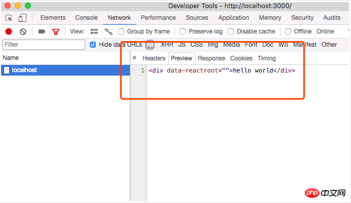

# 实现react服务器渲染基础方法
<!-- TOC -->

- [实现react服务器渲染基础方法](#实现react服务器渲染基础方法)
  - [前言](#前言)
  - [用到的技术栈](#用到的技术栈)
  - [为什么要用服务端渲染](#为什么要用服务端渲染)
  - [实现](#实现)
    - [搭建 koa 环境](#搭建-koa-环境)
    - [安装React](#安装React)
    - [配制webpack](#配制webpack)
  - [代码](#代码)

<!-- /TOC -->
从零开始最小实现react服务器渲染详解

## 前言
最近在写 koa 的时候想到，如果我部分代码提供api，部分代码支持ssr，那我应该如何写呢？（不想拆成 2个服务的情况下）
而且最近写的项目里面也用过一些服务端渲染，如nuxt，自己也搭过next的项目，确实开发体验都非常友好，但是友好归友好，具体又是如何实现的呢，诸位有没有考虑过？

## 用到的技术栈
react 16 + webpack3 + koa2

## 为什么要用服务端渲染
**优点**
1. SEO 友好
2. 加快首屏渲染，减少白屏时间

让服务器把有内容的HTML返回给我们，事件的话浏览器再渲染一次来进行挂载

## 实现
### 搭建 koa 环境
新建一个 ssr 项目，并在项目中初始化 npm
```bash
mkdir ssr && cd ssr

npm init
```

下面的代码我们用到了 import jsx 等语法，node环境是不支持的，所以需要配置babel  
在当前项目中新建文件 app.js跟index.js，然后  
babel的入口， index.js代码如下
```js
require('babel-core/register')()

require('babel-polyfill')

require('./app')
```

我们项目的入口， app.js代码如下
```js
import Koa from 'koa'

const app = new Koa()

// response
app.use((ctx) => {
 ctx.body = 'Hello Koa'
})

app.listen(3000)
console.log("系统启动，端口：3000")
```

根目录下新建一个.babelrc文件
内容是：
```json
{
  "presets": ["react", "env"]
}
```

安装上面所需要的依赖
```js
npm install babel-core babel-polyfill babel-preset-env babel-preset-react nodemon --save-dev

npm i koa --save
```

配置启动脚本
package.json
```json
"scripts": {
  "dev": "nodemon index.js",
}
```

到这里你运行 npm run dev 打开localhost:3000
你就会看到 hello Koa了

### 安装React
> cnpm install react react-dom --save

在根目录下新建一个app文件夹，并在文件夹中个新建一个main.js
main.js代码如下
```js
import React from 'react'

export default class Home extends React.Component {
  render () {
    return <p>hello world</p>
  }
}
```

修改之前server.js
```js
import Koa from 'koa'
import React from 'react'
import { renderToString } from 'react-dom/server'
import App from './app/main'

const app = new Koa()

// response
app.use(ctx => {
  let str = renderToString(<App />)
  ctx.body = str
})

app.listen(3000)
console.log('系统启动，端口：8080')
```

这个时候再 npm run dev
你就会看到屏幕上出现hello world 
再打开chrome 开发者工具查看我们的请求：
<div align="center"></div>

我们的最简单的react组件变成str传了进来
这里我们用到了一个方法： 
`renderToString` – 其实就是将组件渲染成字符串 
目前为止，我们都还没有给组件加上事件等交互行为，下面那让我们来试一下
修改main.js的代码
```js
import React from 'react'

export default class Home extends React.Component {
  render () {
    return <p onClick={() => window.alert(123)}>hello world</p>
  }
}
```

再刷新一下我们的页面，，咦，是不是没有什么卵用 

那是因为后端只能讲组件渲染成一串html的字符串，事件绑定等事情都是需要在浏览器端执行的
那事件我们改怎么绑定上去呢？

那你肯定就会猜到，既然服务器渲染出来的是一串html，挂载事件的方式是不是在浏览器重新渲染一次就好了呢 

### 配制webpack
在根目录下面新建一个 webpack.config.js 
下面是webpack.config.js的内容：
```js
var path = require('path')
var webpack = require('webpack')

module.exports = {
  entry: {
    main: './app/index.js'
  },

  output: {
    filename: '[name].js',
    path: path.join(__dirname, 'public'),
    publicPath: '/'
  },

  resolve: {
    extensions: ['.js', '.jsx']
  },

  module: {
    loaders: [
      {
        test: /\.jsx?$/,
        loaders: ['babel-loader'],
      }
    ]
  }
}
```

上面的配置将`entry`设置成了`app/index.js`文件

那我们就创建一个
下面是app/index.js的代码：
```js
import Demo from './main'
import ReactDOM from 'react-dom'
import React from 'react'

ReactDOM.render(<Demo />, document.getElementById('root'))
```

因为浏览器渲染需要将根组件挂载到某个dom节点上，所以给我们的react代码设置一个入口

这个时候就有一个问题，就是，document对象node环境下并不存在，那怎么解决的呢？

不存在？不存在那我就不用就好了，SSR核心就是让请求的url里面返回具体HTML内容，事件什么的并不care，那么我就把根组件直接renderToString

返回出来就好了呗

下面修改我们的服务代码，让代码支持服务器渲染

新增一点依赖
> cnpm i --save koa-static koa-views ejs

- `koa-static`： 处理静态文件的中间件 
- `koa-views`： 配置模板的中间件
- `ejs`：一个模板引擎

修改server.js的代码
```js
import Koa from 'koa'
import React from 'react'
import { renderToString } from 'react-dom/server'
import views from 'koa-views'
import path from 'path'
import Demo from './app/main'

const app = new Koa()
// 将/public文件夹设置为静态路径
app.use(require('koa-static')(__dirname + '/public'))

// 将ejs设置为我们的模板引擎
app.use(views(path.resolve(__dirname, './views'), { map: { html: 'ejs' } }))

// response
app.use(async ctx => {
  let str = renderToString(<Demo />)
  await ctx.render('index', {
    root: str
  })
})

app.listen(3000)

console.log('系统启动，端口：8080')
```

下面新建我们的渲染模板
新建一个`views`文件夹
里面新建一个`index.html`：
```html
<!DOCTYPE html>
<html lang="en">
<head>
  <meta charset="UTF-8">
  <meta name="viewport" content="width=device-width, initial-scale=1.0">
  <meta http-equiv="X-UA-Compatible" content="ie=edge">
  <title>Document</title>
  <base href="/client" rel="external nofollow" >
</head>
<body>
  <p id="root"><%- root %></p>
  <script src="/main.js"></script>
</body>
</html>
```

这个 html 里面可以放一些变量，比如这个<%- root %>，就是等下要放renderToString结果的地方

`/main.js`则是react构建出来的代码

下面直接来测试一下我们的代码
1. 在 package.json里面 
    新增：
    ```js
    "scripts": {
    "dev": "nodemon index.js",
    "build": "webpack"
    },
    ```
2. 运行 npm run build， 构建出我们的react代码
3. npm run dev

点击一下代码，是不是会 alert(123)
tada 撒花，恭喜你，一个最简单服务器渲染就已经完成

到这里核心的思想就都已经讲完了，总结来说就下面三点：
1. 起一个node服务
2. 把react 根组件 renderToString渲染成字符串一起返回前端
3. 前端再重新render一次

## 代码
[仓库](https://github.com/Jingce-lu/koa-react-ssr)