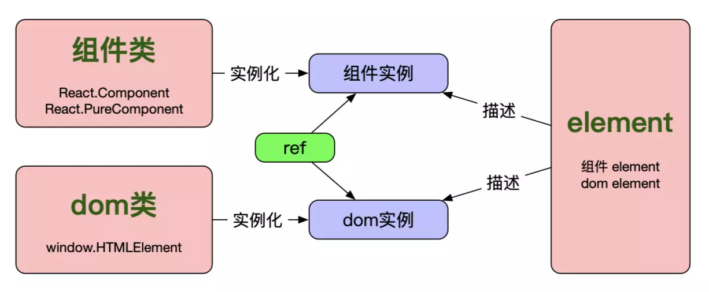
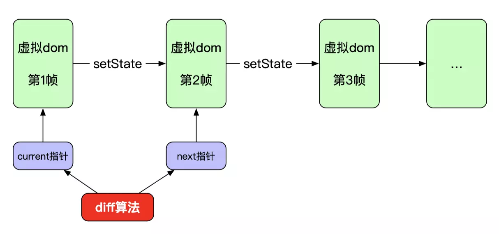
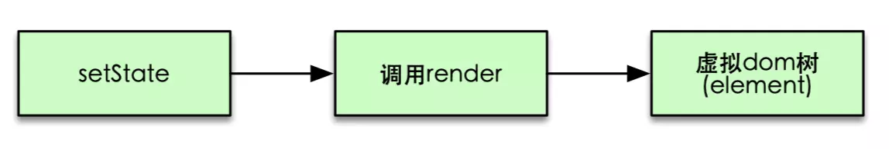
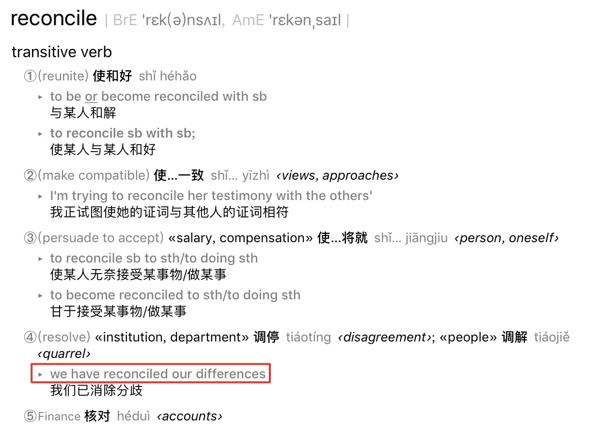
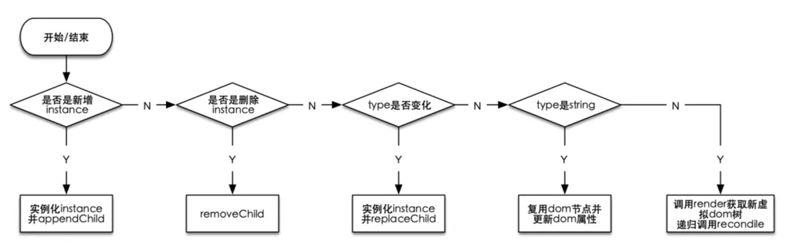

# 200行代码实现简版react

<!-- TOC -->

- [200行代码实现简版react](#200行代码实现简版react)
  - [1. 基本概念](#1-基本概念)
    - [Component（组件）](#Component组件)
    - [instance（组件实例）](#instance组件实例)
    - [element](#element)
    - [jsx](#jsx)
    - [dom](#dom)
  - [2 虚拟dom与diff算法](#2-虚拟dom与diff算法)
  - [3 生命周期与diff算法](#3-生命周期与diff算法)
  - [4 实现](#4-实现)
    - [4.1 实现createElement](#41-实现createElement)
    - [4.2 实现render](#42-实现render)
    - [4.3 实现instantiate](#43-实现instantiate)
    - [4.4 区分类组件与函数式组件](#44-区分类组件与函数式组件)
    - [4.5 实现reconcile(diff算法)](#45-实现reconcilediff算法)
    - [4.6 整体代码](#46-整体代码)
  - [5 fiber架构](#5-fiber架构)

<!-- /TOC -->

## 1. 基本概念
**Component(组件)、instance(组件实例)、 element、jsx、dom**

### Component（组件）
Component就是我们经常实现的组件，可以是**类组件**（`class component`）或者**函数式组件**（`functional component`），而`类组件`又可以分为普通类组件(`React.Component`)以及纯类组件（`React.PureComponent`），总之这两类都属于类组件，只不过`PureComponent`基于`shouldComponentUpdate`做了一些优化，这里不展开说。函数式组件则用来简化一些简单组件的实现，用起来就是写一个函数，入参是组件属性props，出参与类组件的render方法返回值一样，是react element（注意这里已经出现了接下来要介绍的element哦）。
下面我们分别按三种方式实现下Welcome组件：

```js
// Component
class Welcome extends React.Component {
    render() {
        return <h1>Hello, {this.props.name}</h1>;
    }
}
```

```js
// PureComponent
class Welcome extends React.PureComponent {
    render() {
        return <h1>Hello, {this.props.name}</h1>;
    }
}
```

```js
// functional component
function Welcome(props) {
    return <h1>Hello, {props.name}</h1>;
}
```

### instance（组件实例）

熟悉`面向对象编程`的人肯定知道`类`和`实例`的关系，这里也是一样的，`组件实例`其实就是一个`组件类实例化的结果`，概念虽然简单，但是在react这里却容易弄不明白，为什么这么说呢？因为大家在react的使用过程中并不会自己去实例化一个组件实例，这个过程其实是react内部帮我们完成的，因此我们真正接触组件实例的机会并不多。我们更多接触到的是下面要介绍的`element`，因为我们通常写的`jsx`其实就是element的一种表示方式而已(后面详细介绍)。虽然组件实例用的不多，但是偶尔也会用到，其实就是`ref`。ref可以指向一个dom节点或者一个类组件(class component)的实例，但是不能用于函数式组件，因为函数式组件不能实例化。这里简单介绍下ref，我们只需要知道ref可以指向一个组件实例即可，更加详细的介绍大家可以看react官方文档[Refs and the DOM](https://link.juejin.im/?target=https%3A%2F%2Freactjs.org%2Fdocs%2Frefs-and-the-dom.html)。


### element

前面已经提到了`elemen`t，即`类组件`的`render`方法以及`函数式组件`的返回值均为`element`。
那么这里的`element`到底是什么呢？其实很简单，就是一个纯对象（`plain object`），而且这个纯对象包含两个属性：`type:(string|ReactClass)`和`props:Object`，注意`element`并不是组件实例，而是一个纯对象。**虽然element不是组件实例，但是又跟组件实例有关系，element是对组件实例或者dom节点的描述。**如果`type`是`string`类型，则表示`dom节点`，如果`type`是`function`或者`class`类型，则表示`组件实例`。比如下面两个`element`分别描述了一个`dom节点`和一个`组件实例`：

```js
// 描述dom节点
{
  type: 'button',
  props: {
    className: 'button button-blue',
    children: {
      type: 'b',
      props: {
        children: 'OK!'
      }
    }
  }
}
```

```js
function Button(props){
  // ...
}

// 描述组件实例
{
  type: Button,
  props: {
    color: 'blue',
    children: 'OK!'
  }
}
```

### jsx
只要弄明白了element，那么jsx就不难理解了，jsx只是换了一种写法，方便我们来创建element而已，想想如果没有jsx那么我们开发效率肯定会大幅降低，而且代码肯定非常不利于维护。比如我们看下面这个jsx的例子：
```js
const foo = <div id="foo">Hello!</div>;
```

其实说白了就是定义了一个dom节点`div`，并且该节点的属性集合是`{id: 'foo'}`，`children`是`Hello!`，就这点信息量而已，因此完全跟下面这种纯对象的表示是等价的
```js
{
  type: 'div',
  props: {
    id: 'foo',
    children: 'Hello!'
  }
}
```

那么`React`是如何将`jsx`语法转换为纯对象的呢？其实就是利用`Babel`编译生成的，我们只要在使用`jsx`的代码里加上个`编译指示(pragma)`即可，可以参考这里[Babel如何编译jsx](https://link.juejin.im/?target=https%3A%2F%2Fbabeljs.io%2Fdocs%2Fen%2Fbabel-plugin-transform-react-jsx)。比如我们将`编译指示`设置为指向`createElement`函数：`/** @jsx createElement */`，那么前面那段`jsx`代码就会编译为：
```js
var foo = createElement('div', {id:"foo"}, 'Hello!');
```

可以看出，`jsx`的编译过程其实就是从`<`、`>`这种`标签式`写法到`函数调用式`写法的一种转化而已。有了这个前提，我们只需要简单实现下`createElement`函数不就可以构造出`element`了嘛，我们后面自己实现`简版react`也会用到这个函数：
```js
function createElement(type, props, ...children) {
    props = Object.assign({}, props);
    props.children = [].concat(...children)
      .filter(child => child != null && child !== false)
      .map(child => child instanceof Object ? child : createTextElement(child));
    return {type, props};
}
```

### dom

dom我们这里也简单介绍下，作为一个前端研发人员，想必大家对这个概念应该再熟悉不过了。我们可以这样创建一个dom节点`div`：
```js
const divDomNode = window.document.createElement('div');
```

其实所有dom节点都是`HTMLElement`类的实例，我们可以验证下：
```js
window.document.createElement('div') instanceof window.HTMLElement;
// 输出 true
```

关于`HTMLElementAPI`可以参考这里：[HTMLElement介绍](https://link.juejin.im/?target=https%3A%2F%2Fdeveloper.mozilla.org%2Fen-US%2Fdocs%2FWeb%2FAPI%2FElement)。因此，`dom节点`是`HTMLElement`类的实例；同样的，在`react`里面，`组件实例`是`组件类`的实例，而`element`又是对`组件实例`和`dom节点`的描述，现在这些概念之间的关系大家应该都清楚了吧。介绍完了这几个基本概念，我们画个图来描述下这几个概念之间的关系：

<div align="center"></div>

## 2 虚拟dom与diff算法
相信使用过react的同学都多少了解过这两个概念：`虚拟dom`以及`diff算法`。这里的`虚拟dom`其实就是前面介绍的`element`，为什么说是`虚拟dom`呢，前面咱们已经介绍过了，`element`只是`dom节点`或者`组件实例`的一种纯对象描述而已，并不是真正的`dom节点`，因此是`虚拟dom`。`react`给我们提供了`声明式`的组件写法，当组件的`props`或者`state`变化时组件自动更新。整个页面其实可以对应到一棵`dom`节点树，每次组件`props`或者`state`变更首先会反映到`虚拟dom树`，然后最终反应到页面`dom节点树`的渲染。

那么`虚拟dom`跟`diff算法`又有什么关系呢？之所以有`diff算法`其实是为了`提升渲染效率`，试想下，如果每次组件的`state`或者`props`变化后都把所有相关`dom节点`删掉再重新创建，那效率肯定非常低，所以在`react内部存在两棵虚拟dom树`，分别表示`现状`以及`下一个状态`，`setState`调用后就会触发`diff算法`的执行，而好的`diff算法`肯定是尽可能复用已有的dom节点，避免重新创建的开销。我用下图来表示虚拟dom和`diff算法`的关系：

<div align="center"></div>

`react`组件最初渲染到页面后先生成`第1帧虚拟dom`，这时`current指针`指向该第一帧。`setState`调用后会生成`第2帧虚拟dom`，这时`next指针`指向第二帧，接下来`diff算法`通过`比较第2帧和第1帧的异同`来将更新应用到真正的dom树以完成页面更新。

这里再次强调一下`setState`后具体怎么生成`虚拟dom`，因为这点很重要，而且容易忽略。前面刚刚已经介绍过什么是`虚拟dom`了，就是`element树`而已。那`element树`是怎么来的呢？其实就是`render`方法返回的嘛，下面的流程图再加深下印象：

<div align="center"></div>

其实`react`官方对`diff算法`有另外一个称呼，大家肯定会在react相关资料中看到，叫`Reconciliation`，我个人认为这个词有点晦涩难懂，不过后来又重新翻看了下词典，发现跟`diff算法`一个意思

<div align="center"></div>

可以看到`reconcile`有`消除分歧`、`核对`的意思，在`react`语境下就是对比`虚拟dom`异同的意思，其实就是说的`diff算法`。这里强调下，我们后面实现部实现`reconcile`函数，就是实现`diff算法`。


## 3 生命周期与diff算法
`生命周期`与`diff算法`又有什么关系呢？这里我们以`componentDidMount`、`componentWillUnmount`、`ComponentWillUpdate`以及`componentDidUpdate`为例说明下二者的关系。我们知道，`setState`调用后会接着调用`render`生成新的`虚拟dom树`，而这个`虚拟dom树`与上一帧可能会产生如下区别：
1. **新增了某个组件；**
2. **删除了某个组件；**
3. **更新了某个组件的部分属性。**

因此，我们在实现`diff算法`的过程会在相应的时间节点调用这些`生命周期函数`。

这里需要重点说明下前面提到的`第1帧`，我们知道每个`react`应用的入口都是：
```js
ReactDOM.render(
    <h1>Hello, world!</h1>,
    document.getElementById('root')
);
```

`ReactDom.render`也会生成一棵`虚拟dom`树，但是这棵`虚拟dom`树是开天辟地生成的`第一帧`，没有前一帧用来做diff，因此这棵`虚拟dom`树对应的所有组件都只会调用`挂载期`的生命周期函数，比如`componentDidMount`、`componentWillUnmount`。


## 4 实现
```js
// 声明编译指示
/** @jsx DiyReact.createElement */

// 导入我们下面要实现的API
const DiyReact = importFromBelow();

// 业务代码
const randomLikes = () => Math.ceil(Math.random() * 100);
const stories = [
  {name: "React", url: "https://reactjs.org/", likes: randomLikes()},
  {name: "Node", url: "https://nodejs.org/en/", likes: randomLikes()},
  {name: "Webpack", url: "https://webpack.js.org/", likes: randomLikes()}
];

const ItemRender = props => {
  const {name, url} = props;
  return (
    <a href={url}>{name}</a>
  );
};

class App extends DiyReact.Component {
    render() {
        return (
            <div>
                <h1>DiyReact Stories</h1>
                <ul>
                    {this.props.stories.map(story => {
                        return <Story name={story.name} url={story.url} />;
                    })}
                </ul>
            </div>
        );
    }
    
    componentWillMount() {
        console.log('execute componentWillMount');
    }
    
    componentDidMount() {
        console.log('execute componentDidMount');
    }
    
    componentWillUnmount() {
        console.log('execute componentWillUnmount');
    }
}

class Story extends DiyReact.Component {
    constructor(props) {
        super(props);
        this.state = {likes: Math.ceil(Math.random() * 100)};
    }
    like() {
        this.setState({
            likes: this.state.likes + 1
        });
    }
    render() {
        const {name, url} = this.props;
        const {likes} = this.state;
        const likesElement = <span />;
        return (
            <li>
                <button onClick={e => this.like()}>{likes}<b>❤️</b></button>
                <ItemRender {...itemRenderProps} />
            </li>
        );
    }
    
    // shouldcomponentUpdate() {
    //   return true;
    // }
    
    componentWillUpdate() {
        console.log('execute componentWillUpdate');
    }
    
    componentDidUpdate() {
        console.log('execute componentDidUpdate');
    }
}

// 将组件渲染到根dom节点
DiyReact.render(<App stories={stories} />, document.getElementById("root"));
```
我们在这段业务代码里面使用了`render`、`createElement`以及`Component`三个API，因此后面的任务就是实现这三个API并包装到一个函数`importFromBelow`

### 4.1 实现createElement
`createElement`函数的功能跟`jsx`是紧密相关的，前面介绍`jsx`的部分已经介绍过了，其实就是把类似`html`的标签式写法转化为纯对象`element`，具体实现如下：
```js
function createElement(type, props, ...children) {
    props = Object.assign({}, props);
    props.children = [].concat(...children)
        .filter(child => child != null && child !== false)
        .map(child => child instanceof Object ? child : createTextElement(child));
    return {type, props};
}
```

### 4.2 实现render
注意这个`render`相当于`ReactDOM.render`，不是`组件的render`方法，`组件的render`方法在后面`Component`实现部分。
```js
// rootInstance用来缓存一帧虚拟dom
let rootInstance = null;
function render(element, parentDom) {
    // prevInstance指向前一帧
    const prevInstance = rootInstance;
    // element参数指向新生成的虚拟dom树
    const nextInstance = reconcile(parentDom, prevInstance, element);
    // 调用完reconcile算法(即diff算法)后将rooInstance指向最新一帧
    rootInstance = nextInstance;
}
```
`render`函数实现很简单，只是进行了`两帧虚拟dom`的对比(reconcile)，然后将`rootInstance`指向新的`虚拟dom`。细心点会发现，新的`虚拟dom`为`element`，即最开始介绍的`element`，而`reconcile`后的`虚拟dom`是`instance`，不过这个`instance`并不是组件实例，这点看后面`instantiate的实现`。总之`render`方法其实就是调用了`reconcile`方法进行了两帧虚拟dom的对比而已。

### 4.3 实现instantiate
那么前面的`instance`到底跟`element`有什么不同呢？其实`instance`指示简单的是把`element`重新包了一层，并把对应的`dom`也给包了进来，这也不难理解，毕竟我们调用`reconcile`进行`diff`比较的时候需要把跟新应用到真实的`dom`上，因此需要跟`dom`关联起来，下面实现的`instantiate`函数就干这个事的。注意由于`element`包括`dom`类型和`Component`类型(由type字段判断，不明白的话可以回过头看一下第一节的element相关介绍)，因此需要分情况处理：

`dom`类型的`element.type`为`string`类型，对应的`instance`结构为`{element, dom, childInstances}`。

`Component`类型的`element.type`为`ReactClass`类型，对应的`instance`结构为`{dom, element, childInstance, publicInstance}`，注意这里的`publicInstance`就是前面介绍的`组件实例`。

```js
function instantiate(element) {
    const {type, props = {}} = element;
    const isDomElement = typeof type === 'string';
    
    if (isDomElement) {
        // 创建dom
        const isTextElement = type === TEXT_ELEMENT;
        const dom = isTextElement ? document.createTextNode('') : document.createElement(type);
        
        // 设置dom的事件、数据属性
        updateDomProperties(dom, [], element.props);
        const children = props.children || [];
        const childInstances = children.map(instantiate);
        const childDoms = childInstances.map(childInstance => childInstance.dom);
        childDoms.forEach(childDom => dom.appendChild(childDom));
        const instance = {element, dom, childInstances};
        return instance;
    } else {
        const instance = {};
        const publicInstance = createPublicInstance(element, instance);
        const childElement = publicInstance.render();
        const childInstance = instantiate(childElement);
        Object.assign(instance, {dom: childInstance.dom, element, childInstance, publicInstance});
        return instance;
    }
}
```
需要注意，由于`dom节点`和`组件实例`都可能有孩子节点，因此`instantiate函数`中有递归实例化的逻辑。


### 4.4 区分类组件与函数式组件
前面我们提到过，组件包括`类组件（class component）`与`函数式组件（functional component）`。我在平时的业务中经常用到这两类组件，如果一个组件仅用来渲染，我一般会使用函数式组件，毕竟代码逻辑简单清晰易懂。那么React内部是如何区分出来这两种组件的呢？这个问题说简单也简单，说复杂也复杂。为什么这么说呢，是因为React内部实现方式确实比较简单，但是这种简单的实现方式却是经过各种考量后确定下来的实现方式。蛋总(Dan)有一篇文章详细分析了下React内部如何区分二者，强烈推荐大家阅读，这里我直接拿过来用，文章链接见这里How Does React Tell a Class from a Function?。其实很简答，我们实现类组件肯定需要继承自类React.Component，因此首先给React.Component打个标记，然后在实例化组件时判断element.type的原型链上是否有该标记即可。

```js
// 打标记
Component.prototype.isReactComponent = {};

// 区分组件类型
const type = element.type;
const isDomElement = typeof type === 'string';
const isClassElement = !!(type.prototype && type.prototype.isReactComponent);
```

这里我们升级下前面的实例化函数`instantiate`以区分出`函数式组件`与`类组件`：
```js
function instantiate(element) {
    const {type, props = {}} = element;
    const isDomElement = typeof type === 'string';
    const isClassElement = !!(type.prototype && type.prototype.isReactComponent);
    if (isDomElement) {
      // 创建dom
      const isTextElement = type === TEXT_ELEMENT;
      const dom = isTextElement ? document.createTextNode('') : document.createElement(type);
      
      // 设置dom的事件、数据属性
      updateDomProperties(dom, [], element.props);
      const children = props.children || [];
      const childInstances = children.map(instantiate);
      const childDoms = childInstances.map(childInstance => childInstance.dom);
      childDoms.forEach(childDom => dom.appendChild(childDom));
      const instance = {element, dom, childInstances};
      return instance;
    } else if (isClassElement) {
      const instance = {};
      const publicInstance = createPublicInstance(element, instance);
      const childElement = publicInstance.render();
      const childInstance = instantiate(childElement);
      Object.assign(instance, {dom: childInstance.dom, element, childInstance, publicInstance});
      return instance;
    } else {
      const childElement = type(element.props);
      const childInstance = instantiate(childElement);
      const instance = {
        dom: childInstance.dom,
        element,
        childInstance
      };
      return instance;
    }
}
```

可以看到，如果是`函数式组件`，我们没有实例化该组件，而是直接调用了该函数获取`虚拟dom`。

### 4.5 实现reconcile(diff算法)
重点来了，`reconcile`是`react`的核心，显然如何将新设置的`state`快速的渲染出来非常重要，因此`react`会尽量复用已有节点，而不是每次都动态创建所有相关节点。但是react强大的地方还不仅限于此，`react16`将`reconcile`算法由之前的`stack`架构升级成了`fiber`架构，更近一步做的性能优化。fiber相关的内容下一节再介绍，这里为了简单易懂，仍然使用类似stack架构的算法来实现，对于fiber现在只需要知道其调度原理即可，当然后面有时间可以再实现一版基于fiber架构的。

首先看一下整个reconcile算法的处理流程：
<div align="center"></div>

可以看到，我们会根据不同的情况做不同的处理：
1. 如果是新增`instance`，那么需要实例化一个`instance`并且`appendChild`；
2. 如果是不是新增`instance`，而是删除`instance`，那么需要`removeChild`；
3. 如果既不是新增也不是删除`instance`，那么需要看`instance`的type是否变化，如果有变化，那节点就无法复用了，也需要实例化`instance`，然后`replaceChild`；
4. 如果`type`没变化就可以复用已有节点了，这种情况下要判断是原生dom节点还是我们自定义实现的`react`节点，两种情况下处理方式不同。

大流程了解后，我们只需要在对的时间点执行`生命周期`函数即可，下面看具体实现：
```js
function reconcile(parentDom, instance, element) {
    if (instance === null) {
        const newInstance = instantiate(element);
        // componentWillMount
        newInstance.publicInstance
            && newInstance.publicInstance.componentWillMount
            && newInstance.publicInstance.componentWillMount();
        parentDom.appendChild(newInstance.dom);
        // componentDidMount
        newInstance.publicInstance
            && newInstance.publicInstance.componentDidMount
            && newInstance.publicInstance.componentDidMount();
        return newInstance;
    } else if (element === null) {
        // componentWillUnmount
        instance.publicInstance
            && instance.publicInstance.componentWillUnmount
            && instance.publicInstance.componentWillUnmount();
        parentDom.removeChild(instance.dom);
        return null;
    } else if (instance.element.type !== element.type) {
        const newInstance = instantiate(element);
        // componentDidMount
        newInstance.publicInstance
            && newInstance.publicInstance.componentDidMount
            && newInstance.publicInstance.componentDidMount();
        parentDom.replaceChild(newInstance.dom, instance.dom);
        return newInstance;
    } else if (typeof element.type === 'string') {
        updateDomProperties(instance.dom, instance.element.props, element.props);
        instance.childInstances = reconcileChildren(instance, element);
        instance.element = element;
        return instance;
    } else {
        if (instance.publicInstance
            && instance.publicInstance.shouldcomponentUpdate) {
            if (!instance.publicInstance.shouldcomponentUpdate()) {
                return;
            }
        }
        // componentWillUpdate
        instance.publicInstance
            && instance.publicInstance.componentWillUpdate
            && instance.publicInstance.componentWillUpdate();
        instance.publicInstance.props = element.props;
        const newChildElement = instance.publicInstance.render();
        const oldChildInstance = instance.childInstance;
        const newChildInstance = reconcile(parentDom, oldChildInstance, newChildElement);
        // componentDidUpdate
        instance.publicInstance
            && instance.publicInstance.componentDidUpdate
            && instance.publicInstance.componentDidUpdate();
        instance.dom = newChildInstance.dom;
        instance.childInstance = newChildInstance;
        instance.element = element;
        return instance;
    }
}

function reconcileChildren(instance, element) {
    const {dom, childInstances} = instance;
    const newChildElements = element.props.children || [];
    const count = Math.max(childInstances.length, newChildElements.length);
    const newChildInstances = [];
    for (let i = 0; i < count; i++) {
        newChildInstances[i] = reconcile(dom, childInstances[i], newChildElements[i]);
    }
    return newChildInstances.filter(instance => instance !== null);
}
```

看完`reconcile`算法后肯定有人会好奇，为什么这种算法叫做`stack`算法，这里简单解释一下。从前面的实现可以看到，每次组件的`state更新`都会触发`reconcile`的执行，而`reconcile`的执行也是一个递归过程，而且一开始直到递归执行完所有节点才停止，因此称为stack算法。由于是个递归过程，因此该diff算法一旦开始就必须执行完，因此可能会阻塞线程，又由于js是单线程的，因此这时就可能会影响用户的输入或者ui的渲染帧频，降低用户体验。不过react16中升级为了fiber架构，这一问题得到了解决。


### 4.6 整体代码
把前面实现的所有这些代码组合起来就是完整的`简版react`，不到`200`行代码，so easy～！完整代码见[DiyReact](https://codepen.io/iamswf/pen/oJYGoX)。

## 5 fiber架构
`react16`升级了`reconcile`算法架构，从`stack`升级为`fiber`架构，前面我们已经提到过`stack`架构的缺点，那就是使用递归实现，一旦开始就无法暂停，只能一口气执行完毕，由于js是单线程的，这就有可能阻塞用户输入或者ui渲染，会降低用户体验。

而`fiber`架构则不一样。底层是基于`requestIdleCallback`来调度`diff`算法的执行，关于`requestIdleCallback`的介绍可以参考我之前写的一篇关于`js事件循环`的文章javascript事件循环（浏览器端、node端）。`requestIdlecallback`的特点顾名思义就是利用`空闲时间`来完成任务。注意这里的`空闲时间`就是相对于那些优先级更高的任务(比如用户输入、ui渲染)来说的。
