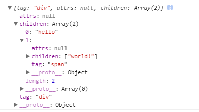
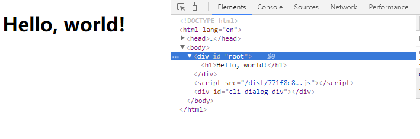

# 从零开始实现一个React（一）：JSX和虚拟DOM

<!-- TOC -->

- [从零开始实现一个React（一）：JSX和虚拟DOM](#从零开始实现一个React一JSX和虚拟DOM)
  - [前言](#前言)
  - [关于jsx](#关于jsx)
  - [准备工作](#准备工作)
  - [React.createElement和虚拟DOM](#ReactcreateElement和虚拟DOM)
  - [ReactDOM.render](#ReactDOMrender)
  - [渲染和更新](#渲染和更新)
  - [后话](#后话)

<!-- /TOC -->

## 前言
从零开始实现一个React，从API层面实现React的大部分功能，在这个过程中去探索为什么有虚拟DOM、diff、为什么setState这样设计等问题。

提起React，总是免不了和Vue做一番对比
* Vue的API设计非常简洁，但是其实现方式却让人感觉是“魔法”，开发者虽然能马上上手，但其原理却很难说清楚。
* 相比之下React的设计哲学非常简单，虽然有很多需要自己处理的细节问题，但它没有引入任何新的概念，相对更加的干净和简单。
  

## 关于jsx
```jsx
const title = <h1 className="title">Hello, world!</h1>;
```
这段代码并不是合法的js代码，它是一种被称为jsx的语法扩展，通过它我们就可以很方便的在js代码中书写html片段。

本质上，jsx是语法糖，上面这段代码会被babel转换成如下代码
```js
const title = React.createElement(
    'h1',
    { className: 'title' },
    'Hello, world!'
);
```
babel官网提供的在线转译测试jsx转换后的代码，这里有一个[稍微复杂一点的例子](https://babeljs.io/repl)


## 准备工作
在代码打包工具上选择了最近火热的零配置打包工具**parcel**,需要先安装parcel：
```bash
npm install -g parcel-bundler
```

接下来新建`index.js`和`index.html`，在`index.html`中引入`index.js`。

注意一下babel的配置
**.babelrc**
```json
{
    "presets": ["env"],
    "plugins": [
        ["transform-react-jsx", {
            "pragma": "React.createElement"
        }]
    ]
}
```

这个`transform-react-jsx`就是将jsx转换成js的babel插件，它有一个pragma项，可以定义jsx转换方法的名称，你也可以将它改成h（这是很多类React框架使用的名称）或别的。

准备工作完成后，我们可以用命令`parcel index.html`将它跑起来了。


## React.createElement和虚拟DOM
前文提到，`jsx`片段会被转译成用`React.createElement`方法包裹的代码。所以第一步，我们来实现这个`React.createElement`方法

从jsx转译结果来看，`createElement`方法的参数是这样：
```js
createElement( tag, attrs, child1, child2, child3 );
```

* 第一个参数是DOM节点的标签名，它的值可能是div，h1，span等等
* 第二个参数是一个对象，里面包含了所有的属性，可能包含了className，id等等
* 从第三个参数开始，就是它的子节点

我们对createElement的实现非常简单，只需要返回一个对象来保存它的信息就行了。
```js
function createElement( tag, attrs, ...children ) {
    return {
        tag,
        attrs,
        children
    }
}
```

函数的参数 ...children使用了ES6的rest参数，它的作用是将后面child1,child2等参数合并成一个数组children。

现在我们来试试调用它
```js
// 将上文定义的createElement方法放到对象React中
const React = {
    createElement
}

const element = (
    <div>
        hello<span>world!</span>
    </div>
);
console.log( element );
```

打开调试工具，我们可以看到输出的对象和我们预想的一致

<div align="center"></div>

我们的createElement方法返回的对象记录了这个DOM节点所有的信息，换言之，通过它我们就可以生成真正的DOM，这个记录信息的对象我们称之为**虚拟DOM**。

## ReactDOM.render

接下来是ReactDOM.render方法，我们再来看这段代码
```js
ReactDOM.render(
    <h1>Hello, world!</h1>,
    document.getElementById('root')
);
```

经过转换，这段代码变成了这样
```js
ReactDOM.render(
    React.createElement( 'h1', null, 'Hello, world!' ),
    document.getElementById('root')
);
```

所以r`ender`的第一个参数实际上接受的是createElement返回的对象，也就是虚拟DOM  
而第二个参数则是挂载的目标DOM

总而言之，render方法的作用就是**将虚拟DOM渲染成真实的DOM**，下面是它的实现：
```js
function render( vnode, container ) {
    
    // 当vnode为字符串时，渲染结果是一段文本
    if ( typeof vnode === 'string' ) {
        const textNode = document.createTextNode( vnode );
        return container.appendChild( textNode );
    }

    const dom = document.createElement( vnode.tag );

    if ( vnode.attrs ) {
        Object.keys( vnode.attrs ).forEach( key => {
            const value = vnode.attrs[ key ];
             setAttribute( dom, key, value );    // 设置属性
        } );
    }

    vnode.children.forEach( child => render( child, dom ) );    // 递归渲染子节点

    return container.appendChild( dom );    // 将渲染结果挂载到真正的DOM上
}
```

设置属性需要考虑一些特殊情况，我们单独将其拿出来作为一个方法setAttribute

```js
function setAttribute( dom, name, value ) {
    // 如果属性名是className，则改回class
    if ( name === 'className' ) name = 'class';

    // 如果属性名是onXXX，则是一个事件监听方法
    if ( /on\w+/.test( name ) ) {
        name = name.toLowerCase();
        dom[ name ] = value || '';
    // 如果属性名是style，则更新style对象
    } else if ( name === 'style' ) {
        if ( !value || typeof value === 'string' ) {
            dom.style.cssText = value || '';
        } else if ( value && typeof value === 'object' ) {
            for ( let name in value ) {
                // 可以通过style={ width: 20 }这种形式来设置样式，可以省略掉单位px
                dom.style[ name ] = typeof value[ name ] === 'number' ? value[ name ] + 'px' : value[ name ];
            }
        }
    // 普通属性则直接更新属性
    } else {
        if ( name in dom ) {
            dom[ name ] = value || '';
        }
        if ( value ) {
            dom.setAttribute( name, value );
        } else {
            dom.removeAttribute( name );
        }
    }
}
```

这里其实还有个小问题：**当多次调用render函数时，不会清除原来的内容**。  
所以我们将其附加到ReactDOM对象上时，先清除一下挂载目标DOM的内容：
```js
const ReactDOM = {
    render: ( vnode, container ) => {
        container.innerHTML = '';
        return render( vnode, container );
    }
}
```

## 渲染和更新
到这里我们已经实现了React最为基础的功能，可以用它来做一些事了。

我们先在index.html中添加一个根节点
```html
<div id="root"></div>
```

我们先来试试官方文档中的`Hello,World`
```js
ReactDOM.render(
    <h1>Hello, world!</h1>,
    document.getElementById('root')
);
```

可以看到结果：
<div align="center"></div>

试试渲染一段动态的代码，这个例子也来自[官方文档](https://reactjs.org/docs/rendering-elements.html#updating-the-rendered-element)
```js
function tick() {
    const element = (
        <div>
            <h1>Hello, world!</h1>
            <h2>It is {new Date().toLocaleTimeString()}.</h2>
        </div>
      );
    ReactDOM.render(
        element,
        document.getElementById( 'root' )
    );
}

setInterval( tick, 1000 );
```

## 后话
这篇文章中，实现了React非常基础的功能，也了解了jsx和虚拟DOM，下一篇文章实现非常重要的组件功能。