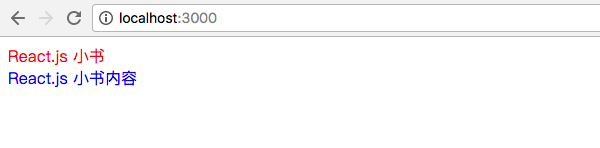

动手实现Redux
===
<!-- TOC -->

- [动手实现Redux](#动手实现Redux)
- [动手实现 Redux（一）：优雅地修改共享状态](#动手实现-Redux一优雅地修改共享状态)
- [动手实现 Redux（二）：抽离 store 和监控数据变化](#动手实现-Redux二抽离-store-和监控数据变化)
  - [抽离出 store](#抽离出-store)
  - [监控数据变化](#监控数据变化)
  - [总结](#总结)
- [动手实现 Redux（三）：纯函数（Pure Function）简介](#动手实现-Redux三纯函数Pure-Function简介)
  - [函数的返回结果只依赖于它的参数](#函数的返回结果只依赖于它的参数)
  - [函数执行过程没有副作用](#函数执行过程没有副作用)
  - [总结](#总结-1)
- [动手实现 Redux（四）：共享结构的对象提高性能](#动手实现-Redux四共享结构的对象提高性能)
  - [共享结构的对象](#共享结构的对象)
  - [优化性能](#优化性能)
- [动手实现 Redux（五）：不要问为什么的 reducer](#动手实现-Redux五不要问为什么的-reducer)
  - [reducer](#reducer)
- [动手实现 Redux（六）：Redux 总结](#动手实现-Redux六Redux-总结)

<!-- /TOC -->
# 动手实现 Redux（一）：优雅地修改共享状态

让我们忘掉 `React.js`、`Redux` 这些词，从一个例子的代码 + 问题开始推演。

用 `create-react-app` 新建一个项目 `make-redux`，修改 `public/index.html` 里面的 `body` 结构为：
```html
<body>
  <div id='title'></div>
  <div id='content'></div>
</body>
```

删除 `src/index.js` 里面所有的代码，添加下面代码，代表我们应用的状态：
```js
const appState = {
  title: {
    text: 'React.js 小书',
    color: 'red',
  },
  content: {
    text: 'React.js 小书内容',
    color: 'blue'
  }
}
```

我们新增几个渲染函数，它会把上面状态的数据渲染到页面上：
```js
function renderApp (appState) {
  renderTitle(appState.title)
  renderContent(appState.content)
}

function renderTitle (title) {
  const titleDOM = document.getElementById('title')
  titleDOM.innerHTML = title.text
  titleDOM.style.color = title.color
}

function renderContent (content) {
  const contentDOM = document.getElementById('content')
  contentDOM.innerHTML = content.text
  contentDOM.style.color = content.color
}
```

`很简单，renderApp` 会调用 `rendeTitle` 和 `renderContent`，而这两者会把 `appState` 里面的数据通过原始的 `DOM` 操作更新到页面上，调用：
```js
renderApp(appState)
```

会在页面上看到：


这是一个很简单的 App，但是它存在一个重大的隐患，我们渲染数据的时候，使用的是一个共享状态 `appState`，**每个人都可以修改它**。如果我在渲染之前做了一系列其他操作：
```js
loadDataFromServer()
doSomethingUnexpected()
doSomthingMore()
// ...
renderApp(appState)
```

`renderApp(appState)` 之前执行了一大堆函数操作，你根本不知道它们会对 appState 做什么事情，`renderApp(appState)` 的结果根本没法得到保障。一个可以被不同模块任意修改共享的数据状态就是魔鬼，一旦数据可以任意修改，所有对共享状态的操作都是不可预料的（某个模块 `appState.title = null` 你一点意见都没有），出现问题的时候 debug 起来就非常困难，这就是老生常谈的尽量避免全局变量。

你可能会说我去看一下它们函数的实现就知道了它们修改了什么，在我们这个例子里面还算比较简单，但是真实项目当中的函数调用和数据初始化操作非常复杂，深层次的函数调用修改了状态是很难调试的。

但不同的模块（组件）之间确实需要共享数据，这些模块（组件）还可能需要修改这些共享数据，就像上一节的“主题色”状态（`themeColor`）。这里的矛盾就是：**“模块（组件）之间需要共享数据”，和“数据可能被任意修改导致不可预料的结果”**之间的矛盾。

让我们来想办法解决这个问题，我们可以学习 React.js 团队的做法，把事情搞复杂一些，提高数据修改的门槛：模块（组件）之间可以共享数据，也可以改数据。但是我们约定，这个数据并不能直接改，你只能执行某些我允许的某些修改，而且你修改的必须大张旗鼓地告诉我。

我们定义一个函数，叫 `dispatch`，它专门负责数据的修改：
```js
function dispatch (action) {
  switch (action.type) {
    case 'UPDATE_TITLE_TEXT':
      appState.title.text = action.text
      break
    case 'UPDATE_TITLE_COLOR':
      appState.title.color = action.color
      break
    default:
      break
  }
}
```

*所有对数据的操作必须通过 `dispatch` 函数*。它接受一个参数 `action`，这个 `action` 是一个普通的 JavaScript 对象，里面必须包含一个 `type` 字段来声明你到底想干什么。`dispatch` 在 `swtich` 里面会识别这个 `type` 字段，能够识别出来的操作才会执行对 `appState` 的修改。

上面的 `dispatch` 它只能识别两种操作，一种是 `UPDATE_TITLE_TEXT` 它会用 `action` 的 `text` 字段去更新 `appState.title.text`；一种是 `UPDATE_TITLE_COLOR`，它会用 `action` 的 `color` 字段去更新 `appState.title.color`。可以看到，`action` 里面除了 `type` 字段是必须的以外，其他字段都是可以自定义的。

任何的模块如果想要修改 `appState.title.text`，必须大张旗鼓地调用 `dispatch`：

```javascript
dispatch({ type: 'UPDATE_TITLE_TEXT', text: '《React.js 小书》' }) // 修改标题文本
dispatch({ type: 'UPDATE_TITLE_COLOR', color: 'blue' }) // 修改标题颜色
```

我们来看看有什么好处：

```javascript
loadDataFromServer() // => 里面可能通过 dispatch 修改标题文本
doSomethingUnexpected()
doSomthingMore() // => 里面可能通过 dispatch 修改标题颜色
// ...
renderApp(appState)
```

我们不需要担心 `renderApp(appState)` 之前的那堆函数操作会干什么奇奇怪怪得事情，因为我们规定不能直接修改 `appState`，它们对 `appState` 的修改必须只能通过 `dispatch`。而我们看看 `dispatch` 的实现可以知道，你只能修改 `title.text` 和 `title.color`。

如果某个函数修改了 `title.text` 但是我并不想要它这么干，我需要 debug 出来是哪个函数修改了，我只需要在 `dispatch`的 `switch` 的第一个 `case` 内部打个断点就可以调试出来了。

原来模块（组件）修改共享数据是直接改的：

<a href="http://huzidaha.github.io/static/assets/img/posts/CA34AC20-F3C0-438F-AD64-66C5E0986669.png" target="_blank"></a>

我们很难把控每一根指向 `appState` 的箭头，`appState` 里面的东西就无法把控。但现在我们必须通过一个“中间人” —— `dispatch`，所有的数据修改必须通过它，并且你必须用 `action` 来大声告诉它要修改什么，只有它允许的才能修改：

<a href="http://huzidaha.github.io/static/assets/img/posts/7536BBF9-6563-4FD5-8359-28D3A5254EE7.png" target="_blank"></a>

我们再也不用担心共享数据状态的修改的问题，我们只要把控了 `dispatch`，所有的对 `appState` 的修改就无所遁形，毕竟只有一根箭头指向 `appState` 了。

本节完整的代码如下：

```javascript
let appState = {
  title: {
    text: 'React.js 小书',
    color: 'red',
  },
  content: {
    text: 'React.js 小书内容',
    color: 'blue'
  }
}

function dispatch (action) {
  switch (action.type) {
    case 'UPDATE_TITLE_TEXT':
      appState.title.text = action.text
      break
    case 'UPDATE_TITLE_COLOR':
      appState.title.color = action.color
      break
    default:
      break
  }
}

function renderApp (appState) {
  renderTitle(appState.title)
  renderContent(appState.content)
}

function renderTitle (title) {
  const titleDOM = document.getElementById('title')
  titleDOM.innerHTML = title.text
  titleDOM.style.color = title.color
}

function renderContent (content) {
  const contentDOM = document.getElementById('content')
  contentDOM.innerHTML = content.text
  contentDOM.style.color = content.color
}

renderApp(appState) // 首次渲染页面
dispatch({ type: 'UPDATE_TITLE_TEXT', text: '《React.js 小书》' }) // 修改标题文本
dispatch({ type: 'UPDATE_TITLE_COLOR', color: 'blue' }) // 修改标题颜色
renderApp(appState) // 把新的数据渲染到页面上
```

下一节我们会把这种 `dispatch` 的模式抽离出来，让它变得更加通用。


# 动手实现 Redux（二）：抽离 store 和监控数据变化

## 抽离出 store
[上一节](http://react.huziketang.com/blog/lesson30) 的我们有了 `appState`  和 `dispatch`：

```javascript
let appState = {
  title: {
    text: 'React.js 小书',
    color: 'red',
  },
  content: {
    text: 'React.js 小书内容',
    color: 'blue'
  }
}

function dispatch (action) {
  switch (action.type) {
    case 'UPDATE_TITLE_TEXT':
      appState.title.text = action.text
      break
    case 'UPDATE_TITLE_COLOR':
      appState.title.color = action.color
      break
    default:
      break
  }
}
```

现在我们把它们集中到一个地方，给这个地方起个名字叫做 `store`，然后构建一个函数 `createStore`，用来专门生产这种 `state` 和 `dispatch` 的集合，这样别的 App 也可以用这种模式了：

```javascript
function createStore (state, stateChanger) {
  const getState = () => state
  const dispatch = (action) => stateChanger(state, action)
  return { getState, dispatch }
}
```

`createStore` 接受两个参数，一个是表示应用程序状态的 `state`；另外一个是 `stateChanger`，它来描述应用程序状态会根据 action 发生什么变化，其实就是相当于本节开头的 `dispatch` 代码里面的内容。

`createStore` 会返回一个对象，这个对象包含两个方法 `getState` 和 `dispatch`。`getState` 用于获取 `state` 数据，其实就是简单地把 `state` 参数返回。

`dispatch` 用于修改数据，和以前一样会接受 `action`，然后它会把 `state` 和 `action` 一并传给 `stateChanger`，那么 `stateChanger` 就可以根据 `action` 来修改 `state` 了。

现在有了 `createStore`，我们可以这么修改原来的代码，保留原来所有的渲染函数不变，修改数据生成的方式：

```javascript
let appState = {
  title: {
    text: 'React.js 小书',
    color: 'red',
  },
  content: {
    text: 'React.js 小书内容',
    color: 'blue'
  }
}

function stateChanger (state, action) {
  switch (action.type) {
    case 'UPDATE_TITLE_TEXT':
      state.title.text = action.text
      break
    case 'UPDATE_TITLE_COLOR':
      state.title.color = action.color
      break
    default:
      break
  }
}

const store = createStore(appState, stateChanger)

renderApp(store.getState()) // 首次渲染页面
store.dispatch({ type: 'UPDATE_TITLE_TEXT', text: '《React.js 小书》' }) // 修改标题文本
store.dispatch({ type: 'UPDATE_TITLE_COLOR', color: 'blue' }) // 修改标题颜色
renderApp(store.getState()) // 把新的数据渲染到页面上
```

针对每个不同的 App，我们可以给 `createStore` 传入初始的数据 `appState`，和一个描述数据变化的函数 `stateChanger`，然后生成一个 `store`。需要修改数据的时候通过 `store.dispatch`，需要获取数据的时候通过 `store.getState`。

## 监控数据变化
上面的代码有一个问题，我们每次通过 `dispatch` 修改数据的时候，其实只是数据发生了变化，如果我们不手动调用 `renderApp`，页面上的内容是不会发生变化的。但是我们总不能每次 `dispatch` 的时候都手动调用一下 `renderApp`，我们肯定希望数据变化的时候程序能够智能一点地自动重新渲染数据，而不是手动调用。

你说这好办，往 `dispatch`里面加 `renderApp` 就好了，但是这样 `createStore` 就不够通用了。我们希望用一种通用的方式“监听”数据变化，然后重新渲染页面，这里要用到观察者模式。修改  `createStore`：

```javascript
function createStore (state, stateChanger) {
  const listeners = []
  const subscribe = (listener) => listeners.push(listener)
  const getState = () => state
  const dispatch = (action) => {
    stateChanger(state, action)
    listeners.forEach((listener) => listener())
  }
  return { getState, dispatch, subscribe }
}
```

我们在 `createStore` 里面定义了一个数组 `listeners`，还有一个新的方法 `subscribe`，可以通过 `store.subscribe(listener)` 的方式给 `subscribe` 传入一个监听函数，这个函数会被 `push` 到数组当中。

我们修改了 `dispatch`，每次当它被调用的时候，除了会调用 `stateChanger` 进行数据的修改，还会遍历 `listeners` 数组里面的函数，然后一个个地去调用。相当于我们可以通过 `subscribe` 传入数据变化的监听函数，每当 `dispatch` 的时候，监听函数就会被调用，这样我们就可以在每当数据变化时候进行重新渲染：

```javascript
const store = createStore(appState, stateChanger)
store.subscribe(() => renderApp(store.getState()))

renderApp(store.getState()) // 首次渲染页面
store.dispatch({ type: 'UPDATE_TITLE_TEXT', text: '《React.js 小书》' }) // 修改标题文本
store.dispatch({ type: 'UPDATE_TITLE_COLOR', color: 'blue' }) // 修改标题颜色
// ...后面不管如何 store.dispatch，都不需要重新调用 renderApp
```

> 对观察者模式不熟悉的朋友可能会在这里晕头转向，建议了解一下这个设计模式的相关资料，然后进行练习： [实现一个 EventEmitter](https://scriptoj.com/problems/36) 再进行阅读。

我们只需要 `subscribe` 一次，后面不管如何 `dispatch` 进行修改数据，`renderApp` 函数都会被重新调用，页面就会被重新渲染。这样的订阅模式还有好处就是，以后我们还可以拿同一块数据来渲染别的页面，这时 `dispatch` 导致的变化也会让每个页面都重新渲染：

```javascript
const store = createStore(appState, stateChanger)
store.subscribe(() => renderApp(store.getState()))
store.subscribe(() => renderApp2(store.getState()))
store.subscribe(() => renderApp3(store.getState()))
...
```

本节的完整代码：

```javascript
function createStore (state, stateChanger) {
  const listeners = []
  const subscribe = (listener) => listeners.push(listener)
  const getState = () => state
  const dispatch = (action) => {
    stateChanger(state, action)
    listeners.forEach((listener) => listener())
  }
  return { getState, dispatch, subscribe }
}

function renderApp (appState) {
  renderTitle(appState.title)
  renderContent(appState.content)
}

function renderTitle (title) {
  const titleDOM = document.getElementById('title')
  titleDOM.innerHTML = title.text
  titleDOM.style.color = title.color
}

function renderContent (content) {
  const contentDOM = document.getElementById('content')
  contentDOM.innerHTML = content.text
  contentDOM.style.color = content.color
}

let appState = {
  title: {
    text: 'React.js 小书',
    color: 'red',
  },
  content: {
    text: 'React.js 小书内容',
    color: 'blue'
  }
}

function stateChanger (state, action) {
  switch (action.type) {
    case 'UPDATE_TITLE_TEXT':
      state.title.text = action.text
      break
    case 'UPDATE_TITLE_COLOR':
      state.title.color = action.color
      break
    default:
      break
  }
}

const store = createStore(appState, stateChanger)
store.subscribe(() => renderApp(store.getState())) // 监听数据变化

renderApp(store.getState()) // 首次渲染页面
store.dispatch({ type: 'UPDATE_TITLE_TEXT', text: '《React.js 小书》' }) // 修改标题文本
store.dispatch({ type: 'UPDATE_TITLE_COLOR', color: 'blue' }) // 修改标题颜色
```

## 总结
现在我们有了一个比较通用的 `createStore`，它可以产生一种我们新定义的数据类型 `store`，通过 `store.getState` 我们获取共享状态，而且我们约定只能通过 `store.dispatch` 修改共享状态。`store` 也允许我们通过 `store.subscribe` 监听数据数据状态被修改了，并且进行后续的例如重新渲染页面的操作。


# 动手实现 Redux（三）：纯函数（Pure Function）简介
我们接下来会继续优化我们的 `createStore` 的模式，让它使我们的应用程序获得更好的性能。

但在开始之前，我们先用一节的课程来介绍一下一个函数式编程里面非常重要的概念 —— 纯函数（Pure Function）。

简单来说，*一个函数的返回结果只依赖于它的参数，并且在执行过程里面没有副作用，我们就把这个函数叫做纯函数*。这么说肯定比较抽象，我们把它掰开来看：

1.  函数的返回结果只依赖于它的参数。
2. 函数执行过程里面没有副作用。

## 函数的返回结果只依赖于它的参数

```javascript
const a = 1
const foo = (b) => a + b
foo(2) // => 3
```

`foo` 函数不是一个纯函数，因为它返回的结果依赖于外部变量 `a`，我们在不知道 `a` 的值的情况下，并不能保证 `foo(2)` 的返回值是 3。虽然 `foo` 函数的代码实现并没有变化，传入的参数也没有变化，但它的返回值却是*不可预料*的，现在 `foo(2)` 是 3，可能过了一会就是 4 了，因为 a 可能发生了变化变成了 2。

```javascript
const a = 1
const foo = (x, b) => x + b
foo(1, 2) // => 3
```

现在 `foo` 的返回结果只依赖于它的参数 `x` 和 `b`，`foo(1, 2)` 永远是 3。今天是 3，明天也是 3，在服务器跑是 3，在客户端跑也 3，不管你外部发生了什么变化，`foo(1, 2)` 永远是 3。只要 `foo` 代码不改变，你传入的参数是确定的，那么 `foo(1, 2)` 的值永远是*可预料的*。

这就是纯函数的第一个条件：*一个函数的返回结果只依赖于它的参数*。

## 函数执行过程没有副作用
一个函数执行过程对产生了*外部可观察的变化*那么就说这个函数是有副作用的。

我们修改一下 `foo`：

```javascript
const a = 1
const foo = (obj, b) => {
  return obj.x + b
}
const counter = { x: 1 }
foo(counter, 2) // => 3
counter.x // => 1
```

我们把原来的 `x` 换成了 `obj`，我现在可以往里面传一个对象进行计算，计算的过程里面并不会对传入的对象进行修改，计算前后的 `counter` 不会发生任何变化，计算前是 1，计算后也是 1，它现在是纯的。但是我再稍微修改一下它：

```javascript
const a = 1
const foo = (obj, b) => {
  obj.x = 2
  return obj.x + b
}
const counter = { x: 1 }
foo(counter, 2) // => 4
counter.x // => 2
```

现在情况发生了变化，我在 `foo` 内部加了一句 `obj.x = 2`，计算前 `counter.x` 是 1，但是计算以后 `counter.x` 是 2。`foo` 函数的执行对外部的 `counter` 产生了影响，它产生了*副作用*，因为它修改了外部传进来的对象，现在它是不纯的。

但是你在函数内部构建的变量，然后进行数据的修改不是副作用：

```javascript
const foo = (b) => {
  const obj = { x: 1 }
  obj.x = 2
  return obj.x + b
}
```

虽然 `foo` 函数内部修改了 obj，但是 `obj` 是内部变量，外部程序根本观察不到，修改 `obj` 并不会产生外部可观察的变化，这个函数是没有副作用的，因此它是一个纯函数。

除了修改外部的变量，一个函数在执行过程中还有很多方式产生*外部可观察的变化*，比如说调用 DOM API 修改页面，或者你发送了 Ajax 请求，还有调用 `window.reload` 刷新浏览器，甚至是 `console.log` 往控制台打印数据也是副作用。

纯函数很严格，也就是说你几乎除了计算数据以外什么都不能干，计算的时候还不能依赖除了函数参数以外的数据。

## 总结
一个函数的返回结果只依赖于它的参数，并且在执行过程里面没有副作用，我们就把这个函数叫做纯函数。

为什么要煞费苦心地构建纯函数？因为纯函数非常“靠谱”，执行一个纯函数你不用担心它会干什么坏事，它不会产生不可预料的行为，也不会对外部产生影响。不管何时何地，你给它什么它就会乖乖地吐出什么。如果你的应用程序大多数函数都是由纯函数组成，那么你的程序测试、调试起来会非常方便。


# 动手实现 Redux（四）：共享结构的对象提高性能
接下来两节某些地方可能会稍微有一点点抽象，但是我会尽可能用简单的方式进行讲解。如果你觉得理解起来有点困难，可以把这几节多读多理解几遍，其实我们一路走来都是符合“逻辑”的，都是发现问题、思考问题、优化代码的过程。所以最好能够用心留意、思考我们每一个提出来的问题。

细心的朋友可以发现，其实我们之前的例子当中是有比较严重的*性能问题*的。我们在每个渲染函数的开头打一些 Log 看看：

```javascript
function renderApp (appState) {
  console.log('render app...')
  renderTitle(appState.title)
  renderContent(appState.content)
}

function renderTitle (title) {
  console.log('render title...')
  const titleDOM = document.getElementById('title')
  titleDOM.innerHTML = title.text
  titleDOM.style.color = title.color
}

function renderContent (content) {
  console.log('render content...')
  const contentDOM = document.getElementById('content')
  contentDOM.innerHTML = content.text
  contentDOM.style.color = content.color
}
```

依旧执行一次初始化渲染，和两次更新，这里代码保持不变：

```javascript
const store = createStore(appState, stateChanger)
store.subscribe(() => renderApp(store.getState())) // 监听数据变化

renderApp(store.getState()) // 首次渲染页面
store.dispatch({ type: 'UPDATE_TITLE_TEXT', text: '《React.js 小书》' }) // 修改标题文本
store.dispatch({ type: 'UPDATE_TITLE_COLOR', color: 'blue' }) // 修改标题颜色
```

可以在控制台看到：

<a href="http://huzidaha.github.io/static/assets/img/posts/39AC7FAA-0332-448E-8B00-7A1719F048DE.png" target="_blank"></a>

前三个毫无疑问是第一次渲染打印出来的。中间三个是第一次 `store.dispatch` 导致的，最后三个是第二次 `store.dispatch` 导致的。可以看到问题就是，每当更新数据就重新渲染整个 App，但其实我们两次更新都没有动到 `appState` 里面的 `content` 字段的对象，而动的是 `title` 字段。其实并不需要重新 `renderContent`，它是一个多余的更新操作，现在我们需要优化它。

这里提出的解决方案是，在每个渲染函数执行渲染操作之前先做个判断，判断传入的新数据和旧的数据是不是相同，相同的话就不渲染了。

```javascript
function renderApp (newAppState, oldAppState = {}) { // 防止 oldAppState 没有传入，所以加了默认参数 oldAppState = {}
  if (newAppState === oldAppState) return // 数据没有变化就不渲染了
  console.log('render app...')
  renderTitle(newAppState.title, oldAppState.title)
  renderContent(newAppState.content, oldAppState.content)
}

function renderTitle (newTitle, oldTitle = {}) {
  if (newTitle === oldTitle) return // 数据没有变化就不渲染了
  console.log('render title...')
  const titleDOM = document.getElementById('title')
  titleDOM.innerHTML = newTitle.text
  titleDOM.style.color = newTitle.color
}

function renderContent (newContent, oldContent = {}) {
  if (newContent === oldContent) return // 数据没有变化就不渲染了
  console.log('render content...')
  const contentDOM = document.getElementById('content')
  contentDOM.innerHTML = newContent.text
  contentDOM.style.color = newContent.color
}
```

然后我们用一个 `oldState` 变量保存旧的应用状态，在需要重新渲染的时候把新旧数据传进入去：

```javascript
const store = createStore(appState, stateChanger)
let oldState = store.getState() // 缓存旧的 state
store.subscribe(() => {
  const newState = store.getState() // 数据可能变化，获取新的 state
  renderApp(newState, oldState) // 把新旧的 state 传进去渲染
  oldState = newState // 渲染完以后，新的 newState 变成了旧的 oldState，等待下一次数据变化重新渲染
})
...
```

希望到这里没有把大家忽悠到，*上面的代码根本不会达到我们的效果*。看看我们的 `stateChanger`：

```javascript
function stateChanger (state, action) {
  switch (action.type) {
    case 'UPDATE_TITLE_TEXT':
      state.title.text = action.text
      break
    case 'UPDATE_TITLE_COLOR':
      state.title.color = action.color
      break
    default:
      break
  }
}
```

即使你修改了 `state.title.text`，但是 `state` 还是原来那个 `state`，`state.title` 还是原来的 `state.title`，这些引用指向的还是原来的对象，只是对象内的内容发生了改变。所以即使你在每个渲染函数开头加了那个判断又什么用？这就像是下面的代码那样自欺欺人：

```javascript
let appState = {
  title: {
    text: 'React.js 小书',
    color: 'red',
  },
  content: {
    text: 'React.js 小书内容',
    color: 'blue'
  }
}
const oldState = appState
appState.title.text = '《React.js 小书》'
oldState !== appState // false，其实两个引用指向的是同一个对象，我们却希望它们不同。
```

但是，我们接下来就要让这种事情变成可能。

## 共享结构的对象
希望大家都知道这种 ES6 的语法：

```javascript
const obj = { a: 1, b: 2}
const obj2 = { ...obj } // => { a: 1, b: 2 }
```

`const obj2 = { ...obj }` 其实就是新建一个对象 `obj2`，然后把 `obj` 所有的属性都复制到 `obj2` 里面，相当于对象的浅复制。上面的 `obj` 里面的内容和 `obj2` 是完全一样的，但是却是两个不同的对象。除了浅复制对象，还可以覆盖、拓展对象属性：

```javascript
const obj = { a: 1, b: 2}
const obj2 = { ...obj, b: 3, c: 4} // => { a: 1, b: 3, c: 4 }，覆盖了 b，新增了 c
```

我们可以把这种特性应用在 `state` 的更新上，我们禁止直接修改原来的对象，一旦你要修改某些东西，你就得把修改路径上的所有对象复制一遍，例如，我们不写下面的修改代码：

```javascript
appState.title.text = '《React.js 小书》'
```

取而代之的是，我们新建一个 `appState`，新建 `appState.title`，新建 `appState.title.text`：

```javascript
let newAppState = { // 新建一个 newAppState
  ...appState, // 复制 appState 里面的内容
  title: { // 用一个新的对象覆盖原来的 title 属性
    ...appState.title, // 复制原来 title 对象里面的内容
    text: '《React.js 小书》' // 覆盖 text 属性
  }
}
```

如果我们用一个树状的结构来表示对象结构的话：

<a href="http://huzidaha.github.io/static/assets/img/posts/C8A1EB09-2D4E-442E-AD6D-E4997B4AF1C1.png" target="_blank"></a>

`appState` 和 `newAppState` 其实是两个不同的对象，因为对象浅复制的缘故，其实它们里面的属性 `content` 指向的是同一个对象；但是因为 `title` 被一个新的对象覆盖了，所以它们的 `title` 属性指向的对象是不同的。同样地，修改 `appState.title.color`：

```javascript
let newAppState1 = { // 新建一个 newAppState1
  ...newAppState, // 复制 newAppState1 里面的内容
  title: { // 用一个新的对象覆盖原来的 title 属性
    ...newAppState.title, // 复制原来 title 对象里面的内容
    color: "blue" // 覆盖 color 属性
  }
}
```

<a href="http://huzidaha.github.io/static/assets/img/posts/4E4E9324-4659-4791-8957-137566C3A929.png" target="_blank"></a>

我们每次修改某些数据的时候，都不会碰原来的数据，而是把需要修改数据路径上的对象都 copy 一个出来。这样有什么好处？看看我们的目的达到了：

```javascript
appState !== newAppState // true，两个对象引用不同，数据变化了，重新渲染
appState.title !== newAppState.title // true，两个对象引用不同，数据变化了，重新渲染
appState.content !== appState.content // false，两个对象引用相同，数据没有变化，不需要重新渲染
```

修改数据的时候就把修改路径都复制一遍，但是保持其他内容不变，最后的所有对象具有某些不变共享的结构（例如上面三个对象都共享 `content` 对象）。大多数情况下我们可以保持 50% 以上的内容具有共享结构，这种操作具有非常优良的特性，我们可以用它来优化上面的渲染性能。

## 优化性能
我们修改 `stateChanger`，让它修改数据的时候，并不会直接修改原来的数据 `state`，而是产生上述的共享结构的对象：

```javascript
function stateChanger (state, action) {
  switch (action.type) {
    case 'UPDATE_TITLE_TEXT':
      return { // 构建新的对象并且返回
        ...state,
        title: {
          ...state.title,
          text: action.text
        }
      }
    case 'UPDATE_TITLE_COLOR':
      return { // 构建新的对象并且返回
        ...state,
        title: {
          ...state.title,
          color: action.color
        }
      }
    default:
      return state // 没有修改，返回原来的对象
  }
}
```

代码稍微比原来长了一点，但是是值得的。每次需要修改的时候都会产生新的对象，并且返回。而如果没有修改（在 `default` 语句中）则返回原来的 `state` 对象。

因为 `stateChanger` 不会修改原来对象了，而是返回对象，所以我们需要修改一下 `createStore`。让它用每次 `stateChanger(state, action)` 的调用结果覆盖原来的 `state`：

```javascript
function createStore (state, stateChanger) {
  const listeners = []
  const subscribe = (listener) => listeners.push(listener)
  const getState = () => state
  const dispatch = (action) => {
    state = stateChanger(state, action) // 覆盖原对象
    listeners.forEach((listener) => listener())
  }
  return { getState, dispatch, subscribe }
}
```

保持上面的渲染函数开头的对象判断不变，再看看控制台：

<a href="http://huzidaha.github.io/static/assets/img/posts/B7386556-7007-4AAB-9E7D-D977DD98CD44.png" target="_blank"></a>

前三个是首次渲染。后面的 `store.dispatch` 导致的重新渲染都没有关于 `content` 的 Log 了。因为产生共享结构的对象，新旧对象的 `content` 引用指向的对象是一样的，所以触发了 `renderContent` 函数开头的：

```javascript
...
  if (newContent === oldContent) return
...
```

我们成功地把不必要的页面渲染优化掉了，问题解决。另外，并不需要担心每次修改都新建共享结构对象会有性能、内存问题，因为构建对象的成本非常低，而且我们最多保存两个对象引用（`oldState` 和 `newState`），其余旧的对象都会被垃圾回收掉。

本节完整代码：

```javascript
function createStore (state, stateChanger) {
  const listeners = []
  const subscribe = (listener) => listeners.push(listener)
  const getState = () => state
  const dispatch = (action) => {
    state = stateChanger(state, action) // 覆盖原对象
    listeners.forEach((listener) => listener())
  }
  return { getState, dispatch, subscribe }
}

function renderApp (newAppState, oldAppState = {}) { // 防止 oldAppState 没有传入，所以加了默认参数 oldAppState = {}
  if (newAppState === oldAppState) return // 数据没有变化就不渲染了
  console.log('render app...')
  renderTitle(newAppState.title, oldAppState.title)
  renderContent(newAppState.content, oldAppState.content)
}

function renderTitle (newTitle, oldTitle = {}) {
  if (newTitle === oldTitle) return // 数据没有变化就不渲染了
  console.log('render title...')
  const titleDOM = document.getElementById('title')
  titleDOM.innerHTML = newTitle.text
  titleDOM.style.color = newTitle.color
}

function renderContent (newContent, oldContent = {}) {
  if (newContent === oldContent) return // 数据没有变化就不渲染了
  console.log('render content...')
  const contentDOM = document.getElementById('content')
  contentDOM.innerHTML = newContent.text
  contentDOM.style.color = newContent.color
}

let appState = {
  title: {
    text: 'React.js 小书',
    color: 'red',
  },
  content: {
    text: 'React.js 小书内容',
    color: 'blue'
  }
}

function stateChanger (state, action) {
  switch (action.type) {
    case 'UPDATE_TITLE_TEXT':
      return { // 构建新的对象并且返回
        ...state,
        title: {
          ...state.title,
          text: action.text
        }
      }
    case 'UPDATE_TITLE_COLOR':
      return { // 构建新的对象并且返回
        ...state,
        title: {
          ...state.title,
          color: action.color
        }
      }
    default:
      return state // 没有修改，返回原来的对象
  }
}

const store = createStore(appState, stateChanger)
let oldState = store.getState() // 缓存旧的 state
store.subscribe(() => {
  const newState = store.getState() // 数据可能变化，获取新的 state
  renderApp(newState, oldState) // 把新旧的 state 传进去渲染
  oldState = newState // 渲染完以后，新的 newState 变成了旧的 oldState，等待下一次数据变化重新渲染
})

renderApp(store.getState()) // 首次渲染页面
store.dispatch({ type: 'UPDATE_TITLE_TEXT', text: '《React.js 小书》' }) // 修改标题文本
store.dispatch({ type: 'UPDATE_TITLE_COLOR', color: 'blue' }) // 修改标题颜色
```

# 动手实现 Redux（五）：不要问为什么的 reducer
经过了这么多节的优化，我们有了一个很通用的 `createStore`：

```javascript
function createStore (state, stateChanger) {
  const listeners = []
  const subscribe = (listener) => listeners.push(listener)
  const getState = () => state
  const dispatch = (action) => {
    state = stateChanger(state, action) // 覆盖原对象
    listeners.forEach((listener) => listener())
  }
  return { getState, dispatch, subscribe }
}
```

它的使用方式是：

```javascript
let appState = {
  title: {
    text: 'React.js 小书',
    color: 'red',
  },
  content: {
    text: 'React.js 小书内容',
    color: 'blue'
  }
}

function stateChanger (state, action) {
  switch (action.type) {
    case 'UPDATE_TITLE_TEXT':
      return {
        ...state,
        title: {
          ...state.title,
          text: action.text
        }
      }
    case 'UPDATE_TITLE_COLOR':
      return {
        ...state,
        title: {
          ...state.title,
          color: action.color
        }
      }
    default:
      return state
  }
}

const store = createStore(appState, stateChanger)
...
```

我们再优化一下，其实 `appState` 和 `stateChanger` 可以合并到一起去：

```javascript
function stateChanger (state, action) {
  if (!state) {
    return {
      title: {
        text: 'React.js 小书',
        color: 'red',
      },
      content: {
        text: 'React.js 小书内容',
        color: 'blue'
      }
    }
  }
  switch (action.type) {
    case 'UPDATE_TITLE_TEXT':
      return {
        ...state,
        title: {
          ...state.title,
          text: action.text
        }
      }
    case 'UPDATE_TITLE_COLOR':
      return {
        ...state,
        title: {
          ...state.title,
          color: action.color
        }
      }
    default:
      return state
  }
}
```

`stateChanger` 现在既充当了获取初始化数据的功能，也充当了生成更新数据的功能。如果有传入 `state` 就生成更新数据，否则就是初始化数据。这样我们可以优化 `createStore` 成一个参数，因为 `state` 和 `stateChanger` 合并到一起了：

```javascript
function createStore (stateChanger) {
  let state = null
  const listeners = []
  const subscribe = (listener) => listeners.push(listener)
  const getState = () => state
  const dispatch = (action) => {
    state = stateChanger(state, action)
    listeners.forEach((listener) => listener())
  }
  dispatch({}) // 初始化 state
  return { getState, dispatch, subscribe }
}
```

`createStore` 内部的 `state` 不再通过参数传入，而是一个局部变量 `let state = null`。`createStore` 的最后会手动调用一次 `dispatch({})`，`dispatch` 内部会调用 `stateChanger`，这时候的 `state` 是 `null`，所以这次的 `dispatch` 其实就是初始化数据了。`createStore` 内部第一次的 `dispatch` 导致 `state` 初始化完成，后续外部的 `dispatch` 就是修改数据的行为了。

我们给 `stateChanger` 这个玩意起一个通用的名字：reducer，不要问为什么，它就是个名字而已，修改 `createStore` 的参数名字：

```javascript
function createStore (reducer) {
  let state = null
  const listeners = []
  const subscribe = (listener) => listeners.push(listener)
  const getState = () => state
  const dispatch = (action) => {
    state = reducer(state, action)
    listeners.forEach((listener) => listener())
  }
  dispatch({}) // 初始化 state
  return { getState, dispatch, subscribe }
}
```

这是一个最终形态的 `createStore`，它接受的参数叫 `reducer`，`reducer` 是一个函数，细心的朋友会发现，它其实是一个纯函数（Pure Function）。

## reducer
`createStore` 接受一个叫 reducer 的函数作为参数，*这个函数规定是一个纯函数*，它接受两个参数，一个是 `state`，一个是 `action`。

如果没有传入 `state` 或者 `state` 是 `null`，那么它就会返回一个初始化的数据。如果有传入 `state` 的话，就会根据 `action` 来“修改“数据，但其实它没有、也规定不能修改 `state`，而是要通过上节所说的把修改路径的对象都复制一遍，然后产生一个新的对象返回。如果它不能识别你的 `action`，它就不会产生新的数据，而是（在 `default` 内部）把 `state` 原封不动地返回。

reducer 是不允许有副作用的。你不能在里面操作 DOM，也不能发 Ajax 请求，更不能直接修改 `state`，它要做的仅仅是 —— *初始化和计算新的 `state`*。

现在我们可以用这个 `createStore` 来构建不同的 `store` 了，只要给它传入符合上述的定义的 `reducer` 即可：

```javascript
function themeReducer (state, action) {
  if (!state) return {
    themeName: 'Red Theme',
    themeColor: 'red'
  }
  switch (action.type) {
    case 'UPATE_THEME_NAME':
      return { ...state, themeName: action.themeName }
    case 'UPATE_THEME_COLOR':
      return { ...state, themeColor: action.themeColor }
    default:
      return state
  }
}

const store = createStore(themeReducer)
...
```

# 动手实现 Redux（六）：Redux 总结
不知不觉地，到这里大家不仅仅已经掌握了 Redux，而且还自己动手写了一个 Redux。我们从一个非常原始的代码开始，不停地在发现问题、解决问题、优化代码的过程中进行推演，最后把 Redux 模式自己总结出来了。这就是所谓的 Redux 模式，我们再来回顾一下这几节我们到底干了什么事情。

我们从一个简单的例子的代码中发现了共享的状态如果可以被任意修改的话，那么程序的行为将非常不可预料，所以我们提高了修改数据的门槛：你必须通过 `dispatch` 执行某些允许的修改操作，而且必须大张旗鼓的在 `action` 里面声明。

这种模式挺好用的，我们就把它抽象出来一个 `createStore`，它可以产生 `store`，里面包含 `getState` 和 `dispatch` 函数，方便我们使用。

后来发现每次修改数据都需要手动重新渲染非常麻烦，我们希望自动重新渲染视图。所以后来加入了订阅者模式，可以通过 `store.subscribe` 订阅数据修改事件，每次数据更新的时候自动重新渲染视图。

接下来我们发现了原来的“重新渲染视图”有比较严重的性能问题，我们引入了“共享结构的对象”来帮我们解决问题，这样就可以在每个渲染函数的开头进行简单的判断避免没有被修改过的数据重新渲染。

我们优化了 `stateChanger` 为 reducer，定义了 reducer 只能是纯函数，功能就是负责初始 `state`，和根据 `state` 和 `action` 计算具有共享结构的新的 `state`。

`createStore` 现在可以直接拿来用了，套路就是：

```javascript
// 定一个 reducer
function reducer (state, action) {
  /* 初始化 state 和 switch case */
}

// 生成 store
const store = createStore(reducer)

// 监听数据变化重新渲染页面
store.subscribe(() => renderApp(store.getState()))

// 首次渲染页面
renderApp(store.getState()) 

// 后面可以随意 dispatch 了，页面自动更新
store.dispatch(...)
```

现在的代码跟 React.js 一点关系都没有，接下来我们要把 React.js 和 Redux 结合起来，用 Redux 模式帮助管理 React.js 的应用状态。