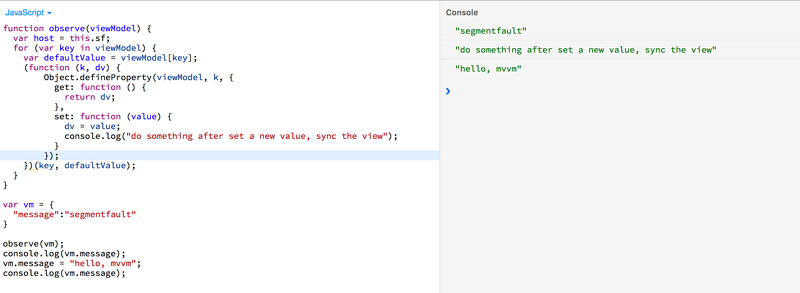
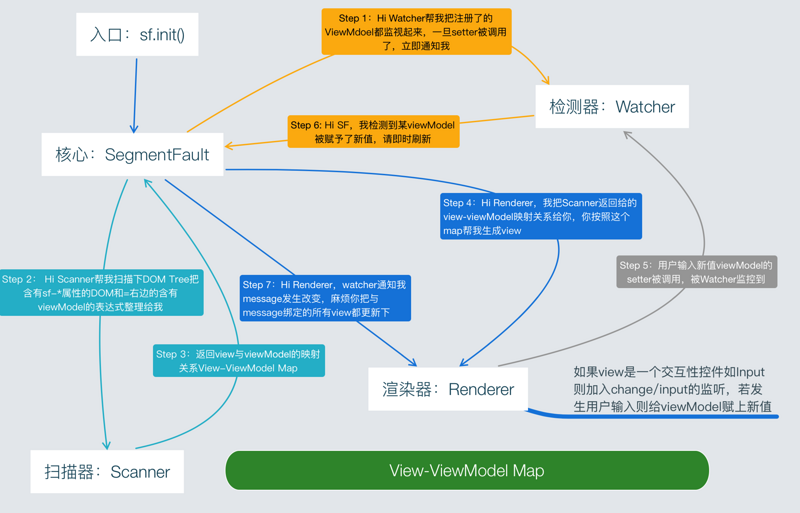
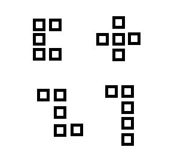
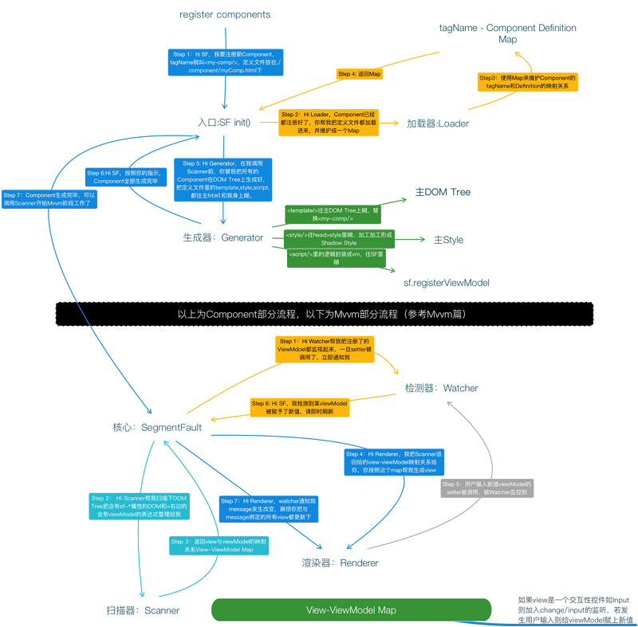
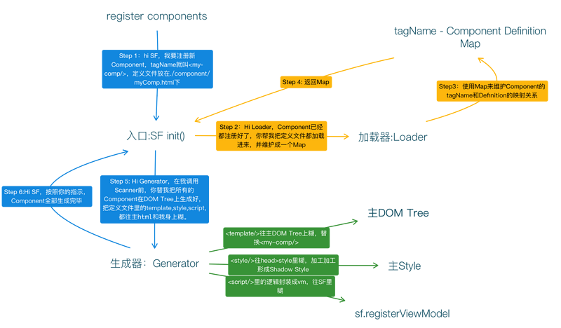
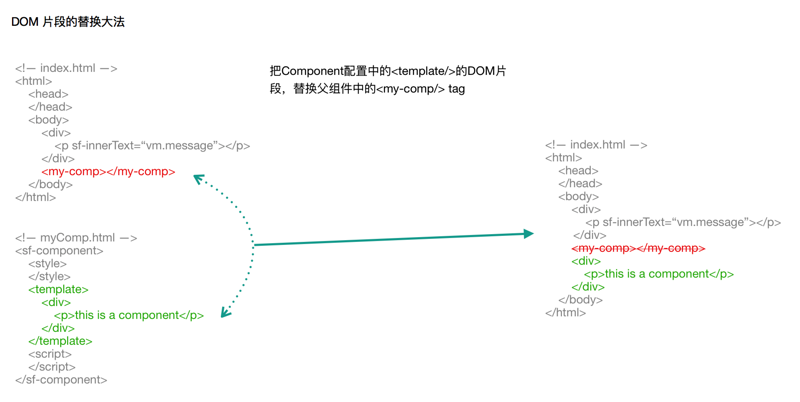

# 150行代码实现一个低配版的MVVM库
<!-- TOC -->

- [150行代码实现一个低配版的MVVM库](#150行代码实现一个低配版的MVVM库)
  - [原理篇](#原理篇)
    - [名词定义](#名词定义)
    - [为什么是低配版？](#为什么是低配版)
    - [什么是双向绑定](#什么是双向绑定)
    - [单向显示的设计思路（viewModel -> view）](#单向显示的设计思路viewModel---view)
      - [先看看API的设计](#先看看API的设计)
      - [思考题1](#思考题1)
    - [逆向修改的设计思路（viewModel <- view）](#逆向修改的设计思路viewModel---view)
      - [思考题2](#思考题2)
    - [同步机制](#同步机制)
      - [脏检查大法](#脏检查大法)
      - [setter大法](#setter大法)
      - [设计思路](#设计思路)
    - [总体设计图](#总体设计图)
  - [代码篇](#代码篇)
    - [第一步 先把骨架搭好, 血肉晚点再填充](#第一步-先把骨架搭好-血肉晚点再填充)
    - [代码](#代码)
  - [github](#github)
  - [再加150行代码教你实现一个低配版的web component库（1） —设计篇](#再加150行代码教你实现一个低配版的web-component库1-设计篇)
    - [什么才是好的 web component 设计](#什么才是好的-web-component-设计)
    - [什么是component](#什么是component)
    - [我心目中的web component](#我心目中的web-component)
    - [API设计](#API设计)
    - [一个Web Component库必须具备的基本素（功）养（能）](#一个Web-Component库必须具备的基本素功养能)
      - [第一点Mvvm](#第一点Mvvm)
      - [第二点Shadow Style](#第二点Shadow-Style)
      - [第三点Communication](#第三点Communication)
      - [第四点生命周期](#第四点生命周期)
  - [再加150行代码教你实现一个低配版的web component库（2） —原理篇](#再加150行代码教你实现一个低配版的web-component库2-原理篇)
    - [先回顾一下](#先回顾一下)
      - [三大部分是](#三大部分是)
      - [四大功能是](#四大功能是)
      - [Component定义文件格式如下](#Component定义文件格式如下)
    - [Web Component库大致流程](#Web-Component库大致流程)
    - [组件通讯](#组件通讯)
  - [再加150行代码教你实现一个低配版的web component库（3） —代码篇](#再加150行代码教你实现一个低配版的web-component库3-代码篇)
    - [component定义格式](#component定义格式)
    - [设计图](#设计图)
    - [还是先搭骨架，再填血肉](#还是先搭骨架再填血肉)
      - [SegmentFault](#SegmentFault)
      - [ComponentDefinition](#ComponentDefinition)
      - [Loader](#Loader)
      - [ComponentGenerator](#ComponentGenerator)
    - [填上骨肉 上最终实现代码](#填上骨肉-上最终实现代码)
  - [github](#github-1)

<!-- /TOC -->

## 原理篇
### 名词定义
* 先给低配版的库起一个响亮的名字-- SegmentFault.js 吧 （以下简称sf.js）
* 设置在DOM Element上的自定义属性前缀统一以 sf- 开头 （如 `<input type="text" sf-value="xxx">`）

### 为什么是低配版？
1. 没有sf-repeat
2. 不支持select，checkbox，radio等控件的双向绑定
3. 没有sf-if
4. 很多都没有

### 什么是双向绑定
首先明白一个概念，什么是**双向绑定**？在说双向绑定之前，我们先说说**单向显示**。
**单向显示** 说白了就是view动态地显示变量。比如在ng或其它一些主流框架里类似这种写法
```js
//scope.message= "segmentfault"; 
<h3 ng-bind="message"></h3> 
<!-- 运行时生成 -->
<h3>segmentfault</h3>
```

为什么说是单向呢，因为都是 viewModel上某个变量(message) -> view (h3)的一个过程，viewModel上的变量被view所呈现。

再来看看 **逆向修改** 
前面说了`单向是viewMode->view的过程`，那`逆向就是 viewModel <- view的过程`，换句话说就是viewModel被view修改的过程。例如angular中
```js
<input type="text" ng-model="message">
```

一旦用户在input控件中输入值，便会实时地改变viewModel中message这个变量的值。这是一个view -> viewModel 的过程。

所谓的**双向绑定**就是一个 **viewMode ->（显示） view ->（修改）viewModel** 的过程。

> **双向绑定 = 单向显示 + 逆向修改**  
> **注意： 单向显示可能发生在所有的类型DOM节点上，而逆向修改只可能发生在INPUT,SELECT,TEXTAREA等交互型控件上。**


### 单向显示的设计思路（viewModel -> view）

#### 先看看API的设计
```html
<!-- view -->
<div>
    <h3 sf-text="vm.message"></h3>
</div>

<script>
    // --- viewModel ---
    function ViewModel(){
        this.message = "segmentfault";
    }
    var vm = new ViewModel();
</script>
```

要实现这个功能，我们的sf库应该需要哪几步操作呢？(先自己想想，独立思考下)
1. 注册ViewModel，我们的库需要知道哪些object是viewModel
2. 扫描整个DOM Tree找到有哪些DOM节点上被配置了sf-xxxx这个attribute
3. 纪录这些被单向绑定的DOM节点和viewModel之间的映射关系
4. 使用DOM API， element.innerText = vm.prop, element.value = vm.prop, element.xxxx = vm.prop 来显示数据

#### 思考题1
Q：如果我们要单向绑定不是innerText,value 而是作为样式的class，style呢？
A：没错，使用sf-class="vm.myClass" sf-style="vm.myStyle"就好了，其它原生属性也以此类推
**"sf-" + native attribute is good!**

### 逆向修改的设计思路（viewModel <- view）
主流的一些mvvm框架上一般这么设计API，还是拿angular举例子
```html
<input type="text" ng-model="message">
```

> 这里我个人并不认同这种xx-model的命名方式来作为双向绑定的一种标识，比如angular的ng-model，或Vue的v-model，撇开前缀不说，这个model很让人困惑，我们知道input控件是本身就有value这个native的属性的，这个属性就是代表着input输入和输出的值，如果要给一个input进行双向绑定我们应该很自然而然地使用一个 *-value就可以了,完全没有必要弄出一个新的attribute叫做*-model的,从而增加学习成本。

所以，我们就设计一个叫做sf-value的attribute来做API
```html
<input type="text" sf-value="vm.message">
```

拍脑袋想想，view要改变数据只可能发生在可以和用户交互的一些html控件上，比如input家族（text, radio, checkbox), select, textarea上。 像h1~hn家族，这辈子是没有机会的。

要实现view改写viewModel，我们的库应该需要哪几步操作呢？
1. 扫描整个DOM Tree，找到哪些INPUT，SELECT，TEXTAREA节点上被配置了sf-value这个attribute
2. 纪录这些被双向绑定的DOM节点和viewModel之间的映射关系
3. sf.js库自动给这个写DOM加上onchange或者oninput的事件监听
4. 一旦监听到change/input事件，立即获取这个DOM的value值，把这个element.value赋给与之绑定的viewModel的变量上。


#### 思考题2
Q：那么问题来了，vm.message被input修改了，谁去通知其它同样绑定了vm.message的view呢？
A：请看下一段


### 同步机制

#### 脏检查大法
**脏检查大法** 这三个字想必大家已经如雷贯耳，我2年多前出去面试的时候被问及最多的就是angular的脏检查，什么是脏检查？angular脏检查的时机是什么？

**脏检查的原理就是，拷贝一份copy_viewModel在内存中，一旦有用户点击，输入操作，或ajax请求，setInterval，setTimeout等这些可能导致viewModel发生改变的行为，框架都会把copy_viewModel和最新的viewModel进行深度比较，一旦发现有属性（如vm.message）发生变化，则重新渲染与message绑定的DOM节点。**

这也是为什么，一旦你没有使用ng自带的$http，$interval,$timeout,ng-click这些angular自己封装的API去操作viewModel，angular都不会自动去同步view，因为已经超出他的管辖范围了，你必须手动调用apply函数去强制执行一次脏检查，以同步view。

#### setter大法 
听说VUE是使用的这种同步机制，其核心原理就是使用**Object.defineProperty(obj, prop, descriptor)** 这个API，在setter中加点料，一旦有任何地方执行 vm.message = "new value"语句，则setter都会被调用，由setter去触发重新渲染view的逻辑。

相较这两种同步机制，似乎setter更加轻便，性能更好。所以本文使用了setter的方式来实现同步机制（关键是实现setter机制使用的代码较少）。

#### 设计思路
给setter加点料
<div align="center"></div>

### 总体设计图
所以归纳来说一个MVVM库主要由3块组成
**MVVM库 = 单向显示 + 逆向修改 + 同步机制**

下图为sf.js的实现机制
其中Renderer负责单向显示和逆向修改，Watcher负责监视viewModel为同步机制的核心模块，
Scanner负责sf.js初始化时扫描DOM Tree生成view和viewModel的映射关系。
SegmentFault模块则负责维护view-viewModel Map，以及各个模块间的调度
<div align="center"></div>


## 代码篇
### 第一步 先把骨架搭好, 血肉晚点再填充
设计的类不多，一共就5个
```js
//SegmentFault.ts
export let SegmentFault = class SegmentFault {
    private viewModelPool = {};   //用来维护viewModel的别名alias与viewModel之间的关系
    private viewViewModelMap = {};//用来维护viewModel和被绑定的view之间的关系
    public registerViewModel(alias:string, vm:object) {};//在sf正式运作之前我们先要注册一个下viewModel并给他起一个别名
    public init() {};  //sf库开始运作的入口函数
    
    public refresh(alias:string){}; // 暴露一个强制刷新整个viewModel的方法，因为毕竟有你监控不到的角落
}
```

SegmentFault是对用户暴露的唯一的对象，就像Angular他会暴露一个angular对象给用户使用一样。
最终，用户会这样来操作SF以达到双向绑定的目的
不妨再看看使用效果
```html
<script src="dist/sf.js"></script> <!-- 这里引入我们的sf.js库-->
<script>
   var sf = new SegmentFault(); //生成一个sf的实例
   sf.registerViewModel("vm", new ViewModel()); //注册一个viewModel，起一个叫vm的别名
   sf.init(); //调用init方法，开始初始化，sf正式开始一些列工作

   //以下是viewModel的定义
   function ViewModel() {
     this.message = "hello, SegmentFault";
     this.buttonClickHandler = function() {
       this.message = "clicked: " + this.message;
     };
   }
</script>
```

有没有觉得SF的API干净利落，清新爽洁！

根据设计图的Step 1，先给已注册的viewModel加上监视，这里我们需要一个Watcher类
```js
export class Watcher {
    private sf;
    
    //构造函数里传入一个sf的对象，便于callback调用时的作用域确定。。。这是后话
    constructor(sf) {
        this.sf = sf;
    }
    public observe(viewModel, callback) {} //暗中观察
}
```

再来看一下Step 2, 另一个主要的类**Scanner**，**Scanner**是干什么的呢？作用就一个遍历整个DOM Tree把出现sf-xxxx这个attribute的Elements全部挑出来，然后找sf-xxxx = expression，等号右边这个表达式里如果出现了viewModel的alias，那就说么这个element是跟viewModel搭界了，是绑定在一起了，**scanner**负责把这对"恋人"关系用一个数据结构维护一下，等全部扫描完了一起返回给SegmentFault去听候发落。

<div align="center"></div>

```js
//Scanner.ts
export class Scanner {

    private prefix = "sf-"; //库的前缀
    private viewModelPool;
    
    constructor(viewModelPool) {
        this.viewModelPool = viewModelPool; 
        //Scanner肯定是为SegmentFault服务的，所以初始化的时候SegmentFault会把之前注册过的viewModel信息传给Scanner，便于它去扫描。
    }
    
    public scanBindDOM():object {} 
    //找出attribute里带sf-，且等号右边表达式里含有viewModel的alias的Element，并返回一个view与viewModel的map

}
```

接下去，SegmentFault会获得Scanner.scanBindDOM()所返回的view_viewModel Map,来看看这个Map的具体数据结构
```js
//template
{
    "vm_alias":[
        {
            "viewModel":viewModel,
            "element":element,
            "expression":expression,
            "attributeName":attributeName
        }
    ]
}
//如果实际中的DOM Tree是这样的，
<body>
    <p sf-text="userVM.username"></p>
    <input type="text" sf-value="userVM.username">
</body>
//那么，Scanner扫描到的结果应该是
{
    "userVM":[
        {
            "viewModel": userViewModel,
            "element": <p/>,
            "expression": "vm.username",
            "attributeName": "sf-text"
        },
        {
            "viewModel": userViewModel,
            "element": <input>,
            "expression": "vm.username",
            "attributeName": "sf-value"
        }
    ]
}
```

我的实现中特地定一个了一个BoundItem类来描述 {"viewModel":viewModel,"element":element,"expression":expression,"attributeName":attributeName}

```js
//BoundItem.ts
export class BoundItem {
    public viewModel: object;
    public element: Element;
    public expression: string;
    public attributeName: string;
 
    constructor(viewModel: object, element: Element, expression: string, attributeName: string) {
        this.viewModel = viewModel;
        this.element = element;
        this.expression = expression;
        this.attributeName = attributeName;
    } 
}
```

拿到view_viewModel map后，SegmentFault会调用Renderer去挨个渲染每一个BoundItem。

<div align="center"></div>

```js
export class Renderer{
    public render(boundItem:BoundItem) {};
}
```

好至此，几个主要的类都一一登场了，接下去我们完善下SegmentFault类，让ta和其它几个类联动起来

```js
import {Scanner} from "./Scanner";
import {Watcher} from "./Watcher";
import {Renderer} from "./Renderer";
export let SegmentFault = class SegmentFault {
  private viewModelPool = {};
  private viewViewModelMap = {};
  private renderer = new Renderer();
  public init() {
    let scanner = new Scanner(this.viewModelPool);
    let watcher = new Watcher(this);
    //step 1, 暗中观察各个viewModel
    for (let key in this.viewModelPool) {
      watcher.observe(this.viewModelPool[key],this.viewModelChangedHandler);
    }
    //step 2 3, 扫描DOM Tree并返回Map 
    this.viewViewModelMap = scanner.scanBindDOM();
    //step 4, 渲染DOM
    Object.keys(this.viewViewModelMap).forEach(alias=>{
        this.refresh(alias);
    });   
  };
  
  public registerViewModel(alias:string, viewModel:object) {
    viewModel["_alias"] = alias;
      window[alias] = this.viewModelPool[alias] = viewModel;
  };
    
  public refresh(alias:string){
    let boundItems = this.viewViewModelMap[alias];
    boundItems.forEach(boundItem => {
      this.renderer.render(boundItem);
    });
  }
    
  private viewModelChangedHandler(viewModel,prop) {
    this.refresh(viewModel._alias);
  }
}
```

**好，写到这里，骨架全部构建完成，你有没有兴趣自己花点时间去填充血肉呢?**

### 代码
```js
//Watcher.ts
export class Watcher {
  private sf;
  constructor(sf) {
    this.sf = sf;
  }
  public observe(viewModel, callback) {
    let host = this.sf;
    for (var key in viewModel) {
      var defaultValue = viewModel[key];
        (function (k, dv) {
          if (k !== "_alias") {
            Object.defineProperty(viewModel, k, {
              get: function () {
                return dv;
              },
              set: function (value) {
                dv = value;
                console.log("do something after set a new value");
                callback.call(host, viewModel, k);
              }
            });
          }
      })(key, defaultValue);
    }
  }
}
```

```js
//Scanner.ts
import { BoundItem } from "./BoundItem";
export class Scanner {
    private prefix = "sf-";
    private viewModelPool;

    constructor(viewModelPool) {
        this.viewModelPool = viewModelPool;
    }
    public scanBindDOM() :object{
        let boundMap = {};
        
        let boundElements = this.getAllBoundElements(this.prefix);
        boundElements.forEach(element => {
           for (let i = 0; i < element.attributes.length; i++) {
                let attr = element.attributes[i];
                if (attr.nodeName.search(this.prefix) > -1) {
                    let attributeName = attr.nodeName;
                    let expression = element.getAttribute(attributeName);
                    for (let alias in this.viewModelPool) {
                        if (expression.search(alias + ".") != -1) {
                            let boundItem = new BoundItem(this.viewModelPool[alias], element, expression,attributeName);
                            if (!boundMap[alias]) {
                                boundMap[alias] = [boundItem];
                            } else {
                                boundMap[alias].push(boundItem);
                            }
                        }
                    }
                }
            }
        });  
        return boundMap;
    }

    private fuzzyFind(element:HTMLElement,text:string):HTMLElement {
        if (element && element.attributes) {
            for (let i = 0; i < element.attributes.length; i++) {
                let attr = element.attributes[i];
                if (attr.nodeName.search(text) > -1) {
                    return element;
                }
            }
        }
        return null;
    }
     private getAllBoundElements(prefix): Array<HTMLElement> {
        let elements = [];
        let allChildren = document.querySelectorAll("*");
        for (let i = 0; i < allChildren.length; i++) {
            let child: HTMLElement = allChildren[i] as HTMLElement;
            let matchElement = this.fuzzyFind(child, prefix);
            if (matchElement) {
                elements.push(matchElement);
            }
        }
        return elements;
    }
}
```

```js
//BoundItem.ts
export class BoundItem {
    public viewModel: object;
    public element: Element;
    public expression: string;
    public attributeName: string;
    private interactiveDomConfig = {
        "INPUT":{
            "text":"input",
            "password":"input",
            "email":"input",
            "url":"input",
            "tel":"input",
            "radio":"change",
            "checkbox":"change",
            "color":"change",
            "date":"change",
            "datetime":"change",
            "datetime-local":"change",
            "month":"change",
            "number":"change",
            "range":"change",
            "search":"change",
            "time":"change",
            "week":"change",
            "button":"N/A",
            "submit":"N/A"
        },
        "SELECT":"change",
        "TEXTAREA":"change"
    }
    constructor(viewModel: object, element: Element, expression: string, attributeName: string) {
        this.viewModel = viewModel;
        this.element = element;
        this.expression = expression;
        this.attributeName = attributeName;
        this.addListener(this.element,this.expression);
    }

    private addListener(element,expression){
        let tagName = element.tagName;
        let eventName = this.interactiveDomConfig[tagName];
        if(!eventName){
            return;
        }
        if(typeof eventName === "object"){
            let type = element.getAttribute("type");
            eventName = eventName[type];
        }
        element.addEventListener(eventName, (e)=> {
            let newValue = (element as HTMLInputElement).value;
            let cmd = expression + "= \"" + newValue + "\"";
            try{
                eval(cmd);
            }catch(e){
                console.error(e);
            }
        });
    }
}
```

```js
//Renderer.ts
import {BoundItem} from "./BoundItem";
export class Renderer{
    public render(boundItem:BoundItem) {
        var value = this.getValue(boundItem.viewModel, boundItem.expression);
        var attribute = boundItem.attributeName.split('-')[1];

        if (attribute.toLowerCase() === "innertext") {
            attribute = "innerText";
        }
        boundItem.element[attribute] = value;
    };
    private getValue(viewModel, expression) {
        return (function () {
            var alias = viewModel._alias;
            var tempScope = {};
            tempScope[alias] = viewModel;
            try {
                var pattern = new RegExp("\\b" + alias + "\\b", "gm");
                expression = expression.replace(pattern, "tempScope." + alias);
                var result = eval(expression);
                tempScope = null;
                return result;
            } catch (e) {
                throw e;
            }
        })();
    }
}
```

## github
[github](ttps://github.com/momoko8443/how_to_write_a_mvvm_library)


## 再加150行代码教你实现一个低配版的web component库（1） —设计篇

本篇是在上两篇的基础之上对代码进行进一步扩展，从而实现web component功能，所以读者务必掌握mvvm的实现机制才能深入理解本篇的内容（mvvm是web component的基石）。

### 什么才是好的 web component 设计

目前市面上各大主流前端框架，凡事带web component功能的，他们的设计水准基本都不入我的法眼，唯一看得上眼的是google的polymer，但是在某些API设计层面也显得略微繁琐（想了解polymer的朋友看一翻一下我专栏里面[10篇polymer入门系列教程](https://segmentfault.com/a/1190000003810019)）


### 什么是component
html提供的原生标签，比如DIV, BUTTON, INPUT家族，Hx家族等等，这些就好比俄罗斯方块里的一块块标准积木,我们称它们为stand component

某一天这些积木不能满足你的需求了，被扩展或被组合形成了非基本形状

<div align="center"></div>

这些新形状就是custom component，自定义组件！为什么要有component呢，好处是什么呢？
 1. 可以复用
 2. 结构清晰
 3. 独立开发

### 我心目中的web component
在座的各位都写过index.html么？很简单
主要就分成3大块内容，style, dom, script
```html
<!--样式-->
<style>
</style>
<!--DOM UI-->
<body>
</body>
<!--逻辑-->
<script>
</script>
```

然后外面用个<html></html>包裹

所以这期低配版web component库设计目的很简单，作为一个开发人员，我希望在写一个custom component的时候也能按照index.html的原生风格来写，这是多么的优雅，自然，没有学习成本啊！
这也应该是无数人心目中的web component设计


### API设计

所以，我们的SegmentFault.js v2.0的Web Component的设计宗旨就是，尽量接近原生的html结构和使用习惯,**接近原生从而把学习成本降到最低，是我追求的东西**

```html
<!-- myComp.html //文件名还是以.html结尾,自然 -->
<sf-component>
    <style>
        <!--css-->
    </style>
    <template>
        <!-- any dom-->
    <template>
    <script>
        //js
    </script>
<sf-component>
```

写个具体的例子
```html
<!-- myComp.html -->
<sf-component>
    <style>
        button{
            color:red;
        }
        p{
            color:yellow;
        }
    </style>
    <template>
        <div>
            <input type="text" sf-value="this.message"/>
            <button sf-innerText="this.buttonName" onclick="this.clickHandler()"></button>
            <p sf-innerText="this.message"> 
            </p>
        </div>
    </template>
    <script>
        this.message = "this is a component";
        this.buttonName = "click me";
        this.clickHandler = function(){
            alert(this.message);
        };
    </script>
</sf-component>
```

一个Component的描述文件定义好了，那么接下去就是如何引入它了。沿用上篇Mvvm中的风格，我们给SegmentFault这个Class弄个registerComponent(tagName,compPath)方法，比如在index.html中

```js
var sf = new SegmentFault();
sf.registerController("xxx",xxx);
...
sf.registerComponent("my-comp","components/myComp.html");
...
sf.init();
```

而在父组件中我们就可以通过"my-comp"这个我们刚刚注册时起的标签名来引入这个组件

```html
<body>
    <div>...<div>
    <my-comp></my-comp>
</body>
```

怎么样！四个字：干净利落

### 一个Web Component库必须具备的基本素（功）养（能）

 1. Mvvm 具备双向绑定功能
 2. Shadow Style 具有独立的不污染全局的css功能
 3. Communication 具有和父子兄弟组件通讯的功能
 4. 拥有生命周期 （属于高级功能，本低配版库不涉及）

#### 第一点Mvvm
Mvvm之前已经实现，我们只要套用之前的实现即可

#### 第二点Shadow Style
可能很多人对这个没什么概念，我沿用前文中的内容，比如我们在component中定义了它的style，如
```html
<!-- myComp.html -->
<sf-component>
    <style>
        button{
            color:red;
        }
        p{
            color:yellow;
        }
    </style>
    <template>
        <div>
            ...
        </div>
    </template>
    <script>
        ...
    </script>
</sf-component>
```

这里我们在`<style></style>`标签中，定义了css，其中p和button的写法在传统观念中都是会影响html页面中所有的p元素和button元素的，这是我们不希望发生的，我们希望的是这个`<style></style>`标签生效的作用域仅仅是在当前的，被定义的component中。这种有独立作用域的css就叫Shadow Style。

要实现Shadow Style，其实有比较简单的做法，本篇设计篇中不会涉及，你可以趁此独立思考下，待下篇看看是否与我不谋而合，或者有比我更加高级的方案。

#### 第三点Communication

即组件之间的通讯，经常有人在sf中问到这个组件通讯问题，其实这个问题是有比较标准的答案的，即3点
 1. 父子通讯: 父->子 通过 set 属性， 子->父 抛事件
 2. 兄弟通讯: 大儿子 抛事件给 -> 父 -> set 小儿子 的属性
 3. 远亲通讯: 走消息总线 （其实就在一个单例上搞事件机制）

要实现通讯机制，其实也不复杂，主要就2个功能，1 父组件可以set子组件的属性， 2 组件可以向外层抛事件，外层也可以监听组件抛出的事件，所以，我们会如此设计这块的内容，觉个例子,代码说话

```html
<body>
    <div>...<div>
    <my-comp sf-msg="vm.message" sf-oncustomevent="vm.customEventHandler"></my-comp>
</body>
```

大家注意看，从父组件的角度，我可以使用`sf-` + propertyName(这里是msg) 来实现外部父组件对组件的赋值，而且还能使用`sf-on` + 自定义事件名称（这里是customevent） 对组件进行监听。

换个角度，从子组件角度出发，我可以被外部赋值，我可以可以向外部dispatch事件。
```jsx
<sf-component>
    <style>
        //...
    </style>
    <template>
        <div>
            <div class="compClass">
                <input type="text" sf-value="this.message" />
                <button sf-innerText="this.buttonName" onclick="this.clickHandler()"></button>
                <my-comp2 sf-msg="this.message"></my-comp2>
                <p sf-innerText="this.message + ', hi Component1'">
                </p>
            </div>
        </div>
    </template>
    <script>
        this.buttonName = "click me";
        this.clickHandler = function () {
            alert(this.message);
            this.dispatchEvent("customevent", "hello world");//为component的vm,内置一个dispatchEvent方法，用法和原生的事件机制一毛一样。
        };
        Object.defineProperty(this, "msg", {
            set: function (value) {
                if (value) {
                    this.message = value;
                }
            }
        });
    </script>
</sf-component>
```

使用`Object.defineProperty`可以很大程度上满足我们对set property的需求，另外再给`component`的`vm`挂载一个内置的函数`this.dispatchEvent`来发送自定义事件我们就功德圆满了。

#### 第四点生命周期
你可以给一个组件：**由注册->加载定义->显示到DOM Tree->内容更新->从DOM Tree移除->销毁** 等一系时间节点定义他的生命周期，如果是做的比较考究的库，你可以把这这些时间节点的变更都一一向用户通知，或者提供api供用户控制。本文设计的低配版库阉割了这部分高级功能，我们就是一教学向的库，不整这些有的没的。


## 再加150行代码教你实现一个低配版的web component库（2） —原理篇

### 先回顾一下
上文说道一个基本款的custom web component由3大部分组成，同时也必须具备4大功能

#### 三大部分是
1. Template(DOM)
2. Style   
3. Script (viewModel)

#### 四大功能是
1. Mvvm
2. Shadow Style
3. Communication
4. Lifecycle （本文不涉及LC的API,但在实现中会隐形的涵盖这部分内容）

#### Component定义文件格式如下
```html
<!-- myComp.html -->
<sf-component>
    <style>
        button{
            color:red;
        }
        p{
            color:yellow;
        }
    </style>
    <template>
        <div>
            <input type="text" sf-value="this.message"/>
            <button sf-innerText="this.buttonName" onclick="this.clickHandler()"></button>
            <p sf-innerText="this.message"> 
            </p>
        </div>
    </template>
    <script>
        this.message = "this is a component";
        this.buttonName = "click me";
        this.clickHandler = function(){
            alert(this.message);
        };
    </script>
</sf-component>
```

### Web Component库大致流程

<div align="center"></div>

黑框以下是不是很眼熟，就是Mvvm篇中的流程。加入Component功能我们几乎不用动Mvvm部分的代码，只要在调用Scanner扫描viewModel和view的映射关系之前，我们把含有Component tag的主DOM Tree升级加工即可。其实Component定义文件中的`<template/>`和`<script/>`也是view和viewModel的关系。我们把Component的定义文件渲染到主DOM Tree上翻译成view和viewModel的关系，再由Mvvm篇中的Scanner，Renderer做扫描和渲染即可。是不是很简单？

我们把着重点放在黑框上面的部分，也就是生成Component的流程，我们更加图中的steps，一步步来看
先放张局部大图

<div align="center"></div>

Step 1：RegisterComponent，这一步，是要在SF库init初始化之前就要进行的，我们给新的component起个名字tagName，比如my-comp，这样我们在以后就可以用`<my-comp/>`这个tag在任何地方引入这个component，另外还需要把component定义文件的路径告诉SF，方便其在初始化的时候加载这些定义文件

```js
//伪代码
var sf = new SegmentFault();
sf.registerComponent("my-comp","./components/myComp.html");
sf.init();
```

Step 2 3 4: Loader加载器在sf.init()时被调用，去加载"./components/myComp.html"这些路径上的component定义文件，并且把这些定义和tagName形成一份Map返回给SF

Step 5: （第五步相当重要，web component 99%的精髓都在这一步，请认真阅读）
SF拿到Map后，通知Generator去扫描DOM Tree一旦发现有`<my-comp/>`标签出现，则使出DOM替换大法，把Map中my-comp对应的component定义中的template部分的DOM，替换上去。如下图

DOM替换大法
<div align="center"></div>

思考题：
Q:辣么，Component定义中的`<script>`里的viewModel怎么办？
A: 使用new Function()或者eval把`<script/>`中的viewModel生成一个function,我们姑且叫它CompViewModel，然后把template
上的sf-xxx=“this.xxxx”的attribute中，等式的左边全部含有this的部分，替换成vm_随机数，比如
```html
<template>
    <div>
        <p sf-innerText="this.message"></p>
    </div>
</template>
```

替换成
```html
<template>
    <div>
        <p sf-innerText="vm_2333.message"></p>
    </div>
</template>
```

还记得这个`vm_2333`是什么的？没错如果你没有白看Mvvm那两篇教程的话，`vm_2333`就是`viewModel`实例的`alias`。那还等什么?赶紧调用`sf.registerViewModle("vm_2333",new CompViewModel())`注册这个`component`的`viewModel`吧！

<div align="center"></div>

有没有发现web component库的套路，是不是很简单？第一步，把index.html（或父组件）中含有的component tagName找出来，然后一通替换和伪装，第二步，让SF把它当成Mvvm篇中的普通view-viewModel和关系去处理即可。

template和script处理完了，那么接下去就只剩下style，如何让`<style>`标签中的css定义的作用于只发生在当前？

我给出的办法是，还是移花接木大法

```html
<sf-component>
    <style>
        p{
            color:red;
        }
    </style>
</sf-component>
```

第一步，要把这坨css加到index.html的head中去，这样css才会生效，但是这样会污染全局

```html
<html>
    <head>
        ...
        <style type=text/css>
            p{
                color:red;
            }
        </style>
    </head>
```

第二步，把这坨css进行加工,加上作用域 .myComp ,这样的话，根据css selector语义，只有在class="myComp"的DOM下的p元素才会生效
```html
<html>
    <head>
        ...
        <style type=text/css>
            .myComp p{
                color:red;
            }
        </style>
    </head>
```

第三步，当然是给代表component的DOM最外层上增加一个叫myComp的class了，一个简单版的Shadow Style就这样实现了。

至此，一个component的三大组成说完，四大功能还剩communication没有讲


### 组件通讯
很简单，实现2个接口即可实现组件通讯，具体见上篇《设计篇》有提到
1. Component的属性可以被父组件set进值
2. viewModel可以向外dispatch事件

这2个接口都可以在step 5中通过一些小动作，给加进去，本篇就不具体解释了，作为思考题大家回去思考，俗话说的的talk is cheap，show me the code，具体实现会在第三篇《代码篇》中给出，大家看了自己一目了然，比我这里浪费口舌能更好的理解。

## 再加150行代码教你实现一个低配版的web component库（3） —代码篇

### component定义格式
```js
<!-- myComp.html -->
<sf-component>
    <style>
        button{
            color:red;
        }
        p{
            color:yellow;
        }
    </style>
    <template>
        <div>
            <input type="text" sf-value="this.message"/>
            <button sf-innerText="this.buttonName" onclick="this.clickHandler()"></button>
            <p sf-innerText="this.message"> 
            </p>
        </div>
    </template>
    <script>
        this.message = "this is a component";
        this.buttonName = "click me";
        this.clickHandler = function(){
            alert(this.message);
        };
    </script>
</sf-component>
```

### 设计图

<div align="center"></div>

### 还是先搭骨架，再填血肉
这次增加web component功能，只是在原来mvvm的基础上新增了3个类，分别是`Loader`，`ComponentGenerator`，和一个描述component定义的类型`ComponentDefinition`

我们看到设计图中的入口是register component，我们需要给SegmentFault类增加个registerComponent的接口

#### SegmentFault

```js
export let SegmentFault = class SegmentFault {
    ...
    private componentPool = {};
    //传入自定义component的tagName，tagName可以随便起，例如my-comp
    //path为定义文件的路径，例如components/myComp.html
    public registerComponent(tagName,path){
        this.componentPool[tagName] = path;
    }
    ...
}
```

#### ComponentDefinition

ComponentDefinitiony用来维护component的定义文件，我们需要把每个xxxComp.html定义文件中的`<template/><script/><style/>`以及component的tagName维护在内存对象中

```js
export class ComponentDefinition{
    public tagName;  //例如 <my-comp>中的my-comp就是tagName，tagName由registerComponent时传入。
    public style;  //样式，即<style/>中的字符串
    public template; //DOM，即<template/>中的字符串
    public script; //逻辑，即<script/>中的字符串
    constructor(tagName,style,template,script){
        this.tagName = tagName;
        this.style = style;
        this.template = template;
        this.script = script;
    }
}
```

#### Loader

这个类就是在sf.init的时候去加载所有定义的component定义文件，把html中的内容维护在内存对象中，并且也会同时维护一张map，来反应tagName和ComponentDefinition之间的映射关系，鉴于是通过ajax请求来load，这些*.html定义文件，所以会使用promise的返回类型。

```js
import {ComponentDefinition} from "./ComponentDefinition";
export class Loader {
    private componentPool;
    private componentDefinitionPool = {};
    constructor(componentPool) {
        this.componentPool = componentPool;
    }
    //通过ajax请求，异步加载各个.html的定义文件，并维护componentDefinitionPool
    public load(): Promise<any> {
        
    }
}
```

#### ComponentGenerator
Loader加载完定义之后，就需要Generator来扫描解析整棵DOM Tree，并用template中的内容替换`<my-comp>`这种tag标签了，具体原理请参考《原理篇》
主要分成2步 扫描scan，和 替换生成generator！由于需要递归扫描子节点，我比较多的使用了async/await来确保同步。

```js
export class ComponentGenerator {
    private sf;
    private componentDefinitionPool;
    constructor(sf, componentDefinitionPool) {
        this.componentDefinitionPool = componentDefinitionPool;
        this.sf = sf;
    }
    public async scanComponent(element): Promise<any> {
        
    }
    private async generate(tagElement: HTMLElement, compDef: ComponentDefinition, attrs) {
        
    }
}
```

### 填上骨肉 上最终实现代码

```js
//SegmentFault.ts
import {Scanner} from "./Scanner";
import {Watcher} from "./Watcher";
import {Renderer} from "./Renderer";
import {Loader} from "./component/Loader";
import {ComponentGenerator} from "./component/ComponentGenerator";
export let SegmentFault = class SegmentFault {
    private viewModelPool = {};
    private viewViewModelMap = {};
    private renderer = new Renderer();
    private generator:ComponentGenerator;
    public init():Promise<any>{

        return new Promise((resolve,reject)=>{
            let loader = new Loader(this.componentPool);
            loader.load().then( componentDefinitionPool =>{
                console.log(componentDefinitionPool);
                if(componentDefinitionPool){
                    this.generator = new ComponentGenerator(this,componentDefinitionPool);
                    return this.generator.scanComponent(document);
                }else{
                    return;
                }
            }).then(()=>{
                let scanner = new Scanner(this.viewModelPool);
                let watcher = new Watcher(this);
                for (let key in this.viewModelPool) {
                    watcher.observe(this.viewModelPool[key],this.viewModelChangedHandler);
                }
                this.viewViewModelMap = scanner.scanBindDOM();
                Object.keys(this.viewViewModelMap).forEach(alias=>{
                    this.refresh(alias);
                }); 
                resolve();
            });
        });
    };
    public registerViewModel(alias:string, viewModel:object) {
        viewModel["_alias"] = alias;
        window[alias] = this.viewModelPool[alias] = viewModel;
    };
    public refresh(alias:string){
        let boundItems = this.viewViewModelMap[alias];
        boundItems.forEach(boundItem => {
            this.renderer.render(boundItem);
        });
    }
    private viewModelChangedHandler(viewModel,prop) {
        this.refresh(viewModel._alias);
    }

    private componentPool = {};
    public registerComponent(tagName,path){
        this.componentPool[tagName] = path;
    }
}
```

```js
//ComponentDefinition.ts
export class ComponentDefinition{
    public tagName;
    public style;
    public template;
    public script; 
    constructor(tagName,style,template,script){
        this.tagName = tagName;
        this.style = style;
        this.template = template;
        this.script = script;
    }
}
```

```js
//Loader.ts
import {ComponentDefinition} from "./ComponentDefinition";
export class Loader {
    private componentPool;
    private componentDefinitionPool = {};
    constructor(componentPool) {
        this.componentPool = componentPool;
    }
    public load(): Promise<any> {
        let compArray = [];
        for (var tagName in this.componentPool) {
            compArray.push({ name: tagName, path: this.componentPool[tagName] });
        }
        return this.doAsyncSeries(compArray).then(result=>{
            return result;
        });
    }
    private doAsyncSeries(componentArray): Promise<any> {
        return componentArray.reduce( (promise, comp) =>{
            return promise.then( (result) => {
                return fetch(comp.path).then((response) => {
                    return response.text().then(definition => {
                        let def = this.getComponentDefinition(comp.name,definition);
                        this.componentDefinitionPool[comp.name] = def;
                        return this.componentDefinitionPool;
                    });
                });
            });
        }, new Promise<void>((resolve, reject) => {
            resolve();
        }));
    }
    private getComponentDefinition(tagName:string, htmlString: string): ComponentDefinition {
        let tempDom: HTMLElement = document.createElement("div");
        tempDom.innerHTML = htmlString;
        let template: string = tempDom.querySelectorAll("template")[0] && tempDom.querySelectorAll("template")[0].innerHTML;
        let script: string = tempDom.querySelectorAll("script")[0] && tempDom.querySelectorAll("script")[0].innerHTML;
        let style: string = tempDom.querySelectorAll( "style")[0] && tempDom.querySelectorAll( "style")[0].innerHTML;

        return new ComponentDefinition(tagName,style,template,script);
    }
}
```

```js
//ComponentGenerator.ts
import { ComponentDefinition } from "./ComponentDefinition";
export class ComponentGenerator {
    private sf;
    private componentDefinitionPool;
    constructor(sf, componentDefinitionPool) {
        this.componentDefinitionPool = componentDefinitionPool;
        this.sf = sf;
    }
    public async scanComponent(element): Promise<any> {
        let compDef: ComponentDefinition = this.componentDefinitionPool[element.localName];
        if (compDef) {
            let attrs = element.attributes;
            return this.generate(element, compDef, attrs);
        } else {
            if (element.children && element.children.length > 0) {
                for (let i = 0; i < element.children.length; i++) {
                    let child = element.children[i];
                    await this.scanComponent(child);
                }
                return element;
            } else {
                return element;
            }
        }
    }
    private async generate(tagElement: HTMLElement, compDef: ComponentDefinition, attrs) {
        if(compDef.style){
            this.dealWithShadowStyle(compDef);
        }       
        let randomAlias = 'vm_' + Math.floor(10000 * Math.random()).toString();
        let template = compDef.template;
        template = template.replace(new RegExp('this', 'gm'), randomAlias);
        let tempFragment = document.createElement('div');
        tempFragment.insertAdjacentHTML('afterBegin' as InsertPosition, template);
        if (tempFragment.children.length > 1) {
            template = tempFragment.outerHTML;
        }
        tagElement.insertAdjacentHTML('beforeBegin' as InsertPosition, template);
        let htmlDom = tagElement.previousElementSibling;
        htmlDom.classList.add(tagElement.localName);
        let vm_instance;
        if (compDef.script) {
            let debugComment = "//# sourceURL="+tagElement.tagName+".js";
            let script = compDef.script + debugComment;
            let ViewModelClass: Function = new Function(script);
            vm_instance = new ViewModelClass.prototype.constructor();
            this.sf.registerViewModel(randomAlias, vm_instance);

            vm_instance._dom = htmlDom;
            vm_instance.dispatchEvent = (eventType: string, data: any, bubbles: boolean = false, cancelable: boolean = true) => {
                let event = new CustomEvent(eventType.toLowerCase(), { "bubbles": bubbles, "cancelable": cancelable });
                event['data'] = data;
                vm_instance._dom.dispatchEvent(event);
            };

            for (let i = 0; i < attrs.length; i++) {
                let attr = attrs[i];
                if(attr.nodeName.search("sf-") !== -1){
                    if(attr.nodeName.search("sf-on") !== -1){
                        let eventName = attr.nodeName.substr(5);
                        vm_instance._dom.addEventListener(eventName,eval(attr.nodeValue));
                    }else{
                        let setTarget = attr.nodeName.split("-")[1];
                        vm_instance[setTarget] = eval(attr.nodeValue);
                    }                 
                }           
            }

        }
        for (let i = 0; i < attrs.length; i++) {
            let attr = attrs[i];
            if(attr.nodeName.search("sf-") === -1){
                htmlDom.setAttribute(attr.nodeName, attr.nodeValue);
            }           
        }

        tagElement.parentNode.removeChild(tagElement);
        if (htmlDom.children && htmlDom.children.length > 0) {
            for (let j = 0; j < htmlDom.children.length; j++) {
                let child = htmlDom.children[j];
                await this.scanComponent(child);
            }
            callInit();
            return htmlDom;
        } else {
            callInit();
            return htmlDom;
        }

        function callInit(){
            if (vm_instance && vm_instance._init && typeof (vm_instance._init) === 'function') {
                vm_instance._init();
            }
        }
    }
    private dealWithShadowStyle(compDef:ComponentDefinition): void {
        let stylesheet = compDef.style;
        let tagName = compDef.tagName;
        let head = document.getElementsByTagName('HEAD')[0];
        let style = document.createElement('style');
        style.type = 'text/css';
        var styleArray = stylesheet.split("}");
        var newArray = [];
        styleArray.forEach((value: string, index: number) => {
            var newValue = value.replace(/^\s*/, "");
            if (newValue) {
                newArray.push(newValue);
            }
        });
        stylesheet = newArray.join("}\n" + "." + tagName + " ");
        stylesheet = "." + tagName + " " + stylesheet + "}";
        style.innerHTML = stylesheet;
        head.appendChild(style);
    }
}
```

## github
[github地址](https://github.com/momoko8443/how_to_write_a_mvvm_library)