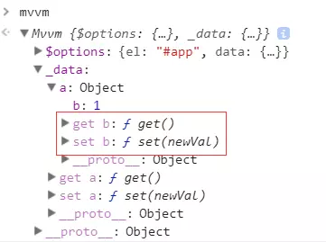
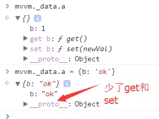

# MVVM原理

<!-- TOC -->

- [MVVM原理](#MVVM原理)
  - [划重点](#划重点)
  - [Object.defineProperty()](#ObjectdefineProperty)
  - [Vue为参照去实现怎么写MVVM](#Vue为参照去实现怎么写MVVM)
  - [打造MVVM](#打造MVVM)
  - [数据劫持](#数据劫持)
  - [数据代理](#数据代理)
  - [数据编译](#数据编译)
  - [发布订阅](#发布订阅)
  - [数据更新视图](#数据更新视图)
  - [双向数据绑定](#双向数据绑定)
  - [computed(计算属性) && mounted(钩子函数)](#computed计算属性--mounted钩子函数)
  - [总结](#总结)
  - [补充](#补充)

<!-- /TOC -->

## 划重点
MVVM 双向数据绑定 在Angular1.x版本的时候通过的是脏值检测来处理
而现在无论是React还是Vue还是最新的Angular，其实实现方式都更相近了
那就是通过**数据劫持+发布订阅模式**

真正实现其实靠的也是ES5中提供的`Object.defineProperty`，当然这是不兼容的所以Vue等只支持了IE8+

## Object.defineProperty()
```js
let obj = {};
let song = '发如雪'; 
obj.singer = '周杰伦';  

Object.defineProperty(obj, 'music', {
    // 1. value: '七里香',
    configurable: true,     // 2. 可以配置对象，删除属性
    // writable: true,         // 3. 可以修改对象
    enumerable: true,        // 4. 可以枚举
    // ☆ get,set设置时不能设置writable和value，它们代替了二者且是互斥的
    get() {     // 5. 获取obj.music的时候就会调用get方法
        return song;
    },
    set(val) {      // 6. 将修改的值重新赋给song
        song = val;   
    }
});

// 下面打印的部分分别是对应代码写入顺序执行
console.log(obj);   // {singer: '周杰伦', music: '七里香'}  // 1

delete obj.music;   // 如果想对obj里的属性进行删除，configurable要设为true  2
console.log(obj);   // 此时为  {singer: '周杰伦'}

obj.music = '听妈妈的话';   // 如果想对obj的属性进行修改，writable要设为true  3
console.log(obj);   // {singer: '周杰伦', music: "听妈妈的话"}

for (let key in obj) {    
    // 默认情况下通过defineProperty定义的属性是不能被枚举(遍历)的
    // 需要设置enumerable为true才可以
    // 不然你是拿不到music这个属性的，你只能拿到singer
    console.log(key);   // singer, music    4
}

console.log(obj.music);   // '发如雪'  5
obj.music = '夜曲';       // 调用set设置新的值
console.log(obj.music);   // '夜曲'    6
```

## Vue为参照去实现怎么写MVVM
```html
// index.html
<body>
    <div id="app">
        <h1>{{song}}</h1>
        <p>《{{album.name}}》是{{singer}}2005年11月发行的专辑</p>
        <p>主打歌为{{album.theme}}</p>
        <p>作词人为{{singer}}等人。</p>
        为你弹奏肖邦的{{album.theme}}
    </div>
    <!--实现的mvvm-->
    <script src="mvvm.js"></script>
    <script>
        // 写法和Vue一样
        let mvvm = new Mvvm({
            el: '#app',
            data: {     // Object.defineProperty(obj, 'song', '发如雪');
                song: '发如雪',
                album: {
                    name: '十一月的萧邦',
                    theme: '夜曲'
                },
                singer: '周杰伦'
            }
        });
    </script>
</body>
```

## 打造MVVM
```js
// 创建一个Mvvm构造函数
// 这里用es6方法将options赋一个初始值，防止没传，等同于options || {}
function Mvvm(options = {}) {   
    // vm.$options Vue上是将所有属性挂载到上面
    // 所以我们也同样实现,将所有属性挂载到了$options
    this.$options = options;
    // this._data 这里也和Vue一样
    let data = this._data = this.$options.data;
    
    // 数据劫持
    observe(data);
}
```

## 数据劫持
> 为什么要做数据劫持？?
* 观察对象，给对象增加Object.defineProperty
* vue特点是不能新增不存在的属性 不存在的属性没有get和set
* 深度响应 因为每次赋予一个新对象时会给这个新对象增加defineProperty(数据劫持)
```js
// 创建一个Observe构造函数
// 写数据劫持的主要逻辑
function Observe(data) {
    // 所谓数据劫持就是给对象增加get,set
    // 先遍历一遍对象再说
    for (let key in data) {     // 把data属性通过defineProperty的方式定义属性
        let val = data[key];
        observe(val);   // 递归继续向下找，实现深度的数据劫持
        Object.defineProperty(data, key, {
            configurable: true,
            get() {
                return val;
            },
            set(newVal) {   // 更改值的时候
                if (val === newVal) {   // 设置的值和以前值一样就不理它
                    return;
                }
                val = newVal;   // 如果以后再获取值(get)的时候，将刚才设置的值再返回去
                observe(newVal);    // 当设置为新值后，也需要把新值再去定义成属性
            }
        });
    }
}

// 外面再写一个函数
// 不用每次调用都写个new
// 也方便递归调用
function observe(data) {
    // 如果不是对象的话就直接return掉
    // 防止递归溢出
    if (!data || typeof data !== 'object') return;
    return new Observe(data);
}
```

以上代码就实现了数据劫持，不过可能也有些疑惑的地方比如：**递归**
```js
let mvvm = new Mvvm({
    el: '#app',
    data: {
        a: {
            b: 1
        },
        c: 2
    }
});
```

我们在控制台里看下
<div align="center"></div>

被标记的地方就是通过**递归observe(val)**进行数据劫持添加上了get和set，递归继续向a里面的对象去定义属性，亲测通过可放心食用

接下来说一下observe(newVal)这里为什么也要递归

还是在可爱的控制台上，敲下这么一段代码 mvvm._data.a = {b:'ok'}

然后继续看图说话
<div align="center"></div>

通过observe(newVal)加上了
<div align="center"></div>

现在大致明白了为什么要对设置的新值也进行递归observe了吧，哈哈，so easy

数据劫持已完成，我们再做个数据代理

## 数据代理
数据代理就是让我们每次拿data里的数据时，不用每次都写一长串，如mvvm._data.a.b这种，我们其实可以直接写成mvvm.a.b这种显而易见的方式

下面继续看下去，+号表示实现部分
```js
function Mvvm(options = {}) {  
    // 数据劫持
    observe(data);
    // this 代理了this._data
+   for (let key in data) {
        Object.defineProperty(this, key, {
            configurable: true,
            get() {
                return this._data[key];     // 如this.a = {b: 1}
            },
            set(newVal) {
                this._data[key] = newVal;
            }
        });
+   }
}

// 此时就可以简化写法了
console.log(mvvm.a.b);   // 1
mvvm.a.b = 'ok';    
console.log(mvvm.a.b);  // 'ok'
```

写到这里数据劫持和数据代理都实现了，那么接下来就需要编译一下了，把｛{}｝里面的内容解析出来

## 数据编译
```js
function Mvvm(options = {}) {
    // observe(data);
        
    // 编译    
+   new Compile(options.el, this);    
}

// 创建Compile构造函数
function Compile(el, vm) {
    // 将el挂载到实例上方便调用
    vm.$el = document.querySelector(el);
    // 在el范围里将内容都拿到，当然不能一个一个的拿
    // 可以选择移到内存中去然后放入文档碎片中，节省开销
    let fragment = document.createDocumentFragment();
    
    while (child = vm.$el.firstChild) {
        fragment.appendChild(child);    // 此时将el中的内容放入内存中
    }
    // 对el里面的内容进行替换
    function replace(frag) {
        Array.from(frag.childNodes).forEach(node => {
            let txt = node.textContent;
            let reg = /\{\{(.*?)\}\}/g;   // 正则匹配｛{}｝
            
            if (node.nodeType === 3 && reg.test(txt)) { // 即是文本节点又有大括号的情况｛{}｝
                console.log(RegExp.$1); // 匹配到的第一个分组 如： a.b, c
                let arr = RegExp.$1.split('.');
                let val = vm;
                arr.forEach(key => {
                    val = val[key];     // 如this.a.b
                });
                // 用trim方法去除一下首尾空格
                node.textContent = txt.replace(reg, val).trim();
            }
            // 如果还有子节点，继续递归replace
            if (node.childNodes && node.childNodes.length) {
                replace(node);
            }
        });
    }
    
    replace(fragment);  // 替换内容
    
    vm.$el.appendChild(fragment);   // 再将文档碎片放入el中
}
```
现在数据已经可以编译了，但是我们手动修改后的数据并没有在页面上发生改变

下面我们就来看看怎么处理，其实这里就用到了特别常见的设计模式，发布订阅模式

## 发布订阅
发布订阅主要靠的就是数组关系，订阅就是放入函数，发布就是让数组里的函数执行
```js
// 发布订阅模式  订阅和发布 如[fn1, fn2, fn3]
function Dep() {
    // 一个数组(存放函数的事件池)
    this.subs = [];
}
Dep.prototype = {
    addSub(sub) {   
        this.subs.push(sub);    
    },
    notify() {
        // 绑定的方法，都有一个update方法
        this.subs.forEach(sub => sub.update());
    }
};
// 监听函数
// 通过Watcher这个类创建的实例，都拥有update方法
function Watcher(fn) {
    this.fn = fn;   // 将fn放到实例上
}
Watcher.prototype.update = function() {
    this.fn();  
};

let watcher = new Watcher(() => console.log(111));  // 
let dep = new Dep();
dep.addSub(watcher);    // 将watcher放到数组中,watcher自带update方法， => [watcher]
dep.addSub(watcher);
dep.notify();   //  111, 111
```

## 数据更新视图
* 现在我们要订阅一个事件，当数据改变需要重新刷新视图，这就需要在replace替换的逻辑里来处理
* 通过new Watcher把数据订阅一下，数据一变就执行改变内容的操作

```js
function replace(frag) {
    // 省略...
    // 替换的逻辑
    node.textContent = txt.replace(reg, val).trim();
    // 监听变化
    // 给Watcher再添加两个参数，用来取新的值(newVal)给回调函数传参
+   new Watcher(vm, RegExp.$1, newVal => {
        node.textContent = txt.replace(reg, newVal).trim();    
+   });
}

// 重写Watcher构造函数
function Watcher(vm, exp, fn) {
    this.fn = fn;
+   this.vm = vm;
+   this.exp = exp;
    // 添加一个事件
    // 这里我们先定义一个属性
+   Dep.target = this;
+   let arr = exp.split('.');
+   let val = vm;
+   arr.forEach(key => {    // 取值
+      val = val[key];     // 获取到this.a.b，默认就会调用get方法
+   });
+   Dep.target = null;
}
```

当获取值的时候就会自动调用get方法，于是我们去找一下数据劫持那里的get方法
```js
function Observe(data) {
+   let dep = new Dep();
    // 省略...
    Object.defineProperty(data, key, {
        get() {
+           Dep.target && dep.addSub(Dep.target);   // 将watcher添加到订阅事件中 [watcher]
            return val;
        },
        set(newVal) {
            if (val === newVal) {
                return;
            }
            val = newVal;
            observe(newVal);
+           dep.notify();   // 让所有watcher的update方法执行即可
        }
    })
}
```

当set修改值的时候执行了dep.notify方法，这个方法是执行watcher的update方法，那么我们再对update进行修改一下
```js
Watcher.prototype.update = function() {
    // notify的时候值已经更改了
    // 再通过vm, exp来获取新的值
+   let arr = this.exp.split('.');
+   let val = this.vm;
+   arr.forEach(key => {    
+       val = val[key];   // 通过get获取到新的值
+   });
    this.fn(val);   // 将每次拿到的新值去替换｛{}｝的内容即可
};
```

现在我们数据的更改可以修改视图了，这很good，还剩最后一点，我们再来看看面试常考的双向数据绑定吧

## 双向数据绑定
```js
// html结构
<input v-model="c" type="text">

// 数据部分
data: {
    a: {
        b: 1
    },
    c: 2
}

function replace(frag) {
    // 省略...
+       if (node.nodeType === 1) {  // 元素节点
        let nodeAttr = node.attributes; // 获取dom上的所有属性,是个类数组
        Array.from(nodeAttr).forEach(attr => {
            let name = attr.name;   // v-model  type
            let exp = attr.value;   // c        text
            if (name.includes('v-')){
                node.value = vm[exp];   // this.c 为 2
            }
            // 监听变化
            new Watcher(vm, exp, function(newVal) {
                node.value = newVal;   // 当watcher触发时会自动将内容放进输入框中
            });
            
            node.addEventListener('input', e => {
                let newVal = e.target.value;
                // 相当于给this.c赋了一个新值
                // 而值的改变会调用set，set中又会调用notify，notify中调用watcher的update方法实现了更新
                vm[exp] = newVal;   
            });
        });
+       }
    if (node.childNodes && node.childNodes.length) {
        replace(node);
    }
}
```

## computed(计算属性) && mounted(钩子函数)
```js
// html结构
<p>求和的值是{{sum}}</p>

data: { a: 1, b: 9 },
computed: {
    sum() {
        return this.a + this.b;
    },
    noop() {}
},
mounted() {
    setTimeout(() => {
        console.log('所有事情都搞定了');
    }, 1000);
}

function Mvvm(options = {}) {
    // 初始化computed,将this指向实例
+       initComputed.call(this);     
    // 编译
    new Compile(options.el, this);
    // 所有事情处理好后执行mounted钩子函数
+       options.mounted.call(this); // 这就实现了mounted钩子函数
}

function initComputed() {
    let vm = this;
    let computed = this.$options.computed;  // 从options上拿到computed属性   {sum: ƒ, noop: ƒ}
    // 得到的都是对象的key可以通过Object.keys转化为数组
    Object.keys(computed).forEach(key => {  // key就是sum,noop
        Object.defineProperty(vm, key, {
            // 这里判断是computed里的key是对象还是函数
            // 如果是函数直接就会调get方法
            // 如果是对象的话，手动调一下get方法即可
            // 如： sum() {return this.a + this.b;},他们获取a和b的值就会调用get方法
            // 所以不需要new Watcher去监听变化了
            get: typeof computed[key] === 'function' ? computed[key] : computed[key].get,
            set() {}
        });
    });
}
```

## 总结
1. 通过Object.defineProperty的get和set进行数据劫持
2. 通过遍历data数据进行数据代理到this上
3. 通过｛{}｝对数据进行编译
4. 通过发布订阅模式实现数据与视图同步
5. 通过通过通过，收了，感谢大官人的留步了

## 补充
针对以上代码在实现编译的时候还是会有一些小bug，再次经过研究和高人指点，完善了编译，下面请看修改后的代码

**修复**：两个相邻的｛{}｝正则匹配，后一个不能正确编译成对应的文本，如{{album.name}} {{singer}}
```js
function Compile(el, vm) {
    // 省略...
    function replace(frag) {
        // 省略...
        if (node.nodeType === 3 && reg.test(txt)) {
            function replaceTxt() {
                node.textContent = txt.replace(reg, (matched, placeholder) => {   
                    console.log(placeholder);   // 匹配到的分组 如：song, album.name, singer...
                    new Watcher(vm, placeholder, replaceTxt);   // 监听变化，进行匹配替换内容
                    
                    return placeholder.split('.').reduce((val, key) => {
                        return val[key]; 
                    }, vm);
                });
            };
            // 替换
            replaceTxt();
        }
    }
}
```

上面代码主要实现依赖的是reduce方法，reduce 为数组中的每一个元素依次执行回调函数