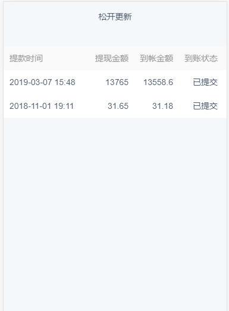

vue2.0 移动端，下拉刷新，上拉加载更多 封装组件
===

组件里：
```html
<template lang="html">
  <div class="yo-scroll"
  :class="{'down':(state===0),'up':(state==1),refresh:(state===2),touch:touching}"
  @touchstart="touchStart($event)"
  @touchmove="touchMove($event)"
  @touchend="touchEnd($event)"
  @scroll="(onInfinite || infiniteLoading) ? onScroll($event) : undefined">
    <section class="inner" :style="{ transform: 'translate3d(0, ' + top + 'px, 0)' }">
      <header class="pull-refresh">
        <slot name="pull-refresh">
           <span class="down-tip">下拉更新</span>
           <span class="up-tip">松开更新</span>
           <span class="refresh-tip">更新中……</span>
        </slot>
      </header>
      <slot></slot>
      <footer class="load-more">
        <slot name="load-more">
          <span>{{loadingText}}</span>
        </slot>
      </footer>
    </section>
  </div>
</template>
 
<script>
export default {
  name: 'kl-scroll',
  props: {
    offset: {
      type: Number,
      default: 40
    },
    loadingText: {
      type: String,
      default: '加载中...'
    },
    enableInfinite: {
      type: Boolean,
      default: true
    },
    enableRefresh: {
      type: Boolean,
      default: true
    },
    onRefresh: {
      type: Function,
      default: undefined,
      required: false
    },
    onInfinite: {
      type: Function,
      default: undefined,
      require: false
    }
  },
  data() {
    return {
      top: 0,
      state: 0,
      startY: 0,
      touching: false,
      infiniteLoading: false
    }
  },
  methods: {
    touchStart(e) {
      this.startY = e.targetTouches[0].pageY
      this.startScroll = this.$el.scrollTop || 0
      this.touching = true
    },
    touchMove(e) {
      if (!this.enableRefresh || this.$el.scrollTop > 0 || !this.touching) {
        return
      }
      let diff = e.targetTouches[0].pageY - this.startY - this.startScroll
      if (diff > 0) e.preventDefault()
      this.top = Math.pow(diff, 0.8) + (this.state === 2 ? this.offset : 0)
 
      if (this.state === 2) { // in refreshing
        return
      }
      if (this.top >= this.offset) {
        this.state = 1
      } else {
        this.state = 0
      }
    },
    touchEnd(e) {
      if (!this.enableRefresh) return
      this.touching = false
      if (this.state === 2) { // in refreshing
        this.state = 2
        this.top = this.offset
        return
      }
      if (this.top >= this.offset) { // do refresh
        this.refresh()
      } else { // cancel refresh
        this.state = 0
        this.top = 0
      }
    },
    refresh() {
      this.state = 2
      this.top = this.offset
      this.onRefresh(this.refreshDone)
    },
    refreshDone() {
      this.state = 0
      this.top = 0
      this.infiniteLoading = false
    },
 
    infinite() {
      this.infiniteLoading = true
      this.onInfinite(this.infiniteDone)
    },
 
    infiniteDone() {
      this.infiniteLoading = false
    },
 
    onScroll(e) {
      if (!this.enableInfinite || this.infiniteLoading) {
        return
      }
      let outerHeight = this.$el.clientHeight
      let innerHeight = this.$el.querySelector('.inner').clientHeight
      let scrollTop = this.$el.scrollTop
      let ptrHeight = this.onRefresh ? this.$el.querySelector('.pull-refresh').clientHeight : 0
      let infiniteHeight = this.$el.querySelector('.load-more').clientHeight
      let bottom = innerHeight - outerHeight - scrollTop - ptrHeight
      if (bottom < infiniteHeight) this.infinite()
    }
  }
}
</script>
<style >
.yo-scroll {
  position: absolute;
  /* top: 2.5rem;  */
   top: 0;
  right: 0;
  bottom: 0;
  left: 0;
  overflow: auto;
  -webkit-overflow-scrolling: touch;
  background-color: #f5f8fa;
}
.yo-scroll .inner {
  position: absolute;
  top: -2rem;
  width: 100%;
  transition-duration: 300ms;
}
.yo-scroll .pull-refresh {
  position: relative;
  left: 0;
  top: 0;
  width: 100%;
  height: 2rem;
  display: flex;
  align-items: center;
  justify-content: center;
}
.yo-scroll.touch .inner {
  transition-duration: 0ms;
}
.yo-scroll.down .down-tip {
  display: block;
}
.yo-scroll.up .up-tip {
  display: block;
}
.yo-scroll.refresh .refresh-tip {
  display: block;
}
.yo-scroll .down-tip,
.yo-scroll .refresh-tip,
.yo-scroll .up-tip {
  display: none;
}
.yo-scroll .load-more {
  height: 1rem;
  display: flex;
  align-items: center;
  justify-content: center;
}
</style>
```

然后

把上面组件拷贝一下，保存vue文件refresh.vue放到你的component/common文件夹下，  然后引入到页面 ,

下面是引用我的demo

```html
<template>
  <kl-scroll :on-refresh="onRefresh" :on-infinite="onInfinite" :loading-text="loadingText">
    <section class="app-body container">
      <div class="container top30r record-table">
        <div class="record-header">
          <span class="label-time">提款时间</span>
          <span class="label-withdraw-amount">提现金额</span>
          <span class="label-arrival-amount">到帐金额</span>
          <span class="label-status">到账状态</span>
        </div>
        <div class="record-body">
          <div class="record-body-row" v-for="(item,index) in records" :key="index">
            <span class="time">{{item._created_at}}</span>
            <span class="withdraw-amount">{{item.withdraw_amount}}</span>
            <span class="arrival-amount">{{item.arrival_amount}}</span>
            <span
              class="status"
              :class="item.status == withdrawStatus.arrival ? 'label-green' : ''"
            >{{item._status}}</span>
          </div>
        </div>
      </div>
    </section>
  </kl-scroll>
</template>

<script>
import api from "@/api";
import qs from "qs";
export default {
  name: "withdrawRecord",
  data() {
    return {
      withdrawStatus: {
        arrival: 1
      },
      records: [
        // {
        //   _created_at: "2019-03-07 15:20",
        //   withdraw_amount: "137854",
        //   arrival_amount: "13552.55",
        //   status: 1
        // }
      ],
      loadingText: "加载中...",
      page: 0, //当前页面
      num: 20, // 一次显示多少条
      listdata: [], // 下拉更新数据存放数组
      downdata: [] // 上拉更多的数据存放数组
    };
  },
  beforeCreate() {
    this.$loading.open();
  },
  mounted() {
    let vm = this;
    this.$nextTick(() => {
      vm.getList();
    });
  },
  methods: {
    onRefresh(done) {
      let _this = this;
      _this.counter = 1;
      _this.$el.querySelector(".load-more").style.display = "flex";
      _this.loadingText = "加载中……";
      _this.getList();
      done(); // call done
    },
    onInfinite(done) {
      let _this = this;
      let arr = [];
      for (var i = 0; i < 10; i++) {
        arr.push({
          _created_at: "2019-03-07 15:20",
          withdraw_amount: 155 + i,
          arrival_amount: "13552.55",
          status: 1,
          _status: "到賬"
        });
      }
      setTimeout(() => {
        _this.records = _this.records.concat(arr);
      }, 300);

      if (arr.length < _this.num) {
        _this.loadingText = "加载完毕……";
        //vm.$el.querySelector('.load-more').style.display = 'none';
        return;
      } else {
        _this.counter++;
      }
      done(); // call done
    },
    getList() {
      let _this = this;
      // let arr = [];
      // for (var i = 0; i < 40; i++) {
      //   arr.push({
      //     _created_at: "2019-03-07 15:20",
      //     withdraw_amount: 155 + i,
      //     arrival_amount: "13552.55",
      //     status: 1,
      //     _status: "到賬"
      //   });
      // }

      // _this.records = arr;
      // if (arr.length >= _this.num) {
      //   _this.counter++;
      // }
      let urlParams = {
        urlParams: {
          page: _this.page
        }
      };
      api.withdrawRecords(urlParams).then(res => {
        if (res.data) {
          let data = res.data.data;
          _this.records = data.records;
          if (_this.records.length == 0 || _this.records.length < _this.num) {
            _this.loadingText = "加载完毕……";
            _this.$el.querySelector(".load-more").style.display = "none";
          }
          _this.$loading.close();
        }
      });
    }
  }
};
</script>

<style lang="scss" scoped>
```

效果图

