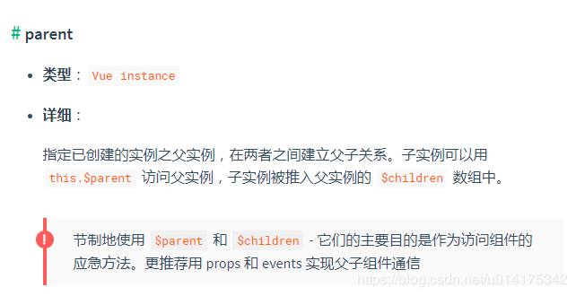

vue中8种组件通信方式
===
<!-- TOC -->

- [vue中8种组件通信方式](#vue中8种组件通信方式)
  - [一、props / $emit](#一props--emit)
    - [1. 父组件向子组件传值](#1-父组件向子组件传值)
    - [2. 子组件向父组件传值](#2-子组件向父组件传值)
  - [二、 $children / $parent](#二-children--parent)
  - [三、provide/ inject](#三provide-inject)
    - [概念:](#概念)
    - [举例验证](#举例验证)
  - [四、ref / refs](#四ref--refs)
  - [五、eventBus](#五eventbus)
  - [六、Vuex](#六vuex)
    - [1. Vuex介绍](#1-vuex介绍)
    - [2. Vuex各个模块](#2-vuex各个模块)
    - [3. Vuex实例应用](#3-vuex实例应用)
  - [七、 localStorage / sessionStorage](#七-localstorage--sessionstorage)
  - [八、 $attrs与 $listeners](#八-attrs与-listeners)
  - [总结](#总结)

<!-- /TOC -->

## 一、props / $emit
父组件通过 `props` 的方式向子组件传递数据，而通过 `$emit` 子组件可以向父组件通信。

### 1. 父组件向子组件传值
下面通过一个例子说明父组件如何向子组件传递数据：在子组件`article.vue`中如何获取父组件`section.vue`中的数据`articles:['红楼梦', '西游记','三国演义']`

```js
// section父组件
<template>
  <div class="section">
    <com-article :articles="articleList"></com-article>
  </div>
</template>

<script>
import comArticle from './test/article.vue'
export default {
  name: 'HelloWorld',
  components: { comArticle },
  data() {
    return {
      articleList: ['红楼梦', '西游记', '三国演义']
    }
  }
}
</script>
```

```js
// 子组件 article.vue
<template>
  <div>
    <span v-for="(item, index) in articles" :key="index">{{item}}</span>
  </div>
</template>

<script>
export default {
  props: ['articles']
}
</script>
```

总结: prop 只可以从上一级组件传递到下一级组件（父子组件），即所谓的单向数据流。而且 prop 只读，不可被修改，所有修改都会失效并警告。


### 2. 子组件向父组件传值
对于`$emit` 我自己的理解是这样的: `$emit`绑定一个自定义事件, 当这个语句被执行时, 就会将参数arg传递给父组件,父组件通过v-on监听并接收参数。 通过一个例子，说明子组件如何向父组件传递数据。
在上个例子的基础上, 点击页面渲染出来的`ariticle`的`item`, 父组件中显示在数组中的下标

```js
// 父组件中
<template>
  <div class="section">
    <com-article :articles="articleList" @onEmitIndex="onEmitIndex"></com-article>
    <p>{{currentIndex}}</p>
  </div>
</template>

<script>
import comArticle from './test/article.vue'
export default {
  name: 'HelloWorld',
  components: { comArticle },
  data() {
    return {
      currentIndex: -1,
      articleList: ['红楼梦', '西游记', '三国演义']
    }
  },
  methods: {
    onEmitIndex(idx) {
      this.currentIndex = idx
    }
  }
}
</script>
```

```js
<template>
  <div>
    <div v-for="(item, index) in articles" :key="index" @click="emitIndex(index)">{{item}}</div>
  </div>
</template>

<script>
export default {
  props: ['articles'],
  methods: {
    emitIndex(index) {
      this.$emit('onEmitIndex', index)
    }
  }
}
</script>
```

## 二、 $children / $parent


上面这张图片是vue官方的解释，通过`$parent`和`$children`就可以访问组件的实例，拿到实例代表什么？代表可以访问此组件的所有方法和data。接下来就是怎么实现拿到指定组件的实例。

使用方法
```js
// 父组件中
<template>
  <div class="hello_world">
    <div>{{msg}}</div>
    <com-a></com-a>
    <button @click="changeA">点击改变子组件值</button>
  </div>
</template>

<script>
import ComA from './test/comA.vue'
export default {
  name: 'HelloWorld',
  components: { ComA },
  data() {
    return {
      msg: 'Welcome'
    }
  },

  methods: {
    changeA() {
      // 获取到子组件A
      this.$children[0].messageA = 'this is new value'
    }
  }
}
</script>
```

```js
// 子组件中
<template>
  <div class="com_a">
    <span>{{messageA}}</span>
    <p>获取父组件的值为:  {{parentVal}}</p>
  </div>
</template>

<script>
export default {
  data() {
    return {
      messageA: 'this is old'
    }
  },
  computed:{
    parentVal(){
      return this.$parent.msg;
    }
  }
}
</script>
```

> 要注意边界情况，如在`#app`上拿`$parent`得到的是`new Vue()`的实例，在这实例上再拿`$parent`得到的是`undefined`，而在最底层的子组件拿`$children`是个空数组。也要注意得到`$parent`和`$children`的值不一样，`$children` 的值是数组，而`$parent`是个对象

总结: 上面两种方式用于父子组件之间的通信， 而使用props进行父子组件通信更加普遍; 二者皆不能用于非父子组件之间的通信。


## 三、provide/ inject
### 概念:
`provide`/ `inject` 是`vue2.2.0`新增的api, 简单来说就是父组件中通过`provide`来提供变量, 然后再子组件中通过`inject`来注入变量。

> 注意: 这里不论子组件嵌套有多深, 只要调用了`inject` 那么就可以注入`provide`中的数据，而不局限于只能从当前父组件的`props`属性中回去数据

### 举例验证
接下来就用一个例子来验证上面的描述:  
假设有三个组件: A.vue、B.vue、C.vue 其中 C是B的子组件，B是A的子组件

```js
// A.vue

<template>
  <div>
    <comB></comB>
  </div>
</template>

<script>
  import comB from '../components/test/comB.vue'
  export default {
    name: "A",
    provide: {
      for: "demo"
    },
    components:{
      comB
    }
  }
</script>
```

```js
// B.vue

<template>
  <div>
    {{demo}}
    <comC></comC>
  </div>
</template>

<script>
  import comC from '../components/test/comC.vue'
  export default {
    name: "B",
    inject: ['for'],
    data() {
      return {
        demo: this.for
      }
    },
    components: {
      comC
    }
  }
</script>
```

```js
// C.vue
<template>
  <div>
    {{demo}}
  </div>
</template>

<script>
  export default {
    name: "C",
    inject: ['for'],
    data() {
      return {
        demo: this.for
      }
    }
  }
</script>
```

## 四、ref / refs
`ref`：如果在普通的 DOM 元素上使用，引用指向的就是 DOM 元素；如果用在子组件上，引用就指向组件实例，可以通过实例直接调用组件的方法或访问数据， 我们看一个`ref` 来访问组件的例子:

```js
// 子组件 A.vue

export default {
  data () {
    return {
      name: 'Vue.js'
    }
  },
  methods: {
    sayHello () {
      console.log('hello')
    }
  }
}
```

```js
// 父组件 app.vue

<template>
  <component-a ref="comA"></component-a>
</template>
<script>
  export default {
    mounted () {
      const comA = this.$refs.comA;
      console.log(comA.name);  // Vue.js
      comA.sayHello();  // hello
    }
  }
</script>
```

## 五、eventBus
`eventBus` 又称为事件总线，在vue中可以使用它来作为沟通桥梁的概念, 就像是所有组件共用相同的事件中心，可以向该中心注册发送事件或接收事件， 所以组件都可以通知其他组件。

> eventBus也有不方便之处, 当项目较大,就容易造成难以维护的灾难

在Vue的项目中怎么使用eventBus来实现组件之间的数据通信呢?具体通过下面几个步骤

1. 初始化  
    首先需要创建一个事件总线并将其导出, 以便其他模块可以使用或者监听它.
    ```js
    // event-bus.js

    import Vue from 'vue'
    export const EventBus = new Vue()
    ```

2. 发送事件
    假设你有两个组件: `additionNum` 和 `showNum`, 这两个组件可以是兄弟组件也可以是父子组件；这里我们以兄弟组件为例:
    ```js
    <template>
      <div>
        <show-num-com></show-num-com>
        <addition-num-com></addition-num-com>
      </div>
    </template>

    <script>
    import showNumCom from './showNum.vue'
    import additionNumCom from './additionNum.vue'
    export default {
      components: { showNumCom, additionNumCom }
    }
    </script>
    ```

    ```js
    // addtionNum.vue 中发送事件

    <template>
      <div>
        <button @click="additionHandle">+加法器</button>    
      </div>
    </template>

    <script>
    import {EventBus} from './event-bus.js'
    console.log(EventBus)
    export default {
      data(){
        return{
          num:1
        }
      },

      methods:{
        additionHandle(){
          EventBus.$emit('addition', {
            num:this.num++
          })
        }
      }
    }
    </script>
    ```

3. 接收事件
    ```js
    // showNum.vue 中接收事件

    <template>
      <div>计算和: {{count}}</div>
    </template>

    <script>
    import { EventBus } from './event-bus.js'
    export default {
      data() {
        return {
          count: 0
        }
      },

      mounted() {
        EventBus.$on('addition', param => {
          this.count = this.count + param.num;
        })
      }
    }
    </script>
    ```
    这样就实现了在组件`addtionNum.vue`中点击相加按钮, 在`showNum.vue`中利用传递来的 `num` 展示求和的结果.

4. 移除事件监听者
    如果想移除事件的监听, 可以像下面这样操作:
    ```js
    import { eventBus } from 'event-bus.js'
    EventBus.$off('addition', {})
    ```

## 六、Vuex
### 1. Vuex介绍
Vuex 是一个专为 Vue.js 应用程序开发的状态管理模式。它采用集中式存储管理应用的所有组件的状态，并以相应的规则保证状态以一种可预测的方式发生变化.

Vuex 解决了`多个视图依赖于同一状态`和`来自不同视图的行为需要变更同一状态`的问题，将开发者的精力聚焦于数据的更新而不是数据在组件之间的传递上

### 2. Vuex各个模块
1. `state`：用于数据的存储，是store中的唯一数据源
2. `getters`：如vue中的计算属性一样，基于state数据的二次包装，常用于数据的筛选和多个数据的相关性计算
3. `mutations`：类似函数，改变state数据的唯一途径，且不能用于处理异步事件
4. `actions`：类似于mutation，用于提交mutation来改变状态，而不直接变更状态，可以包含任意异步操作
5. `modules`：类似于命名空间，用于项目中将各个模块的状态分开定义和操作，便于维护

### 3. Vuex实例应用
```js
// 父组件

<template>
  <div id="app">
    <ChildA/>
    <ChildB/>
  </div>
</template>

<script>
  import ChildA from './components/ChildA' // 导入A组件
  import ChildB from './components/ChildB' // 导入B组件

  export default {
    name: 'App',
    components: {ChildA, ChildB} // 注册A、B组件
  }
</script>
```

```js
// 子组件childA

<template>
  <div id="childA">
    <h1>我是A组件</h1>
    <button @click="transform">点我让B组件接收到数据</button>
    <p>因为你点了B，所以我的信息发生了变化：{{BMessage}}</p>
  </div>
</template>

<script>
  export default {
    data() {
      return {
        AMessage: 'Hello，B组件，我是A组件'
      }
    },
    computed: {
      BMessage() {
        // 这里存储从store里获取的B组件的数据
        return this.$store.state.BMsg
      }
    },
    methods: {
      transform() {
        // 触发receiveAMsg，将A组件的数据存放到store里去
        this.$store.commit('receiveAMsg', {
          AMsg: this.AMessage
        })
      }
    }
  }
</script>
```

```js
// 子组件 childB

<template>
  <div id="childB">
    <h1>我是B组件</h1>
    <button @click="transform">点我让A组件接收到数据</button>
    <p>因为你点了A，所以我的信息发生了变化：{{AMessage}}</p>
  </div>
</template>

<script>
  export default {
    data() {
      return {
        BMessage: 'Hello，A组件，我是B组件'
      }
    },
    computed: {
      AMessage() {
        // 这里存储从store里获取的A组件的数据
        return this.$store.state.AMsg
      }
    },
    methods: {
      transform() {
        // 触发receiveBMsg，将B组件的数据存放到store里去
        this.$store.commit('receiveBMsg', {
          BMsg: this.BMessage
        })
      }
    }
  }
</script>
```

**vuex的store.js**

```js
import Vue from 'vue'
import Vuex from 'vuex'
Vue.use(Vuex)
const state = {
  // 初始化A和B组件的数据，等待获取
  AMsg: '',
  BMsg: ''
}

const mutations = {
  receiveAMsg(state, payload) {
    // 将A组件的数据存放于state
    state.AMsg = payload.AMsg
  },
  receiveBMsg(state, payload) {
    // 将B组件的数据存放于state
    state.BMsg = payload.BMsg
  }
}

export default new Vuex.Store({
  state,
  mutations
})
```

## 七、 localStorage / sessionStorage
这种通信比较简单,缺点是数据和状态比较混乱,不太容易维护。

通过`window.localStorage.getItem(key)` 获取数据

通过`window.localStorage.setItem(key,value)` 存储数据

> 注意用JSON.parse() / JSON.stringify() 做数据格式转换  
> localStorage / sessionStorage可以结合vuex, 实现数据的持久保存,同时使用vuex解决数据和状态混乱问题.


## 八、 $attrs与 $listeners
现在我们来讨论一种情况， 我们一开始给出的组件关系图中A组件与D组件是隔代关系， 那它们之前进行通信有哪些方式呢？
1. 使用props绑定来进行一级一级的信息传递, 如果D组件中状态改变需要传递数据给A, 使用事件系统一级级往上传递
2. 使用eventBus,这种情况下还是比较适合使用, 但是碰到多人合作开发时, 代码维护性较低, 可读性也低
3. 使用Vuex来进行数据管理, 但是如果仅仅是传递数据, 而不做中间处理,使用Vuex处理感觉有点大材小用了.

在`vue2.4`中，为了解决该需求，引入了`$attrs` 和`$listeners` ， 新增了`inheritAttrs` 选项。 在版本2.4以前，默认情况下,父作用域中不作为 prop 被识别 (且获取) 的特性绑定 (class 和 style 除外)，将会“回退”且作为普通的HTML特性应用在子组件的根元素上。接下来看一个跨级通信的例子:

```js
// app.vue
// index.vue

<template>
  <div>
    <child-com1
      :name="name"
      :age="age"
      :gender="gender"
      :height="height"
      title="程序员成长指北"
    ></child-com1>
  </div>
</template>
<script>
const childCom1 = () => import("./childCom1.vue");
export default {
  components: { childCom1 },
  data() {
    return {
      name: "zhang",
      age: "18",
      gender: "女",
      height: "158"
    };
  }
};
</script>
```

```js
// childCom1.vue

<template class="border">
  <div>
    <p>name: {{ name}}</p>
    <p>childCom1的$attrs: {{ $attrs }}</p>
    <child-com2 v-bind="$attrs"></child-com2>
  </div>
</template>
<script>
const childCom2 = () => import("./childCom2.vue");
export default {
  components: {
    childCom2
  },
  inheritAttrs: false, // 可以关闭自动挂载到组件根元素上的没有在props声明的属性
  props: {
    name: String // name作为props属性绑定
  },
  created() {
    console.log(this.$attrs);
     // { "age": "18", "gender": "女", "height": "158", "title": "程序员成长指北" }
  }
};
</script>
```

```js
// childCom2.vue

<template>
  <div class="border">
    <p>age: {{ age}}</p>
    <p>childCom2: {{ $attrs }}</p>
  </div>
</template>
<script>

export default {
  inheritAttrs: false,
  props: {
    age: String
  },
  created() {
    console.log(this.$attrs); 
    // { "gender": "女", "height": "158", "title": "程序员成长指北" }
  }
};
</script>
```

## 总结
常见使用场景可以分为三类:
- 父子组件通信: `props`; `$parent / $children`; `provide / inject` ; `ref` ; `$attrs / $listeners`
- 兄弟组件通信: `eventBus` ; `vuex`
- 跨级通信: `eventBus`；`Vuex`；`provide / inject` 、`$attrs / $listeners`
