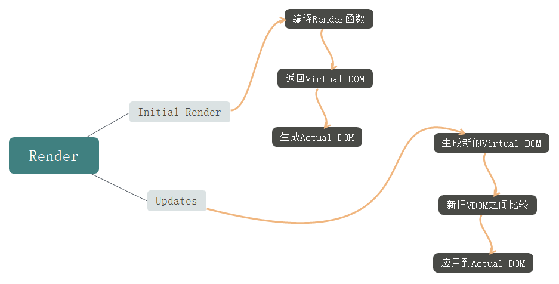

Vue 进阶系列（三）之Render函数原理及实现
===
<!-- TOC -->

- [Render函数原理](#render函数原理)
- [Actual DOM 和 Virtual DOM](#actual-dom-和-virtual-dom)
- [JSX和Template](#jsx和template)
- [实例1：实现example组件](#实例1实现example组件)
- [实例2：实现动态的<example>组件](#实例2实现动态的example组件)
- [实例3：实现组件](#实例3实现组件)

<!-- /TOC -->

## Render函数原理
根据第一篇文章介绍的响应式原理，如下图所示。


在初始化阶段，本质上发生在auto run函数中，然后通过render函数生成Virtual DOM，view根据Virtual DOM生成Actual DOM。因为render函数依赖于页面上所有的数据data，并且这些数据是响应式的，所有的数据作为组件render函数的依赖。一旦这些数据有所改变，那么render函数会被重新调用。

在更新阶段，render函数会重新调用并且返回一个新的Virtual Dom，新旧Virtual DOM之间会进行比较，把diff之后的最小改动应用到Actual DOM中。

Watcher负责收集依赖，清除依赖和通知依赖。在大型复杂的组件树结构下，由于采用了精确的依赖追踪系统，所以会避免组件的过度渲染。




## Actual DOM 和 Virtual DOM
Actual DOM 通过document.createElement('div')生成一个DOM节点。

```js
document.createElement('div')

// 浏览器原生对象（开销大）
"[object HTMLDivElement]"
```

`Virtual DOM` 通过 `vm.$createElement('div')`生成一个JS对象，VDOM对象有一个表示div的tag属性，有一个包含了所有可能特性的data属性，可能还有一个包含更多虚拟节点的children列表。

```js
vm.$createElement('div')

// 纯JS对象（轻量）
{ tag: 'div', data: { attrs: {}, ...}, children: [] }
```

因为Virtual DOM的渲染逻辑和Actual DOM解耦了，所以有能力运行在的非浏览器环境中，这就是为什么Virtual DOM出现之后混合开发开始流行的原因，React Native 和 Weex能够实现的原理就是这个。


## JSX和Template
JSX和Template都是用于声明DOM和state之间关系的一种方式，在Vue中，Template是默认推荐的方式，但是也可以使用JSX来做更灵活的事。

JSX更加动态化，对于使用编程语言是很有帮助的，可以做任何事，但是动态化使得编译优化更加复杂和困难。

Template更加静态化并且对于表达式有更多约束，但是可以快速复用已经存在的模板，模板约束意味着可以在编译时做更多的性能优化，相对于JSX在编译时间上有着更多优势。

## 实例1：实现example组件
要求使用如下
```js
<example :tags="['h1', 'h2', 'h3']"></example>
```

要求输出如下
```html
<div>
  <h1>0</h1>
  <h2>1</h2>
  <h3>2</h3>
</div>
```

上面这个需求可以通过`render`函数来做，官方提供了`createElement` 函数用来生成模板。`createElement('div', {}， [...])`可接受的参数如下。

```js
// @returns {VNode}
createElement(
  // {String | Object | Function}
  // 一个 HTML 标签字符串，组件选项对象，或者
  // 解析上述任何一种的一个 async 异步函数。必需参数。
  'div',

  // {Object}
  // 一个包含模板相关属性的数据对象
  // 你可以在 template 中使用这些特性。可选参数。
  {
    
  },

  // {String | Array}
  // 子虚拟节点 (VNodes)，由 `createElement()` 构建而成，
  // 也可以使用字符串来生成“文本虚拟节点”。可选参数。
  [
    '先写一些文字',
    createElement('h1', '一则头条'),
    createElement(MyComponent, {
      props: {
        someProp: 'foobar'
      }
    })
  ]
)
```

知道了用法之后，就可以在`render`中返回`createElement`生成的虚拟节点，外层是div，内层是三个锚点标题`h1 h2 h3`，所以内层需要遍历下，使用两个`createElement`就可以完成了。

通常使用`h`作为`createElement`的别名，这是`Vue`的通用惯例，也是`JSX`的要求。

实现如下
```html
<!--引用-->
<script src="../node_modules/vue/dist/vue.js"></script>

<!--定义template -->
<div id="app">
  <example :tags="['h1', 'h2', 'h3']"></example>
</div>

<script>
    // 定义example组件
    Vue.component('example', {
      props: ['tags'],
      render (h) {
        
        // 第二个参数是一个包含模板相关属性的数据对象，可选参数
        
        // 子虚拟节点（VNodes）参数可以传入字符串或者数字，
        // 通过createElement生成，可选参数
        return h('div', this.tags.map((tag, i) => h(tag, i)))
      }
    })
    
    // 实例化
    new Vue({ el: '#app' })
</script>
```

## 实例2：实现动态的<example>组件
要求如下
- 实现一个`Foo`组件渲染`<div>foo</div>`，实现一个Bar组件渲染`<div>bar</div>`。
- 实现一个`<example>`组件，根据属性ok动态渲染Foo组件或者Bar组件。如果属性ok是true，那么最终的渲染应该是`<div>foo</div>`。
- 实现一个按钮控制属性ok，通过这个属性让`<example>`在Foo或者Bar之间切换。
根据上面的要求，在模板中调用`<example>`组件，然后定义`<button>`组件，同时绑定属性ok。

实现如下
```html
<!--引用-->
<script src="../node_modules/vue/dist/vue.js"></script>

<!--定义template -->
<div id="app">

  <!--绑定属性ok-->
  <example :ok="ok"></example>
  
  <!--绑定点击事件-->
  <button @click="ok = !ok">toggle</button>
</div>

<script>
    // 定义Foo
    const Foo = {
      render (h) {
        return h('div', 'foo')
      }
    }
    
    // 定义Bar
    const Bar = {
      render (h) {
        return h('div', 'bar')
      }
    }
    
    // 定义example组件
    // 根据ok属性动态切换
    Vue.component('example', {
      props: ['ok'],
      render (h) {
        return h(this.ok ? Foo : Bar)
      }
    })
    
    // 实例化
    new Vue({
      el: '#app',
      data: { ok: true }
    })
</script>
```


## 实例3：实现组件
要求如下
- 实现一个`withAvatarURL`函数，要求传入一个带有`url`属性的组件，返回一个接收`username`属性的高阶组件，这个高阶组件主要负责获取相应的头像URL。
- 在API返回之前，高阶组件将占位符URL `http://via.placeholder.com/200x200`传递给内部组件。

例子如下
```js
const SmartAvatar = withAvatarURL(Avatar)

// 使用这个方式
<smart-avatar username="vuejs"></smart-avatar>

// 替换下面的方式
<avatar url="/path/to/image.png"></avatar>
```

`withAvatarURL`函数返回一个对象，接收username属性，在生命周期created获取头像URL。Avatar对象接收src属性，src的内容从`withAvatarURL`中获取，然后展示在上。实例化的时候，传入新定义的组件名SmartAvatar。

实现如下

```html
<!--引用-->
<script src="../node_modules/vue/dist/vue.js"></script>

<!--定义template-->
<div id="app">
  <smart-avatar username="vuejs"></smart-avatar>
</div>

<script>
    // 获取头像URL
    function fetchURL (username, cb) {
      setTimeout(() => {
        // 获取头像并回传
        cb('https://avatars3.githubusercontent.com/u/6128107?v=4&s=200')
      }, 500)
    }
    
    // 传递的InnerComponent
    const Avatar = {
      props: ['src'],
      template: ``
    }
    
    function withAvatarURL (InnerComponent) {
      return {
        props: ['username'],
        inheritAttrs: false, // 2.4 only，组件将不会把未被注册的props呈现为普通的HTML属性
        data () {
          return { url: null }
        },
        created () {
          // 获取头像URL并回传给this.url
          fetchURL(this.username, url => {
            this.url = url
          })
        },
        render (h) {
          return h(InnerComponent, {
            attrs: this.$attrs, // 2.4 only，获取到没有使用的注册属性
            props: {
              src: this.url || 'http://via.placeholder.com/200x200'
            }
          })
        }
      }
    }
    
    const SmartAvatar = withAvatarURL(Avatar)
    
    // 实例化，新构造组件名为SmartAvatar或smart-avatar
    new Vue({
      el: '#app',
      components: { SmartAvatar }
    })
</script>
```