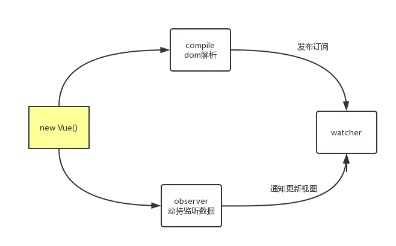

# 撸一个简单的Vue

<!-- TOC -->

- [撸一个简单的Vue](#撸一个简单的Vue)
  - [内部的原理实现一个简单的vue](#内部的原理实现一个简单的vue)
    - [Object.defineProperty()](#ObjectdefineProperty)
    - [流程图](#流程图)
    - [html代码结构](#html代码结构)
    - [js调用](#js调用)
    - [Vue结构](#Vue结构)
      - [Vue constructor 初始化](#Vue-constructor-初始化)
      - [proxyData 代理data](#proxyData-代理data)
      - [observer 劫持监听](#observer-劫持监听)
      - [compile 解析dom](#compile-解析dom)
      - [Watcher](#Watcher)
    - [完整代码](#完整代码)

<!-- /TOC -->

## 内部的原理实现一个简单的vue

### Object.defineProperty()
因为vue主要是通过数据劫持来实现的，通过get、set来完成数据的读取和更新。
```js
var obj = {name:'wclimb'}
var age = 24
Object.defineProperty(obj,'age',{
    enumerable: true, // 可枚举
    configurable: false, // 不能再define
    get () {
        return age
    },
    set (newVal) {
        console.log('我改变了',age +' -> '+newVal);
        age = newVal
    }
})

> obj.age
> 24

> obj.age = 25;
> 我改变了 24 -> 25
> 25
```
从上面可以看到通过`get`获取数据，通过`set`监听到数据变化执行相应操作

### 流程图


### html代码结构
```html
<div id="wrap">
    <p v-html="test"></p>
    <input type="text" v-model="form">
    <input type="text" v-model="form">
    <button @click="changeValue">改变值</button>
    {{form}}
</div>
```

### js调用
```js
new Vue({
    el: '#wrap',
    data:{
        form: '这是form的值',
        test: '<strong>我是粗体</strong>',
    },
    methods:{
        changeValue(){
            console.log(this.form)
            this.form = '值被我改变了，气不气？'
        }
    }
})
```

### Vue结构
```js
class Vue{
    constructor(){}
    proxyData(){}
    observer(){}
    compile(){}
    compileText(){}
}
class Watcher{
    constructor(){}
    update(){}
}
```
* `Vue constructor` 构造函数主要是数据的初始化
* `proxyData` 数据代理
* `observer` 劫持监听所有数据
* `compile` 解析dom
* `compileText` 解析dom里处理纯双花括号的操作
* `Watcher` 更新视图操作

#### Vue constructor 初始化
```js
class Vue{
    constructor(options = {}){
        this.$el = document.querySelector(options.el);
        let data = this.data = options.data; 
        // 代理data，使其能直接this.xxx的方式访问data，正常的话需要this.data.xxx
        Object.keys(data).forEach((key)=> {
            this.proxyData(key);
        });
        this.methods = options.methods // 事件方法
        this.watcherTask = {}; // 需要监听的任务列表
        this.observer(data); // 初始化劫持监听所有数据
        this.compile(this.$el); // 解析dom
    }
}
```
上面主要是初始化操作，针对传过来的数据进行处理

#### proxyData 代理data
```js
class Vue{
        constructor(options = {}){
            ......
        }
        proxyData(key){
            let that = this;
            Object.defineProperty(that, key, {
                configurable: false,
                enumerable: true,
                get () {
                    return that.data[key];
                },
                set (newVal) {
                    that.data[key] = newVal;
                }
            });
        }
    }
```
上面主要是代理`data`到最上层，`this.xxx`的方式直接访问`data`

#### observer 劫持监听
```js
class Vue{
        constructor(options = {}){
            ......
        }
        proxyData(key){
            ......
        }
        observer(data){
            let that = this
            Object.keys(data).forEach(key=>{
                let value = data[key]
                this.watcherTask[key] = []
                Object.defineProperty(data,key,{
                    configurable: false,
                    enumerable: true,
                    get(){
                        return value
                    },
                    set(newValue){
                        if(newValue !== value){
                            value = newValue
                            that.watcherTask[key].forEach(task => {
                                task.update()
                            })
                        }
                    }
                })
            })
        }
    }
```
同样是使用**Object.defineProperty**来监听数据，初始化需要订阅的数据。  

把需要订阅的数据到`push`到`watcherTask`里，等到时候需要更新的时候就可以批量更新数据了下面就是；

遍历订阅池，批量更新视图。
```js
set(newValue){
    if(newValue !== value){
        value = newValue
        // 批量更新视图
        that.watcherTask[key].forEach(task => {
            task.update()
        })
    }
}
```

#### compile 解析dom
```js
class Vue{
        constructor(options = {}){
            ......
        }
        proxyData(key){
            ......
        }
        observer(data){
            ......
        }
        compile(el){
            var nodes = el.childNodes;
            for (let i = 0; i < nodes.length; i++) {
                const node = nodes[i];
                if(node.nodeType === 3){
                    var text = node.textContent.trim();
                    if (!text) continue;
                    this.compileText(node,'textContent')                
                }else if(node.nodeType === 1){
                    if(node.childNodes.length > 0){
                        this.compile(node)
                    }
                    if(node.hasAttribute('v-model') && (node.tagName === 'INPUT' || node.tagName === 'TEXTAREA')){
                        node.addEventListener('input',(()=>{
                            let attrVal = node.getAttribute('v-model')
                            this.watcherTask[attrVal].push(new Watcher(node,this,attrVal,'value'))
                            node.removeAttribute('v-model')
                            return () => {
                                this.data[attrVal] = node.value
                            }
                        })())
                    }
                    if(node.hasAttribute('v-html')){
                        let attrVal = node.getAttribute('v-html');
                        this.watcherTask[attrVal].push(new Watcher(node,this,attrVal,'innerHTML'))
                        node.removeAttribute('v-html')
                    }
                    this.compileText(node,'innerHTML')
                    if(node.hasAttribute('@click')){
                        let attrVal = node.getAttribute('@click')
                        node.removeAttribute('@click')
                        node.addEventListener('click',e => {
                            this.methods[attrVal] && this.methods[attrVal].bind(this)()
                        })
                    }
                }
            }
        },
        compileText(node,type){
            let reg = /\{\{(.*?)\}\}/g, txt = node.textContent;
            if(reg.test(txt)){
                node.textContent = txt.replace(reg,(matched,value)=>{
                    let tpl = this.watcherTask[value] || []
                    tpl.push(new Watcher(node,this,value,type))
                    if(value.split('.').length > 1){
                        let v = null
                        value.split('.').forEach((val,i)=>{
                            v = !v ? this[val] : v[val]
                        })
                        return v
                    }else{
                        return this[value]
                    }
                })
            }
        }
    }
```

首先我们先遍历`el`元素下面的所有子节点，`node.nodeType === 3` 的意思是当前元素是文本节点，`node.nodeType === 1` 的意思是当前元素是元素节点。因为可能有的是纯文本的形式，如`纯双花括号`就是纯文本的文本节点，然后通过判断元素节点是否还存在子节点，如果有的话就递归调用`compile`方法。下面重头戏来了，我们拆开看：
```js
if(node.hasAttribute('v-html')){
    let attrVal = node.getAttribute('v-html');
    this.watcherTask[attrVal].push(new Watcher(node,this,attrVal,'innerHTML'))
    node.removeAttribute('v-html')
}
```
上面这个首先判断node节点上是否有`v-html`这种指令，如果存在的话，我们就发布订阅，怎么发布订阅呢？只需要把当前需要订阅的数据`push`到`watcherTask`里面，然后到时候在设置值的时候就可以批量更新了，实现双向数据绑定，也就是下面的操作
```js
that.watcherTask[key].forEach(task => {
    task.update()
})
```
然后`push`的值是一个`Watcher`的实例，首先他new的时候会先执行一次，执行的操作就是去把`纯双花括号` -> 1，也就是说把我们写好的模板数据更新到模板视图上。 

最后把当前元素属性剔除出去，我们用`Vue`的时候也是看不到这种指令的，不剔除也不影响

至于`Watcher`是什么，看下面就知道了

#### Watcher
```js
class Watcher{
    constructor(el,vm,value,type){
        this.el = el;
        this.vm = vm;
        this.value = value;
        this.type = type;
        this.update()
    }
    update(){
        this.el[this.type] = this.vm.data[this.value]
    }
}
```

之前发布订阅之后走了这里面的操作，意思就是把当前元素如：node.innerHTML = ‘这是data里面的值’、node.value = ‘这个是表单的数据’

那么我们为什么不直接去更新呢，还需要`update`做什么，不是多此一举吗？

其实`update`记得吗？我们在订阅池里面需要批量更新，就是通过调用`Watcher`原型上的`update`方法。

### 完整代码
- **index.js**
```js
class Vue{
    constructor(options = {}){
        this.$el = document.querySelector(options.el);
        let data = this.data = options.data; 
        // 代理data，使其能直接this.xxx的方式访问data，正常的话需要this.data.xxx
        Object.keys(data).forEach((key)=> {
            this.proxyData(key);
        });
        this.methods = options.methods // 事件方法
        this.watcherTask = {}; // 需要监听的任务列表
        this.observer(data); // 初始化劫持监听所有数据
        this.compile(this.$el); // 解析dom
    }
    proxyData(key){
        let that = this;
        Object.defineProperty(that, key, {
            configurable: false,
            enumerable: true,
            get () {
                return that.data[key];
            },
            set (newVal) {
                that.data[key] = newVal;
            }
        });
    }
    observer(data){
        let that = this
        Object.keys(data).forEach(key=>{
            let value = data[key]
            this.watcherTask[key] = []
            Object.defineProperty(data,key,{
                configurable: false,
                enumerable: true,
                get(){
                    return value
                },
                set(newValue){
                    if(newValue !== value){
                        value = newValue
                        that.watcherTask[key].forEach(task => {
                            task.update()
                        })
                    }
                }
            })
        })
    }
    compile(el){
        var nodes = el.childNodes;
        for (let i = 0; i < nodes.length; i++) {
            const node = nodes[i];
            if(node.nodeType === 3){
                var text = node.textContent.trim();
                if (!text) continue;
                this.compileText(node,'textContent')                
            }else if(node.nodeType === 1){
                if(node.childNodes.length > 0){
                    this.compile(node)
                }
                if(node.hasAttribute('v-model') && (node.tagName === 'INPUT' || node.tagName === 'TEXTAREA')){
                    node.addEventListener('input',(()=>{
                        let attrVal = node.getAttribute('v-model')
                        this.watcherTask[attrVal].push(new Watcher(node,this,attrVal,'value'))
                        node.removeAttribute('v-model')
                        return () => {
                            this.data[attrVal] = node.value
                        }
                    })())
                }
                if(node.hasAttribute('v-html')){
                    let attrVal = node.getAttribute('v-html');
                    this.watcherTask[attrVal].push(new Watcher(node,this,attrVal,'innerHTML'))
                    node.removeAttribute('v-html')
                }
                this.compileText(node,'innerHTML')
                if(node.hasAttribute('@click')){
                    let attrVal = node.getAttribute('@click')
                    node.removeAttribute('@click')
                    node.addEventListener('click',e => {
                        this.methods[attrVal] && this.methods[attrVal].bind(this)()
                    })
                }
            }
        }
    }
    compileText(node,type){
        let reg = /\{\{(.*?)\}\}/g, txt = node.textContent;
        if(reg.test(txt)){
            node.textContent = txt.replace(reg,(matched,value)=>{
                let tpl = this.watcherTask[value] || []
                tpl.push(new Watcher(node,this,value,type))
                if(value.split('.').length > 1){
                    let v = null
                    value.split('.').forEach((val,i)=>{
                        v = !v ? this[val] : v[val]
                    })
                    return v
                }else{
                    return this[value]
                }
            })
        }
    }
}

class Watcher{
    constructor(el,vm,value,type){
        this.el = el;
        this.vm = vm;
        this.value = value;
        this.type = type;
        this.update()
    }
    update(){       
        this.el[this.type] = this.vm.data[this.value]
    }
}
```

- **index.html**
```html
<!DOCTYPE html>
<html lang="en">
<head>
    <meta charset="UTF-8">
    <meta name="viewport" content="width=device-width, initial-scale=1.0">
    <meta http-equiv="X-UA-Compatible" content="ie=edge">
    <title>MyVue</title>
</head>
<body>
    <div id="wrap">
        {{obj.test}}
        <p v-html="test"></p>
        <input type="text" v-model="form">
        <input type="text" v-model="form">
        <button @click="changeValue">改变值</button>
        {{form}} 
    </div>
    <script src="./index.js"></script>
    <script>
        new Vue({
            el: '#wrap',
            data:{
                form: '这是form的值',
                test: '<strong>我是粗体</strong>',
                obj:{
                    test:123
                }
            },
            methods:{
                changeValue(){
                    console.log(this.form)
                    this.form = '值被我改变了，气不气？'
                }
            }
        })
    </script>
</body>
</html>
```