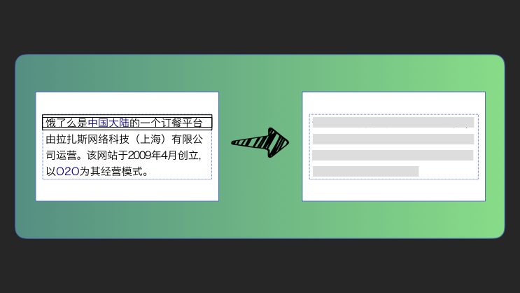

一种自动化生成骨架屏的方案
===

## 首屏加载状态演进
通常方案，我们会在首屏、或者获取数据时，在页面中展现一个进度条，或者转动的 Spinner。
- 进度条：明确知道交互所需时间，或者知道一个大概值的时候我们选择使用进度条。
- Spinner：无法预测获取数据、或者打开页面的时长。

有了进度条或者 Spinner，至少告诉了用户两点内容：
- 你所进行的操作需要等待一段时间。
- 其次，安抚用户，让其耐心等待。


## 如何构建骨架屏
下面我将通过 [page-skeleton-webpack-plugin](https://link.zhihu.com/?target=https%3A//www.npmjs.com/package/page-skeleton-webpack-plugin) 工具中的代码，来展示骨架屏的具体生成过程。

我们将页面分成了不同的块：
- **文本块**：仅包含文本节点（NodeType 为 Node.TEXT_NODE）的元素（NodeType 为 Node.ELEMENT_NODE），一个文本块可能是一个 p 元素也可能是 div 等。文本块将会被转化为灰色条纹。

- **图片块**：图片块是很好区分的，任何 img 元素都将被视为图片块，图片块的颜色将被处理成配置的颜色，形状也被修改为配置的矩形或者圆型。

- **按钮块**：任何 button 元素、 type 为 button 的 input 元素，role 为 button 的 a 元素，都将被视为按钮块。按钮块中的文本块不在处理。

- **svg 块**：任何最外层是 svg 的元素都被视为 svg 块。

- **伪类元素块**：任何伪类元素都将视为伪类元素块，如 ::before 或者 ::after。

- ...

### 文本块的骨架结构生成
文本块可以算是骨架屏生成中最复杂的一个区块了，正如上面也说的，任何只包含文本节点的元素都将视为文本块，在确定某个元素是文本块后，下一步就是通过一些 CSS 样式，以及元素的增减将其修改为骨架样式。



在这张图中，图左边虚线框内是一个 p 元素，可以看到其内部有 4 行文本，右图是一个已经生成好的带有 4 行文本的骨架屏。在生成文本块骨架屏之前，我们首先需要了解一些基本的参数。
- 单行文本内容的高度，可以通过 fontSize 获取到。
- 单行文本内容加空白间隙的高度，可以通过 lineHeight 获取到。
- p 元素总共有多少行文本，也就是所谓行数，这个可以通过 p 元素的（height - paddingTop - paddingBottom）/ lineHeight 大概算出。
- 文本的 textAlign 属性。

在这些参数中，fontSize、lineHeight、paddingTop、paddingBottom 都可以通过 getComputedStyle 获取到，而元素的高度 height 可以通过 getBoundingClientRect 获取到，有了这些参数后我们就能够绘制文本块的骨架屏了。

线性渐变生成条纹背景, 核心简化代码看屏幕
```js
const textHeightRatio = parseFloat(fontSize, 10) / parseFloat(lineHeight, 10)
const firstColorPoint = ((1 - textHeightRatio) / 2 * 100).toFixed(decimal)
const secondColorPoint = (((1 - textHeightRatio) / 2 + textHeightRatio) * 100).toFixed(decimal)

const rule = `{
  background-image: linear-gradient(
    transparent ${firstColorPoint}%, ${color} 0%,
    ${color} ${secondColorPoint}%, transparent 0%);
  background-size: 100% ${lineHeight};
  position: ${position};
  background-origin: content-box;
  background-clip: content-box;
  background-color: transparent;
  color: transparent;
  background-repeat: repeat-y;
}`
```

### 图片块的骨架生成

图片块的绘制比文本块要相对简单很多，但是在订方案的过程中也踩了一些坑，这儿简单分享下采坑经历。

最初订的方案是通过一个 DIV 元素来替换 IMG 元素，然后设置 DIV 元素背景为灰色，DIV 的宽高等同于原来 IMG 元素的宽高，这种方案有一个严重的弊端就是，原来通过元素选择器设置到 IMG 元素上的样式无法运用到 DIV 元素上面，导致最终图片块的骨架效果和真实的图片在页面样式上有出入，特别是没法适配不同的移动端设备，因为 DIV 的宽高被硬编码。

接下来我们又尝试了一种看似「高级」的方法，通过 Canvas 来绘制和原来图片大小相同的灰色块，然后将 Canvas 转化为 dataUrl 赋予给 IMG 元素的 src 特性上，这样 IMG 元素就显示成了一个灰色块了，看似完美，当我们将生成的骨架页面生成 HTML 文件时，一下就傻眼了，文件大小尽然有 200 多 kb，我们做骨架页面渲染的一个重要原因就是希望用户在感知上感觉页面加载快了，如果骨架页面都有 200 多 kb，必将导致页面加载比之前要慢一些，违背了我们的初衷，因此该方案也只能够放弃。

最终方案，我们选择了将一张1 * 1 像素的 gif 透明图片，转化成 dataUrl ，然后将其赋予给 IMG 元素的 src 特性上，同时设置图片的 width 和 height 特性为之前图片的宽高，将背景色调至为骨架样式所配置的颜色值，完美解决了所有问题。

这是1 * 1像素的 base64 格式的图片，总共只有几十个字节，明显比之前通过 Canvas 绘制的图片小很多。

代码看屏幕：
```js
function imgHandler(ele, { color, shape, shapeOpposite }) {
  const { width, height } = ele.getBoundingClientRect()
  const attrs = {
    width,
    height,
    src
  }

  const finalShape = shapeOpposite.indexOf(ele) > -1 ? getOppositeShape(shape) : shape

  setAttributes(ele, attrs)

  const className = CLASS_NAME_PREFEX + 'image'
  const shapeName = CLASS_NAME_PREFEX + finalShape
  const rule = `{
    background: ${color} !important;
  }`
  addStyle(`.${className}`, rule)
  shapeStyle(finalShape)

  addClassName(ele, [className, shapeName])

  if (ele.hasAttribute('alt')) {
    ele.removeAttribute('alt')
  }
}
```

### svg 块骨架结构

svg 块处理起来也比较简单，首先我们需要判断 svg 元素 hidden 属性是否为 true，如果为 true，说明该元素不展示的，所以我们可以直接删除该元素。
```js
if (width === 0 || height === 0 || ele.getAttribute('hidden') === 'true') {
  return removeElement(ele)
}
```

如果不是隐藏的元素，那么我们将会把 svg 元素内部所有元素删除，减少最终生成的骨架页面体积，其次，设置svg 元素的宽、高和形状等。
```js
const shapeClassName = CLASS_NAME_PREFEX + shape
shapeStyle(shape)

Object.assign(ele.style, {
  width: px2relativeUtil(width, cssUnit, decimal),
  height: px2relativeUtil(height, cssUnit, decimal),
})

addClassName(ele, [shapeClassName])

if (color === TRANSPARENT) {
  setOpacity(ele)
} else {
  const className = CLASS_NAME_PREFEX + 'svg'
  const rule = `{
    background: ${color} !important;
  }`
  addStyle(`.${className}`, rule)
  ele.classList.add(className)
}
```

一些优化的细节

首先，由上面一些代码可以看出，在我们生成骨架页面的过程中，我们将所有的共用样式通过 addStyle 方法缓存起来，最后在生成骨架屏的时候，统一通过 style 标签插入到骨架屏中。这样保证了样式尽可能多的复用。   
其次，在处理列表的时候，为了生成骨架屏尽可能美观，我们对列表进行了同化处理，也就是说将 list 中所有的 listItem 都是同一个 listItem 的克隆。这样生成的 list 的骨架屏样式就更加统一了。
还有就是，正如前文所说，骨架屏仅是一种加载状态，并非真实页面，因此其并不需要完整的页面，其实只需要首屏就好了，我们对非首屏的元素进行了删除，只保留了首屏内部元素，这样也大大缩减了生成骨架屏的体积。   
删除无用的 CSS 样式，只是我们只提取了对骨架屏有用的 CSS，然后通过 style 标签引入。

关键代码大致是这样的，看屏幕：
```js
const checker = (selector) => {
  if (DEAD_OBVIOUS.has(selector)) {
    return true
  }
  if (/:-(ms|moz)-/.test(selector)) {
     return true
  }
  if (/:{1,2}(before|after)/.test(selector)) {
    return true
  }
  try {
    const keep = !!document.querySelector(selector)
    return keep
  } catch (err) {
    const exception = err.toString()
    console.log(`Unable to querySelector('${selector}') [${exception}]`, 'error')
    return false
  }
}
```

可以看出，我们主要通过 document.querySelector 方法来判断该 CSS 是否被使用到，如果该 CSS 选择器能够选择上元素，说明该 CSS 样式是有用的，保留。如果没有选择上元素，说明该 CSS 样式没有用到，所以移除。

在后面的一些 slides 中，我们来聊聊怎讲将构建骨架屏和 webpack 开发、打包结合起来，最终将我们的骨架屏打包到实际项目中。

## 将骨架屏打包的项目中
通过 webpack 将骨架屏打包到项目中

### 为什么在开发过程中生成骨架屏？

其主要原因还是为了骨架屏的可编辑。

在上一个部分，我们通过一些样式和元素的修改生成了骨架屏页面，但是我们并没有马上将其写入到配置的输出文件夹中，在写入骨架页面到项目之前。我们通过 memory-fs 将骨架屏写入到内存中，以便我们能够通过预览页面进行访问。同时我们也将骨架屏源码发送到了预览页面，这样我们就可以通过修改源码，对骨架屏进行二次编辑。

正如屏幕上这张图片，这张图是插件打开的骨架屏的预览页面，从左到右依次是开发中的真实页面、骨架屏、骨架屏可编辑源码。


这样我们就可以在开发过程中对骨架屏进行编辑，修改部分样式，中部骨架屏可以进行实时预览，这之间的通信都是通过websocket 来完成的。当我们对生成的骨架屏满意后，并点击右上角写入骨架屏按钮，将骨架屏写入到项目中，在最后项目构建时，将骨架屏打包到项目中。

如果我们同时在构建的过程中生成骨架屏，并打包到项目中，这时的骨架屏我们是无法预览的，因此我们对此时的骨架屏一无所知，也不能够做任何修改，这就是我们在开发中生成骨架屏的原因所在。

演讲最开始已经提到，目前流行的前端框架基本都是 JS 驱动，也就是说，在最初的 index.html 中我们不用写太多的 html 内容，而是等框架启动完成后，通过运行时将内容填充到 html 中，通常我们会在 html 模板中添加一个根元素（看屏幕）：

```js
<div id="app"></div>
```

当应用启动后，会将真实的内容填充到上面的元素中。这也就给了我们一个展示骨架屏的机会，我们将骨架屏在页面启动之前添加到上面元素内（看屏幕）：
```html
<div id="app"><!-- shell.html --></div>
```

我们在项目构建的过程中，将骨架屏 插入到上面代码注释的位置，这样在应用启动前，就是展示的骨架屏，当应用启动后，通过真实数据渲染的页面替换骨架屏页面。


### 怎样将骨架屏打包到项目中
Webpack 是一款优秀的前端打包工具，其也提供了一些丰富的 API 让我们可以自己编写一些插件来让 webpack 完成更多的工作，比如在构建过程中，将骨架屏打包到项目中。

Webpack 在整个打包的过程中提供了众多生命周期事件，比如compilation 、after-emit 等，比如我们最终将骨架屏插入到 html 中就是在after-emit 钩子函数中进行的，简单的代码看下屏幕：
```js
SkeletonPlugin.prototype.apply = function (compiler) {
  // 其他代码
  compiler.plugin('after-emit', async (compilation, done) => {
    try {
      await outputSkeletonScreen(this.originalHtml, this.options, this.server.log.info)
    } catch (err) {
      this.server.log.warn(err.toString())
    }
    done()
  })
  // 其他代码
}
```

我们再来看看 outputSkeletonScreen 是如何将骨架屏插入到原始的 HTML 中，并且写入到配置的输入文件夹的。
```js
const outputSkeletonScreen = async (originHtml, options, log) => {
  const { pathname, staticDir, routes } = options
  return Promise.all(routes.map(async (route) => {
    const trimedRoute = route.replace(/\//g, '')
    const filePath = path.join(pathname, trimedRoute ? `${trimedRoute}.html` : 'index.html')
    const html = await promisify(fs.readFile)(filePath, 'utf-8')
    const finalHtml = originHtml.replace('<!-- shell -->', html)
    const outputDir = path.join(staticDir, route)
    const outputFile = path.join(outputDir, 'index.html')
    await fse.ensureDir(outputDir)
    await promisify(fs.writeFile)(outputFile, finalHtml, 'utf-8')
    log(`write ${outputFile} successfully in ${route}`)
    return Promise.resolve()
  }))
}
```
