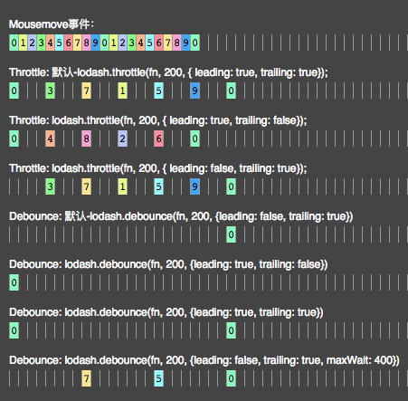

7 个角度吃透 Lodash 防抖节流原理
===
<!-- TOC -->

- [7 个角度吃透 Lodash 防抖节流原理](#7-个角度吃透-lodash-防抖节流原理)
- [节流函数 Throttle](#节流函数-throttle)
  - [角度1](#角度1)
    - [mousemove 第一次触发](#mousemove-第一次触发)
    - [mousemove 第二次触发](#mousemove-第二次触发)
    - [mousemove 第五次触发](#mousemove-第五次触发)
    - [mousemove 停止触发](#mousemove-停止触发)
  - [角度 2](#角度-2)
  - [角度 3](#角度-3)
- [防抖函数 Debounce](#防抖函数-debounce)
  - [角度 4](#角度-4)
  - [角度 5](#角度-5)
  - [角度 6](#角度-6)
  - [角度 7](#角度-7)

<!-- /TOC -->

# 节流函数 Throttle
我们先来看一张图，这张图充分说明了 `Throttle`（节流）和 `Debounce`（防抖）的区别，以及在不同配置下产生的不同效果，其中 `mousemove` 事件每 50 ms 触发一次，即下图中的每一小隔是 50 ms。今天这篇文章就从下面这张图开始介绍。



## 角度1
> lodash.throttle(fn, 200, {leading: true, trailing: true})

### mousemove 第一次触发
先来看下 throttle 源码
```js
function throttle(func, wait, options) {
  // 首尾调用默认为 true
  let leading = true
  let trailing = true

  if (typeof func !== 'function') {
    throw new TypeError('Expected a function')
  }
  // options 是否是对象
  if (isObject(options)) {
    leading = 'leading' in options ? !!options.leading : leading
    trailing = 'trailing' in options ? !!options.trailing : trailing
  }
  // maxWait 为 wait 的防抖函数
  return debounce(func, wait, {
    leading,
    trailing,
    'maxWait': wait,
  })
}
```

所以 `throttle(fn, 200, {leading: true, trailing: true})` 返回内容是 `debounce(fn, 200, {leading: true, trailing: true, maxWait: 200})`，多了 `maxWait: 200` 这部分。

先打个预防针，后面即将开始比较难的部分，看下 debounce 入口函数。

```js
// 入口函数，返回此函数
function debounced(...args) {
  // 获取当前时间
  const time = Date.now()
  // 判断此时是否应该执行 func 函数
  const isInvoking = shouldInvoke(time)

  // 赋值给闭包，用于其他函数调用
  lastArgs = args
  lastThis = this
  lastCallTime = time

  // 执行
  if (isInvoking) {
    // 无 timerId 的情况有两种：
    // 1、首次调用 
    // 2、trailingEdge 执行过函数
    if (timerId === undefined) {
      return leadingEdge(lastCallTime)
    }
    
    // 如果设置了最大等待时间，则立即执行 func
    // 1、开启定时器，到时间后触发 trailingEdge 这个函数。
    // 2、执行 func，并返回结果
    if (maxing) {
      // 循环定时器中处理调用
      timerId = startTimer(timerExpired, wait)
      return invokeFunc(lastCallTime)
    }
  }
  // 一种特殊情况，trailing 设置为 true 时，前一个 wait 的 trailingEdge 已经执行了函数
  // 此时函数被调用时 shouldInvoke 返回 false，所以要开启定时器
  if (timerId === undefined) {
    timerId = startTimer(timerExpired, wait)
  }
  // 不需要执行时，返回结果
  return result
}
```

对于 `debounce(fn, 200, {leading: true, trailing: true, maxWait: 200})` 来说，会经历如下过程。

- 1、`shouldInvoke(time)` 中，因为满足条件 `lastCallTime === undefined`，所以返回 `true`
- 2、`lastCallTime = time`，所以 `lastCallTime` 等于当前时间，假设为 0
- 3、`timerId === undefined` 满足，执行 `leadingEdge(lastCallTime)` 方法

```js
// 执行连续事件刚开始的那次回调
function leadingEdge(time) {
  // 1、设置上一次执行 func 的时间
  lastInvokeTime = time
  // 2、开启定时器，为了事件结束后的那次回调
  timerId = startTimer(timerExpired, wait)
  // 3、如果配置了 leading 执行传入函数 func
  // leading 来源自 !!options.leading
  return leading ? invokeFunc(time) : result
}
```
- 4、在 `leadingEdge(time)` 中，设置 `lastInvokeTime` 为当前时间即 0，开启 200 毫秒定时器，执行 `invokeFunc(time)` 并返回
```js
// 执行 Func 函数
function invokeFunc(time) {
  // 获取上一次执行 debounced 的参数
  const args = lastArgs
  // 获取上一次的 this
  const thisArg = lastThis

  // 重置
  lastArgs = lastThis = undefined
  lastInvokeTime = time
  result = func.apply(thisArg, args)
  return result
}
```

- 5、在 `invokeFunc(time)` 中，执行 `func.apply(thisArg, args)`，即 fn 函数第一次执行，并把结果赋值给 `result`，便于后续触发时直接返回。同时重置 `lastInvokeTime` 为当前时间即 0，清空 `lastArgs` 和 `lastThis`。
- 6、第一次触发已经完成，注意此时 `lastCallTime` 和 `lastInvokeTime` 都为 0，200 毫秒的定时器还在运行中。


### mousemove 第二次触发
50 毫秒后第二次触发到来，此时当前时间 `time` 为 50，`wait` 为 200，` maxWait` 为 200，`maxing` 为 true，`lastCallTime` 和 `lastInvokeTime` 都为 0，`timerId` 定时器存在，我们来看下执行步骤。

```js
function shouldInvoke(time) {
  // 当前时间距离上一次调用 debounce 的时间差
  const timeSinceLastCall = time - lastCallTime
  // 当前时间距离上一次执行 func 的时间差
  const timeSinceLastInvoke = time - lastInvokeTime

  // 下述 4 种情况返回 true
  return ( lastCallTime === undefined || 
          (timeSinceLastCall >= wait) ||
          (timeSinceLastCall < 0) || 
          (maxing && timeSinceLastInvoke >= maxWait) )
}
```

- 1、shouldInvoke(time) 中，timeSinceLastCall 为 50，timeSinceLastInvoke 为 50，4 种条件都不满足，返回 false。
- 2、此时 isInvoking 为 false，同时 timerId === undefined 不满足，直接返回第一次触发时的 result
- 3、第二次触发完成，并不会执行 fn，只会返回上次执行的结果 result
- 4、第三次和第四次触发时，效果一样，就不再重复了。


### mousemove 第五次触发
距第一次触发 200 毫秒后第五次触发到来，此时当前时间 `time` 为 200，`wait` 为 200， `maxWait` 为 `200，maxing` 为 true，`lastCallTime` 为 150， `lastInvokeTime` 为 `0，timerId` 定时器存在，我们来看下执行步骤。

- 1、`shouldInvoke(time)` 中，`timeSinceLastInvoke` 为 200，满足 `(maxing && timeSinceLastInvoke >= maxWait)`，所以返回 true
```js
// debounced 方法中执行到这部分
if (maxing) {
  // 循环定时器中处理调用
  timerId = startTimer(timerExpired, wait)
  return invokeFunc(lastCallTime)
}
```

- 2、满足 maxing 条件，重新开启 200 毫秒的定时器，并执行 invokeFunc(lastCallTime) 函数
- 3、invokeFunc(time) 中，重置 lastInvokeTime 为当前时间即 200，清空 lastArgs 和 lastThis
- 4、第六、七、八次触发时，同第二次触发效果一致，就不再重复了。


### mousemove 停止触发
假设第八次触发之后就停止了滚动，在第八次触发时 `time` 为 350，所以如果有第九次触发，那么此时是应该执行fn 的，但是此时 `mousemove` 已经停止了触发，那么还会执行 fn 吗？答案是依旧执行，因为最开始设置了 `{trailing: true}`。

```js
// 开启定时器
function startTimer(pendingFunc, wait) {
  // 没传 wait 时调用 window.requestAnimationFrame()
  if (useRAF) {
    // 若想在浏览器下次重绘之前继续更新下一帧动画
    // 那么回调函数自身必须再次调用 window.requestAnimationFrame()
    root.cancelAnimationFrame(timerId);
    return root.requestAnimationFrame(pendingFunc)
  }
  // 不使用 RAF 时开启定时器
  return setTimeout(pendingFunc, wait)
}
```

在第五次触发时开启了 200 毫秒的定时器，所以在时间 `time` 到 400 时会执行 `pendingFunc`，此时的 `pendingFunc` 就是 `timerExpired` 函数，来看下具体的代码。

```js
// 定时器回调函数，表示定时结束后的操作
function timerExpired() {
  const time = Date.now()
  // 1、是否需要执行
  // 执行事件结束后的那次回调，否则重启定时器
  if (shouldInvoke(time)) {
    return trailingEdge(time)
  }
  // 2、否则 计算剩余等待时间，重启定时器，保证下一次时延的末尾触发
  timerId = startTimer(timerExpired, remainingWait(time))
}
```


此时在 `shouldInvoke(time)` 中，`time` 为 400，`lastInvokeTime` 为 200，`timeSinceLastInvoke` 为 200，满足 `(maxing && timeSinceLastInvoke >= maxWait)`，所以返回 true。

```js
// 执行连续事件结束后的那次回调
function trailingEdge(time) {
  // 清空定时器
  timerId = undefined

  // trailing 和 lastArgs 两者同时存在时执行
  // trailing 来源自 'trailing' in options ? !!options.trailing : trailing
  // lastArgs 标记位的作用，意味着 debounce 至少执行过一次
  if (trailing && lastArgs) {
    return invokeFunc(time)
  }
  // 清空参数
  lastArgs = lastThis = undefined
  return result
}
```

之后执行 `trailingEdge(time)`，在这个函数中判断 `trailing` 和 `lastArgs` ，此时这两个条件都是 true，所以会执行 `invokeFunc(time)`，最终执行函数 fn。

这里需要说明以下两点
1. 如果设置了 `{trailing: false}`，那么最后一次是不会执行的。对于 `throttle` 和 `debounce` 来说，默认值是 true，所以如果没有特意指定 `trailing`，那么最后一次是一定会执行的。
2. 对于 `lastArgs` 来说，执行 `debounced` 时会赋值，即每次触发都会重新赋值一次，那什么时候清空呢，在 `invokeFunc(time)` 中执行 fn 函数时重置为 undefined，所以如果 `debounced` 只触发了一次，即使设置了 `{trailing: true}` 那也不会再执行 fn 函数，这个就解答了上篇文章留下的第一道思考题。


## 角度 2
> lodash.throttle(fn, 200, {leading: true, trailing: false})

在「角度 1 之 mousemove 停止触发」这部分中说到，如果不设置 `trailing` 和设置 `{trailing: true}` 效果是一样的，事件回调结束后都会再执行一次传入函数 fn，但是如果设置了`{trailing: false}`，那么事件回调结束后是不会再执行 fn 的。

此时的配置对比角度 1 来说，区别在于设置了`{trailing: false}`，所以实际效果对比 1 来说，就是最后不会额外再执行一次，效果见第一张图。


## 角度 3
> lodash.throttle(fn, 200, {leading: false, trailing: true})

此时的配置和角度 1 相比，区别在于设置了 `{leading: false}`，所以直接看 `leadingEdge(time)` 方法就可以了。

```js
// 执行连续事件刚开始的那次回调
function leadingEdge(time) {
  // 1、设置上一次执行 func 的时间
  lastInvokeTime = time
  // 2、开启定时器，为了事件结束后的那次回调
  timerId = startTimer(timerExpired, wait)
  // 3、如果配置了 leading 执行传入函数 func
  // leading 来源自 !!options.leading
  return leading ? invokeFunc(time) : result
}
```

在这里，会开启 200 毫秒的定时器，同时因为 `leading` 为 false，所以并不会执行 `invokeFunc(time)` ，只会返回 result，此时的 result 值是 undefined。

这里开启一个定时器的目的是为了事件结束后的那次回调，即如果设置了 `{trailing: true}` 那么最后一次回调将执行传入函数 fn，哪怕 debounced 函数只触发一次。

这里指定了 `{leading: false}`，那么 `leading` 的初始值是什么呢？在 `debounce` 中是 false，在 `throttle` 中是 true。所以在 `throttle` 中不需要刚开始就触发时，必须指定 `{leading: false}`，在 debounce 中就不需要了，默认不触发。


# 防抖函数 Debounce
## 角度 4
> lodash.debounce(fn, 200, {leading: false, trailing: true})

此时相比较 `throttle` 来说，缺少了 `maxWait` 值，所以具体触发过程中的判断就不一样了，来详细看一遍。

- 1、在入口函数 `debounced` 中，执行 `shouldInvoke(time)`，前面讨论过因为第一次触发所以会返回 true，之后执行 `leadingEdge(lastCallTime)`。
```js
// 执行连续事件刚开始的那次回调
function leadingEdge(time) {
  // 1、设置上一次执行 func 的时间
  lastInvokeTime = time
  // 2、开启定时器，为了事件结束后的那次回调
  timerId = startTimer(timerExpired, wait)
  // 3、如果配置了 leading 执行传入函数 func
  // leading 来源自 !!options.leading
  return leading ? invokeFunc(time) : result
}
```

- 2、在 `leadingEdge` 中，因为 `leading` 为 false，所以并不执行 fn，只开启 200 毫秒的定时器，并返回 undefined。此时 `lastInvokeTime` 为当前时间，假设为 0。

```js
// 判断此时是否应该执行 func 函数
function shouldInvoke(time) {
  // 当前时间距离上一次调用 debounce 的时间差
  const timeSinceLastCall = time - lastCallTime
  // 当前时间距离上一次执行 func 的时间差
  const timeSinceLastInvoke = time - lastInvokeTime

  // 下述 4 种情况返回 true
  return ( lastCallTime === undefined || 
          (timeSinceLastCall >= wait) ||
          (timeSinceLastCall < 0) || 
          (maxing && timeSinceLastInvoke >= maxWait) )
}
```

- 3、之后每次触发时，`timeSinceLastCall` 总是为 50 毫秒，`maxing` 为 false，所以 `shouldInvoke(time)` 总是返回 false，并不会执行传入函数 fn，只返回 result，即为 undefined。
- 4、到现在为止，fn 一次还没有执行，200 毫秒后，定时器回调函数触发，执行 `timerExpired` 函数

```js
// 定时器回调函数，表示定时结束后的操作
function timerExpired() {
  const time = Date.now()
  // 1、是否需要执行
  // 执行事件结束后的那次回调，否则重启定时器
  if (shouldInvoke(time)) {
    return trailingEdge(time)
  }
  // 2、否则 计算剩余等待时间，重启定时器，保证下一次时延的末尾触发
  timerId = startTimer(timerExpired, remainingWait(time))
}
```

- 5、此时存在两种情况，第一种是 `mousemove` 事件一直在触发，根据前面介绍 `shouldInvoke(time)` 会返回 false，之后就将计算剩余等待时间，重启定时器。时间计算公式为 `wait - (time - lastCallTime)`，即 200 - 50，所以只要 `shouldInvoke(time)` 返回 false，就每隔 150 毫秒后执行一次 `timerExpired()`。
- 6、第二种情况是 `mousemove` 事件不再触发，因为 `timerExpired()` 在循环执行，所以肯定会存在一种情况满足 `timeSinceLastCall >= wait`，即 `shouldInvoke(time)` 返回 true，终结 `timerExpired()` 的循环，并执行 `trailingEdge(time)`。

```js
// 执行连续事件结束后的那次回调
function trailingEdge(time) {
  // 清空定时器
  timerId = undefined

  // trailing 和 lastArgs 两者同时存在时执行
  // trailing 来源自 'trailing' in options ? !!options.trailing : trailing
  // lastArgs 标记位的作用，意味着 debounce 至少执行过一次
  if (trailing && lastArgs) {
    return invokeFunc(time)
  }
  // 清空参数
  lastArgs = lastThis = undefined
  return result
}
```

- 7、在 `trailingEdge` 中 `trailing` 和 `lastArgs` 都是 true，所以会执行 `invokeFunc(time)`，即执行传入函数 fn。
8、所以整个过程中只在最后执行一次传入函数 fn，效果同上面第一张图所示。


## 角度 5
> lodash.debounce(fn, 200, {leading: true, trailing: false})

此时相比角度 4 来说，差异在于 `{leading: true, trailing: false}`，但是 `wait` 和 `maxWait` 都和角度 4 一致，所以只存在下面 2 种区别，效果同上面第一张图所示。

- 区别 1：`leadingEdge` 中会执行传入函数 fn
- 区别 2：`trailingEdge` 中不再执行传入函数 fn


## 角度 6
> lodash.debounce(fn, 200, {leading: true, trailing: true})

此时相比角度 4 来说，差异仅仅在于设置了 `{leading: true}`，所以只存在一个区别，那就是在 `leadingEdge` 中会执行传入函数 fn，当然在 `trailingEdge` 中依旧执行传入函数 fn，所以会出现在 `mousemove` 事件触发过程中首尾都会执行的情况，效果同上面第一张图所示。

当然一种情况除外，那就是 `mousemove` 事件永远只触发一次的情况，关键在于 `lastArgs` 变量。

对于 `lastArgs` 变量来说，在入口函数 `debounced` 中赋值，即每次触发都会重新赋值一次，那什么时候清空呢，在 `invokeFunc(time)` 中重置为 undefined，所以如果 `debounced` 只触发了一次，而且在 `{leading: true}` 时执行过一次 fn，那么即使设置了 `{trailing: true}` 也不会再执行传入函数 fn。


## 角度 7
> lodash.debounce(fn, 200, {leading: false, trailing: true, maxWait: 400})

此时 `wait` 为 200，`maxWait` 为 400，maxing 为 true，我们来看下执行过程。

- 1、第一次触发时，因为 `{leading: false}`，所以肯定不会执行 fn，此时开启了一个 200 毫秒的定时器。

```js
// 判断此时是否应该执行 func 函数
function shouldInvoke(time) {
  // 当前时间距离上一次调用 debounce 的时间差
  const timeSinceLastCall = time - lastCallTime
  // 当前时间距离上一次执行 func 的时间差
  const timeSinceLastInvoke = time - lastInvokeTime

  // 下述 4 种情况返回 true
  return ( lastCallTime === undefined || 
          (timeSinceLastCall >= wait) ||
          (timeSinceLastCall < 0) || 
          (maxing && timeSinceLastInvoke >= maxWait) )
}
```

- 2、之后每隔 50 毫秒触发一次，每次都会执行 `shouldInvoke(time)` 函数，只有在第 400 毫秒时，才会满足 `maxing && timeSinceLastInvoke >= maxWait`，返回 true。

```js
// 计算仍需等待的时间
function remainingWait(time) {
  // 当前时间距离上一次调用 debounce 的时间差
  const timeSinceLastCall = time - lastCallTime
  // 当前时间距离上一次执行 func 的时间差
  const timeSinceLastInvoke = time - lastInvokeTime
  // 剩余等待时间
  const timeWaiting = wait - timeSinceLastCall

  // 是否设置了最大等待时间
	// 是（节流）：返回「剩余等待时间」和「距上次执行 func 的剩余等待时间」中的最小值
	// 否：返回剩余等待时间
  return maxing
    ? Math.min(timeWaiting, maxWait - timeSinceLastInvoke)
  	: timeWaiting
}
```

- 3、但是在这之前的第 200 毫秒，定时器触发回调函数，执行 `timerExpired`，因为此时 `shouldInvoke(time)` 返回 false，所以会重新计算剩余等待时间并重启计时器，其中 `timeWaiting` 是 150 毫秒，`maxWait - timeSinceLastInvoke` 是 200 毫秒，所以计算结果是150 毫秒。
- 4、150 毫秒之后，即自开始之后的第 350 毫秒时，会重新计算时间，其中 `timeWaiting` 依旧是 150 毫秒，`maxWait - timeSinceLastInvoke` 是 50 毫秒，所以重新开启 50 毫秒的定时器，即在第 400 毫秒时触发。
- 5、此时会发现定时器触发的时间是第 400 毫秒，`shouldInvoke(time)` 中返回 true 的时间也是在第 400 毫秒，为什么要这样呢？这样会冲突吗？首先定时器剩余时间判断和 `shouldInvoke(time)` 判断中，只要有一处满足执行 fn 条件，就会立马执行，同时 `lastInvokeTime` 值也会发生改变，所以另一处判断就不会生效了。另外本身定时器是不精准的，所以通过 `Math.min(timeWaiting, maxWait - timeSinceLastInvoke)` 取最小值的方式来减少误差。
- 6、于此同时，需要在 `debounced` 入口函数添加这么一句 `if (timerId === undefined) {timerId = startTimer(timerExpired, wait)}`，避免 `trailingEdge` 执行后定时器被清空。
- 7、最终效果和节流是一样的，只是时间间隔变大了而已，具体效果同第一张图所示。
