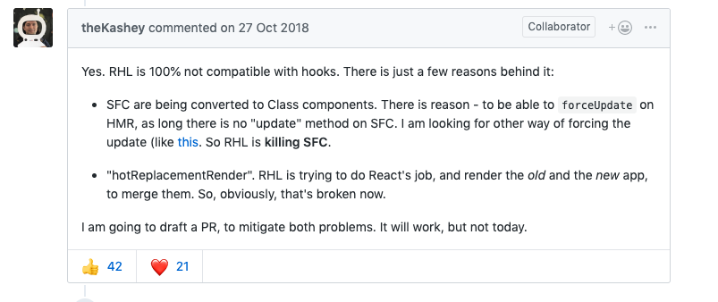

第三期
===

## TS 中使用 typeof 关键字可以自动获取数据类型
在写 React 项目时，有些时候，你的 state 可能会有默认值，比如：
```js
const initialState = {
   username: '',
   mobile: '',
   isVip: false,
   addresses: [],
}

type IState = typeof initialState

class Comp extends Component<any, IState> {
   constructor(props) {
        super(props);
        this.state = {
            ...initialState
        };
    }
}
```

这样就不用分开定义 state 的初始值和 state 的类型了。

## 交换数组指定位置元素位置
最近get到的一个小技巧。交换数组指定位置元素位置：

例如： `[1 ,2, 3, 4] ===> [1, 2, 4, 3]`

```js
// x , y是要交换元素的位置(index+1)
function arrIndexExchange(array, x, y){
    array.splice(x - 1, 1, ...array.splice(y - 1, 1, array[x - 1]));
    return array;
};
```

## 位运算
> 请注意 位运算适用于 32 位整数，所以精度可能会丢失

### 用 "|" 取整
```js
let num=1.5
num=num|0; // 1
```

### 用 ">>" 取半
```js
let num=4;
num=num>>1; // 2
```

## 用 "<<" 加倍
```js
let num=2;
num=num<<1; / / 4

num = num << 2; // 8
```


## 用 "^" 两值交换
```js
let a=1;
let b=2;

a^=b;
b^=a;
a^=b;
// a===2,b===1
```


## 用 "&" 判断奇数
```js
let n=3;
let m=4;
n&1===1; // true 奇数
m&1===1; // false 偶数
```

## 用 "~" 判断项是否存在
```js
let firstname="Ma";
let fullname="Jack Ma";
let isExist=!!~fullname.indexOf(firstname); // true
```

## arguments 的坑
> 注意严格模式下，没有这个问题

* 当非严格模式中的函数 没有 包含 剩余参数、默认参数和解构赋值，那么arguments对象中的值会跟踪参数的值（反之亦然）
  ```js
  function sidEffecting(ary) {
    ary[0] = ary[2];
  }
  function bar(a,b,c) {
    c = 10 // 注意这里，其实它修改的就是 arguments 对象里的参数
    sidEffecting(arguments);
    return a + b + c;
  }
  bar(1,1,1);   // 21
  ```

* 当非严格模式中的函数 有 包含剩余参数、默认参数和解构赋值，那么arguments对象中的值不会跟踪参数的值（反之亦然）
    ```js
    function sidEffecting(ary) {
      ary[0] = ary[2];
    }
    function bar(a,b,c=3) {
      c = 10
      sidEffecting(arguments);
      return a + b + c;
    }
    bar(1,1,1); // 12
    ```

## 用canvas实现文字渐变效果
```html
<canvas id="canvas" width="600" height="200" style="border: 1px solid;">
```

```js
var context = canvas.getContext('2d')
var g = context.createLinearGradient(0,0,canvas.width,0) //参数是渐变方向
g.addColorStop(0, 'red')
g.addColorStop(0.5, 'blue')
g.addColorStop(1, 'purple')
context.fillStyle = g
context.font = '36px fantasy'
context.fillText('hello canvas', 0, 100) // 后俩参数是起始位置
```

效果:    


[效果演示](https://codepen.io/ailjc/pen/ExYXmLV?editors=1010)

## ES6 proxy 深度代理一个对象
```js
function deepProxy(object, handler) {
    if (isComplexObject(object)) {
        addProxy(object, handler);
    }
    return new Proxy(object, handler);
}

function addProxy(obj, handler) {
    for (let i in obj) {
        if (typeof obj[i] === 'object') {
            if (isComplexObject(obj[i])) {
                addProxy(obj[i], handler);
            }
            obj[i] = new Proxy(obj[i], handler);
        }
    }
}

function isComplexObject(object) {
    if (typeof object !== 'object') {
        return false;
    } else {
        for (let prop in object) {
            if (typeof object[prop] == 'object') {
                return true;
            }
        }
    }
    return false;
}

let person = {
    txt: 123,
    name: 'tnt',
    age: 26,
    status: {
        money: 'less',
        fav: [1, 2, 3]
    }
};
let proxyObj = deepProxy(person, {
    get(target, key, receiver) {
        console.log(`get--${target}--${key}`);
        return Reflect.get(target, key);
    },
    set(target, key, value, receiver) {
        console.log(`set--${target}--${key}-${value}`);
        return Reflect.set(target, key, value);
    }
});
proxyObj.status.test = 13;
proxyObj.status.fav.push('33');
```

## 格式化秒为 04:19 类型的小函数
```js
const convertDuration = time => {
  let minutes = Math.floor(time / 60);
  let seconds = Math.floor(time - minutes * 60);
  minutes = String(minutes).length < 2 ? String(minutes).padStart(2,'0'): minutes;
  seconds = String(seconds).length < 2 ? String(seconds).padStart(2,'0'): seconds;
  return minutes + ":" + seconds;
}

convertDuration(252); // "04:12"
```

## hooks 与 react-hot-loader 冲突
之前把老的 React 项目升级成了最新版，在使用 hooks 的时候遇到了一个问题。当时通过谷歌找到了问题所在，升级了 react-hot-loader 包以后就顺便解决了问题，为了继续做工作就没有具体去了解原因。

今天有时间了就搜索了一番资料，总结了一下内容：

在正确使用 hooks 的情况下出现了以下报错：

```js
Uncaught Error: Hooks can only be called inside the body of a function component.
```

Hooks 确实有限制必须在函数组件中使用，但是我确实正确的使用了。于是搜索了一波资料，发现了一个 issus 出现了与我一样的问题：[Incompatibility with react-hot-loader](https://github.com/gaearon/react-hot-loader/issues/1088)。

在阅读 issus 的过程中，发现 react-hot-loader 开发者给出了如下解答：



大致意思是无状态组件（也就是函数组件）会被转换成类组件，这是因为无状态组件没有更新的方法。

因此搜索了下 react-hot-loader 的工作原理，发现官方同样给出了一份文档：[How React Hot Loader works](https://github.com/gaearon/react-hot-loader/wiki/How-React-Hot-Loader-works)。

内容中有说到为了渲染 react-tree，不得不把所有的无状态组件都转换成了无状态的类组件。
