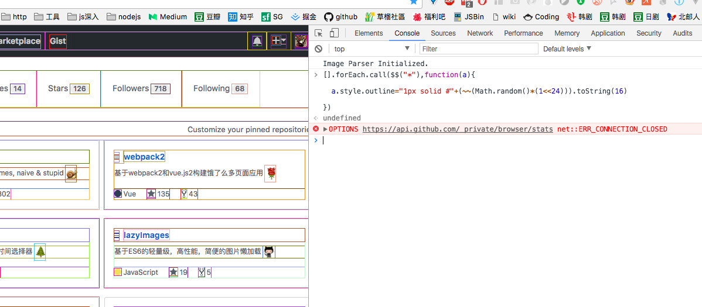

# js 编程黑科技

<!-- TOC -->

- [js 编程黑科技](#js-编程黑科技)
  - [1、单行写一个评级组件](#1单行写一个评级组件)
  - [2、 如何装逼用代码骂别人SB](#2-如何装逼用代码骂别人SB)
  - [3、 如何用代码优雅的证明自己NB](#3-如何用代码优雅的证明自己NB)
  - [4、 JavaScript 错误处理的方式的正确姿势](#4-JavaScript-错误处理的方式的正确姿势)
  - [5、 从一行代码里面学点JavaScript](#5-从一行代码里面学点JavaScript)
  - [6、论如何优雅的取随机字符串](#6论如何优雅的取随机字符串)
  - [7. (10)["toString"]() === "10"](#7-10toString--10)
  - [8、匿名函数自执行](#8匿名函数自执行)
  - [9、另外一种undefined -> void 0](#9另外一种undefined---void-0)
  - [10、 论如何优雅的取整](#10-论如何优雅的取整)
  - [11、如何优雅的实现金钱格式化：1234567890 --> 1,234,567,890](#11如何优雅的实现金钱格式化1234567890----1234567890)
  - [12、逗号运算符](#12逗号运算符)
  - [13、论如何最佳的让两个整数交换数值](#13论如何最佳的让两个整数交换数值)
    - [算术运算](#算术运算)
    - [黑科技办法: 异或运算](#黑科技办法-异或运算)
    - [ES5 数据交换](#ES5-数据交换)
    - [ES6 解构赋值](#ES6-解构赋值)
  - [14、实现标准JSON的深拷贝](#14实现标准JSON的深拷贝)
  - [15、不用Number、parseInt和parseFloat和方法把"1"字符串转换成数字](#15不用NumberparseInt和parseFloat和方法把1字符串转换成数字)
  - [16、parseInt(0.0000008) === 8](#16parseInt00000008--8)
  - [17、 ++[[]][+[]]+[+[]] == 10](#17---10)
  - [18、new Set实现去重](#18new-Set实现去重)
  - [19、用最短的代码实现一个长度为m(6)且值都n(8)的数组](#19用最短的代码实现一个长度为m6且值都n8的数组)
  - [20、取出一个数组中的最大值和最小值](#20取出一个数组中的最大值和最小值)
  - [21、 将argruments对象转换成数组](#21-将argruments对象转换成数组)
  - [22、 从一个数组中找到一个数，O(n)的算法，找不到就返回 null。](#22-从一个数组中找到一个数On的算法找不到就返回-null)

<!-- /TOC -->

## 1、单行写一个评级组件

> "★★★★★☆☆☆☆☆".slice(5 - rate, 10 - rate);

```js
// 定义一个变量rate是1到5的值，然后执行上面代码，看图
var rate = 1;
"★★★★★☆☆☆☆☆".slice(5 - rate, 10 - rate);
```

<div align="center"></div>

## 2、 如何装逼用代码骂别人SB
```js
(!(~+[])+{})[--[~+""][+[]]*[~+[]] + ~~!+[]]+({}+[])[[~!+[]]*~+[]]
```

## 3、 如何用代码优雅的证明自己NB

> ([][[]]+[])[+!![]]+([]+{})[!+[]+!![]]

```js
console.log(([][[]]+[])[+!![]] + ([]+{})[!+[]+!![]])
```

## 4、 JavaScript 错误处理的方式的正确姿势

```js
try {
    something
} catch (e) {
    window.location.href =
        "http://stackoverflow.com/search?q=[js]+" +
        e.message;
}
```

<div align="center"></div>

## 5、 从一行代码里面学点JavaScript

```js
[].forEach.call($$("*"),function(a){
    a.style.outline="1px solid #"+(~~(Math.random()*(1<<24))).toString(16)
})
```

翻译成正常语言就是这样的

```js
Array.prototype.forEach.call(document.querySelectorAll('*'), 
    dom => dom.style.outline = `1px solid #${parseInt(Math.random() * Math.pow(2,24)).toString(16)}`)
```

接下来在浏览器控制看看：something magic happens

<div align="center"></div>

## 6、论如何优雅的取随机字符串
```js
Math.random().toString(16).substring(2) // 13位
Math.random().toString(36).substring(2) // 11位
```


## 7. (10)["toString"]() === "10"

```js
(10)["toString"]() === "10"
```
<

## 8、匿名函数自执行

```js
( function() {}() );
( function() {} )();
[ function() {}() ];

~ function() {}();
! function() {}();
+ function() {}();
- function() {}();

delete function() {}();
typeof function() {}();
void function() {}();
new function() {}();
new function() {};

var f = function() {}();

1, function() {}();
1 ^ function() {}();
1 > function() {}();
// ...
```

## 9、另外一种undefined -> void 0

从来不需要声明一个变量的值是undefined，因为JavaScript会自动把一个未赋值的变量置为undefined。所有如果你在代码里这么写，会被鄙视的

```js
var data = undefined;

var data = void 0;
```

void在JavaScript中是一个操作符，对传入的操作不执行并且返回undefined。void后面可以跟()来用，例如void(0)，看起来是不是很熟悉？没错，在HTML里阻止带href的默认点击操作时，都喜欢把href写成javascript:void(0)，实际上也是依靠void操作不执行的意思。

## 10、 论如何优雅的取整

```js
var a = ~~2.33

var b= 2.33 | 0

var c= 2.33 >> 0
```


## 11、如何优雅的实现金钱格式化：1234567890 --> 1,234,567,890

用正则魔法实现：

```js
var test1 = '1234567890'
var format = test1.replace(/\B(?=(\d{3})+(?!\d))/g, ',')

console.log(format) // 1,234,567,890
```

非正则的优雅实现：

```js
function formatCash(str) {
    return str.split('').reverse().reduce((prev, next, index) => {
        return ((index % 3) ? next : (next + ',')) + prev
    })
}
console.log(formatCash('1234567890')) // 1,234,567,890
```

## 12、逗号运算符

```js
var a = 0; 
var b = ( a++, 99 ); 
console.log(a);  // 1
console.log(b);  // 99
```


## 13、论如何最佳的让两个整数交换数值

### 算术运算

```js
var a=1, b=2;
a += b;
b = a - b;
a -= b;

var a = 1,
    b = 2;
a = a + b; // a = 3, b = 2
b = a - b; // a = 3, b = 1
a = a - b; // a = 2, b = 1
```
缺点也很明显，整型数据溢出，对于32位字符最大表示数字是2147483647，如果是2147483645和2147483646交换就失败了。

### 黑科技办法: 异或运算

```js
a ^= b;
b ^= a;
a ^= b;

var a = 1, // 二进制：0001
    b = 2; // 二进制：0010
a = a ^ b; // 计算结果：a = 0011, b = 0010
b = a ^ b; // 计算结果：a = 0011, b = 0001
a = a ^ b; // 计算结果：a = 0010, b = 0001
```

### ES5 数据交换

```js
var a = 1,
    b = 2,
    tmp;
tmp = a;
a = b;
b = tmp;
```

### ES6 解构赋值

```js
let a = 1,
    b = 2;
[a, b] = [b, a];
```

## 14、实现标准JSON的深拷贝

```js
var a = {
    a: 1,
    b: { c: 1, d: 2 }
}
var b=JSON.parse(JSON.stringify(a))
```

不考虑IE的情况下，标准JSON格式的对象蛮实用，不过对于undefined和function的会忽略掉。

## 15、不用Number、parseInt和parseFloat和方法把"1"字符串转换成数字

不准用强制类型转换，那么就想到了强大了隐式转换

```js
var a =1 
+a
```


## 16、parseInt(0.0000008) === 8


## 17、 ++[[]][+[]]+[+[]] == 10


## 18、new Set实现去重

```js
[...new Set([1, "1", 2, 1, 1, 3])]  // [1, "1", 2, 3]

Array.from(new Set([1, "1", 2, 1, 1, 3]))  // [1, "1", 2, 3]
```

## 19、用最短的代码实现一个长度为m(6)且值都n(8)的数组
```js
Array(6).fill(8) // [8, 8, 8, 8, 8, 8]
```

## 20、取出一个数组中的最大值和最小值

```js
var numbers = [5, 458 , 120 , -215 , 228 , 400 , 122205, -85411]; 
var maxInNumbers = Math.max.apply(Math, numbers); 
var minInNumbers = Math.min.apply(Math, numbers);
```

## 21、 将argruments对象转换成数组
```js
// ES5
var argArray = Array.prototype.slice.call(arguments);

// ES6
var argArray = Array.from(arguments)
```

## 22、 从一个数组中找到一个数，O(n)的算法，找不到就返回 null。

* 正常的版本:

```js
function find (x, y) {
  for ( let i = 0; i < x.length; i++ ) {
    if ( x[i] == y ) return i;
  }
  return null;
}
 
let arr = [0,1,2,3,4,5]
console.log(find(arr, 2))
console.log(find(arr, 8))
```

结果到了函数式成了下面这个样子（好像上面的那些代码在下面若影若现，不过又有点不太一样，为了消掉if语言，让其看上去更像一个表达式，动用了 ? 号表达式）：

* 函数式的版本

```js
const find = (f => f(f))(f =>
	(next => (x, y, i = 0) =>
		(i >= x.length) ? null :
			(x[i] == y) ? i :
				next(x, y, i + 1))((...args) =>
					(f(f))(...args)))
 
let arr = [0,1,2,3,4,5]
console.log(find(arr, 2))
console.log(find(arr, 8))
```