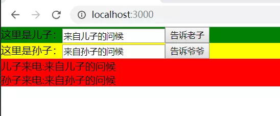

37行代码构建无状态组件通信工具
===
<!-- TOC -->

- [37行代码构建无状态组件通信工具](#37行代码构建无状态组件通信工具)
  - [状态管理的现状](#状态管理的现状)
  - [无状态组件间通信的由来](#无状态组件间通信的由来)
  - [巧用设计模式](#巧用设计模式)
  - [使用无状态工具实现组件间数据通信](#使用无状态工具实现组件间数据通信)

<!-- /TOC -->

## 状态管理的现状
很多前端开发者认为，`Vuex`和`Redux`是用来解决组件间状态通信问题的，所以大部分人仅仅是用于达到状态共享的目的。但是通常`Redux`是用于解决工程性问题的，用于分离业务与视图，让结构更加清晰，从而达到易于维护的目的。也就是 `Flux`架构所解决的问题。但是绝大多数时候，大家只是想解决的问题是组件嵌套过深的时候，如何将子组件的状态直接传递给父组件。那么此时`Vuex`也好`Redux`也好，对于我们的诉求就过于繁琐。每次通信后，我们还需要清理掉`Store`中的状态。更加恼人的是，我们该如何选择哪些状态应该放入`Store`，那些状态应该放在组建内的`state`一直困扰着大家，甚至于社区也是没有一个定论。因此很多年轻前端工程师所开发的项目，状态管理极其混乱。以至于不久后就难以维护。

## 无状态组件间通信的由来
针对以上诉求，我们能不能开发一个简单的组件间通信工具来解决目前前端状态管理的痛点呢？因此我实现了一个无状态组件通信工具，这也就是这篇文章的由来。
无状态，也就是它并不关注数据内容，它只是起到一个管道的作用，在组件间建立管道，组件可以通过该管道向管道另一头的组件说：“hello world！This is your message。”。

## 巧用设计模式
设计模式，大家都很熟悉,现代前端框架已经使用非常多的设计模式，大家都能耳熟能详的就是`观察者模式`，`装饰器模式`，以及`发布订阅模式`(一种将观察者和通知者融合的设计模式)。

utils/index.js
```js
const listener = {}; // 用于保存订阅者

// 注册订阅者
function subscribe (event, handle) {
  // 订阅者订阅的信息
  if (typeof event !== 'string') {
    throw new Error('event must be String!');
  }
  // 订阅者的callback函数
  if (typeof handle !== 'function') {
    throw new Error('handle must be function!');
  }
  // 将订阅者添加到订阅者容器中保存起来
  if (!listener[event]) {
    listener[event] = [];
    listener[event].push(handle);
  } else {
    var index = listener[event].indexOf(handle);
    if (index < 0) {
      listener[event].push(handle);
    }
  }
  // 返回用于取消订阅的接口，这里是一个高阶函数
  return function unSubscribe() {
    var index = listener[event].indexOf(handle);
    if (index > -1) {
      listener[event].splice(index, 1);
    }
  }
}
// 为通知者提供的发起通知的接口
function dispatch (event, payload) {
  if (listener[event]) {
    listener[event].forEach(function serviceFunc(handle) {
      handle(payload);
    })
  } else {
    throw new Error('No subscriber be registried for serviceName!');
  }
}

export {
  subscribe,
  dispatch
}
```

这里主要使用了一下几种JS语言常用的设计模式以及技术知识点：
- **沙盒模式** 在之前一篇文章如何构建一个不到100行的小程序端mini版本redux
中介绍了如何通过沙盒模式构建一个mini小程序版的redux。如果对于沙盒模式还不了解可以参看这篇文章，这里用沙盒模式对用于存储订阅者的变量进行封装和保护。
- **发布订阅模式** 发布(dispatch)订阅(subscribe)模式是一种混合模式，它包含了观察者模式和通知者模式。
- **高阶函数** 这是JS一种常见的知识点，在面试的时候经常会有面试官提问这个技术，但是真正用于实战的并不多，大多都是构建基础架构的高级工程师才有机会使用。

以上，我们利用沙盒模式，发布订阅模式实现了一个基本的无状态组件间通信工具。那么我们如何使用它呢？


## 使用无状态工具实现组件间数据通信
下面是我们要实现的一个例子：



组件结构是 爷爷包含儿子，儿子包含孙子，儿子和孙子可以和爷爷直接对话。

在根组件(爷爷组件)注册订阅者用来订阅儿子和孙子发来的信息：

```js
import Son from './Son';

import { subscribe } from './utils';

class App extends Component {
  constructor(props) {
    super(props);
    this.state = {
      messageFromSon: '',
      messageFromGrandson: ''
    }
    // 在这里订阅了儿子的会话和孙子的会话，记得bind(this)这样才能访问组件的上下文
    this.listenSonHandle = this.listenSonHandle.bind(this);
    this.listenGrandsonHandle = this.listenGrandsonHandle.bind(this);
    // 我们需要保留订阅会话，在不需要的时候取消注册
    this.listenHandle = [
      subscribe('son', this.listenSonHandle),
      subscribe('grandson', this.listenGrandsonHandle)
    ]
  }

  listenSonHandle(payload) {
    this.setState({
      messageFromSon: payload
    });
  }

  listenGrandsonHandle(payload) {
    this.setState({
      messageFromGrandson: payload
    })
  }

  componentWillUnmount() {
    this.listenHandle.forEach((unSubscribe) => {
      unSubscribe();
    })
  }

  render() {
    return (
      <div style={{background: 'red'}}>
        <Son />
        <div>
          儿子来电:{this.state.messageFromSon}
        </div>
        <div>
          孙子来电:{this.state.messageFromGrandson}
        </div>
      </div>
    );
  }
}
```

儿子组件需要和爷爷组件直接对话，那么就需要和爷爷组件建立相同的通信管道：

```js
import React from 'react';
import { dispatch } from './utils';
import Grandson from './Grandson';

export default class Son extends React.Component {
  constructor(props) {
    super(props);
    this.state = {
      message: ''
    }
  }

  render() {
    return <div style={{background: 'green'}}>
      这里是儿子：
      <input value={this.state.message} onChange={(e) => {
        this.setState({
          message: e.target.value
        })
      }}></input>
      <button onClick={() => {
        // 利用通知者接口，向爷爷组件发送信息
        dispatch('son', this.state.message);
      }}>告诉老子</button>
      <Grandson/>
    </div>
  }
}
```

孙子组件想要向爷爷组件发送信息，如果不使用redux的话就要一层一层的传递props。先告诉爸爸，然后爸爸告诉爷爷，但是有了我们现在构建的无状态组件通信工具。就不需要那么麻烦了：

```js
import React from 'react';
import { dispatch } from './utils';

export default class Son extends React.Component {
  constructor(props) {
    super(props);
    this.state = {
      message: ''
    }
  }

  render() {
    return <div style={{background: 'yellow'}}>
      这里是孙子：
      <input value={this.state.message} onChange={(e) => {
        this.setState({
          message: e.target.value
        })
      }}></input>
      <button onClick={() => {
        dispatch('grandson', this.state.message);
      }}>告诉爷爷</button>
    </div>
  }
}
```