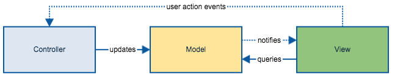
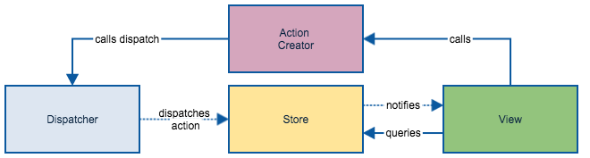
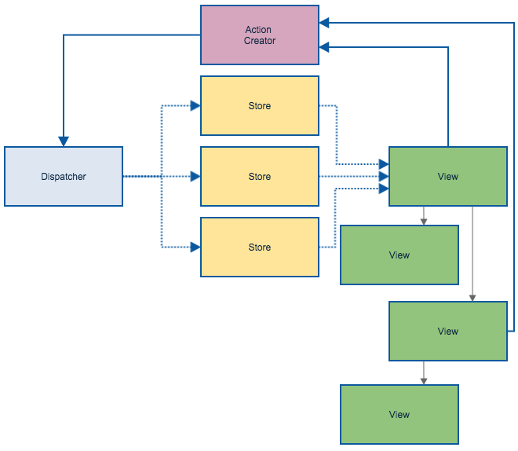
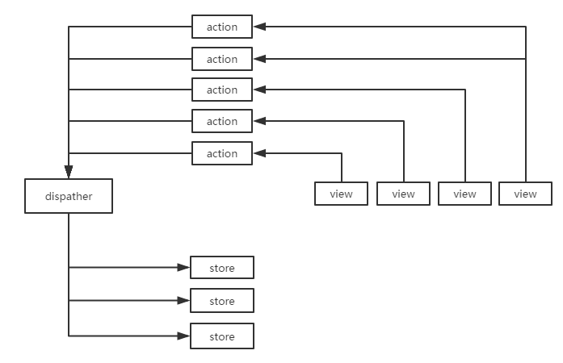

# MVC VS Flux
<!-- TOC -->

- [MVC VS Flux](#MVC-VS-Flux)
  - [MVC简介](#MVC简介)
    - [MVC的局限](#MVC的局限)
  - [Flux](#Flux)
  - [Flux代码](#Flux代码)
    - [View](#View)
    - [Actions](#Actions)
    - [Store](#Store)

<!-- /TOC -->

## MVC简介
MVC架构讲程序划分为三个角色，从上到下依次为：
* **View**: 视图，用户数据展示，同时接受用户输入
* **Contorller**：响应用户的输入，对数据进行操作，
* **Model**：负责管理程序需要的数据，并且定义了操作数据的行为。

对于一个简单的MVC架构程序来说，其工作流程如下：
<div align="center"></div>

从最右边的View开始，当用户在UI上进行操作之后，用户的操作被转发到了Controller上，Controller根据用户的操作对数据进行更新(准确来说是调用Model层的API)，数据更新之后自然视图View展现的内容也需要进行更新。Model层此时可以向所有关联的视图发出通知，收到通知的视图重新获取最新的数据。注意这最后一步Model与View的交互，大部分现有的MVC框架将其进行了封装，开发人员只要使用数据绑定即可。

如果上面的流程图还过于抽象的话，我们可以看一段MVC项目的代码，比如基于Nodejs的Kraken框架的Shopping_Cart示例项目中的controller `controllers/index.js`：
```js
var Product = require('../models/productModel');

module.exports = function (server) {
    server.get('/', function (req, res) {
        Product.find(function (err, prods) {
            if (err) {
                console.log(err);
            }

            var model =
            {
                products: prods
            };

            res.render('index', model);
        });
    });
};
```

由于这是一个后端框架，用户的操作只能通过url路径体现。当用户访问`/`路径时，首页`index.html`对应的controller，也就是该`controllers/index.js`收到请求，它调用Model层的Product模块的`find`方法请求数据，并将或得到的数据交给`index`模板进行重新渲染，产生的页面返回给用户。

为了和flux做比较，在这里我们要强调几点：

- 通常View和Controller的关系是一一对应的，比如首页index.html有自己的controller`controllers/index.js`，查询页面search.html有自己的controller`controllers/search.js`。从下面这段[angular的路由代码](AngularJS)就是很典型的示例：
  
  ```js
  phonecatApp.config(['$routeProvider',
      function($routeProvider) {
        $routeProvider.
            when('/phones', {
              templateUrl: 'partials/phone-list.html',
              controller: 'PhoneListCtrl'
            }).
            when('/phones/:phoneId', {
              templateUrl: 'partials/phone-detail.html',
              controller: 'PhoneDetailCtrl'
            }).
            otherwise({
              redirectTo: '/phones'
            });
  }]);
  ```

- controller是有业务逻辑的。虽然在MVC中我们强调"fat model, skinny controller"(业务逻辑应尽量放在Model层，Controller只应该作为View与Model的接口)，但skinny并不代表none，controller中还是有与业务相关的逻辑来决定将如何转发用户的请求，最典型的决定是转发到哪个Model层。

- Model应该被更准确的称为Domain Model(领域模型)，它不代表具体的Class或者Object，也不是单纯的databse。而是一个“层”的概念：数据在Model里得到存储，Model提供方法操作数据(Model的行为)。所以Model代码可以有业务逻辑，甚至可以有数据的存储操作的底层服务代码。

- MVC中的数据流是双向的，模型通知视图数据已经更新，视图直接查询模型中的数据。

### MVC的局限

上小节单组MVC(View、Model、Controller是1:1:1的关系)只是一种理想状态。现实中的程序往往是`多视图`，`多模型`。更严重的是视图与模型之间还可以是多对多的关系。也就是说，单个视图的数据可以来自多个模型，单个模型更新是需要通知多个视图，用户在视图上的操作可以对多个模型造成影响。可以想象最致命的后果是，视图与模型之间相互更新的死循环。

------------

## Flux
一个简单的flux流程图如下所示：

<div align="center"></div>

参照上面的图示，我们首先总结一下，flux架构下一共有四类模块角色，按照交互顺序依次是：

1. **Component/View**: 你可以把组件(Component)理解为View与Controller的结合，它既展现数据，同时也处理用户的交互请求。不同于MVC的Controller直接调用模型层业务逻辑处理接口，flux上来自用户的操作或者请求最终会映射为对应的Action，交由Action进行下一步处理。另一点需要注意的是View同时也监听着Store中数据的更改事件，一旦发生更改则重新请求数据。

2. **Action**：描述组件触发的操作，包括名称和数据，比如`{ 'actionType': 'delete', 'data': item}`

3. **Dispatcher**: flux的中央枢纽(central hub)，所有的Action都会交由Dispatcher进行处理。Dispatcher在接收到Action之后，调用Store注册在Action上的回调函数。需要注意与MVC中Controller不同的是，Dispatcher是不包含业务逻辑的，它机械的像一座桥，一个路由器，所以它能被别的程序复用当然也能被别的Dispatcher替换。

4. **Store**：包含程序的数据与业务逻辑。和MVC的Model比较，Store有一些不易被察觉但又非常重要的差异：MVC中的每一个model即对应着一个领域模型；而flux中的一个Store自己并不是一个领域模型，而是可能包含多个模型。`最重要的是，只有store自己知道如何修改数据，它并不对外直接提供操作数据的接口(但是提供查询数据的接口)，action和dispatcher没法操作store.`

一个简单的flux流程我们可以这么描述：<b style="color: red">用户在View上的操作最终会映射为一类Action，Action传递给Dispatcher，再由Dispatcher执行注册在指定Action上的回调函数。最终完成对Store的操作。如果Store中的数据发生了更改，则触发数据更改的事件，View监听着这些时间，并对这些事件做出反应（比如重新查询数据）</b>。

当有多个Store和View被添加后，复杂的flux流程图如下图所示

<div align="center"></div>

如果上图还是让你感觉到复杂的话，我们继续抽象flux流程如下：

<div align="center"></div>

由此可见即使是复杂的flux应用，它的数据流和程序的运作过程仍然是清晰可辨的。

------------

## Flux代码

### View
我们从最简单的场景出发，假设页面上只有一个按钮，我们通过这个按钮向store里添加一条数据。这里视图我们通过Reactjs实现：
```js
var View = React.createClass({  
    addNewItem: function (event) {
        Dispatcher.dispatch({
          action: 'add_item',
          data: {date: +new Date}        
        });
    },
    render: function(){
        return (
            <button onClick={this.addNewItem}>Add Item</button>
        )
    }
});
```

在按钮的点击事件中我们触发了`add_item`事件。只不过触发事件是直接通过调用`Dispatcher`来实现。

### Actions
在上面的视图代码中，我们直接调用了Dispatcher的方法。但这样的代码耦合太强了。View其实无需感知Dispatcher，这里我们更是直接把Dispatcher的细节暴露给了View，同时action也没有被抽象出来。

接下来我们把Action抽象出来
```js
var Actions = {
  add: function (item) {
      Dispatcher.dispatch({
          action: 'add_item',
          data: item        
      });   
  }
}
```

此时的View也要修改为：
```js
var View = React.createClass({  
    addNewItem: function (event) {
        Actions.add({
            date: +new Date
        });
    },
    render: function(){
        return (
            <button onClick={this.addNewItem}>Add Item</button>
        )
    }
});
```

### Store
Store负责存储并更新数据，它需要监听Dispatcher上触发的action并做出响应：
```js
var Store = {
    items: []
}

Dispatcher.register(function(payload) {
    switch(payload.action) {
        case 'add_item':
            // 当事件名为“添加”时，向仓库里添加数据
            Store.items.push(payload.data);
            // 同时触发“数据已更改”的事件
            Store.triggerEvent('change');
            break;
    }
}); 
```

当Store更新完数据之后，它还需要触发一个数据更新的事件，以告知那些关注这些数据的人。如果我们的视图需要在数据更改后时时更新数据，则还需要在Store注册数据更改事件的回调函数
```js
var View = React.createClass({
    update: function () {
        // TODO
    }, 
    componentDidMount: function() {  
        Store.bind('change', this.update);
    },  
    addNewItem: function (event) {
        Actions.add({
            date: +new Date
        });
    },
    render: function(){
        return (
            <button onClick={this.addNewItem}>Add Item</button>
        )
    }
});
```
