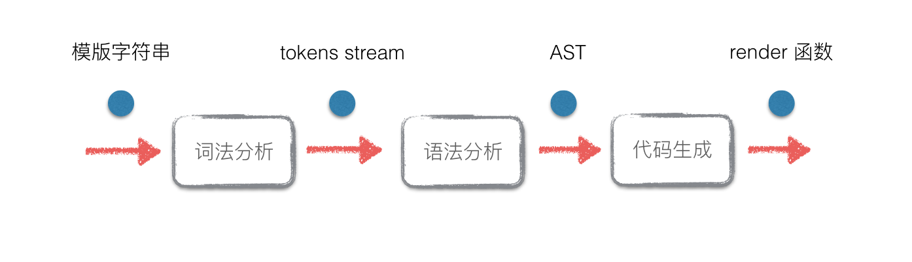
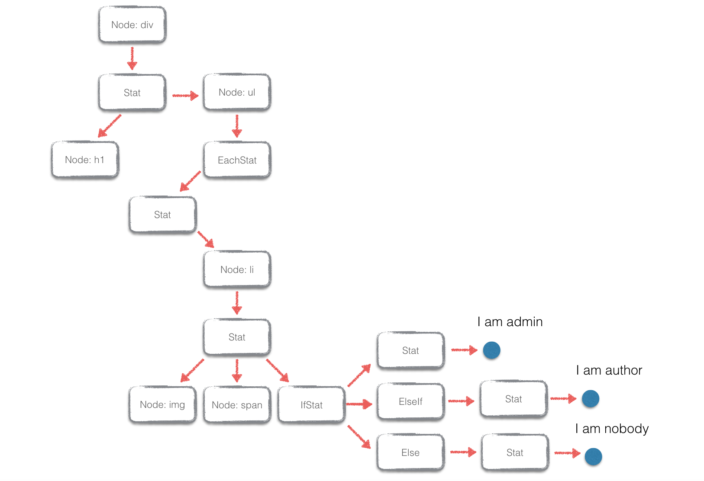

构建一个使用 Virtual-DOM 的前端模版引擎
===
<!-- TOC -->

- [构建一个使用 Virtual-DOM 的前端模版引擎](#构建一个使用-virtual-dom-的前端模版引擎)
  - [1. 前言](#1-前言)
  - [2. 模板引擎和 Virtual-DOM 结合 —— Virtual-Template](#2-模板引擎和-virtual-dom-结合--virtual-template)
  - [3. Virtual-Template 的实现](#3-virtual-template-的实现)
    - [3.1 编译原理相关](#31-编译原理相关)
    - [3.2 模板引擎的 EBNF](#32-模板引擎的-ebnf)
    - [3.3 词法分析](#33-词法分析)
    - [3.4 语法分析与抽象语法树](#34-语法分析与抽象语法树)
    - [3.5 代码生成](#35-代码生成)
  - [4. 完整的 Virtual-Template](#4-完整的-virtual-template)
  - [5. 结语](#5-结语)

<!-- /TOC -->

## 1. 前言
本文尝试构建一个 Web 前端模板引擎，并且把这个引擎和 Virtual-DOM 进行结合。把传统模板引擎编译成 HTML 字符串的方式改进为编译成 Virtual-DOM 的 render 函数，可以有效地结合模板引擎的便利性和 Virtual-DOM 的性能。类似 ReactJS 中的 JSX。

## 2. 模板引擎和 Virtual-DOM 结合 —— Virtual-Template
考虑以下模板语法：
```js
<div>
  <h1>{title}</h1>
  <ul>
    {each users as user i}
    <li class="user-item">
      
      <span>NO.{i + 1} - {user.name}</span>
      {if user.isAdmin}
        I am admin
      {elseif user.isAuthor}
        I am author
      {else}
        I am nobody
      {/if}
    </li>
    {/each}
  </ul>
</div>
```

这只一个普通的模板引擎语法（类似 artTemplate），支持循环语句（each）、条件语句（if elseif else ..）、和文本填充（{...}）， 应该比较容易看懂，这里就不解释。当用下面数据渲染该模板的时候：

```js
var data = {
  title: 'Users List',
  users: [
    {id: 'user0', name: 'Jerry', isAdmin: true},
    {id: 'user1', name: 'Lucy', isAuthor: true},
    {id: 'user2', name: 'Tomy'}
  ]
}
```

会得到下面的 HTML 字符串：
```html
<div>
  <h1>Users List</h1>
  <ul>
    <li class="user-item">
       
       <span>NO.1 - Jerry</span>
       I am admin
    </li>
    <li class="user-item">
       
       <span>NO.2 - Lucy</span>
       I am author
    </li>
    <li class="user-item">
       
       <span>NO.3 - Tomy</span>
       I am nobody
    </li>
  </ul>
</div>
```

把这个字符串塞入文档当中就可以生成 DOM 。但是问题是如果数据变更了，例如`data.title`由`Users List`修改成Users，你只能用 jQuery 修改 DOM 或者直接重新渲染一个新的字符串塞入文档当中。

然而我们可以参考 ReactJS 的 JSX 的做法，不把模板编译成 HTML， 而是把模板编译成一个返回 Virtual-DOM 的 render 函数。render 函数会根据传入的 state 不同返回不一样的 Virtual-DOM ，然后就可以根据 Virtual-DOM 算法进行 diff 和 patch：

```js
// setup codes
// ...

var render = template(tplString) // template 把模板编译成 render 函数而不是 HTML 字符串
var root1 = render(state1) // 根据初始状态返回的 virtual-dom

var dom = root.render() // 根据 virtual-dom 构建一个真正的 dom 元素
document.body.appendChild(dom)

var root2 = render(state2) // 状态变更，重新渲染另外一个 virtual-dom
var patches = diff(root1, root2) // virtual-dom 的 diff 算法
patch(dom, patches) // 更新真正的 dom 元素
```

这样做好处就是：既保留了原来模板引擎的语法，又结合了 Virtual-DOM 特性：当状态改变的时候不再需要 jQuery 了，而是跑一遍 Virtual-DOM 算法把真正的 DOM 给patch了，达到了 one-way data-binding 的效果，总结流程就是：
1. 先把模板编译成一个 render 函数，这个函数会根据数据状态返回 Virtual-DOM
2. 用 render 函数构建 Virtual-DOM；并根据这个 Virtual-DOM 构建真正的 DOM 元素，塞入文档当中
3. 当数据变更的时候，再用 render 函数渲染一个新的 Virtual-DOM
4. 新旧的 Virtual-DOM 进行 diff，然后 patch 已经在文档中的 DOM 元素

这里重点就是，如何能把模板语法编译成一个能够返回 Virtual-DOM 的 render 函数？例如上面的模板引擎，不再返回 HTML 字符串了，而是返回一个像下面那样的 render 函数：
```js
function render (state) {
  return el('div', {}, [
    el('h1', {}, [state.title]),
    el('ul', {}, state.users.map(function (user, i) {
       return el('li', {"class": "user-item"}, [
         el('img', {"src": "/avatars/" + user.id}, []),
         el('span', {}, ['No.' + (i + 1) + ' - ' + user.name]),
         (user.isAdmin 
           ? 'I am admin'
           : uesr.isAuthor 
             ? 'I am author'
             : '')
       ])
    }))
  ])
}
```

前面的模板和这个 render 函数在语义上是一样的，只要能够实现“模板 -> render 函数”这个转换，就可以跑上面所说的 Virtual-DOM 的算法流程，这样就把模板引擎和 Virtual-DOM结合起来。为了方便起见，这里把这个结合体称为 Virtual-Template 。


## 3. Virtual-Template 的实现
网上关于模板引擎的实现原理介绍非常多。如果语法不是太复杂的话，可以直接通过对语法标签和代码片段进行分割，识别语法标签内的内容（循环、条件语句）然后拼装代码，具体可以参考[这篇博客](http://www.cnblogs.com/hustskyking/p/principle-of-javascript-template.html)。其实就是正则表达式使用和字符串的操作，不需要对语法标签以外的内容做识别。

但是对于和 HTML 语法已经差别较大的模板语法（例如 Jade ），单纯的正则和字符串操作已经不够用了，因为其语法标签以外的代码片段根本不是合法的 HTML 。这种情况下一般需要编译器相关知识发挥用途：模板引擎本质上就是把一种语言编译成另外一种语言。

而对于 Virtual-Template 的情况，虽然其除了语法标签以外的代码都是合法的 HTML 字符串，但是我们的目的是把它编译成返回 Virtual-DOM 的 render 函数，在构建 Virtual-DOM 的时候，你需要知道元素的 tagName、属性等信息，所以就需要对 HTML 元素本身做识别。

因此 Virtual-Template 也需要借助编译原理（编译器前端）相关的知识，把一种语言（模板语法）编译成另外一种语言（一个叫 render 的 JavaScript 函数）。


### 3.1 编译原理相关
CS 本科都教过编译原理，本文会用到编译器前端的一些概念。在实现模板到 render 函数的过程中，要经过几个步骤：
1. 词法分析：把输入的模板分割成词法单元（tokens stream）
2. 语法分析：读入 tokens stream ，根据文法规则转化成抽象语法树（Abstract Syntax Tree）
3. 代码生成：遍历 AST，生成 render 函数体代码



所以这个过程可以分成几个主要模块：`tokenizer`（词法分析器），`parser`（语法分析器），`codegen`（代码生成）。在此之前，还需要对模板的语法做文法定义，这是构建词法分析和语法分析的基础。

### 3.2 模板引擎的 EBNF
在计算机领域，对某种语言进行语法定义的时候，几乎都会用到 EBNF（扩展的巴科斯范式）。在定义模板引擎的语法的时候，也可以用到 EBNF。Virtual-Template 拥有非常简单的语法规则，支持上面所提到的 each、if 等语法：

```js
{each users as user i }
 <div> {user.name} </div>
 ...
{/each}

{if user.isAdmin}
 ...
{elseif user.isAuthor}
 ...
{elseif user.isXXX}
 ...
{/if}
```

对于 `{user.name}` 这样的表达式插入，可以简单地看成是字符串，在代码生成的时候再做处理。这样我们的词法和语法分析就会简化很多，基本只需要对 each、if、HTML 元素进行处理。

**Virtual-Template 的 EBNF：**

```js
Stat -> Frag Stat | ε
Frag -> IfStat | EachStat | Node | text

IfStat -> '{if ...}' Stat {ElseIf} [Else] '{/if}'
ElseIf -> '{elseif ...}' Stat
Else -> '{else}' Stat|e

EachStat -> '{each ...}' Stat '{/each}'

Node -> OpenTag NodeTail
OpenTag -> '/[\w\-\d]+/' {Attr}
NodeTail -> '>' Stat '/\<[\w\d]+\>/' | '/>'

Attr -> '/[\w\-\d]/+' Value
Value -> '=' '/"[\s\S]+"/' | ε
```

可以把该文法转换成 LL(1) 文法，方便我们写递归下降的 parser。这个语法还是比较简单的，没有出现复杂的左递归情况。简单进行展开和提取左公因子消除冲突获得下面的 LL(1) 文法。

**LL(1) 文法：**
```js
Stat -> Frag Stat | ε
Frag -> IfStat | EachStat | Node | text

IfStat -> '{if ...}' Stat ElseIfs Else '{/if}'
ElseIfs -> ElseIf ElseIfs | ε
ElseIf -> '{elseif ...}' Stat
Else -> '{else}' Stat | ε

EachStat -> '{each ...}' Stat '{/each}'

Node -> OpenTag NodeTail
OpenTag -> '/[\w\-\d]+/' Attrs
NodeTail -> '>' Stat '/\<[\w\d]+\>/' | '/>'

Attrs -> Attr Attrs | ε 
Attr -> '/[\w\-\d]/+' Value
Value -> '=' '/"[\s\S]+"/' | ε
```

### 3.3 词法分析
根据上面获得的 EBNF ，单引号包含的都是非终结符，可以知道有以下几种词法单元：
```js
module.exports = {
  TK_TEXT: 1, // 文本节点
  TK_IF: 2, // {if ...}
  TK_END_IF: 3, // {/if}
  TK_ELSE_IF: 4, // {elseif ...}
  TK_ELSE: 5, // {else}
  TK_EACH: 6, // {each ...}
  TK_END_EACH: 7, // {/each}
  TK_GT: 8, // >
  TK_SLASH_GT: 9, // />
  TK_TAG_NAME: 10, // <div|<span||</span>|</a>|...
  TK_EOF: 100 // end of file
}
```

使用 JavaScript 自带的正则表达式引擎编写 tokenizer 很方便，把输入的模板字符串从左到右进行扫描，按照上面的 token 的类型进行分割：
```js
function Tokenizer (input) {
  this.input = input
  this.index = 0
  this.eof = false
}

var pp = Tokenizer.prototype

pp.nextToken = function () {
  this.eatSpaces()
  return (
    this.readCloseTag() ||
    this.readTagName() ||
    this.readAttrName() ||
    this.readAttrEqual() ||
    this.readAttrString() ||
    this.readGT() ||
    this.readSlashGT() ||
    this.readIF() ||
    this.readElseIf() ||
    this.readElse() ||
    this.readEndIf() ||
    this.readEach() ||
    this.readEndEach() ||
    this.readText() ||
    this.readEOF() ||
    this.error()
  )
}

// read token methods
// ...
```

Tokenizer 会存储一个 `index`，标记当前识别到哪个字符位置。每次调用 `nextToken` 会先跳过所有的空白字符，然后尝试某一种类型的 token ，识别失败就会尝试下一种，如果成功就直接返回，并且把 `index` 往前移；所有类型都试过都无法识别那么就是语法错误，直接抛出异常。

具体每个识别的函数其实就是正则表达式的使用，这里就不详细展开，有兴趣可以阅读源码 [tokenizer.js](https://github.com/livoras/virtual-template/blob/dsl/src/tokenizer.js)

最后会把这样的文章开头的模板例子转换成下面的 tokens stream：
```js
{ type: 10, label: 'div' }
{ type: 8, label: '>' }
{ type: 10, label: 'h1' }
{ type: 8, label: '>' }
{ type: 1, label: '{title}' }
{ type: 13, label: '</h1>' }
{ type: 10, label: 'ul' }
{ type: 8, label: '>' }
{ type: 6, label: '{each users as user i}' }
{ type: 10, label: 'li' }
{ type: 11, label: 'class' }
{ type: 12, label: '=' }
{ type: 13, label: 'user-item' }
{ type: 8, label: '>' }
{ type: 10, label: 'img' }
{ type: 11, label: 'src' }
{ type: 12, label: '=' }
{ type: 13, label: '/avatars/{user.id}' }
{ type: 9, label: '/>' }
{ type: 10, label: 'span' }
{ type: 8, label: '>' }
{ type: 1, label: 'NO.' }
{ type: 1, label: '{i + 1} - ' }
{ type: 1, label: '{user.name}' }
{ type: 13, label: '</span>' }
{ type: 2, label: '{if user.isAdmin}' }
{ type: 1, label: 'I am admin\r\n        ' }
{ type: 4, label: '{elseif user.isAuthor}' }
{ type: 1, label: 'I am author\r\n        ' }
{ type: 5, label: '{else}' }
{ type: 1, label: 'I am nobody\r\n        ' }
{ type: 3, label: '{/if}' }
{ type: 13, label: '</li>' }
{ type: 7, label: '{/each}' }
{ type: 13, label: '</ul>' }
{ type: 13, label: '</div>' }
{ type: 100, label: '$' }
```

### 3.4 语法分析与抽象语法树
拿到 tokens 以后就可以就可以按顺序读取 token，根据模板的 LL(1) 文法进行语法分析。语法分析器，也就是 parser，一般可以采取**递归下降**的方式来进行编写。LL(1) 不允许语法中有冲突（ conflicts )，需要对文法中的产生式求解 FIRST 和 FOLLOW 集。

```js
FIRST(Stat) = {TK_IF, TK_EACH, TK_TAG_NAME, TK_TEXT}
FOLLOW(Stat) = {TK_ELSE_IF, TK_END_IF, TK_ELSE, TK_END_EACH, TK_CLOSE_TAG, TK_EOF}
FIRST(Frag) = {TK_IF, TK_EACH, TK_TAG_NAME, TK_TEXT}
FIRST(IfStat) = {TK_IF}
FIRST(ElseIfs) = {TK_ELSE_IF}
FOLLOW(ElseIfs) = {TK_ELSE, TK_ELSE}
FIRST(ElseIf) = {TK_ELSE_IF}
FIRST(Else) = {TK_ELSE}
FOLLOW(Else) = {TK_END_IF}
FIRST(EachStat) = {TK_EACH}
FIRST(OpenTag) = {TK_TAG_NAME}
FIRST(NodeTail) = {TK_GT, TK_SLASH_GT}
FIRST(Attrs) = {TK_ATTR_NAME}
FOLLOW(Attrs) = {TK_GT, TK_SLASH_GT}
FIRST(Value) = {TK_ATTR_EQUAL}
FOLLOW(Value) = {TK_ATTR_NAME, TK_GT, TK_SLASH_GT}
```

上面只求出了一些必要的 FIRST 和 FOLLOW 集，对于一些不需要预测的产生式就省略求解了。有了 FIRST 和 FOLLOW 集，剩下的编写递归下降的 parser 只是填空式的体力活。

```js
var Tokenizer = require('./tokenizer')
var types = require('./tokentypes')

function Parser (input) {
  this.tokens = new Tokenizer(input)
  this.parse()
}

var pp = Parser.prototype

pp.is = function (type) {
  return (this.tokens.peekToken().type === type)
}

pp.parse = function () {
  this.tokens.index = 0
  this.parseStat()
  this.eat(types.TK_EOF)
}

pp.parseStat = function () {
  if (
    this.is(types.TK_IF) ||
    this.is(types.TK_EACH) ||
    this.is(types.TK_TAG_NAME) ||
    this.is(types.TK_TEXT)
  ) {
    this.parseFrag()
    this.parseStat()
  } else {
    // end
  }
}

pp.parseFrag = function () {
  if (this.is(types.TK_IF)) return this.parseIfStat()
  else if (this.is(types.TK_EACH)) return this.parseEachStat()
  else if (this.is(types.TK_TAG_NAME)) return this.parseNode()
  else if (this.is(types.TK_TEXT)) {
    var token = this.eat(types.TK_TEXT)
    return token.label
  } else {
    this.parseError('parseFrag')
  }
}

// ...
```

完整的 parser 可以查看 [parser.js](https://github.com/livoras/virtual-template/blob/dsl/src/parser.js)。

**抽象语法树（Abstract Syntax Tree）**

递归下降进行语法分析的时候，可以同时构建模版语法的树状表示结构——抽象语法树，模板语法有以下的抽象语法树的节点类型：

```js
Stat: {
    type: 'Stat'
    members: [IfStat | EachStat | Node | text, ...]
}

IfStat: {
    type: 'IfStat'
    label: <string>,
    body: Stat
    elifs: [ElseIf, ...]
    elsebody: Stat
}

ElseIf: {
    type: 'ElseIf'
    label: <string>,
    body: Stat
}

EachStat: {
    type: 'EachStat'
    label: <string>,
    body: Stat
}

Node: {
    type: 'Node'
    name: <string>,
    attributes: <object>,
    body: Stat
}
```

因为 JavaScript 语法的灵活性，可以用字面量的 JavaScript 对象和数组直接表示语法树的树状结构。语法树构的建过程可以在语法分析阶段同时进行。最后，可以获取到如下图的语法树结构：




完整的语法树构建过程，可以查看 [parser.js](https://github.com/livoras/virtual-template/blob/dsl/src/parser.js) 。

从模版字符串到 tokens stream 再到 AST ，这个过程只需要对文本进行一次扫描，整个算法的时间复杂度为 O(n)。

至此，Virtual-Template 的编译器前端已经完成了。


### 3.5 代码生成
JavaScript 从字符串中构建一个新的函数可以直接用 `new Function` 即可。例如：

```js
var newFunc = new Function('a', 'b', 'return a + b')
newFunc(1, 2) // => 3
```

这里需要通过语法树来还原 render 函数的函数体的内容，也就是 `new Function` 的第三个参数。

拿到模版语法的抽象语法树以后，生成相应的 JavaScript 函数代码就很好办了。只需要地对生成的 AST 进行深度优先遍历，遍历的同时维护一个数组，这个数组保存着 render 函数的每一行的代码：

```js
function CodeGen (ast) {
  this.lines = []
  this.walk(ast)
  this.body = this.lines.join('\n')
}

var pp = CodeGen.prototype

pp.walk = function (node) {
  if (node.type === 'IfStat') {
    this.genIfStat(node)
  } else if (node.type === 'Stat') {
    this.genStat(node)
  } else if (node.type === 'EachStat') {
    ...
  }
  ...
}

pp.genIfStat = function (node) {
  var expr = node.label.replace(/(^\{\s*if\s*)|(\s*\}$)/g, '')
  this.lines.push('if (' + expr + ') {')
  if (node.body) {
    this.walk(node.body)
  }
  if (node.elseifs) {
    var self = this
    _.each(node.elseifs, function (elseif) {
      self.walk(elseif)
    })
  }
  if (node.elsebody) {
    this.lines.push(indent + '} else {')
    this.walk(node.elsebody)
  }
  this.lines.push('}')
}

// ...
```

`CodeGen` 类接受已经生成的 AST 的根节点，然后 `this.walk(ast)` 会对不同的节点类型进行解析。例如对于 `IfStat` 类型的节点：

```js
{ 
  type: 'IfStat',
  label: '{if user.isAdmin}'
  body: {...}
  elseifs: [{...}, {...}, {...}],
  elsebody: {...}
}
```

`genIfStat` 会把 `'{if user.isAdmin}'` 中的 `user.isAdmin` 抽离出来，然后拼接 JavaScript 的 if 语句，push 到 `this.lines` 中：

```js
var expr = node.label.replace(/(^\{\s*if\s*)|(\s*\}$)/g, '')
this.lines.push('if (' + expr + ') {')
```

然后会递归的对 `elseifs` 和 `elsebody` 进行遍历和解析，最后给 `if` 语句补上 `}`。所以如果 `elseifs` 和 `elsebody` 都不存在，`this.lines` 上就会有：

```js
['if (user.isAdmin) {', <body>, '}']
```

其它的结构和 `IfStat` 同理的解析和拼接方式，例如 `EachStat`:

```js
pp.genEachStat = function (node) {
  var expr = node.label.replace(/(^\{\s*each\s*)|(\s*\}$)/g, '')
  var tokens = expr.split(/\s+/)
  var list = tokens[0]
  var item = tokens[2]
  var key = tokens[3]
  this.lines.push(
    'for (var ' + key + ' = 0, len = ' + list + '.length; ' + key + ' < len; ' + key + '++) {'
  )
  this.lines.push('var ' + item + ' = ' + list + '[' + key + '];')
  if (node.body) {
    this.walk(node.body)
  }
  this.lines.push('}')
}
```

最后递归构造完成以后，`this.lines.join('\n')` 就把整个函数的体构建起来：

```js
if (user.isAdmin) {
...
}

for (var ...) {
...
}
```

这时候 `render` 函数的函数体就有了，直接通过 `new Function` 构建 `render` 函数：
```js
var code = new CodeGen(ast)
var render = new Function('el', 'data', code.body)
```

`el` 是需要注入的构建 Virtual-DOM 的构建函数，`data` 需要渲染的数据状态：

```js
var svd = require('simple-virtual-dom')
var root = render(svd.el, {users: [{isAdmin: true}]})
```

从模版 -> Virtual-DOM 的 render 函数 -> Virtual-DOM 的过程就完成了。完整的代码生成的过程可以参考：[codegen.js](https://github.com/livoras/virtual-template/blob/dsl/src/codegen.js)


## 4. 完整的 Virtual-Template
其实拿到 `render` 函数以后，每次手动进行 `diff` 和 `patch` 都是重复操作。可以把 `diff` 和 `patch` 也封装起来，只暴露一个 `setData` 的 API 。每次数据变更的时候，只需要 `setData` 就可以更新到 DOM 元素上（就像 ReactJS 的 `setState`）：

```js
// vTemplate.compile 编译模版字符串，返回一个函数
var usersListTpl = vTemplate.compile(tplStr)

// userListTpl 传入初始数据状态，返回一个实例
var usersList = usersListTpl({
  title: 'Users List',
  users: [
    {id: 'user0', name: 'Jerry', isAdmin: true},
    {id: 'user1', name: 'Lucy', isAuthor: true},
    {id: 'user2', name: 'Tomy'}
  ]
})

// 返回的实例有 dom 元素和一个 setData 的 API
document.appendChild(usersList.dom)

// 需要变更数据的时候，setData 一下即可
usersList.setData({
  title: 'Users',
  users: [
    {id: 'user1', name: 'Lucy', isAuthor: true},
    {id: 'user2', name: 'Tomy'}
  ]
})
```

完整的 Virtual-Template 源码托管在 [github](https://github.com/livoras/virtual-template) 。

## 5. 结语
这个过程其实和 ReactJS 的 JSX 差不多。就拿 Babel 的 JSX 语法实现而言，它的 parser 叫 [babylon](https://github.com/babel/babel/tree/master/packages/babylon)。而 babylon 基于一个叫 [acorn](https://github.com/marijnh/acorn) 的 JavaScript 编写的 JavaScript 解释器和它的 JSX 插件 [acorn-jsx](https://github.com/RReverser/acorn-jsx)。其实就是利用 acorn 把文本分割成 tokens，而 JSX 语法分析部分由 acorn-jsx 完成。

Virtual-Template 还不能应用于实际的生产环境，需要完善的东西还有很多。本文记录基本的分析和实现的过程，也有助于更好地理解和学习 ReactJS 的实现。
