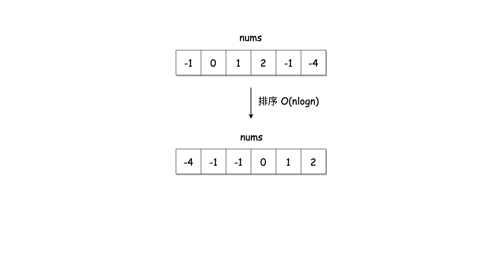
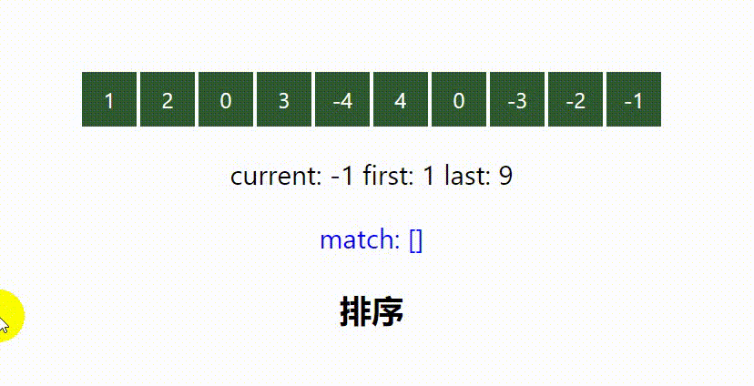

三数之和
====

<!-- TOC -->

- [三数之和](#三数之和)
  - [题目](#题目)
  - [解析](#解析)
    - [热身](#热身)
    - [three sum](#three-sum)
    - [再优化](#再优化)
    - [针对特殊用例优化](#针对特殊用例优化)
    - [重构策略](#重构策略)
  - [思路](#思路)
  - [Three Sum Gif图解](#Three-Sum-Gif图解)
    - [原理](#原理)
    - [图解](#图解)

<!-- /TOC -->

## 题目
给定一个包含 n 个整数的数组 `nums`，判断 `nums` 中是否存在三个元素 a，b，c ，使得 a + b + c = 0 ？找出所有满足条件且不重复的三元组。

**注意**：答案中不可以包含重复的三元组。

```js
例如, 给定数组 nums = [-1, 0, 1, 2, -1, -4]，
满足要求的三元组集合为：
[
  [-1, 0, 1],
  [-1, -1, 2]
]
```

## 解析
### 热身
首先，先找一下它的简化版 2sum 来热热身。

最简单的想法就是把每两个都拿出来加一下，看看结果是不是我们想要的。但是直觉告诉我们，这样子并不高效。举一个很实际的例子就能明白。

比如这个周末你去参加线下相亲会，全场有且只有两个人才是真爱。于是我们每个人都要去找其他所有人聊天，去寻找 ta 是不是自己要找的另一半。每个人都要和每个人说话，这样时间复杂度很高，翻译成计算机的表示就是 O(n2)。

```JavaScript
var twoSum = function(nums, target) {
  for (let i = 0; i < nums.length - 1; i++) { // 每个人
    for (let j = i + 1; j < nums.length; j++) { // 都去问其他的人
      if (nums[i]+nums[j] === target) {
        return [nums[i], nums[j]]
      }
    }
  }
}
```

怎么样可以更高效一点？ 这时候要引入哈希表，其实就是一个登记册，写上你的名字和你的要求。如果每个人都提前在主持人那里登记一遍，然后只要大家依次再报出自己名字，主持人就能够识别到，ta 就是你要找的人。

```JavaScript
var twoSum = function(nums, target) {
  let res = {}
  for (let i = 0; i < nums.length; i++) { // 每个人登记自己想要配对的人，让主持人记住
    res[target - nums[i]] = nums[i]
  }
  for (let j = 0; j < nums.length; j++) { // 每个人再次报数的时候，主持人看一下名单里有没有他
    if (res[nums[j]] !== undefined) {
      return [nums[j], res[nums[j]]]
    }
  }
}
```

很容易看出来，上面的方案仍然可以优化。就是每个人都来问一下主持人，自己要找的人有没有来登记过，如果没有的话，就把自己的要求写下来，等着别人来找自己。

```JavaScript
var twoSum = function(nums, target) {
  let res = {}
  for (let i = 0; i < nums.length; i++) { // 每个人报出自己想要配对的人
    if (res[nums[i]] !== undefined) { // 如果有人被登记过
      return [nums[i], res[nums[i]]] // 就是他
    } else {  // 否则
      res[target - nums[i]] = nums[i] // 主持人记住他的需求
    }
  }
}
```

2sum 问题最坏的情况是，第一个人和最后一个人配对，每个人都发了一次言。时间复杂度是 O(n)，空间复杂度也是 O(n)，因为主持人要用小本本记录下每个人的发言，最坏的时候，要把所有人的诉求都记一遍。

从生活经验中我们能感觉到什么方案是最好的，而且也能够知道，什么算法已经到达了优化的极限。这就是所谓的”只使用人类的聪明才智“就可以做出来。

当然， 如果没有编程的基础，可能不会想到哈希表-登记册这样的类比，但这应该只影响把解决方案转化为代码表达。想到解决方案这件事，其实是完全不依赖编码能力的。

### three sum
好的，热身结束，现在来看 3sum 问题。这个问题复杂了一些，变成了一个人找两个人。

一个新的周末，你再次去现在参加了一个，额，这次不是相亲会，是参加一个街篮比赛，赛前当然要组队啦，现在要想一个方法找到队友。组队还有一个要求，就是队伍的平均实力要符合要求，比如菜鸟抱两个大腿，或者有王者带两个弱鸡。

我们先想一个保底的办法，再去慢慢优化。最简单的办法是，每个人都去依次拉上另一个人一起去找第三个人，这个时间复杂度是 O(n3)O(n3)。

```JavaScript
var threeSum = function(nums) {
  let res = []
  for (let i = 0; i < nums.length - 2; i++) { // 每个人
    for (let j = i + 1; j < nums.length - 1; j++) { // 依次拉上其他每个人
      for (let k = j + 1; k < nums.length; k++) { // 去问剩下的每个人
        if (nums[i] + nums[j] + nums[k] === 0) { // 我们是不是可以一起组队
          res.push([nums[i], nums[j], nums[k]])
        }
      }
    }
  }
  return res
}
```

受到上题的启发，在凑齐两人以后，他们可以找主持人登记需求的第三人，而不需要在茫茫人海中去找队友。这样，我们就把问题优化成了每个人都要找其他每个人，即时间复杂度 O(n2)O(n2)，因为需要主持人记录数据，这里还有 O(n)O(n) 的空间复杂度。

```JavaScript
var threeSum = function(nums) {
  let res = []
  let hash = {}
  for (let i = 0; i < nums.length - 2; i++) { // 每个人
    for (let j = i + 1; j < nums.length - 1; j++) { // 依次拉上其他每个人
      if (hash[nums[j]] !== undefined) { // 已经有合适自己的两人组
        res.push([nums[j]].concat(hash[nums[j]]))
        hash[nums[j]] = undefined
      } else { // 没有合适自己的两人组
        let mark = 0 - nums[i] - nums[j]
        hash[mark] = [nums[i], nums[j]]
      }
    }
  }
  return res
} // 示意代码 未AC
```

### 再优化
现在已经想到了可用的通用方案，根据题目的特点，看看还有哪里可以做一些优化。比如提前结束一些不可能的组合。

首先安排所有人按照顺序排队站好，这是一个需要花时间的操作，不过磨刀不误砍柴工，付出这个时间还是值得的。排序可以做到 O(nlogn)，这是优于 O(n^2)的。

作者：wonderful611
链接：https://leetcode-cn.com/problems/two-sum/solution/three-sum-ti-jie-by-wonderful611/
来源：力扣（LeetCode）
著作权归作者所有。商业转载请联系作者获得授权，非商业转载请注明出处。

然后我们选择一个人做C位，既然是C位，那么就需要左右各有一个人。先选择队伍最左边（最小值）和队伍最右边（最大值）两个人，加上你，算一下总和。如果大于 0，说明实力太强了，就把就把右侧的人选调左一位，反之，则调整左边的人选，增强一下实力。当某边选到紧挨着你的人的时候，就意味着组队结束，以你为 C位的所有可能都已经尝试完毕了。

```JavaScript
var threeSum = function (nums) {
  let res = []
  nums.sort((a, b) => a - b) // 先排个队，最左边是最弱（小）的，最右边是最强(大)的
  for (let i = 1; i < nums.length - 1; i++) { // C位人选
    let first = 0
    let last = nums.length - 1
    do {
      let result = nums[i] + nums[first] + nums[last]
      if (result === 0) { // 如果可以组队
        res.push([nums[i], nums[first], nums[last]])
      }
      if (result <= 0 && first < i) { // 实力太弱，把菜鸟那边右移一位
        while (nums[first] === nums[++first]); // 如果相等就跳过
      } else if (result > 0 && last > i) { // 实力太强，把大神那边右移一位
        while (nums[last] === nums[--last]);
      } else {
        break // 某一边已经没有人选了
      }
    } while (1) { }
  }
  return res
} // 示意代码 未AC
```

于是我们开开心心的把解答发到了力扣，然后就得到了一个 WA（wrong answer）。因为力扣的测试用例往往会有很多边界数据，不针对这些特殊情况做考虑的话，几乎一定会翻车的。

### 针对特殊用例优化
我们刚刚的解法，会在 [0,0,0,0] 这个情况下败下阵来，此时有两个解决方案，第一种就是直接堵上漏洞，针对有问题的测试数据在代码中加补丁。如果运气好的话，可能下一次提交就会 AC 了。但是这种方法在竞赛中是不可取的，因为一次 WA 会有罚时。在工作中我们可能顺手就打补丁修了问题，然后等到测试报出其他问题再去修。如果测试恰好没有发现任何问题，这段代码就可以上线了。但是这样带来的问题，一是并没有在逻辑层面消除某一类特殊数据可能带来的问题，二是代码会很丑陋，变得难以维护。

所以更好的做法是：从这个不通过的数据提取特征，添加对应特征数据的处理逻辑，一次修复一类的错误，并且尽量保持代码的流畅。

此处的报错是由重复数据引起的，看样子完全一样的两个人没必要 C 位出道两次，但是在一个队伍中其实存在着有两个相同值的可能，比如 [-1, -1, 2] 这种组合。

于是我们新的问题就是：当有多个相同值的时候，选谁做 C 位？

像在[-1, -1, 2]这个例子中，由第二个-1做了 C 位，我们用人类的聪明才智想一下就很容易想明白。如果一个负数要做 C 位，它必须要保证队里有一个正数，所以选择最右边的那个就可以。反过来看 [-2, 1, 1] 这个案例，为了保证至少有一个负数，我们选择最左边的重复值。

对于 0 这个特殊值来说，左右一定是对称的，有一个极特殊的情况就是队列里面有超过三个 0，此时只有选择中间的 0 才能保证不遗漏这种情况。除此之外，选择哪个0居中都是无所谓的。

### 重构策略
等等，分析到这里，好像把事情搞得过于复杂了。我们在选择第一个人的时候就分了三种情况。 重新思考一下，一开始选择 C 位，实则是为了利用有序数组快速筛选方案。因为这个人位于中间，所以才会有复杂的选取策略。如果第一次直接选择最左边的那个人，后面的策略依然类似，以双指针从最大最小两端相向而行，直到相遇，或者即将筛选出来三个符号相同的结果，即停止。好像仍然可以找到正确答案，同时也恰好避开了复杂的选 C 位情况。

我们可以进一步把一些明显出界的条件加上判断，再一次剪除部分无用尝试。

```JavaScript
var threeSum = function (nums) {
  let res = []
  let length = nums.length;
  nums.sort((a, b) => a - b) // 先排个队，最左边是最弱（小）的，最右边是最强(大)的
  if (nums[0] <= 0 && nums[length - 1] >= 0) { // 优化1: 整个数组同符号，则无解
    for (let i = 0; i < length - 2;) {
      if (nums[i] > 0) break; // 优化2: 最左值为正数则一定无解
      let first = i + 1
      let last = length - 1
      do {
        if (first >= last || nums[i] * nums[last] > 0) break // 两人选相遇，或者三人同符号，则退出
        let result = nums[i] + nums[first] + nums[last]
        if (result === 0) { // 如果可以组队
          res.push([nums[i], nums[first], nums[last]])
        }
        if (result <= 0 ) { // 实力太弱，把菜鸟那边右移一位
          while (first < last && nums[first] === nums[++first]){} // 如果相等就跳过
        } else { // 实力太强，把大神那边右移一位
          while (first < last && nums[last] === nums[--last]) {}
        }
      } while (first < last)
      while (nums[i] === nums[++i]) {}
    }
  }
  return res
}
```

面试中考察算法当然有可能就是比较纯粹的智商测试。既然你能够讲清楚这道题，至少说明你可以理解一个较复杂问题是如何解决的，思维和表达能力可以达到一定的水平。

另一种考察的可能，并不是要背算法，而是让面试者现场对问题进行分析，提出解决方案，然后进一步的转化为代码，再去验证。在这个过程中还可以持续的优化，包括对边界的优化补充，局部分支优化，甚至也包括对解法模型的优化。 这和我们日常的开发过程也很像。从需求抽象出技术方案，再转化为代码，经过联调测试，修bug，可能还有整合和重构。

## 思路
- 标签：数组遍历
- 首先对数组进行排序，排序后固定一个数nums[i]nums[i]，再使用左右指针指向nums[i]nums[i]后面的两端，数字分别为nums[L]nums[L]和nums[R]nums[R]，计算三个数的和sumsum判断是否满足为 00，满足则添加进结果集
- 如果nums[i]nums[i]大于 00，则三数之和必然无法等于 00，结束循环
- 如果nums[i]nums[i] == nums[i-1]nums[i−1]，则说明该数字重复，会导致结果重复，所以应该跳过
- 当sumsum == 00 时，nums[L]nums[L] == nums[L+1]nums[L+1]则会导致结果重复，应该跳过，L++L++
- 当sumsum == 00 时，nums[R]nums[R] == nums[R-1]nums[R−1]则会导致结果重复，应该跳过，R--R−−
- 时间复杂度：O(n^2)，n为数组长度

```js
/**
 * @param {number[]} nums
 * @return {number[][]}
 */
var threeSum = function(nums) {
  let ans = [];
  nums.sort((a, b) => a - b); // 排序
  const len = nums.length;
  if (nums == null || len < 3) return ans;
  for (let i = 0; i < len; i++) {
    if (nums[i] > 0) break; // 如果当前数字大于0，则三数之和一定大于0，所以结束循环
    if (i > 0 && nums[i] == nums[i - 1]) continue; // 去重
    let L = i + 1;
    let R = len - 1;
    while (L < R) {
      const sum = nums[i] + nums[L] + nums[R];
      if (sum == 0) {
        ans.push([nums[i], nums[L], nums[R]]);
        while (L < R && nums[L] == nums[L + 1]) L++; // 去重
        while (L < R && nums[R] == nums[R - 1]) R--; // 去重
        L++;
        R--;
      } else if (sum < 0) L++;
      else if (sum > 0) R--;
    }
  }
  return ans;
};
```
画解


## Three Sum Gif图解
### 原理
- 先将数组进行排序
- 从左侧开始，选定一个值为 `定值` ，右侧进行求解，获取与其相加为 00 的两个值
- 类似于快排，定义首和尾
- 首尾与 `定值` 相加
  1. 等于 00，记录这三个值
  2. 小于 00，首部右移
  3. 大于 00，尾部左移
- 定值右移，重复该步骤

### 图解


```js
var threeSum = function(nums) {
  // 最左侧值为定值，右侧所有值进行两边推进计算
  let res = [];
  nums.sort((a, b) => a - b);
  let size = nums.length;
  if (nums[0] <= 0 && nums[size - 1] >= 0) {
    // 保证有正数负数
    let i = 0;
    while (i < size - 2) {
      if (nums[i] > 0) break; // 最左侧大于0，无解
      let first = i + 1;
      let last = size - 1;
      while (first < last) {
        if (nums[i] * nums[last] > 0) break; // 三数同符号，无解
        let sum = nums[i] + nums[first] + nums[last];
        if (sum === 0) {
          res.push([nums[i], nums[first], nums[last]]);
        }
        if (sum <= 0) {
          // 负数过小，first右移
          while (nums[first] === nums[++first]) {} // 重复值跳过
        } else {
          while (nums[last] === nums[--last]) {} // 重复值跳过
        }
      }
      while (nums[i] === nums[++i]) {}
    }
  }

  return res;
};
```
