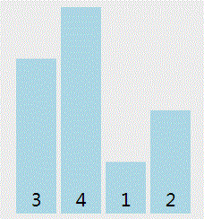

冒泡排序
====

**思想**
- 冒泡排序只会操作相邻的两个数据。
- 每次冒泡操作都会对相邻的两个元素进行比较，看是否满足大小关系要求。如果不满足就让它俩互换。
- 一次冒泡会让至少一个元素移动到它应该在的位置，重复 n 次，就完成了 n 个数据的排序工作。


**特点**
- 优点：排序算法的基础，简单实用易于理解。
- 缺点：比较次数多，效率较低。

**实现**
```js
// 冒泡排序（未优化）
const bubbleSort = arr => {
	console.time('改进前冒泡排序耗时');
	const length = arr.length;
	if (length <= 1) return;
	// i < length - 1 是因为外层只需要 length-1 次就排好了，第 length 次比较是多余的。
	for (let i = 0; i < length - 1; i++) {
		// j < length - i - 1 是因为内层的 length-i-1 到 length-1 的位置已经排好了，不需要再比较一次。
		for (let j = 0; j < length - i - 1; j++) {
			if (arr[j] > arr[j + 1]) {
				const temp = arr[j];
				arr[j] = arr[j + 1];
				arr[j + 1] = temp;
			}
		}
	}
	console.log('改进前 arr :', arr);
	console.timeEnd('改进前冒泡排序耗时');
};
```

优化：当某次冒泡操作已经没有数据交换时，说明已经达到完全有序，不用再继续执行后续的冒泡操作。

```js
// 冒泡排序（已优化）
const bubbleSort2 = arr => {
	console.time('改进后冒泡排序耗时');
	const length = arr.length;
	if (length <= 1) return;
	// i < length - 1 是因为外层只需要 length-1 次就排好了，第 length 次比较是多余的。
	for (let i = 0; i < length - 1; i++) {
		let hasChange = false; // 提前退出冒泡循环的标志位
		// j < length - i - 1 是因为内层的 length-i-1 到 length-1 的位置已经排好了，不需要再比较一次。
		for (let j = 0; j < length - i - 1; j++) {
			if (arr[j] > arr[j + 1]) {
				const temp = arr[j];
				arr[j] = arr[j + 1];
				arr[j + 1] = temp;
				hasChange = true; // 表示有数据交换
			}
		}

		if (!hasChange) break; // 如果 false 说明所有元素已经到位，没有数据交换，提前退出
	}
	console.log('改进后 arr :', arr);
	console.timeEnd('改进后冒泡排序耗时');
};
```

**测试**
```js
// 测试
const arr = [7, 8, 4, 5, 6, 3, 2, 1];
bubbleSort(arr);
// 改进前 arr : [1, 2, 3, 4, 5, 6, 7, 8]
// 改进前冒泡排序耗时: 0.43798828125ms

const arr2 = [7, 8, 4, 5, 6, 3, 2, 1];
bubbleSort2(arr2);
// 改进后 arr : [1, 2, 3, 4, 5, 6, 7, 8]
// 改进后冒泡排序耗时: 0.318115234375ms
```

**分析**
1. 第一，冒泡排序是原地排序算法吗 ？  
    冒泡的过程只涉及相邻数据的交换操作，只需要常量级的临时空间，所以它的空间复杂度为 O(1)，是一个原地排序算法。

2. 第二，冒泡排序是稳定的排序算法吗 ？   
  在冒泡排序中，只有交换才可以改变两个元素的前后顺序。为了保证冒泡排序算法的稳定性，当有相邻的两个元素大小相等的时候，我们不做交换，相同大小的数据在排序前后不会改变顺序。所以冒泡排序是稳定的排序算法。

3. 第三，冒泡排序的时间复杂度是多少 ？  
   - 最佳情况：T(n) = O(n)，当数据已经是正序时。
   - 最差情况：T(n) = O(n2)，当数据是反序时。
   - 平均情况：T(n) = O(n2)。


**动画**



[动画地址(https://algorithm-visualizer.org/brute-force/bubble-sort)](https://algorithm-visualizer.org/brute-force/bubble-sort)

<br />

-----

<br />

> 两个for循环

1. 外层 for 循环控制循环次数 
2. 内层 for 循环进行两数交换，找每次的最大数，排到最后 
3. 设置一个标志位，减少不必要的循环

```js
var examplearr = [8, 94, 15, 88, 55, 76, 21, 39];

function bubbleSort(arr) {
  for (i = 0; i < arr.length - 1; i++) {
    for (j = 0; j < arr.length - 1 - i; j++) {
      if (arr[j] > arr[j + 1]) {
        var temp = arr[j];
        arr[j] = arr[j + 1];
        arr[j + 1] = temp;
      }
    }
  }
  return arr;
}
bubbleSort(examplearr);
console.log(examplearr);
```

> while

```js
function bubbleSort(arr) {
  let i = arr.length - 1;
  while (i >= 0) {
    for (let j = 0; j < i; j++) {
      if (arr[j] > arr[j + 1]) {
        [arr[j], arr[j + 1]] = [arr[j + 1], arr[j]];
      }
    }
    i--;
  }
  return arr;
}
```

---

为什么我们在冒泡排序算法的内部循环中使用`length-i-1`？

在每次外迭代之后，第i个最大元素位于正确的位置。所以在第一次迭代之后，最大的元素在最右侧。不需要在下一轮比较这个元素。在第二次迭代之后，第二大元素位于最右侧的-1位置。所以这两个最大的元素已经排序了，不必在下一轮考虑它们。

假设仅仅为了举例而有10个元素的数组。

第一步
```js
i = 0, j goes from 0 to 9( = 10 - 0 - 1)
```

所以它遍历整个数组。现在，每次当前元素比下一个更大时，我们将它们切换（by if(arr[j] > arr[j+1])），因此在第一次迭代结束时，在最后一个位置，我们将拥有数组的最大元素。

第二步
```js
i = 1, j goes from 0 to 8( = 10 - 1 - 1)
```

我们可以注意到我们排除了最后一个（第9）的位置，但是我们知道它已经是上一步的最大值，所以处于正确的位置。在这次迭代结束时，我们将在第8个位置有第2个最大元素，并且过程继续。