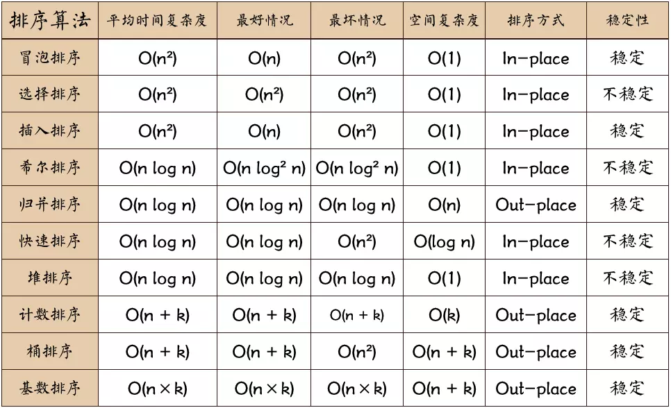
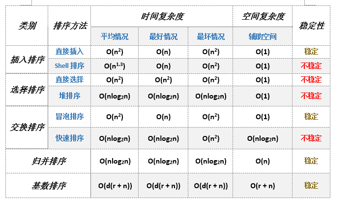
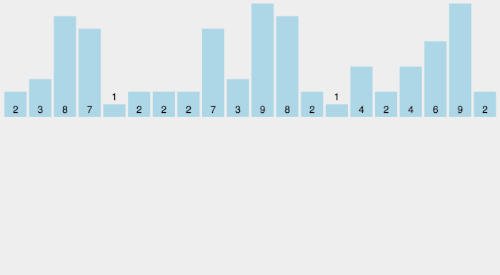
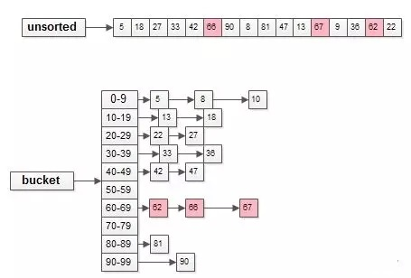
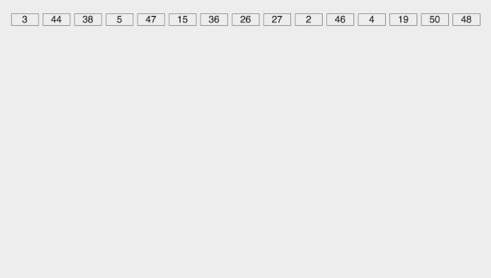

十大经典算法排序总结对比
===
<!-- TOC -->

- [十大经典算法排序总结对比](#十大经典算法排序总结对比)
  - [十大排序时间空间复杂度比较图](#十大排序时间空间复杂度比较图)
  - [1. 冒泡排序（Bubble Sort）](#1-冒泡排序Bubble-Sort)
  - [2. 选择排序（Selection Sort）](#2-选择排序Selection-Sort)
  - [3.1 插入排序（Insertion Sort）](#31-插入排序Insertion-Sort)
  - [3.2 插入排序的优化：二分排序(拆半插入)](#32-插入排序的优化二分排序拆半插入)
  - [4. 希尔排序（Shell Sort）](#4-希尔排序Shell-Sort)
  - [5. 归并排序（Merge Sort）](#5-归并排序Merge-Sort)
  - [6. 快速排序（Quick Sort）](#6-快速排序Quick-Sort)
    - [6.2 快速排序之填坑](#62-快速排序之填坑)
    - [6.3 快速排序之交换](#63-快速排序之交换)
  - [7. 堆排序（Heap Sort）](#7-堆排序Heap-Sort)
  - [8. 计数排序（Counting Sort）](#8-计数排序Counting-Sort)
    - [8.1 常规计数排序](#81-常规计数排序)
    - [8.2 优化计数排序](#82-优化计数排序)
  - [9. 桶排序（Bucket Sort）](#9-桶排序Bucket-Sort)
  - [10. 基数排序（Radix Sort）](#10-基数排序Radix-Sort)

<!-- /TOC -->

## 十大排序时间空间复杂度比较图



主流排序算法概览

名词解释：
- n: 数据规模
- k: “桶”的个数
- In-place: 占用常数内存，不占用额外内存
- Out-place: 占用额外内存
- 稳定性: 排序后2个相等键值的顺序和排序之前它们的顺序相同



注：基数排序中：r是关键字的基数，d是长度，n是关键字的个数

## 1. 冒泡排序（Bubble Sort）
**基本思想**：每次比较两相邻的数,当发现它们的排序与排序要求相反时，就将它们互换。这样小的数往下沉，大的数往上冒

**冒泡排序动图演示**：


```js
// 1
function bubbleSort(arr) {
  let i = arr.length - 1;
  while (i >= 0) {
    for (let j = 0; j < i; j++) {
      if (arr[j] > arr[j + 1]) {
        [arr[j], arr[j + 1]] = [arr[j + 1], arr[j]];
      }
    }
    i--;
  }
  return arr;
}

// 2
function bubbleSort(arr) {
  for (i = 0; i < arr.length - 1; i++) {
    for (j = 0; j < arr.length - 1 - i; j++) {
      if (arr[j] > arr[j + 1]) {
        var temp = arr[j];
        arr[j] = arr[j + 1];
        arr[j + 1] = temp;
      }
    }
  }
  return arr;
}
```


## 2. 选择排序（Selection Sort）
**基本思想**：每次选择待排序的元素中最小的值，放置在序列的首位

在时间复杂度上表现最稳定的排序算法之一，因为无论什么数据进去都是O(n²)的时间复杂度。。。所以用到它的时候，数据规模越小越好。唯一的好处可能就是不占用额外的内存空间了吧。

**选择排序动图演示**：


**步骤**: 
1. 首先在未排序序列中找到最小（大）元素，存放到排序序列的起始位置。
2. 再从剩余未排序元素中继续寻找最小（大）元素，然后放到已排序序列的末尾。
3. 重复第二步，直到所有元素均排序完毕。

```js
function selectionSort(arr) {
  var len = arr.length;
  var minIndex, temp;
  for (var i = 0; i < len - 1; i++) {
    minIndex = i;
    for (var j = i + 1; j < len; j++) {
      if (arr[j] < arr[minIndex]) { //寻找最小的数
        minIndex = j; //将最小数的索引保存
      }
    }
    temp = arr[i];
    arr[i] = arr[minIndex];
    arr[minIndex] = temp;
  }
  return arr;
}
```

## 3.1 插入排序（Insertion Sort）
**基本思想**：在序号i之前的元素(0到i-1)已经排好序，本趟需要找到i对应的元素x (此时即arr[i]) 的正确位置k,在寻找位置k的过程中与序号i-1到0的元素依次进行比较。如果x小于比较元素，则比较元素向后移动一位；否则，结束移位，将x插入当前位置k

**插入排序的工作原理:** 通过构建有序序列，对于未排序数据，在已排序序列中从后向前扫描，找到相应位置并插入。

**步骤**: 
1. 从第一个元素开始，该元素可以认为已经被排序；
2. 取出下一个元素，在已经排序的元素序列中从后向前扫描；
3. 如果该元素（已排序）大于新元素，将该元素移到下一位置；
4. 重复步骤 3，直到找到已排序的元素小于或者等于新元素的位置；
5. 将新元素插入到该位置后；
6. 重复步骤 2~5。

**插入排序动图演示**：


```js
// 插入排序
const insertionSort = arr => {
  const len = arr.length;
  if (len <= 1) return;

  let preIndex, current;
  for (let i = 1; i < len; i++) {
    preIndex = i - 1; //待比较元素的下标
    current = arr[i]; //当前元素
    while (preIndex >= 0 && arr[preIndex] > current) {
      //前置条件之一: 待比较元素比当前元素大
      arr[preIndex + 1] = arr[preIndex]; //将待比较元素后移一位
      preIndex--; //游标前移一位
    }

    // arr[preIndex+1] = current;

    if (preIndex + 1 != i) {
      //避免同一个元素赋值给自身
      arr[preIndex + 1] = current; //将当前元素插入预留空位
      console.log("array :", arr);
    }
  }
  return arr;
};
```

## 3.2 插入排序的优化：二分排序(拆半插入)

插入排序也有一种优化算法，叫做**拆半插入**。

**思想:**

折半插入排序是直接插入排序的升级版，鉴于插入排序第一部分为已排好序的数组, 我们不必按顺序依次寻找插入点, 只需比较它们的中间值与待插入元素的大小即可。

与插入排序思想差不多，但是二分排序是在插入第i个元素时，对前面的0~i-1元素进行折半，先跟它们中间的元素进行比较。如果小，那么对前半进行折半；如果大，那么对后半进行折半。依次进行，直到left>right。然后再把第i个元素前一位与目标位置之间的所有元素向后移动一位，再将目标元素放入正确位置上。

**注意**：和直接插入排序类似，折半插入排序每次交换的是相邻的且值为不同的元素，它并不会改变值相同的元素之间的顺序，因此它是稳定的。

**步骤**: 
1. 取 0 ~ i-1 的中间点 ( m = (i-1)>>1 )，array[i] 与 array[m] 进行比较，若 array[i]  <  array[m]，则说明待插入的元素 array[i]  应该处于数组的 0 ~ m 索引之间；反之，则说明它应该处于数组的 m ~ i-1 索引之间。
2. 重复步骤 1，每次缩小一半的查找范围，直至找到插入的位置。
3. 将数组中插入位置之后的元素全部后移一位。
4. 在指定位置插入第 i 个元素。


> 注：x>>1 是位运算中的右移运算，表示右移一位，等同于 x 除以 2 再取整，即 x>>1 == Math.floor(x/2) 。

```js
// 折半插入排序
const binaryInsertionSort = array => {
  const len = array.length;
  if (len <= 1) return;

  let current, i, j, low, high, m;
  for (i = 1; i < len; i++) {
    low = 0;
    high = i - 1;
    current = array[i];

    while (low <= high) {
      //步骤 1 & 2 : 折半查找
      m = (low + high) >> 1; 
      // 注: x>>1 是位运算中的右移运算, 表示右移一位, 等同于 x 除以 2 再取整, 即 x>>1 == Math.floor(x/2) .
      
      if (array[i] >= array[m]) {
        //值相同时, 切换到高半区，保证稳定性
        low = m + 1; //插入点在高半区
      } else {
        high = m - 1; //插入点在低半区
      }
    }
    for (j = i; j > low; j--) {
      //步骤 3: 插入位置之后的元素全部后移一位
      array[j] = array[j - 1];
      console.log("array2 :", JSON.parse(JSON.stringify(array)));
    }
    array[low] = current; //步骤 4: 插入该元素
  }
  console.log("array2 :", JSON.parse(JSON.stringify(array)));
  return array;
};
```

```js
// 折半插入排序
function binarySort(arr) {
  for (let i = 0; i < arr.length; i++) {
    let temp = arr[i];
    let left = 0;
    let right = i - 1;
    let mid;
    while (left <= right) {
      mid = Math.floor((left + right) / 2);
      if (arr[mid] > temp) {
        right = mid - 1;
      } else {
        left = mid + 1;
      }
    }
    for (let j = i - 1; j >= left; j--) {
      arr[j + 1] = arr[j];
    }
    if (left !== i) {
      arr[left] = temp;
    }
  }
  return arr;
}
console.log(binarySort([7, 3, 4, 5, 10, 7, 8, 2]));
```

```js
/*
 * @param { Array } arr 有序的数组 ⚠️注意：是有序的有序的有序的
 * @param { Number } data 要查找的数据
 * @return { Number } 返回查找到的位置，未查找到放回-1值
 **/
function binSearch(arr, data) {
  let upperBound = arr.length - 1,
      lowerBound = 0;

  while (lowerBound <= upperBound) {
    let mid = Math.floor((upperBound + lowerBound) / 2);
    if (arr[mid] < data) {
      lowerBound = mid + 1;
    } else if (arr[mid] > data) {
      upperBound = mid + 1;
    } else {
      return mid;
    }
  }
  return -1; // 你朋友选要猜的数据在1-100范围之外
}
```


## 4. 希尔排序（Shell Sort）
**基本思想**：先取一个小于n的整数d1作为第一个增量，把文件的全部记录分成d1个组。所有距离为d1的倍数的记录放在同一个组中。先在各组内进行直接插入排序；然后，取第二个增量`d2<d1`重复上述的分组和排序，直至所取的增量`dt=1(dt<dt-l<…<d2<d1)`，即所有记录放在同一组中进行直接插入排序为止。

希尔排序是插入排序的一种更高效率的实现。它与插入排序的不同之处在于，它会优先比较距离较远的元素。希尔排序的核心在于间隔序列的设定。既可以提前设定好间隔序列，也可以动态的定义间隔序列。动态定义间隔序列的算法是《算法（第4版》的合著者Robert Sedgewick提出的。在这里，我就使用了这种方法。

```js
function shellSort(arr) {
  var len = arr.length,
      temp,
      gap = 1;
      
  while (gap < len / 3) {
    //动态定义间隔序列
    gap = gap * 3 + 1;
  }
  
  for (gap; gap > 0; gap = Math.floor(gap / 3)) {
    for (var i = gap; i < len; i++) {
      temp = arr[i];
      for (var j = i - gap; j >= 0 && arr[j] > temp; j -= gap) {
        arr[j + gap] = arr[j];
      }
      arr[j + gap] = temp;
    }
  }
  return arr;
}
```

**图解:**


通过某个增量 gap，将整个序列分给若干组，从后往前进行组内成员的比较和交换，随后逐步缩小增量至 1。希尔排序类似于插入排序，只是一开始向前移动的步数从 1 变成了 gap。
```js
function shellSort(arr) {
  let len = arr.length;
  // 初始步数
  let gap = parseInt(len / 2);
  // 逐渐缩小步数
  while (gap) {
    // 从第gap个元素开始遍历
    for (let i = gap; i < len; i++) {
      // 逐步其和前面其他的组成员进行比较和交换
      for (let j = i - gap; j >= 0; j -= gap) {
        if (arr[j] > arr[j + gap]) {
          [arr[j], arr[j + gap]] = [arr[j + gap], arr[j]];
        } else {
          break;
        }
      }
    }
    gap = parseInt(gap / 2);
  }
  return arr;
}
```

## 5. 归并排序（Merge Sort）
**基本思想:** 将待排序序列分为若干个子序列，每个子序列是有序的，然后将有序子序列合并为整体有序序列。

作为一种典型的分而治之思想的算法应用，归并排序的实现由两种方法：
- 自上而下的递归（所有递归的方法都可以用迭代重写，所以就有了第2种方法）
- 自下而上的迭代

和选择排序一样，归并排序的性能不受输入数据的影响，但表现比选择排序好的多，因为始终都是O(n log n）的时间复杂度。代价是需要额外的内存空间。

**归并排序动图演示**


```js
function merge(left, right) {
  var result = [];
  while (left.length > 0 && right.length > 0) {
    if (left[0] < right[0]) {
      result.push(left.shift());
    } else {
      result.push(right.shift());
    }
  }
  // 当左右数组长度不等.将比较完后剩下的数组项链接起来即可
  return result.concat(left).concat(right);
}
function mergeSort(arr) {
  if (arr.length == 1) {
    return arr;
  }
  var mid = Math.floor(arr.length / 2);
  var left_arr = arr.slice(0, mid),
      right_arr = arr.slice(mid);

  return merge(mergeSort(left_arr), mergeSort(right_arr));
}

var arr = [12, 20, 30, 21, 15, 33, 26, 19, 40, 25];
mergeSort(arr);
```

```js
// 融合两个有序数组，这里实际上是将数组 arr 分为两个数组
function mergeArray(arr, first, mid, last, temp) {
  let i = first;
  let m = mid;
  let j = mid + 1;
  let n = last;
  let k = 0;
  while (i <= m && j <= n) {
    if (arr[i] < arr[j]) {
      temp[k++] = arr[i++];
    } else {
      temp[k++] = arr[j++];
    }
  }
  while (i <= m) {
    temp[k++] = arr[i++];
  }
  while (j <= n) {
    temp[k++] = arr[j++];
  }
  for (let l = 0; l < k; l++) {
    arr[first + l] = temp[l];
  }
  return arr;
}
// 递归实现归并排序
function mergeSort(arr, first, last, temp) {
  if (first < last) {
    let mid = Math.floor((first + last) / 2);
    mergeSort(arr, first, mid, temp); // 左子数组有序
    mergeSort(arr, mid + 1, last, temp); // 右子数组有序
    arr = mergeArray(arr, first, mid, last, temp);
  }
  return arr;
}

// example
let arr = [10, 3, 1, 5, 11, 2, 0, 6, 3];
let temp = new Array();
let SortedArr = mergeSort(arr, 0, arr.length - 1, temp);
console.log(SortedArr);
```

## 6. 快速排序（Quick Sort）
又是一种分而治之思想在排序算法上的典型应用。本质上来看，快速排序应该算是在冒泡排序基础上的递归分治法。

**快速排序动图演示**：


```js
function quickSort(arr) {
	//如果数组<=1,则直接返回
	if (arr.length <= 1) {
		return arr;
	}
	var pivotIndex = Math.floor(arr.length / 2);
	//找基准，并把基准从原数组删除
	var pivot = arr.splice(pivotIndex, 1)[0];
	//定义左右数组
	var left = [];
	var right = [];
	//比基准小的放在left，比基准大的放在right
	for (var i = 0; i < arr.length; i++) {
		if (arr[i] <= pivot) {
			left.push(arr[i]);
		} else {
			right.push(arr[i]);
		}
	}
	//递归
	return quickSort(left).concat([pivot], quickSort(right));
}
```

**基本思想**：选择一个基准元素(通常选择第一个元素)，通过一趟排序将要排序的数据分割成独立的两部分，其中一部分的所有元素都比基准元素小，另外一部分的所有元素大于或等于基准元素大。同样方法依次分割；整个排序过程可以递归进行。

```js
function quickSort(arr) {
  if (arr.length <= 1) return arr;

  let left = [];
  let right = [];

  let pivot = arr[0];

  for (let i = 1; i < arr.length; i++) {
    if (arr[i] >= pivot) {
      right.push(arr[i]);
    } else {
      left.push(arr[i]);
    }
  }

  return [...quickSort(left), pivot, ...quickSort(right)];
}
```

1、快速排序的基本思想：  
   快速排序使用分治的思想，通过一趟排序将待排序列分割成两部分，其中一部分记录的关键字均比另一部分记录的关键字小。之后分别对这两部分记录继续进行排序，以达到整个序列有序的目的。

2、快速排序的三个步骤：
1. 选择基准：在待排序列中，按照某种方式挑出一个元素，作为 "基准"（pivot）
2. 分割操作：以该基准在序列中的实际位置，把序列分成两个子序列。此时，在基准左边的元素都比该基准小，在基准右边的元素都比基准大
3. 递归地对两个序列进行快速排序，直到序列为空或者只有一个元素。

3、选择基准的方式

### 6.2 快速排序之填坑

从右边向中间推进的时候，遇到小于基数的数就赋给左边（一开始是基数的位置），右边保留原先的值等之后被左边的值填上。

```js
function quickSort(nums) {
  // 递归排序基数左右两边的序列
  function recursive(arr, left, right) {
    if(left >= right)  return;
    let index = partition(arr, left, right);
    recursive(arr, left, index - 1);
    recursive(arr, index + 1, right);
    return arr;
  }
  // 将小于基数的数放到基数左边，大于基数的数放到基数右边，并返回基数的位置
  function partition(arr, left, right) {
    // 取第一个数为基数
    let temp = arr[left];
    while(left < right) {
      while(left < right && arr[right] >= temp)  right--;
      arr[left] = arr[right];
      while(left < right && arr[left] < temp)  left++;
      arr[right] = arr[left];
    }
    // 修改基数的位置
    arr[left] = temp;
    return left;
  }
  recursive(nums, 0, nums.length-1);
}
```

### 6.3 快速排序之交换

从左右两边向中间推进的时候，遇到不符合的数就两边交换值。

```js
function quickSort1(nums) {
  function recursive(arr, left, right) {
    if(left >= right)  return;
    let index = partition(arr, left, right);
    recursive(arr, left, index - 1);
    recursive(arr, index + 1, right);
    return arr;
  }
  function partition(arr, left, right) {
    let temp = arr[left];
    let p = left + 1;
    let q = right;
    while(p <= q) {
      while(p <= q && arr[p] < temp)  p++;
      while(p <= q && arr[q] > temp)  q--;
      if(p <= q) {
        [arr[p], arr[q]] = [arr[q], arr[p]];
        // 交换值后两边各向中间推进一位
        p++;
        q--;
      }
    }
    // 修改基数的位置
    [arr[left], arr[q]] = [arr[q], arr[left]];
    return q;
  }
  recursive(nums, 0, nums.length-1);
}
```

## 7. 堆排序（Heap Sort）
堆排序可以说是一种利用堆的概念来排序的选择排序。分为两种方法：
1. 大顶堆：每个节点的值都大于或等于其子节点的值，在堆排序算法中用于升序排列
2. 小顶堆：每个节点的值都小于或等于其子节点的值，在堆排序算法中用于降序排列

堆排序利用了大根堆（或小根堆）堆顶记录的关键字最大（或最小）这一特征，使得在当前无序区中选取最大（或最小）关键字的记录变得简单

用大根堆排序的基本思想
1. 先将初始文件R[1..n]建成一个大根堆，此堆为初始的无序区
2. 再将关键字最大的记录R[1]（即堆顶）和无序区的最后一个记录R[n]交换，由此得到新的无序区R[1..n-1]和有序区R[n]，且满足R[1..n-1].keys≤R[n].key
3. 由于交换后新的根R[1]可能违反堆性质，故应将当前无序区R[1..n-1]调整为堆。然后再次将R[1..n-1]中关键字最大的记录R[1]和该区间的最后一个记录R[n-1]交换，由此得到新的无序区R[1..n-2]和有序区R[n-1..n]，且仍满足关系R[1..n-2].keys≤R[n-1..n].keys，同样要将R[1..n-2]调整为堆。……

直到无序区只有一个元素为止。

**堆排序动图演示**：


```js
function heapSort(nums) {
  // 调整最大堆，使index的值大于左右节点
  function adjustHeap(nums, index, size) {
    // 交换后可能会破坏堆结构，需要循环使得每一个父节点都大于左右结点
    while(true) {
      let max = index;
      let left = index * 2 + 1;   // 左节点
      let right = index * 2 + 2;  // 右节点
      if(left < size && nums[max] < nums[left])  max = left;
      if(right < size && nums[max] < nums[right])  max = right;
      // 如果左右结点大于当前的结点则交换，并再循环一遍判断交换后的左右结点位置是否破坏了堆结构（比左右结点小了）
      if(index !== max) {
        [nums[index], nums[max]] = [nums[max], nums[index]];
        index = max;
      }
      else {
        break;
      }
    }
  }

  // 建立最大堆
  function buildHeap(nums) {
    // 注意这里的头节点是从0开始的，所以最后一个非叶子结点是 parseInt(nums.length/2)-1
    let start = parseInt(nums.length / 2) - 1;
    let size = nums.length;
    // 从最后一个非叶子结点开始调整，直至堆顶。
    for(let i=start; i>=0; i--) {
      adjustHeap(nums, i, size);
    }
  }

  buildHeap(nums);

  // 循环n-1次，每次循环后交换堆顶元素和堆底元素并重新调整堆结构
  for(let i=nums.length-1; i>0; i--) {
    [nums[i], nums[0]] = [nums[0], nums[i]];
    adjustHeap(nums, 0, i);
  }
  
  return nums;
}
```

## 8. 计数排序（Counting Sort）
计数排序的核心在于将输入的数据值转化为键存储在额外开辟的数组空间中。

作为一种线性时间复杂度的排序，计数排序要求输入的数据必须是有确定范围的整数。

**计数排序动图演示**：



以数组元素值为键，出现次数为值存进一个临时数组，最后再遍历这个临时数组还原回原数组。因为 JavaScript 的数组下标是以字符串形式存储的，所以**计数排序可以用来排列负数，但不可以排列小数**。
+ 最好：`O(n + k)`，k是最大值和最小值的差。
+ 最坏：`O(n + k)`
+ 平均：`O(n + k)`

### 8.1 常规计数排序
```js
function countingSort(nums) {
  let arr = [];
  let max = Math.max(...nums);
  let min = Math.min(...nums);
  // 装桶
  for(let i=0, len=nums.length; i<len; i++) {
    let temp = nums[i];
    arr[temp] = arr[temp] + 1 || 1;
  }
  let index = 0;
  // 还原原数组
  for(let i=min; i<=max; i++) {
    while(arr[i] > 0) {
      nums[index++] = i;
      arr[i]--;
    }
  }

  return nums;
}
```

### 8.2 优化计数排序
把每一个数组元素都加上 min 的相反数，来避免特殊情况下的空间浪费，通过这种优化可以把所开的空间大小从 max+1 降低为 max-min+1，max 和 min 分别为数组中的最大值和最小值。

比如数组 [103, 102, 101, 100]，普通的计数排序需要开一个长度为 104 的数组，而且前面 100 个值都是 undefined，使用该优化方法后可以只开一个长度为 4 的数组。

```js
function countingSort(nums) {
  let arr = [];
  let max = Math.max(...nums);
  let min = Math.min(...nums);
  // 加上最小值的相反数来缩小数组范围
  let add = -min;
  for(let i=0, len=nums.length; i<len; i++) {
    let temp = nums[i];
    temp += add;
    arr[temp] = arr[temp] + 1 || 1;
  }
  let index = 0;
  for(let i=min; i<=max; i++) {
    let temp = arr[i+add];
    while(temp > 0) {
      nums[index++] = i;
      temp--;
    }
  }

  return nums;
}
```


## 9. 桶排序（Bucket Sort）
桶排序是计数排序的升级版。它利用了函数的映射关系，高效与否的关键就在于这个映射函数的确定。

为了使桶排序更加高效，我们需要做到这两点：
1. 在额外空间充足的情况下，尽量增大桶的数量
2. 使用的映射函数能够将输入的N个数据均匀的分配到K个桶中

同时，对于桶中元素的排序，选择何种比较排序算法对于性能的影响至关重要。

可以设定10个桶，申请额外的空间bucket[10]来作为辅助空间。其中，每个桶bucket[i]来存放[10*i, 10*i+9]的元素链表。



上图所示：
- 待排序的数组为unsorted[16]
- 桶空间是buket[10]
- 扫描所有元素之后，元素被放到了自己对应的桶里
- 每个桶内，使用插入排序，保证一直是有序的
- 例如，标红的元素66, 67, 62最终会在一个桶里，并且使用插入排序桶内保持有序。
- 最终，每个桶按照次序输出，排序完毕。

```js
function bucketSort(nums) {
  // 桶的个数，只要是正数即可
  let num = 5;
  let max = Math.max(...nums);
  let min = Math.min(...nums);
  // 计算每个桶存放的数值范围，至少为1，
  let range = Math.ceil((max - min) / num) || 1;
  // 创建二维数组，第一维表示第几个桶，第二维表示该桶里存放的数
  let arr = Array.from(Array(num)).map(() => Array().fill(0));
  nums.forEach(val => {
    // 计算元素应该分布在哪个桶
    let index = parseInt((val - min) / range);
    // 防止index越界，例如当[5,1,1,2,0,0]时index会出现5
    index = index >= num ? num - 1 : index;
    let temp = arr[index];
    // 插入排序，将元素有序插入到桶中
    let j = temp.length - 1;
    while (j >= 0 && val < temp[j]) {
      temp[j + 1] = temp[j];
      j--;
    }
    temp[j + 1] = val;
  });
  // 修改回原数组
  let res = [].concat.apply([], arr);
  nums.forEach((val, i) => {
    nums[i] = res[i];
  });
  return nums;
}
```

## 10. 基数排序（Radix Sort）
基数排序有两种方法：
- MSD 从高位开始进行排序
- LSD 从低位开始进行排序

**基数排序 vs 计数排序 vs 桶排序**
这三种排序算法都利用了桶的概念，但对桶的使用方法上有明显差异：
- 基数排序：根据键值的每位数字来分配桶
- 计数排序：每个桶只存储单一键值
- 桶排序：每个桶存储一定范围的数值

**LSD基数排序动图演示**：



```js
// LSD Radix Sort
// helper function to get the last nth digit of a number
var getDigit = function(num, nth) {
  // get last nth digit of a number
  var ret = 0;
  while (nth--) {
    ret = num % 10;
    num = Math.floor((num - ret) / 10);
  }
  return ret;
};

// radixSort
function radixSort(arr) {
  var max = Math.floor(Math.log10(Math.max.apply(Math, arr))),
    // get the length of digits of the max value in this array
    digitBuckets = [],
    idx = 0;

  for (var i = 0; i < max + 1; i++) {
    // rebuild the digit buckets according to this digit
    digitBuckets = [];
    for (var j = 0; j < arr.length; j++) {
      var digit = getDigit(arr[j], i + 1);

      digitBuckets[digit] = digitBuckets[digit] || [];
      digitBuckets[digit].push(arr[j]);
    }

    // rebuild the arr according to this digit
    idx = 0;
    for (var t = 0; t < digitBuckets.length; t++) {
      if (digitBuckets[t] && digitBuckets[t].length > 0) {
        for (j = 0; j < digitBuckets[t].length; j++) {
          arr[idx++] = digitBuckets[t][j];
        }
      }
    }
  }
  return arr;
}
console.log(radixSort([7, 3, 4, 5, 10, 7, 8, 2]));
```

```js
function radixSort(nums) {
  // 计算位数
  function getDigits(n) {
    let sum = 0;
    while (n) {
      sum++;
      n = parseInt(n / 10);
    }
    return sum;
  }
  // 第一维表示位数即0-9，第二维表示里面存放的值
  let arr = Array.from(Array(10)).map(() => Array());
  let max = Math.max(...nums);
  let maxDigits = getDigits(max);
  for (let i = 0, len = nums.length; i < len; i++) {
    // 用0把每一个数都填充成相同的位数
    nums[i] = (nums[i] + "").padStart(maxDigits, 0);
    // 先根据个位数把每一个数放到相应的桶里
    let temp = nums[i][nums[i].length - 1];
    arr[temp].push(nums[i]);
  }
  // 循环判断每个位数
  for (let i = maxDigits - 2; i >= 0; i--) {
    // 循环每一个桶
    for (let j = 0; j <= 9; j++) {
      let temp = arr[j];
      let len = temp.length;
      // 根据当前的位数i把桶里的数放到相应的桶里
      while (len--) {
        let str = temp[0];
        temp.shift();
        arr[str[i]].push(str);
      }
    }
  }
  // 修改回原数组
  let res = [].concat.apply([], arr);
  nums.forEach((val, index) => {
    nums[index] = +res[index];
  });

  return nums;
}
```