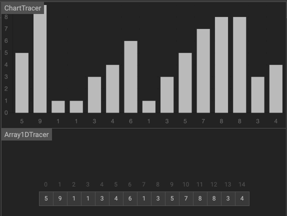

插入排序
===

<!-- TOC -->

- [插入排序](#插入排序)
  - [一、直接插入](#一直接插入)
    - [思想](#思想)
    - [步骤](#步骤)
    - [动画](#动画)
    - [实现](#实现)
    - [测试](#测试)
    - [分析](#分析)
  - [二、拆半插入](#二拆半插入)
    - [思想](#思想-1)
    - [步骤](#步骤-1)

<!-- /TOC -->

插入排序又为分为 **直接插入排序** 和优化后的 **拆半插入排序** 与 **希尔排序**，我们通常说的插入排序是指直接插入排序。

## 一、直接插入

### 思想
一般人打扑克牌，整理牌的时候，都是按牌的大小（从小到大或者从大到小）整理牌的，那每摸一张新牌，就扫描自己的牌，把新牌插入到相应的位置。

插入排序的工作原理：通过构建有序序列，对于未排序数据，在已排序序列中从后向前扫描，找到相应位置并插入。


### 步骤
1. 从第一个元素开始，该元素可以认为已经被排序；
2. 取出下一个元素，在已经排序的元素序列中从后向前扫描；
3. 如果该元素（已排序）大于新元素，将该元素移到下一位置；
4. 重复步骤 3，直到找到已排序的元素小于或者等于新元素的位置；
5. 将新元素插入到该位置后；
6. 重复步骤 2~5。


### 动画



[动画演示地址 https://algorithm-visualizer.org/brute-force/insertion-sort](https://algorithm-visualizer.org/brute-force/insertion-sort)

### 实现
```js
// 插入排序
const insertionSort = array => {
  const len = array.length;
  if (len <= 1) return;

  let preIndex, current;
  for (let i = 1; i < len; i++) {
    preIndex = i - 1; //待比较元素的下标
    current = array[i]; //当前元素
    while (preIndex >= 0 && array[preIndex] > current) {
      //前置条件之一: 待比较元素比当前元素大
      array[preIndex + 1] = array[preIndex]; //将待比较元素后移一位
      preIndex--; //游标前移一位
    }
    if (preIndex + 1 != i) {
      //避免同一个元素赋值给自身
      array[preIndex + 1] = current; //将当前元素插入预留空位
      console.log("array :", array);
    }
  }
  return array;
};
```

### 测试
```js
// 测试
const array = [5, 4, 3, 2, 1];
console.log("原始 array :", array);
insertionSort(array);
// 原始 array:    [5, 4, 3, 2, 1]
// array:  		 [4, 5, 3, 2, 1]
// array:  		 [3, 4, 5, 2, 1]
// array: 		 [2, 3, 4, 5, 1]
// array:  		 [1, 2, 3, 4, 5]
```

### 分析
1. 第一，插入排序是原地排序算法吗 ？     
   插入排序算法的运行并不需要额外的存储空间，所以空间复杂度是 O(1)，所以，这是一个原地排序算法。

2. 第二，插入排序是稳定的排序算法吗 ？    
  在插入排序中，对于值相同的元素，我们可以选择将后面出现的元素，插入到前面出现元素的后面，这样就可以保持原有的前后顺序不变，所以插入排序是稳定的排序算法。

3. 第三，插入排序的时间复杂度是多少 ？  
   - 最佳情况：T(n) = O(n)，当数据已经是正序时。
   - 最差情况：T(n) = O(n2)，当数据是反序时。
   - 平均情况：T(n) = O(n2)。

## 二、拆半插入
插入排序也有一种优化算法，叫做**拆半插入**。

### 思想

折半插入排序是直接插入排序的升级版，鉴于插入排序第一部分为已排好序的数组, 我们不必按顺序依次寻找插入点, 只需比较它们的中间值与待插入元素的大小即可。

### 步骤
1. 取 0 ~ i-1 的中间点 ( m = (i-1)>>1 )，array[i] 与 array[m] 进行比较，若 array[i]  <  array[m]，则说明待插入的元素 array[i]  应该处于数组的 0 ~ m 索引之间；反之，则说明它应该处于数组的 m ~ i-1 索引之间。
2. 重复步骤 1，每次缩小一半的查找范围，直至找到插入的位置。
3. 将数组中插入位置之后的元素全部后移一位。
4. 在指定位置插入第 i 个元素。


> 注：x>>1 是位运算中的右移运算，表示右移一位，等同于 x 除以 2 再取整，即 x>>1 == Math.floor(x/2) 。

```js
// 折半插入排序
const binaryInsertionSort = array => {
	const len = array.length;
	if (len <= 1) return;

	let current, i, j, low, high, m;
	for (i = 1; i < len; i++) {
		low = 0;
		high = i - 1;
		current = array[i];

		while (low <= high) {
			//步骤 1 & 2 : 折半查找
			m = (low + high) >> 1; // 注: x>>1 是位运算中的右移运算, 表示右移一位, 等同于 x 除以 2 再取整, 即 x>>1 == Math.floor(x/2) .
			if (array[i] >= array[m]) {
				//值相同时, 切换到高半区，保证稳定性
				low = m + 1; //插入点在高半区
			} else {
				high = m - 1; //插入点在低半区
			}
		}
		for (j = i; j > low; j--) {
			//步骤 3: 插入位置之后的元素全部后移一位
			array[j] = array[j - 1];
			console.log('array2 :', JSON.parse(JSON.stringify(array)));
		}
		array[low] = current; //步骤 4: 插入该元素
	}
	console.log('array2 :', JSON.parse(JSON.stringify(array)));
	return array;
};
```

**测试**

```js
const array2 = [5, 4, 3, 2, 1];
console.log('原始 array2:', array2);
binaryInsertionSort(array2);
// 原始 array2:  [5, 4, 3, 2, 1]
// array2 :     [5, 5, 3, 2, 1]
// array2 :     [4, 5, 5, 2, 1]
// array2 :     [4, 4, 5, 2, 1]
// array2 :     [3, 4, 5, 5, 1]
// array2 :     [3, 4, 4, 5, 1]
// array2 :     [3, 3, 4, 5, 1]
// array2 :     [2, 3, 4, 5, 5]
// array2 :     [2, 3, 4, 4, 5]
// array2 :     [2, 3, 3, 4, 5]
// array2 :     [2, 2, 3, 4, 5]
// array2 :     [1, 2, 3, 4, 5]
```

**注意**：和直接插入排序类似，折半插入排序每次交换的是相邻的且值为不同的元素，它并不会改变值相同的元素之间的顺序，因此它是稳定的。

