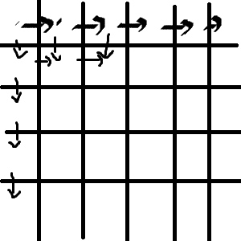

最小路径和
===
<!-- TOC -->

- [最小路径和](#最小路径和)
  - [题目](#题目)
  - [标签](#标签)
  - [JS](#JS)
  - [JS2 DP](#JS2-DP)
  - [JS3 动态规划](#JS3-动态规划)
  - [JS4 动态规划 用原数组对象来维护 "状态数组"](#JS4-动态规划-用原数组对象来维护-状态数组)

<!-- /TOC -->
## 题目
给定一个包含非负整数的 `m x n` 网格，请找出一条从左上角到右下角的路径，使得路径上的数字总和为最小。

**说明**：每次只能向下或者向右移动一步。

示例:
```js
输入:
[
  [1,3,1],
  [1,5,1],
  [4,2,1]
]
输出: 7
解释: 因为路径 1→3→1→1→1 的总和最小。
```

## 标签
- 数组
- 动态规划

## JS
我的提交执行用时 已经战胜 86.24 % 的 javascript 提交记录

由题可知，每次只能向右或者向下走，因此[0][n]的上一步必定是向右走，而[0][n]的上一步必定是向下，由此可以先确定第一行和第一列的当前最小路径。

对于中间的其他格子，由于上一步有两种可能性，因此需要分别计算左侧格子和上侧格子的最小路径和，并选出较小的一个，即为当前格的最小路径和。



```js
/**
 * @param {number[][]} grid
 * @return {number}
 */
var minPathSum = function(grid) {
  let l = grid.length,
    h = grid[0].length;
  let temp = [];
  for (let i = 0; i < l; i++) {
    temp[i] = [];
  }
  // console.log(temp)
  for (let i = 0; i < l; i++) {
    for (let j = 0; j < h; j++) {
      if (i == 0 && j == 0) {
        temp[i][j] = grid[i][j];
      } else if (i == 0) {
        temp[i][j] = temp[i][j - 1] + grid[i][j];
      } else if (j == 0) {
        temp[i][j] = temp[i - 1][j] + grid[i][j];
      } else {
        temp[i][j] = grid[i][j] + Math.min(temp[i][j - 1], temp[i - 1][j]);
      }
    }
  }
  // console.log(temp)
  return temp[l - 1][h - 1];
};
```

## JS2 DP
```js
var minPathSum = function(grid) {
  if (grid.length === 0 || grid[0].length === 0) return 0;
  var m = grid.length,
    n = grid[0].length,
    dp = new Array(m).fill(0).map(function(a) {
      return new Array(n).fill(0);
    });
  dp[m - 1][n - 1] = grid[m - 1][n - 1];
  for (var i = m - 1; i >= 0; i--) {
    for (var ii = n - 1; ii >= 0; ii--) {
      if (i === m - 1 && ii === n - 1) continue;
      if (i + 1 < m && ii + 1 === n) dp[i][ii] = grid[i][ii] + dp[i + 1][ii];
      if (i + 1 === m && ii + 1 < n) dp[i][ii] = grid[i][ii] + dp[i][ii + 1];
      if (i + 1 < m && ii + 1 < n)
        dp[i][ii] = grid[i][ii] + Math.min(dp[i][ii + 1], dp[i + 1][ii]);
    }
  }
  return dp[0][0];
};
```

## JS3 动态规划
```js
var minPathSum = function(grid) {
  let rn = grid.length,
      cn = grid[0].length;
  for (let i = 0; i < rn; ++i) {
    let line = grid[i];
    for (let j = 0; j < cn; ++j) {
      let a = Infinity,
          b = Infinity;
      if (i - 1 >= 0) a = grid[i - 1][j] + grid[i][j];
      if (j - 1 >= 0) b = grid[i][j - 1] + grid[i][j];
      if (a != Infinity || b != Infinity) {
        grid[i][j] = a < b ? a : b;
      }
    }
  }
  return grid[rn - 1][cn - 1];
};
```

## JS4 动态规划 用原数组对象来维护 "状态数组"
```js
var minPathSum = function (grid) {
  var m = grid.length
  var n = grid[0].length

  for (var i = 0; i < m; i++) {

    for (var j = 0; j < n; j++) {

      if (i === 0 && j !== 0) {
        grid[i][j] += grid[i][j - 1]
        continue;
      }
      if (j === 0 && i !== 0) {
        grid[i][j] += grid[i - 1][j]
        continue;
      }
      if (j !== 0 && i !== 0) {
        grid[i][j] += Math.min(grid[i - 1][j], grid[i][j - 1])
      }

    }
  }
  return grid[m - 1][n - 1]
};
```