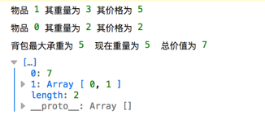
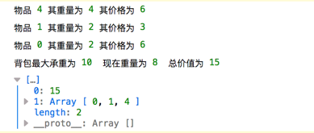
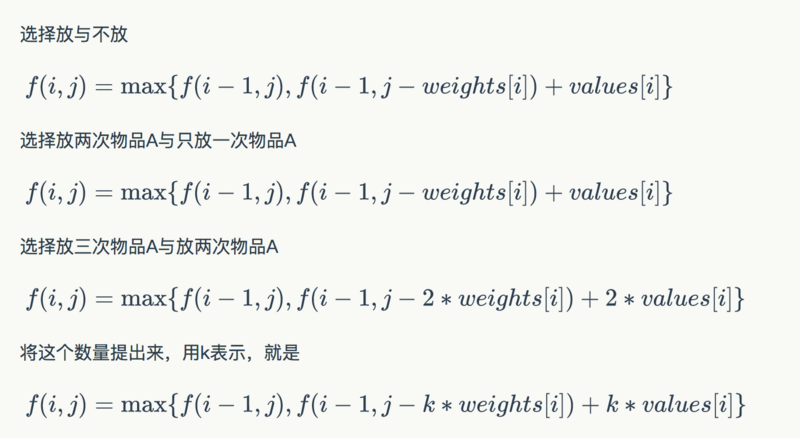

背包问题
===
<!-- TOC -->

- [背包问题](#背包问题)
  - [01背包问题](#01背包问题)
    - [1.1 问题描述](#11-问题描述)
    - [1.2 问题分析](#12-问题分析)
    - [1.3 各种优化](#13-各种优化)
      - [合并循环](#合并循环)
      - [选择物品](#选择物品)
      - [使用滚动数组压缩空间](#使用滚动数组压缩空间)
      - [使用一维数组压缩空间](#使用一维数组压缩空间)
    - [1.4 递归法解01背包](#14-递归法解01背包)
  - [二、完全背包问题](#二完全背包问题)
    - [2.1 问题描述：](#21-问题描述)
    - [2.2 问题分析：](#22-问题分析)
    - [2.3 O(nW)优化](#23-onw优化)
  - [三、多重背包问题](#三多重背包问题)
    - [3.1 问题描述：](#31-问题描述)
    - [3.2 问题分析：](#32-问题分析)
    - [3.3 使用二进制优化](#33-使用二进制优化)

<!-- /TOC -->

## 01背包问题
### 1.1 问题描述
有${n}$件物品和${1}$个容量为W的背包。每种物品均只有一件，第${i}$件物品的重量为${weights[i]}$，价值为${values[i]}$，求解将哪些物品装入背包可使价值总和最大。

对于一种物品，要么装入背包，要么不装。所以对于一种物品的装入状态只是1或0, 此问题称为01背包问题。

### 1.2 问题分析
数据：物品个数${n=5}$,物品重量${weights=[2，2，6，5，4]}$,物品价值${values=[6，3，5，4，6]}$,背包总容量${W=10}$。

我们设置一个矩阵${f}$来记录结果，${f(i, j)}$ 表示可选物品为 ${i...n}$ 背包容量为 ${j(0<=j<=W)}$ 时， 背包中所放物品的最大价值。


| w |	v |	i\j |	0 |	1 |	2 |	3 |	4 |	5 |	6 |	7 | 8 |	9 |	10 |
|:----:|:----:|:----:|:----:|:----:|:----:|:----:|:----:|:----:|:----:|:----:|:----:|:----:|:----:|
| 2 |	6 |	0 |	| | | | | | | | | | |
| 2 |	3 |	1	|	| | | | | | | | | | |									
| 6	| 5 |	2	|	| | | | | | | | | | |										
| 5 |	4 |	3	|	| | | | | | | | | | |									
| 4	| 6 |	4	|	| | | | | | | | | | |

										
我们先看第一行，物品0的体积为2，价值为6，当容量为0时，什么也放不下，因此第一个格式只能填0，程序表示为${f(0,0) = 0}$或者${f[0][0] = 0}$。 当${j=1}$时，依然放不下${w_0}$，因此依然为0，${f(0, 1) = 0}$。 当${j=2}$时，能放下${w_0}$，于是有 ${f(0, 2)\ = \ v_0=6}$。 当${j=3}$时，也能放下${w_0}$，但我们只有一个物品0，因此它的值依然是6，于是一直到${j=10}$时，它的值都是${v_0}$。

| w |	v |	i\j |	0 |	1 |	2 |	3 |	4 |	5 |	6 |	7 | 8 |	9 |	10 |
|:----:|:----:|:----:|:----:|:----:|:----:|:----:|:----:|:----:|:----:|:----:|:----:|:----:|:----:|
| 2 |	6 |	0 | 0 |	0 |	6 |	6 |	6 |	6 |	6 |	6 |	6 |	6 |	6 |
| 2 |	3 |	1	|	| | | | | | | | | | |									
| 6	| 5 |	2	|	| | | | | | | | | | |										
| 5 |	4 |	3	|	| | | | | | | | | | |										
| 4	| 6 |	4	|	| | | | | | | | | | | 


根据第一行，我们得到如下方程


当背包容量少于物品価积时，总价值为0，否则为物品的价值

然后我们看第二行，确定确定${f(1,0...10)}$这11个元素的值。当${j=0}$ 时，依然什么也放不下，值为0，但我们发觉它是上方格式的值一样的，${f(1,0)=0}$。 当${j=1}$时，依然什么也放不下，值为0，但我们发觉它是上方格式的值一样的，${f(1,1)=0}$. 当${j=2}$时，它可以选择放入物品1或不放。

如果选择不放物品1，背包里面有物品0，最大价值为6。

如果选择放入物品1，我们要用算出背包放入物品1后还有多少容量，然后根据容量查出它的价值，再加上物品1的价值，即${f(0,j-w_1)+v_1}$ 。由于我们的目标是尽可能装最值钱的物品， 因此放与不放， 我们需要通过比较来决定，于是有


显然${v_1=2，v_0=6}$, 因此这里填${v_0}$。 当${j=3}$时， 情况相同。 当${j=4}$，能同时放下物品0与物品1，我们这个公式的计算结果也合乎我们的预期， 得到${f(1,4)=9}$。 当${j>4}$时， 由于背包只能放物品0与物品1，那么它的最大价值也一直停留在${v_0+v_1=9}$

| w |	v |	i\j |	0 |	1 |	2 |	3 |	4 |	5 |	6 |	7 | 8 |	9 |	10 |
|:----:|:----:|:----:|:----:|:----:|:----:|:----:|:----:|:----:|:----:|:----:|:----:|:----:|:----:|
| 2 |	6 |	0 | 0 |	0 |	6 |	6 |	6 |	6 |	6 |	6 |	6 |	6 |	6 |
| 2 |	3 |	1	|	0 |	0 |	6 |	6 |	9 |	9 |	9 |	9 |	9 |	9 |	9 |									
| 6	| 5 |	2	|	| | | | | | | | | | |						
| 5 |	4 |	3	|	| | | | | | | | | | |									
| 4	| 6 |	4	|	| | | | | | | | | | |

我们再看第三行，当${j=0}$时，什么都放不下，${f(2,0)=0}$。当${j=1}$时，依然什么也放不下，${f(2,1)=0}$，当${j=2}$时，虽然放不下${w_2}$，但我们根据上表得知这个容号时，背包能装下的最大价值是6。继续计算下去，其实与上面推导的公式结果是一致的，说明公式是有效的。当${j=8}$时，背包可以是放物品0、1，或者放物品1、2，或者放物品0、2。物品0、1的价值，我们在表中就可以看到是9，至于其他两种情况我们姑且不顾，我们目测就知道是最优值是${6+5=11}$， 恰恰我们的公式也能正确计算出来。当${j=10}$时,刚好三个物品都能装下，它们的总值为14，即${f(2,10)=14}$

第三行的结果如下：

| w |	v |	i\j |	0 |	1 |	2 |	3 |	4 |	5 |	6 |	7 | 8 |	9 |	10 |
|:----:|:----:|:----:|:----:|:----:|:----:|:----:|:----:|:----:|:----:|:----:|:----:|:----:|:----:|
| 2 |	6 |	0 | 0 |	0 |	6 |	6 |	6 |	6 |	6 |	6 |	6 |	6 |	6 |
| 2 |	3 |	1	|	0 |	0 |	6 |	6 |	9 |	9 |	9 |	9 |	9 |	9 |	9 |									
| 6	| 5 |	2	|	0 |	0 |	6 |	6 |	9 |	9 |	9 |	9 |	11 | 11 |	14 |										
| 5 |	4 |	3	|	| | | | | | | | | | |
| 4	| 6 |	4	|	| | | | | | | | | | |

整理一下第1，2行的适用方程：


我们根据此方程，继续计算下面各列，于是得到

| w |	v |	i\j |	0 |	1 |	2 |	3 |	4 |	5 |	6 |	7 | 8 |	9 |	10 |
|:----:|:----:|:----:|:----:|:----:|:----:|:----:|:----:|:----:|:----:|:----:|:----:|:----:|:----:|
| 2 |	6 |	0 | 0 |	0 |	6 |	6 |	6 |	6 |	6 |	6 |	6 |	6 |	6 |
| 2 |	3 |	1	|	0 |	0 |	6 |	6 |	9 |	9 |	9 |	9 |	9 |	9 |	9 |									
| 6	| 5 |	2	|	0 |	0 |	6 |	6 |	9 |	9 |	9 |	9 |	11 | 11 |	14 |										
| 5 |	4 |	3	|	0 |	0 |	6 |	6 |	9 |	9 |	9 |	10 | 11 | 13 |	14 |									
| 4	| 6 |	4	| 0 |	0 |	6 |	6 |	9 |	9 |	12 |	12 |	15 | 15 |	15 |

至此，我们就可以得到解为15.

我们最后根据0-1背包问题的最优子结构性质，建立计算${f(i,j)}$的递归式：


```js
function knapsack(weights, values, W) {
  var n = weights.length - 1;
  var f = [[]];
  for (var j = 0; j <= W; j++) {
    if (j < weights[0]) {
      //如果容量不能放下物品0的重量，那么价值为0
      f[0][j] = 0;
    } else {
      //否则等于物体0的价值
      f[0][j] = values[0];
    }
  }
  for (var j = 0; j <= W; j++) {
    for (var i = 1; i <= n; i++) {
      if (!f[i]) {
        //创建新一行
        f[i] = [];
      }
      if (j < weights[i]) {
        //等于之前的最优值
        f[i][j] = f[i - 1][j];
      } else {
        f[i][j] = Math.max(f[i - 1][j], f[i - 1][j - weights[i]] + values[i]);
      }
    }
  }
  return f[n][W];
}

var a = knapsack([2, 2, 6, 5, 4], [6, 3, 5, 4, 6], 10);
console.log(a); // 15
```

### 1.3 各种优化
#### 合并循环
现在方法里面有两个大循环，它们可以合并成一个。
```js
function knapsack(weights, values, W) {
  var n = weights.length;
  var f = new Array(n);
  for (var i = 0; i < n; i++) {
    f[i] = [];
  }
  for (var i = 0; i < n; i++) {
    for (var j = 0; j <= W; j++) {
      if (i === 0) {
        //第一行
        f[i][j] = j < weights[i] ? 0 : values[i];
      } else {
        if (j < weights[i]) {
          //等于之前的最优值
          f[i][j] = f[i - 1][j];
        } else {
          f[i][j] = Math.max(f[i - 1][j], f[i - 1][j - weights[i]] + values[i]);
        }
      }
    }
  }
  return f[n - 1][W];
}
```

然后我们再认真地思考一下，为什么要孤零零地专门处理第一行呢？`f[i][j] = j < weights[i] ? 0 : values[i]`是不是能适用于下面这一行`f[i][j] = Math.max(f[i-1][j], f[i-1][j-weights[i]] + values[i])` 。Math.max可以轻松转换为三元表达式，结构极其相似。而看一下i-1的边界问题，有的书与博客为了解决它，会添加第0行，全部都是0，然后i再往下挪。其实我们也可以添加一个${-1}$行。那么在我们的方程中就不用区分${i==0}$与${0>0}$的情况，方程与其他教科书的一模一样了！


```js
function knapsack(weights, values, W) {
  var n = weights.length;
  var f = new Array(n);
  f[-1] = new Array(W + 1).fill(0);
  for (var i = 0; i < n; i++) {
    //注意边界，没有等号
    f[i] = new Array(W).fill(0);
    for (var j = 0; j <= W; j++) {
      //注意边界，有等号
      if (j < weights[i]) {
        //注意边界， 没有等号
        f[i][j] = f[i - 1][j];
      } else {
        f[i][j] = Math.max(f[i - 1][j], f[i - 1][j - weights[i]] + values[i]); //case 3
      }
    }
  }
  return f[n - 1][W];
}
```

| w |	v |	i\j |	0 |	1 |	2 |	3 |	4 |	5 |	6 |	7 | 8 |	9 |	10 |
|:----:|:----:|:----:|:----:|:----:|:----:|:----:|:----:|:----:|:----:|:----:|:----:|:----:|:----:|
| X |	X |	-1 | 0 |	0 |	0 |	0 |	0 |	0 |	0 |	0 |	0 |	0 |	0 |
| 2 |	6 |	0 | 0 |	0 |	6 |	6 |	6 |	6 |	6 |	6 |	6 |	6 |	6 |
| 2 |	3 |	1	|	0 |	0 |	6 |	6 |	9 |	9 |	9 |	9 |	9 |	9 |	9 |									
| 6	| 5 |	2	|	0 |	0 |	6 |	6 |	9 |	9 |	9 |	9 |	11 | 11 |	14 |										
| 5 |	4 |	3	|	0 |	0 |	6 |	6 |	9 |	9 |	9 |	10 | 11 | 13 |	14 |									
| 4	| 6 |	4	| 0 |	0 |	6 |	6 |	9 |	9 |	12 |	12 |	15 | 15 |	15 |


负一行的出现可以大大减少了在双层循环的分支判定。是一个很好的技巧。

注意，许多旧的教程与网上文章，通过设置二维数组的第一行为0来解决i-1的边界问题（比如下图）。当然也有一些思维转不过来的缘故，他们还在坚持数字以1开始，而我们新世代的IT人已经确立从0开始的编程思想。


#### 选择物品
上面讲解了如何求得最大价值，现在我们看到底选择了哪些物品，这个在现实中更有意义。许多书与博客很少提到这一点，就算给出的代码也不对，估计是在设计状态矩阵就出错了。

仔细观察矩阵，从${f(n-1,W)}$逆着走向${f(0,0)}$，设i=n-1,j=W，如果${f(i,j)}$==${f(i-1,j-w_i)+v_i}$说明包里面有第i件物品，因此我们只要当前行不等于上一行的总价值，就能挑出第i件物品，然后j减去该物品的重量，一直找到j = 0就行了。

```js
function knapsack(weights, values, W) {
  var n = weights.length;
  var f = new Array(n);
  f[-1] = new Array(W + 1).fill(0);
  var selected = [];
  for (var i = 0; i < n; i++) {
    //注意边界，没有等号
    f[i] = []; //创建当前的二维数组
    for (var j = 0; j <= W; j++) {
      //注意边界，有等号
      if (j < weights[i]) {
        //注意边界， 没有等号
        f[i][j] = f[i - 1][j]; //case 1
      } else {
        f[i][j] = Math.max(f[i - 1][j], f[i - 1][j - weights[i]] + values[i]); //case 2
      }
    }
  }
  var j = W,
    w = 0;
  for (var i = n - 1; i >= 0; i--) {
    if (f[i][j] > f[i - 1][j]) {
      selected.push(i);
      console.log("物品", i, "其重量为", weights[i], "其价格为", values[i]);
      j = j - weights[i];
      w += weights[i];
    }
  }
  console.log("背包最大承重为", W, " 现在重量为", w, " 总价值为", f[n - 1][W]);
  return [f[n - 1][W], selected.reverse()];
}
var a = knapsack([2, 3, 4, 1], [2, 5, 3, 2], 5);
console.log(a);
var b = knapsack([2, 2, 6, 5, 4], [6, 3, 5, 4, 6], 10);
console.log(b);
```






#### 使用滚动数组压缩空间
所谓滚动数组，目的在于优化空间，因为目前我们是使用一个${i*j}$的二维数组来储存每一步的最优解。在求解的过程中，我们可以发现，当前状态只与前一行的状态有关，那么更之前存储的状态信息已经无用了，可以舍弃的，我们只需要存储当前状态和前一行状态，所以只需使用${2*j}$的空间，循环滚动使用，就可以达到跟${i*j}$一样的效果。这是一个非常大的空间优化。

```js
function knapsack(weights, values, W) {
  var n = weights.length;
  var lineA = new Array(W + 1).fill(0);
  var lineB = [],
    lastLine = 0,
    currLine;
  var f = [lineA, lineB]; //case1 在这里使用es6语法预填第一行
  for (var i = 0; i < n; i++) {
    currLine = lastLine === 0 ? 1 : 0; //决定当前要覆写滚动数组的哪一行
    for (var j = 0; j <= W; j++) {
      f[currLine][j] = f[lastLine][j]; //case2 等于另一行的同一列的值
      if (j >= weights[i]) {
        var a = f[lastLine][j];
        var b = f[lastLine][j - weights[i]] + values[i];
        f[currLine][j] = Math.max(a, b); //case3
      }
    }
    lastLine = currLine; //交换行
  }
  return f[currLine][W];
}

var a = knapsack([2, 3, 4, 1], [2, 5, 3, 2], 5);
console.log(a);
var b = knapsack([2, 2, 6, 5, 4], [6, 3, 5, 4, 6], 10);
console.log(b);
```

我们还可以用更hack的方法代替currLine, lastLine

```js
function knapsack(weights, values, W) {
  var n = weights.length;

  var f = [new Array(W + 1).fill(0), []],
    now = 1,
    last; //case1 在这里使用es6语法预填第一行
  for (var i = 0; i < n; i++) {
    for (var j = 0; j <= W; j++) {
      f[now][j] = f[1 - now][j]; //case2 等于另一行的同一列的值
      if (j >= weights[i]) {
        var a = f[1 - now][j];
        var b = f[1 - now][j - weights[i]] + values[i];
        f[now][j] = Math.max(a, b); //case3
      }
    }
    last = f[now];
    now = 1 - now; // 1 - 0 => 1;1 - 1 => 0; 1 - 0 => 1 ....
  }
  return last[W];
}
var a = knapsack([2, 3, 4, 1], [2, 5, 3, 2], 5);
console.log(a);
var b = knapsack([2, 2, 6, 5, 4], [6, 3, 5, 4, 6], 10);
console.log(b);
```

注意，这种解法由于丢弃了之前N行的数据，因此很难解出挑选的物品，只能求最大价值。

#### 使用一维数组压缩空间
观察我们的状态迁移方程:


weights为每个物品的重量，values为每个物品的价值，W是背包的容量，i表示要放进第几个物品，j是背包现时的容量（假设我们的背包是魔术般的可放大，从0变到W）。

我们假令i = 0


f中的-1就变成没有意义，因为没有第-1行，而weights[0], values[0]继续有效，${f(0,j)}$也有意义，因为我们全部放到一个一维数组中。于是:


这方程后面多加了一个限制条件，要求是从大到小循环。为什么呢？

假设有物体${\cal z}$容量2，价值${v_z}$很大，背包容量为5，如果j的循环顺序不是逆序，那么外层循环跑到物体${\cal z}$时， 内循环在${j=2}$时 ，${\cal z}$被放入背包。当${j=4}$时，寻求最大价值，物体z放入背包，${f(4)=max(f(4),f(2)+v_z) }$， 这里毫无疑问后者最大。 但此时${f(2)+v_z}$中的${f(2)}$ 已经装入了一次${\cal z}$，这样一来${\cal z}$被装入两次不符合要求， 如果逆序循环j， 这一问题便解决了。

javascript实现：
```js
function knapsack(weights, values, W) {
  var n = weights.length;
  var f = new Array(W + 1).fill(0);
  for (var i = 0; i < n; i++) {
    for (var j = W; j >= weights[i]; j--) {
      f[j] = Math.max(f[j], f[j - weights[i]] + values[i]);
    }
    console.log(f.concat()); //调试
  }
  return f[W];
}
var b = knapsack([2, 2, 6, 5, 4], [6, 3, 5, 4, 6], 10);
console.log(b);
```


### 1.4 递归法解01背包
由于这不是动态规则的解法，大家多观察方程就理解了：
```js
function knapsack(n, W, weights, values, selected) {
  if (n == 0 || W == 0) {
    //当物品数量为0，或者背包容量为0时，最优解为0
    return 0;
  } else {
    //从当前所剩物品的最后一个物品开始向前，逐个判断是否要添加到背包中
    for (var i = n - 1; i >= 0; i--) {
      //如果当前要判断的物品重量大于背包当前所剩的容量，那么就不选择这个物品
      //在这种情况的最优解为f(n-1,C)
      if (weights[i] > W) {
        return knapsack(n - 1, W, weights, values, selected);
      } else {
        var a = knapsack(n - 1, W, weights, values, selected); //不选择物品i的情况下的最优解
        var b =
          values[i] +
          knapsack(n - 1, W - weights[i], weights, values, selected); //选择物品i的情况下的最优解
        //返回选择物品i和不选择物品i中最优解大的一个
        if (a > b) {
          selected[i] = 0; //这种情况下表示物品i未被选取
          return a;
        } else {
          selected[i] = 1; //物品i被选取
          return b;
        }
      }
    }
  }
}
var selected = [],
  ws = [2, 2, 6, 5, 4],
  vs = [6, 3, 5, 4, 6];
var b = knapsack(5, 10, ws, vs, selected);
console.log(b); //15
selected.forEach(function(el, i) {
  if (el) {
    console.log("选择了物品" + i + " 其重量为" + ws[i] + " 其价值为" + vs[i]);
  }
});
```


## 二、完全背包问题
### 2.1 问题描述：
有${n}$件物品和${1}$个容量为W的背包。每种物品没有上限，第${i}$件物品的重量为${weights[i]}$，价值为${values[i]}$，求解将哪些物品装入背包可使价值总和最大。

### 2.2 问题分析：
最简单思路就是把完全背包拆分成01背包，就是把01背包中状态转移方程进行扩展，也就是说01背包只考虑放与不放进去两种情况，而完全背包要考虑 放0、放1、放2...的情况，



这个k当然不是无限的，它受背包的容量与单件物品的重量限制，即${j/weights[i]}$。假设我们只有1种商品，它的重量为20，背包的容量为60，那么它就应该放3个，在遍历时，就0、1、2、3地依次尝试。

程序需要求解${n*W}$个状态，每一个状态需要的时间为${O（W/w_i）}$，总的复杂度为${O(nW*Σ(W/w_i))}$。

我们再回顾01背包经典解法的核心代码
```js
for (var i = 0; i < n; i++) {
  for (var j = 0; j <= W; j++) {
    f[i][j] = Math.max(f[i - 1][j], f[i - 1][j - weights[i]] + values[i]);
  }
}
```

现在多了一个k，就意味着多了一重循环
```js
for (var i = 0; i < n; i++) {
  for (var j = 0; j <= W; j++) {
    for (var k = 0; k < j / weights[i]; k++) {
      f[i][j] = Math.max(
        f[i - 1][j],
        f[i - 1][j - k * weights[i]] + k * values[i]
      );
    }
  }
}
```

javascript的完整实现
```js
function completeKnapsack(weights, values, W) {
  var f = [],
    n = weights.length;
  f[-1] = []; //初始化边界
  for (var i = 0; i <= W; i++) {
    f[-1][i] = 0;
  }
  for (var i = 0; i < n; i++) {
    f[i] = new Array(W + 1);
    for (var j = 0; j <= W; j++) {
      f[i][j] = 0;
      var bound = j / weights[i];
      for (var k = 0; k <= bound; k++) {
        f[i][j] = Math.max(
          f[i][j],
          f[i - 1][j - k * weights[i]] + k * values[i]
        );
      }
    }
  }
  return f[n - 1][W];
}
//物品个数n = 3，背包容量为W = 5，则背包可以装下的最大价值为40.
var a = completeKnapsack([3, 2, 2], [5, 10, 20], 5);
console.log(a); //40
```

### 2.3 O(nW)优化
我们再进行优化，改变一下f思路，让${f(i,j)}$表示出在前i种物品中选取若干件物品放入容量为j的背包所得的最大价值。

所以说，对于第i件物品有放或不放两种情况，而放的情况里又分为放1件、2件、......${j/w_i}$件

如果不放, 那么${f(i,j)=f(i-1,j)}$；如果放，那么当前背包中应该出现至少一件第i种物品，所以f(i,j)中至少应该出现一件第i种物品,即${f(i,j)=f(i,j-w_i)+v_i}$，为什么会是${f(i,j-w_i)+v_i}$？

因为我们要把当前物品i放入包内，因为物品i可以无限使用，所以要用${f(i,j-w_i)}$；如果我们用的是${f(i-1,j-w_i)}$，${f(i-1,j-w_i)}$的意思是说，我们只有一件当前物品i，所以我们在放入物品i的时候需要考虑到第i-1个物品的价值${f(i-1,j-w_i)}$；但是现在我们有无限件当前物品i，我们不用再考虑第i-1个物品了，我们所要考虑的是在当前容量下是否再装入一个物品i，而${(j-w_i)}$的意思是指要确保${f(i,j)}$至少有一件第i件物品，所以要预留c(i)的空间来存放一件第i种物品。总而言之，如果放当前物品i的话，它的状态就是它自己"i"，而不是上一个"i-1"。

所以说状态转移方程为：


与01背包的相比，只是一点点不同，我们也不需要三重循环了


javascript的完整实现：
```js
function unboundedKnapsack(weights, values, W) {
  var f = [],
    n = weights.length;
  f[-1] = []; //初始化边界
  for (let i = 0; i <= W; i++) {
    f[-1][i] = 0;
  }
  for (let i = 0; i < n; i++) {
    f[i] = [];
    for (let j = 0; j <= W; j++) {
      if (j < weights[i]) {
        f[i][j] = f[i - 1][j];
      } else {
        f[i][j] = Math.max(f[i - 1][j], f[i][j - weights[i]] + values[i]);
      }
    }
    console.log(f[i].concat()); //调试
  }
  return f[n - 1][W];
}

var a = unboundedKnapsack([3, 2, 2], [5, 10, 20], 5); //输出40
console.log(a);
var b = unboundedKnapsack([2, 3, 4, 7], [1, 3, 5, 9], 10); //输出12
console.log(b);
```

我们可以继续优化此算法，可以用一维数组写

我们用${f(j)}$表示当前可用体积j的价值，我们可以得到和01背包一样的递推式：


```js
function unboundedKnapsack(weights, values, W) {
  var n = weights.length,
    f = new Array(W + 1).fill(0);
  for (var i = 0; i < n; ++i) {
    for (j = weights[i]; j <= W; ++j) {
      var tmp = f[j - weights[i]] + values[i];
      f[j] = f[j] > tmp ? f[j] : tmp;
    }
  }
  console.log(f); //调试
  return f[W];
}
var a = unboundedKnapsack([3, 2, 2], [5, 10, 20], 5); //输出40
console.log(a);
var b = unboundedKnapsack([2, 3, 4, 7], [1, 3, 5, 9], 10); //输出12
console.log(b);
```

## 三、多重背包问题
### 3.1 问题描述：
有${n}$件物品和${1}$个容量为W的背包。每种物品最多有numbers[i]件可用，第${i}$件物品的重量为${weights[i]}$，价值为${values[i]}$，求解将哪些物品装入背包可使价值总和最大。

### 3.2 问题分析：
多重背包就是一个进化版完全背包。在我们做完全背包的第一个版本中，就是将它转换成01背包，然后限制k的循环

直接套用01背包的一维数组解法
```js
function knapsack(weights, values, numbers,  W){
  var n = weights.length;
  var f= new Array(W+1).fill(0)
  for(var i = 0; i < n; i++) {
    for(var k=0; k<numbers[i]; k++)//其实就是把这类物品展开，调用numbers[i]次01背包代码  
      for(var j=W; j>=weights[i]; j--)//正常的01背包代码  
        f[j]=Math.max(f[j],f[j-weights[i]]+values[i]);  
    }
  return f[W];
}
var b = knapsack([2,3,1 ],[2,3,4],[1,4,1],6)
console.log(b)
```

### 3.3 使用二进制优化
其实说白了我们最朴素的多重背包做法是将有数量限制的相同物品看成多个不同的0-1背包。这样的时间复杂度为${O(W*Σn(i))}$, W为空间容量 ，n(i)为每种背包的数量限制。如果这样会超时，我们就得考虑更优的拆分方法，由于拆成1太多了，我们考虑拆成二进制数，对于13的数量，我们拆成1，2，4，6（有个6是为了凑数）。 19 我们拆成1，2，4，8，4 （最后的4也是为了凑和为19）。经过这个样的拆分我们可以组合出任意的小于等于n(i)的数目（二进制啊，必然可以）。j极大程度缩减了等效为0-1背包时候的数量。 大概可以使时间复杂度缩减为${O(W*log(ΣN(i))}$；

定理：一个正整数n可以被分解成1,2,4,…,2^(k-1),n-2^k+1（k是满足n-2^k+1>0的最大整数）的形式，且1～n之内的所有整数均可以唯一表示成1,2,4,…,2^(k-1),n-2^k+1中某几个数的和的形式。

证明如下：

（1） 数列1,2,4,…,2^(k-1),n-2^k+1中所有元素的和为n，所以若干元素的和的范围为：[1, n]；

（2）如果正整数t<= 2^k – 1,则t一定能用1,2,4,…,2^(k-1)中某几个数的和表示，这个很容易证明：我们把t的二进制表示写出来，很明显，t可以表示成n=a0*2^0+a1*2^1+…+ak*2^（k-1），其中ak=0或者1，表示t的第ak位二进制数为0或者1.

（3）如果t>=2^k,设s=n-2^k+1，则t-s<=2^k-1，因而t-s可以表示成1,2,4,…,2^(k-1)中某几个数的和的形式，进而t可以表示成1,2,4,…,2^(k-1)，s中某几个数的和（加数中一定含有s）的形式。

（证毕！）

```js
function mKnapsack(weights, values, numbers, W) {
  var kind = 0; //新的物品种类
  var ws = []; //新的物品重量
  var vs = []; //新的物品价值
  var n = weights.length;
  /**
   * 二进制分解
   * 100=1+2+4+8+16+32+37，观察可以得出100以内任何一个数都可以由以上7个数选择组合得到，
   * 所以对物品数目就不是从0都100遍历，而是0，1，2，4，8，16，32，37遍历，时间大大优化。
   */
  for (let i = 0; i < n; i++) {
    var w = weights[i];
    var v = values[i];
    var num = numbers[i];
    for (let j = 1; ; j *= 2) {
      if (num >= j) {
        ws[kind] = j * w;
        vs[kind] = j * v;
        num -= j;
        kind++;
      } else {
        ws[kind] = num * w;
        vs[kind] = num * v;
        kind++;
        break;
      }
    }
  }
  //01背包解法
  var f = new Array(W + 1).fill(0);
  for (let i = 0; i < kind; i++) {
    for (let j = W; j >= ws[i]; j--) {
      f[j] = Math.max(f[j], f[j - ws[i]] + vs[i]);
    }
  }
  return f[W];
}

var b = mKnapsack([2, 3, 1], [2, 3, 4], [1, 4, 1], 6);
console.log(b); //9
```
