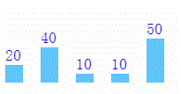
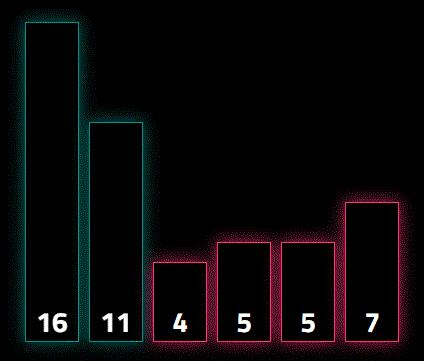

自己实现冒泡排序可视化
===

先来个简单的版本，看效果图 



**实现这个效果，思路是这样的** 
1. 先将需要排序的数组，进行冒泡排序，记录每一步的内容，存放在一个数组中 
2. 利用canvas，实现一个 darw 方法，能将一步的内容画到页面上  
3. 实现动画效果，利用定时器，每隔一段时间，调用  darw 方法，画出一步到页面上    

实现这个效果还是需要会一点点`canvas`的，比如知道怎么画个长方形，怎么写几个字，换个颜色，如果不会的话，请到这里去看看。

**代码**
```html
<!doctype html>
<html lang="en">

<head>
  <meta charset="UTF-8">
  <style>
    #main {
      width: 600px;
      height: 200px;
      position: relative;
    }
  </style>
</head>

<body>

  <div id="main">
    <canvas id="myCanvas" width="600" height="200"> </canvas>
  </div>
  <script>
    function bubbleSort(arr) {
      // 冒泡排序算法，对数组进行排序，同时记录每一步操作，保存在一个数组中
      function sort() {
        // virtualArr 用来存放 每一个步内容的数组
        var virtualArr = [arr.slice()];
        var max = arr.length;
        for (var i = 0; i < max; i++) {
          var done = true;
          for (var j = 0; j < max - i; j++) {
            if (arr[j] > arr[j + 1]) {
              var temp = arr[j];
              arr[j] = arr[j + 1];
              arr[j + 1] = temp;
              done = false;
              virtualArr.push(arr.slice());
            }
          };
          if(done){
            break;
          };
        }
        return virtualArr;
      }

      // 绘画，调用一次就画出一步的图像 
      function darw(arr){
        var canvas = document.getElementById('myCanvas');
        var ctx = canvas.getContext('2d');
        // 获取 canvas画板的高度(确定每个长方形的 y 值时需要)
        var maxWidth = canvas.height;
        // 每个长方形的宽度
        var width = 20;
        // 每个长方形之间的间隔
        var space =20;

        // 清空画布
        ctx.clearRect(0, 0, canvas.width, canvas.height);
        // 设置字体
        ctx.font = "18px serif";
        // 在页面上，画出一步的内容
        for (var i = 0; i < arr.length; i++) {
          ctx.fillStyle = '#61C5FE';
          // x 的 值等于 第i个长方形 * （长方形的宽+每个长方形的间隔）
          // y 的 值等于  画板的高度 - 第i的元素的值
          ctx.fillRect(i * (width+space), maxWidth - arr[i], width, arr[i]);
          ctx.fillStyle = '#240be4';
          // maxWidth - arr[i]-5，这里多- 5，是为了能让文字，在长方形上方一点显示，看的明显些
          ctx.fillText(arr[i], i * (width+space), maxWidth - arr[i]-5);
        }
      }

      // 动画 
      function animation() {
        // 调用sort 方法，返回包括每一步内容的数组
        var virtualArr = sort();
        var interval =500;
        // 遍历得到的数组，每隔500ms，调用darw 方法，画出一步内容
        virtualArr.forEach((item, index) => {
            setTimeout(() => darw(item), index * interval);
        });  
      }

      animation();
    }
    var arr = [50,40,20,10,10];
    bubbleSort(arr);
  </script>
</body>
</html>
```

**看上面的代码，能看出，实现效果主要靠的是三个函数** 
1. `sort`，实现冒泡排序，返回包括每一步的数组  
2. `darw` ，画出一步的内容 
3. `animation` ，实现动画效果，定时调用`darw`方法

上面实现的是比较简单的一版，下来看一版更加漂亮的，这是我在Codepen上找到的，改了些代码后，是这样了，看图 



**这一版是使用vue做的，在vuex中的mutations定义了 6个方法 来实现效果**
1. reset，重置， 
2. swap，交换，实现图中两个绿色div，进行位移， 
3. activate，激活，实现图中两个红色div，变成绿色， 
4. deactivate，释放，实现图中两个绿色div，恢复成红色， 
5. lock，锁定，实现找到一个最大值后，将它变成蓝色， 
6. done，完成，返回 true 表示排序完成。

```html
<div id="app">
  <div class="cards">
    <sort-card
      v-for="(card, index) in store.state.cards"
      :key="index"
      :value="card.value"
      :sort-index="card.sortIndex"
      :is-active="card.isActive"
      :is-locked="card.isLocked"
    >
    </sort-card>
  </div>
  <div class="control-panel">
    <h1>Bubble Sort Visualizer</h1>
    <button
      aria-label="Reset"
      v-if="store.state.done"
      @click="reset(SORT_ARRAY)"
    >
      <i class="fa fa-refresh" aria-hidden="true"></i>
    </button>
  </div>
</div>
<script type="text/x-template" id="sort-card-template">
  < !--绑定内联样式，通过 height 和 transform 来显示不同的div-- >
  <div class="card-wrapper" : data-sort-index="sortIndex"
    v-bind: style="{height: value * HEIGHT_INCREMENT + 'px',transform: 'translateX('+sortIndex*100+'%)'}">
    <!-- 通过改变class，来改变颜色 -->
    <div class="card" : class="cardClassObject">
      <div class="value">{{ value }}</div>
  </div>
  </div >
</script>
```

```css
$transition-time: 200ms;
$easing: cubic-bezier(0.175, 0.885, 0.320, 1.275);

@import url('https://fonts.googleapis.com/css?family=Titillium+Web:700');
@import url('https://maxcdn.bootstrapcdn.com/font-awesome/4.7.0/css/font-awesome.min.css');

*, *::before, *::after {
  box-sizing: border-box;
}

html {
  font: 700 16px/1 'Titillium Web', sans-serif;
}

body {
  margin: 40px 0;
  color: #fff;
  background-color: #000;
}

#app {
  width: 640px;
  margin: 0 auto;
}

.cards {
  position: relative;
  height: 400px;
}

.card-wrapper {
  position: absolute;
  bottom: 0;
  width: 6.25%;
  transition: transform $transition-time $easing;
}

.card {
  position: relative;
  height: 100%;
  margin: 0 5px;
  border: 1px solid #ff3179;
  background-color: #000;
  box-shadow: 0 0 25px #c2255c;
}

.card-active {
  filter: hue-rotate(200deg);
}

.card-locked {
  filter: hue-rotate(280deg);
}

.value {
  position: absolute;
  bottom: 5px;
  left: 0;
  right: 0;
  text-align: center;
  font-size: 1.25rem;
}

.control-panel {
  display: flex;
  align-items: center;
  justify-content: space-between;
  margin: 30px 5px 0;
  padding-top: 20px;
  border-top: 1px solid #fff;
}

h1 {
  margin: 0;
  font-size: 2.5rem;
}

button {
  appearance: none;
  background: none;
  border: none;
  color: #ff3179;
  font-size: 1.5rem;
  cursor: pointer;
}

@media only screen and (min-width: 880px) {
  #app { width: 800px; }
  .value { font-size: 1.5rem; }
}

@media only screen and (min-width: 1084px) {
  #app { width: 1024px; }
  .value { font-size: 1.75rem; }
}
```

```js
const EVENT_DELAY = 200; // 交换的过渡时间
const HEIGHT_INCREMENT = 20; //高度的增量, 数组的某一个值 * 增量 = 长方形高度
const SORT_ARRAY = [16, 11, 4, 5, 5, 7]; // 进行冒泡排序的数组

const store = new Vuex.Store({
  state: {
    values: [], // 值为 SORT_ARRAY 的副本
    cards: [], // 可视化需要的数组，就是每一个长方形（div元素），数组的每一个值都代表一个div元素
    done: true, // 表示是否排序完成，为true时，右下角出现重置按钮

    // strValues 用来解决数组中出现重复的值，移动位置不对的情况
    strValues: [] // 数组的一个副本，会将数组的值与下标拼起来，形成唯一的一个字符串
  },

  mutations: {
    // 重置，重新开始排序
    reset(state, payload) {
      state.values = payload.values;
      // 遍历state.values，把state.values的每个值和下标拼接，形成唯一的字符串
      // 值 和 下标 中间加上一个 符号，确保是唯一的，注意符号不能用""空字符串
      state.values.forEach((item, i) => state.strValues.push(item + "&" + i));

      // 往 state.cards 中，添加对象，每个对象都代表一个需要排序的长方形（div元素）
      state.cards = [];
      for (let i = 0; i < state.values.length; i++) {
        state.cards.push({
          value: state.values[i], // 数组中的值
          strValue: state.strValues[i], //数组中的值和下标拼接的字符串
          sortIndex: i, // 排序的索引
          isActive: false, // 是否激活
          isLocked: false // 是否锁定
        });
      }

      state.done = false;
    },

    // 交换
    swap(state, payload) {
      let a = payload.indexes[0];
      let b = payload.indexes[1];
      let temp = state.values[a];

      // 交换真实的值
      state.values[a] = state.values[b];
      state.values[b] = temp;

      // 交换 数组中的值和下标拼接的字符串
      let temp2 = state.strValues[a];
      state.strValues[a] = state.strValues[b];
      state.strValues[b] = temp2;

      // 重新定义state.cards的每个成员的sortIndex属性
      state.cards.forEach(card => {
        card.sortIndex = state.strValues.indexOf(card.strValue);
      });
    },

    // 激活
    // 用参数 payload的indexes属性中所有成员，与state.cards 的每个成员（card）的sortIndex属性与进行匹配，
    // 如果找到相等的，就将state.cards 的成员（card）的isActive设置为true
    activate(state, payload) {
      payload.indexes.forEach(index => {
        state.cards.forEach(card => {
          if (card.sortIndex === index) card.isActive = true;
        });
      });
    },

    //  释放
    // 用参数 payload的indexes属性中所有成员，与state.cards 的每个成员（card）的sortIndex属性与进行匹配，
    // 如果找到相等的，就将state.cards 的成员（card）的isActive设置为false
    deactivate(state, payload) {
      payload.indexes.forEach(index => {
        state.cards.forEach(card => {
          if (card.sortIndex === index) card.isActive = false;
        });
      });
    },

    // 锁定
    // 用参数 payload的indexes属性中所有成员，与state.cards 的每个成员（card）的sortIndex属性与进行匹配，
    // 如果找到相等的，就将state.cards 的成员（card）的isLocked设置为true
    lock(state, payload) {
      payload.indexes.forEach(index => {
        state.cards.forEach(card => {
          if (card.sortIndex === index) card.isLocked = true;
        });
      });
    },

    // 完成
    done(state) {
      state.done = true;
    }
  }
});

Vue.component("sort-card", {
  template: "#sort-card-template",
  props: ["value", "sortIndex", "isActive", "isLocked"],
  computed: {
    cardClassObject() {
      return {
        "card-active": this.isActive,
        "card-locked": this.isLocked
      };
    }
  }
});

new Vue({
  el: "#app",
  store,
  created() {
    this.reset(SORT_ARRAY);
  },
  methods: {
    // 重置
    reset(arr) {
      // 获取传入数组的一个副本，因为重置功能需要不改变原数组
      let values = arr.slice();
      store.commit({ type: "reset", values: values });

      // 排序数组，返回一个包括每步的值 和 每步状态的数组
      let sequence = this.bubbleSort(values);

      // 遍历上边排序得到的数组，定时执行操作，实现动画效果
      sequence.forEach((event, index) => {
        setTimeout(() => {
          store.commit(event);
        }, index * EVENT_DELAY);
      });
    },

    // 冒泡排序方法，返回包括每一步的数组
    bubbleSort(values) {
      // sequence 为包括每一步内容的数组
      let sequence = [];
      // swapped 为判断是否已经排序好的 标志位
      let swapped;
      // indexLastUnsorted 用来减少不必要的循环
      let indexLastUnsorted = values.length - 1;

      do {
        swapped = false;
        for (let i = 0; i < indexLastUnsorted; i++) {
          // card 是 state.cards 的一个成员
          // 开始一次循环，就有两个card 的 isActive的值设置为true
          sequence.push({ type: "activate", indexes: [i, i + 1] });

          // 如果前一个数 大于 后一个数，就交换两数
          if (values[i] > values[i + 1]) {
            let temp = values[i];
            values[i] = values[i + 1];
            values[i + 1] = temp;
            swapped = true;
            // 满足交换的条件，就重新定义所有card的sortIndex属性
            sequence.push({ type: "swap", indexes: [i, i + 1] });
          }
          // 结束这次循环之前，把原来两个card的isActive的值为true的，设置为false
          sequence.push({ type: "deactivate", indexes: [i, i + 1] });
        }
        // 外层循环，每循环完一次，就锁定最后一个card，下次这个card 就不参与循环
        sequence.push({ type: "lock", indexes: [indexLastUnsorted] });
        indexLastUnsorted--;
      } while (swapped);

      // 如果提前排序好了，把剩下的card全部锁定
      let skipped = Array.from(Array(indexLastUnsorted + 1).keys());
      sequence.push({ type: "lock", indexes: skipped });
      // 修改done 为true，完成排序
      sequence.push({ type: "done" });
      console.log("包括每一步内容的数组", sequence);
      return sequence;
    }
  }
});
```