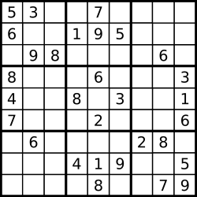

解数独
===
<!-- TOC -->

- [解数独](#解数独)
  - [题目](#题目)
  - [标签](#标签)
  - [JS](#JS)

<!-- /TOC -->
## 题目
编写一个程序，通过已填充的空格来解决数独问题。

一个数独的解法需遵循如下规则：

1. 数字 `1-9` 在每一行只能出现一次。
2. 数字 `1-9` 在每一列只能出现一次。
3. 数字 `1-9` 在每一个以粗实线分隔的 `3x3` 宫内只能出现一次。
4. 空白格用 `'.'` 表示。



一个数独。


答案被标成红色。

Note:
- 给定的数独序列只包含数字 `1-9` 和字符 `'.'` 。
- 你可以假设给定的数独只有唯一解。
- 给定数独永远是 `9x9` 形式的。

## 标签
- 哈希表
- 回溯算法

## JS
```js
/**
 * @param {character[][]} board
 * @return {void} Do not return anything, modify board in-place instead.
 */
var S = [[], [], [], [], [], [], [], [], []]; //初始值
var INIT = [[], [], [], [], [], [], [], [], []]; //备份初始值
var solveSudoku = function(board) {
  for (i = 0; i < 9; i++) {
    for (j = 0; j < 9; j++) {
      if (board[i][j] == ".") {
        S[i][j] = 0;
        INIT[i][j] = 0;
      } else {
        S[i][j] = board[i][j];
        INIT[i][j] = board[i][j];
      }
    }
  }
  //初始值合法性检测
  //var isInitArrOK = allCheck(S,1);
  if (true) {
    //数独克星===================================================start
    try {
      var re = core(S, 0, 0);
      if (re.flag == 1) {
        for (i = 0; i < 9; i++) {
          for (j = 0; j < 9; j++) {
            board[i][j] = re.arr[i][j] + "";
          }
        }
      } else {
        console.log("no");
      }
    } catch (error) {
      console.log("runing"); //异常处理(如循环次数出现太多)
    }
    //数独克星====================================================end
  } else {
    //printS(INIT);
    console.log("init false"); //初始化数据有问题
  }
};
//判断一个数组是否有重复的值(值为0的除外)
function isRepeat(arr) {
  var hash = {};
  for (var i in arr) {
    if (hash[arr[i]]) return true;
    if (arr[i] != 0) {
      hash[arr[i]] = true;
    }
  }
  return false;
}
//判断数组之和是否为非45
function isAll(arr) {
  var sum = 0;
  for (var i = 0; i < 9; i++) {
    sum += arr[i];
  }
  return sum == 45 ? false : true;
}
//arr 待检测的组数
//type=1只检是否有重复;type=2检测是否和为非45;type=3 是否有重复 和 非45 都检测
//如果返回真则数独不成立
function check(arr, type) {
  switch (type) {
    case 1:
      return isRepeat(arr);
    case 2:
      return isAll(arr);
    case 3:
      return isAll(arr) || isRepeat(arr);
  }
}
//行检测(有没有重复数据)
//参数 arr数独二维数组
//没有重复数据返回 true,有重复数据返回 false
function rowsCheck(arr, type) {
  for (var i = 0; i < 9; i++) {
    if (check(arr[i], type)) {
      return false;
    }
  }
  return true;
}
//列检测(有没有重复数据)
//参数 arr数独二维数组
//没有重复数据返回 true,有重复数据返回 false
function colsCheck(arr, type) {
  var tmparr = [[], [], [], [], [], [], [], [], []];
  for (var i = 0; i < 9; i++) {
    for (var j = 0; j < 9; j++) {
      tmparr[i][j] = arr[j][i];
    }
    if (check(tmparr[i], type)) {
      return false;
    }
  }
  return true;
}
//列检测(有没有重复数据)
//参数 arr数独二维数组
//没有重复数据返回 true,有重复数据返回 false
function blockCheck(arr, type) {
  var tmparr = [[], [], [], [], [], [], [], [], []];
  for (var i = 0; i < 9; i++) {
    for (var j = 0; j < 9; j++) {
      var x = parseInt(i / 3) * 3;
      var y = (i % 3) * 3;
      x = x + parseInt(j / 3);
      y = y + (j % 3);
      tmparr[i][j] = arr[x][y];
    }
    if (check(tmparr[i], type)) {
      return false;
    }
  }
  return true;
}
// type=1 检测一个未完成的数独是否合法
// type=3 检测一个完成的数独是否成立
// 返回 true 合法 或 成立
function allCheck(arr, type) {
  return rowsCheck(arr, type) && colsCheck(arr, type) && blockCheck(arr, type);
}
function printS(arr) {
  //console.log(arr[0][1]);
  //return 0;
  for (var i = 0; i < 9; i++) {
    console.log(arr[i]);
  }
  console.log("================================");
}
//找上一次的正确节点
//INIT初始的数独(二维数据),S要计算的数独二维数组,xy为当前所处的错误节点坐标,v为坐标值
function findBackNode(INIT, S, i, j) {
  var x = i;
  var y = j;
  if (x < 0) {
    return { flag: 0 }; //上级节点没有了，则说明此数组无解(抽象为回到迷宫入口外)
  }
  //console.log(x+'-'+y+'=');
  if (INIT[x][y]) {
    //console.log(S[x][y]);
    //printS(S);
    x = j - 1 < 0 ? i - 1 : i;
    y = j - 1 < 0 ? 8 : j - 1;
    return findBackNode(INIT, S, x, y);
  } else {
    if (S[x][y] < 9) {
      //console.log(S[x][y]);
      //printS(S);
      S[x][y] = S[x][y] + 1;
      if (allCheck(S, 1)) {
        return { flag: 1, arr: S, x: x, y: y };
      } else {
        return findBackNode(INIT, S, x, y);
      }
    } else {
      //console.log(S[x][y]);
      //printS(S);
      S[x][y] = 0;
      x = j - 1 < 0 ? i - 1 : i;
      y = j - 1 < 0 ? 8 : j - 1;
      return findBackNode(INIT, S, x, y);
    }
  }
}
function core(S, x, y) {
  for (var i = 0; i < 9; i++) {
    for (var j = 0; j < 9; j++) {
      //console.log('cur('+i+','+j+')');
      //如果起初没有值;则尝试进行填值。
      if (S[i][j] == 0) {
        //console.log('('+i+','+j+')'+'='+S[i][j]);
        for (var n = 1; n <= 9; n++) {
          S[i][j] = n;
          if (allCheck(S, 1)) {
            break;
          } else {
            //若尝试填到9，数还未成立。则这一轮尝试失败退回
            if (n == 9) {
              //回退-到上一次正确的节点start
              S = findBackNode(INIT, S, i, j);
              lastnode = S;
              //回退-到上一次正确的节点end
              x = S.x;
              y = S.y;
              if (S.flag == 1) {
                return core(S.arr, x, y);
              } else {
                return { flag: 0 };
              }
              //return false;
            } else {
              continue;
            }
          }
        }
      } else {
        //console.log(i+'-'+j+'init');
      }
    }
  }
  return { flag: 1, arr: S };
}
```