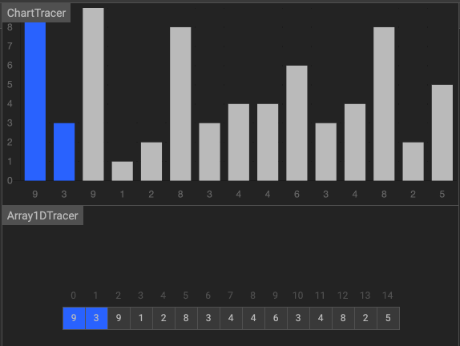

选择排序
===
<!-- TOC -->

- [选择排序](#选择排序)
  - [思路](#思路)
  - [步骤](#步骤)
  - [动画](#动画)
  - [实现](#实现)
  - [分析](#分析)

<!-- /TOC -->

## 思路

选择排序算法的实现思路有点类似插入排序，也分已排序区间和未排序区间。但是选择排序每次会从未排序区间中找到最小的元素，将其放到已排序区间的末尾。

## 步骤
1. 首先在未排序序列中找到最小（大）元素，存放到排序序列的起始位置。
2. 再从剩余未排序元素中继续寻找最小（大）元素，然后放到已排序序列的末尾。
3. 重复第二步，直到所有元素均排序完毕。

## 动画



[动画演示地址 https://algorithm-visualizer.org/brute-force/selection-sort](https://algorithm-visualizer.org/brute-force/selection-sort)

## 实现
```js
const selectionSort = array => {
	const len = array.length;
	let minIndex, temp;
	for (let i = 0; i < len - 1; i++) {
		minIndex = i;
		for (let j = i + 1; j < len; j++) {
			if (array[j] < array[minIndex]) {
				// 寻找最小的数
				minIndex = j; // 将最小数的索引保存
			}
		}
		temp = array[i];
		array[i] = array[minIndex];
		array[minIndex] = temp;
		console.log('array: ', array);
	}
	return array;
};
```

**测试**

```js
// 测试
const array = [5, 4, 3, 2, 1];
console.log('原始array:', array);
selectionSort(array);
// 原始 array:  [5, 4, 3, 2, 1]
// array:  		 [1, 4, 3, 2, 5]
// array:  		 [1, 2, 3, 4, 5]
// array: 		 [1, 2, 3, 4, 5]
// array:  		 [1, 2, 3, 4, 5]
```

## 分析
1. 第一，选择排序是原地排序算法吗 ？  
   选择排序空间复杂度为 O(1)，是一种原地排序算法。

2. 第二，选择排序是稳定的排序算法吗 ？  
  选择排序每次都要找剩余未排序元素中的最小值，并和前面的元素交换位置，这样破坏了稳定性。所以，选择排序是一种不稳定的排序算法。

3. 第三，选择排序的时间复杂度是多少 ？  
  无论是正序还是逆序，选择排序都会遍历 n2 / 2 次来排序，所以，最佳、最差和平均的复杂度是一样的。
   - 最佳情况：T(n) = O(n2)。
   - 最差情况：T(n) = O(n2)。
   - 平均情况：T(n) = O(n2)。
