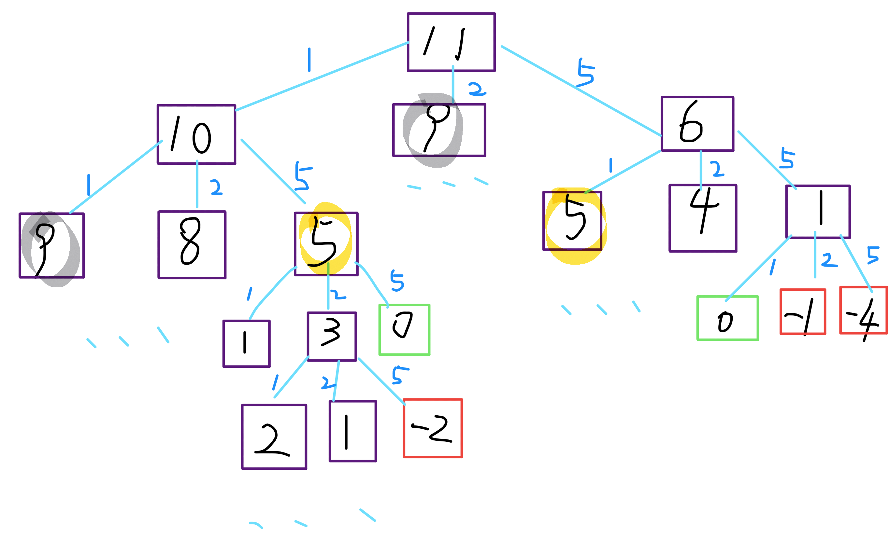

零钱兑换 - 凑零钱
===
<!-- TOC -->

- [零钱兑换 - 凑零钱](#零钱兑换---凑零钱)
  - [题目](#题目)
  - [标签](#标签)
  - [JS1 DP](#js1-dp)
  - [JS2 DP](#js2-dp)
  - [JS3 DP](#js3-dp)
  - [JS4 DP](#js4-dp)
  - [JS5 DP](#js5-dp)
  - [JS6 DP](#js6-dp)
  - [JS7 贪心算法](#js7-贪心算法)

<!-- /TOC -->

## 题目
给定不同面额的硬币 coins 和一个总金额 amount。编写一个函数来计算可以凑成总金额所需的最少的硬币个数。如果没有任何一种硬币组合能组成总金额，返回 -1。

示例 1:
```js
输入: coins = [1, 2, 5], amount = 11
输出: 3 
解释: 11 = 5 + 5 + 1
```

示例 2:
```js
输入: coins = [2], amount = 3
输出: -1
```

**说明**:  
你可以认为每种硬币的数量是无限的。

## 标签
- 动态规划
- 贪心算法

## JS1 DP
画出递归树：



```js
var coinChange = function(coins, amount) {
  if (amount == 0) return 0;
  var ans = Number.MAX_VALUE;
  for (var coin in coins) {
    // 金额不可达
    if (amount - coin < 0) continue;
    var subProb = coinChange(coins, amount - coin);
    // 子问题无解
    if (subProb == -1) continue;
    ans = Math.min(ans, subProb + 1);
  }
  return ans == Number.MAX_VALUE ? -1 : ans;
}

coinChange([1, 2, 5], 11) // 3
```

## JS2 DP
```js
var coinChange = function(coins, amount) {
  let dp = [0];

  for (let i = 1; i < amount + 1; i++) {
    dp[i] = Number.MAX_VALUE;

    for (let coin of coins) {
      if (i >= coin && dp[i - coin] !== -1) {
        dp[i] = Math.min(dp[i - coin] + 1, dp[i]);
      }
    }

    if (dp[i] === Number.MAX_VALUE) dp[i] = -1;
  }
  return dp[amount];
};
```

## JS3 DP
```js
var coinChange = (coins, amount) => {
  // dp[i]表示装满i数量所需要的最少硬币数，
  // 状态转移方程为d[i] = math.min(dp[i],dp[i-k]+1),
  // 满足i>=k的条件即可。
  let dp = new Array(amount + 1).fill(Number.MAX_SAFE_INTEGER);
  dp[0] = 0;
  for (let i = 0; i <= amount; i++) {
    coins.forEach(coin => {
      if (i - coin >= 0) dp[i] = Math.min(dp[i], dp[i - coin] + 1);
    });
  }
  return dp[amount] === Number.MAX_SAFE_INTEGER ? -1 : dp[amount];
};
```

## JS4 DP
```js
var coinChange = function(coins, amount) {
  var dp = [0];
  for (var i = 1; i <= amount; i++) {
    dp[i] = amount + 1;
    for (var j = 0; j < coins.length; j++) {
      if (i >= coins[j]) {
        dp[i] = dp[i] > dp[i - coins[j]] + 1 ? dp[i - coins[j]] + 1 : dp[i];
      }
    }
  }
  return dp[amount] > amount ? -1 : dp[amount];
};

coinChange([1, 2, 5], 11)
```

## JS5 DP
```js
var coinChange = function(coins, amount) {
  let dp = Array(amount + 1).fill(Number.MAX_SAFE_INTEGER);
  dp[0] = 0;

  for (const c of coins) {
    for (let i = c; i <= amount; i++) {
      dp[i] = Math.min(dp[i], dp[i - c] + 1);
    }
  }

  if (dp[amount] === Number.MAX_SAFE_INTEGER) return -1;
  return dp[amount];
};

coinChange([1, 2, 5], 11)
```


## JS6 DP
```js
var coinChange = function(coins, amount) {
  if (amount <= 0 || coins.length == 0) {
    return 0;
  }
  coins.sort((a, b) => a - b);
  var dp = []; //dp[i]表示i金额的最小拿法
  for (var i = 0; i <= amount; i++) {
    var arr = [];
    for (var j = 0; j < coins.length; j++) {
      if (i < coins[j]) {
        break;
      } else {
        if (coins[j] == i) {
          arr.push(1);
        }
        if (dp[i - coins[j]] !== -1) {
          arr.push(dp[i - coins[j]] + 1);
        }
      }
    }
    if (arr.length == 0) {
      dp[i] = -1;
    } else {
      dp[i] = Math.min(...arr);
    }
  }
  return dp[amount];
};

coinChange([1, 2, 5], 11) // 3
```

## JS7 贪心算法
对每个面额(从大到小), 把它的值和total相加后， total需要小于amount, 我们会将当前面额coin添加到结果中，也会将它和total相加
```js
var minCoinChange = function(coins, amount) {
  var change = [],
      total = 0;

  for(var i = coins.length; i >= 0; i--) { // 对每个面额(从大到小)
    var coin = coins[i];

    while(total + coin <= amount) { // 把它的值和total相加后， total需要小于amount
      change.push(coin);  // 将当前面额coin添加到结果中
      total += coin  // 会将它和total相加
    }
  }

  return change;
}

minCoinChange([1, 2, 5], 11) // [5, 5, 1]
```