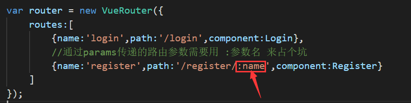

Vue路由获取路由参数
===
<!-- TOC -->

- [1.通过query配置](#1通过query配置)
- [2.通过params配置](#2通过params配置)
- [获取路由参数的方法：](#获取路由参数的方法)
  - [1.通过query配置的：](#1通过query配置的)
  - [2.通过params配置的：](#2通过params配置的)

<!-- /TOC -->

vue路由**设置路由参数**有2种方式：

## 1.通过query配置
```html
<router-link :to="{ name:'login',query:{id:1} }">登录</router-link>
```

通过query配置的路径显示如下：

router获取路由参数.html#/login?<span style="border: 1px red solid">id=1</span>


## 2.通过params配置
```html
<router-link :to="{ name:'register',params:{'name':'San'} }">注册</router-link>
```

通过query配置的路径显示如下：

router获取路由参数.html#/register/<span style="border: 1px red solid">San</span>

通过该方法配置的参数，需要在配置路由的时候给参数留个坑，如下图：




##  获取路由参数的方法：
### 1.通过query配置的：
```js
this.$route.query
```

### 2.通过params配置的：
```js
this.$route.params
```

相关代码：
```html
<!DOCTYPE html>
<html lang="en">

<head>
    <title>路由参数</title>
    <meta charset="UTF-8">
    <meta name="viewport" content="width=device-width, initial-scale=1">   
</head>

<body>

  <div id="app">
  </div>
  <script src="https://cdn.bootcss.com/vue/2.5.15/vue.js"></script>
  <script src="js/vue-router.js"></script>
  <script>
    var Login = {
      template:`<div>我是登录页面</div>`,
      created() {
        console.log(this.$route.query)
      },    
    }

    var Register = {
      template:`<div>我是注册页面</div>`,
      created() {
        console.log(this.$route.params)
      },
    }

    Vue.use(VueRouter);

    var router = new VueRouter({
      routes:[
        {name:'login',path:'/login',component:Login},
        //通过params传递的路由参数需要用 :参数名 来占个坑
        {name:'register',path:'/register/:name',component:Register}
      ]
    });
    
    var App = {
      template:`
        <div>
          <router-link :to="{ name:'login',query:{id:1} }">登录</router-link>
          <router-link :to="{ name:'register',params:{'name':'San'} }">注册</router-link>
          <router-view></router-view>
        </div>
      `
    }

    var vm = new Vue({
      el: '#app',
      router:router,
      components: {
        app:App
      },
      template:`<app></app>`
    });
  </script>

</body>

</html>
```
