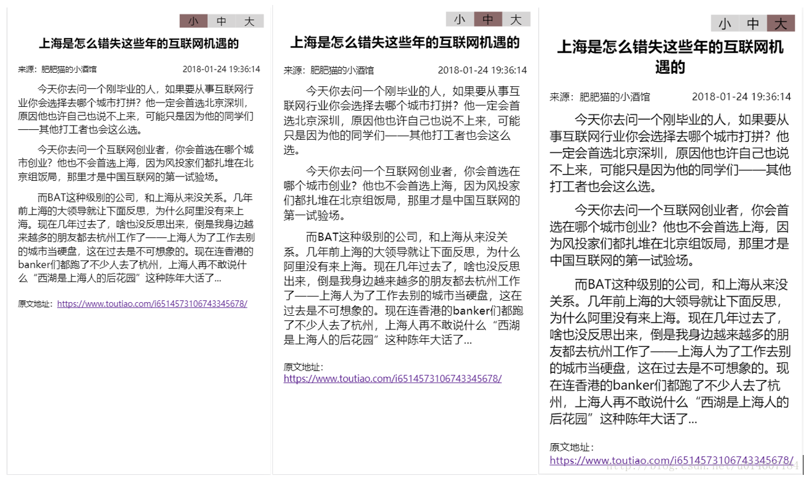

详解rem布局-利用rem布局实现移动端高清显示
===
<!-- TOC -->

- [一、初探rem布局](#一初探rem布局)
  - [1.1 rem是什么?](#11-rem是什么)
  - [1.2 rem实现新闻字体“小中大”设置](#12-rem实现新闻字体小中大设置)
- [二、利用rem布局实现移动端高清显示](#二利用rem布局实现移动端高清显示)
- [工作中踩的两个坑：](#工作中踩的两个坑)

<!-- /TOC -->

## 一、初探rem布局

### 1.1 rem是什么?
rem是CSS3新增的一个相对单位（root em，根em）。这个单位与em有什么区别呢？区别在于使用rem为元素设定字体大小时，仍然是相对大小，但相对的只是HTML根元素。这个单位可谓集相对大小和绝对大小的优点于一身，通过它既可以做到只修改根元素就成比例地调整所有字体大小，又可以避免字体大小逐层复合的连锁反应。目前，除了IE8及更早版本外，所有浏览器均已支持rem。对于不支持它的浏览器，应对方法也很简单，就是多写一个绝对单位的声明。这些浏览器会忽略用rem设定的字体大小。举一个简单的例子：

浏览器默认的 html `font-size=16px`， 这样如果我们需要设置字体的大小为12px, 通过计算可知 `12 / 16 = 0.75`；因此只需要设置 `font-size= 0.75rem`。

为了计算方便，我们可以设置html `font-size=10px` 或者 `font-size=62.5%`，这样设置12px字体的时候就只需要设置 `font-size=1.2rem`,十进制换算信手拈来。


### 1.2 rem实现新闻字体“小中大”设置

介绍完rem,急需写点东西练练手：通常在移动端看新闻的时候，右上角都有个调节字体大小的，可以通过点击调节新闻的字体大小，方便阅读。用rem实现的基本思路就是：设置html的`font-size`，然后新闻中的字体都根据 html 的 `font-size`来设置大小，点击调节字体大小时，只需要将 html 的 `font-size` 修改成对应的值就可以了。

首先设置html
> font-size: 16px;

然后新闻的标题、内容等字体大小都根据 html 的大小来设置
```css
 .title{
    font-size: 1.2rem;
 }
 .sub-title{
     font-size: 0.8rem;
 }
 .content{
     font-size: 1rem;
 }
 .bottom{
     font-size: 0.8rem;
 }
```

最后再放置一个三个`<li/>`元素，并加上click 事件用来控制 html 的`font-size`大小：

```js
// html
<ul><li id="1">小</li><li id="2">中</li><li id="3">大</li></ul>

// js
$("li").click(function() {
    $("li").css({"background":"#d6d5d5"});
    $(this).css({"background":"#8a6969"});
    var index = $(this).attr("id");
    var TextFont;
    switch (index) {
        case "1":
            TextFont = 14;
            break;
        case "2":
            TextFont = 16;
            break;
        case "3":
            TextFont = 18;
            break;
        default:
            TextFont = 16;
            break;
    }
    $("html").css({"font-size":TextFont});
})
```

最后的效果图：



上述效果的完整的代码如下：
```html
<!DOCTYPE html>
<html>
<head>
    <meta charset="utf-8" />
    <meta http-equiv="X-UA-Compatible" content="IE=edge">
    <title>rem布局实现新闻字体小中大切换</title>
    <meta name="viewport" content="width=device-width, initial-scale=1">
    <style>
        *{margin:0;padding:0} 
        body{
            padding: 20px 15px;
        }
        html{
            font-size: 16px;
        }
        .title{
            text-align: center;
            font-size: 1.2rem;
            margin: 20px 0;
        }
        .sub-title{
            position: relative;
            font-size: 0.8rem;
        }
        .sub-title:after{display:block;clear:both;content:"";visibility:hidden;height:0} 
        .source{
            float: left;
        }
        .date{
            float: right;
        }
        .content{
            margin: 10px 0;
            font-size: 1rem;
        }
        .content .item{
            text-indent: 2em;
            margin: 10px 0;
        }
        .bottom{
            margin-top: 20px;
            text-align: left;
            font-size: 0.8rem;
        }

        ul{
            list-style:none;
            position: absolute;
            top: 10px;
            right: 10px;
        }
        li{
            float: left;
            width: 40px;
            /* height: 20px; */
            text-align: center;
            background: #d6d5d5;
        }

    </style>
</head>
<body>
    <ul><li id="1">小</li><li id="2">中</li><li id="3">大</li></ul>
    <h3 class="title">上海是怎么错失这些年的互联网机遇的</h3>
    <p class="sub-title"><span class="source">来源：肥肥猫的小酒馆</span><span class="date">2018-01-24 19:36:14</span></p>
    <div class="content">
        <p class="item">今天你去问一个刚毕业的人，如果要从事互联网行业你会选择去哪个城市打拼？他一定会首选北京深圳，原因他也许自己也说不上来，可能只是因为他的同学们——其他打工者也会这么选。</p>
        <p class="item">今天你去问一个互联网创业者，你会首选在哪个城市创业？他也不会首选上海，因为风投家们都扎堆在北京组饭局，那里才是中国互联网的第一试验场。</p>
        <p class="item">而BAT这种级别的公司，和上海从来没关系。几年前上海的大领导就让下面反思，为什么阿里没有来上海。现在几年过去了，啥也没反思出来，倒是我身边越来越多的朋友都去杭州工作了——上海人为了工作去别的城市当硬盘，这在过去是不可想象的。现在连香港的banker们都跑了不少人去了杭州，上海人再不敢说什么“西湖是上海人的后花园”这种陈年大话了...</p>
    </div>
    <p class="bottom">原文地址：<a href="https://www.toutiao.com/i6514573106743345678/">https://www.toutiao.com/i6514573106743345678/</a></p>
</body>
<script src="https://apps.bdimg.com/libs/jquery/2.1.4/jquery.min.js"></script>
<script>
    $(function() {
        $("li").click(function() {
            $("li").css({"background":"#d6d5d5"});
            $(this).css({"background":"#8a6969"});
            var index = $(this).attr("id");
            var TextFont;
            switch (index) {
                case "1":
                    TextFont = 14;
                    break;
                case "2":
                    TextFont = 16;
                    break;
                case "3":
                    TextFont = 18;
                    break;
                default:
                    TextFont = 16;
                    break;
            }
            $("html").css({"font-size":TextFont});
        })
    });
</script>
</html>
```

## 二、利用rem布局实现移动端高清显示
对rem有了基本的了解之后，可以用rem的思想来实现移动端的自适应高清缩放，实现高清显示。

首先来了解一些基本知识，我们在写移动端上的页面时，都会网页的`<head>`中增加这句话，让网页的宽度自动适应手机屏幕的宽度。

```html
<meta 
  name="viewport" 
  content="width=device-width, initial-scale=1.0, minimum-scale=1.0, maximum-scale=1.0, user-scalable=no" 
/>  
```

其中：
> width=device-width ：表示宽度是设备屏幕的宽度    
> initial-scale=1.0：表示初始的缩放比例  
> minimum-scale=1.0：表示最小的缩放比例  
> maximum-scale=1.0：表示最大的缩放比例  
> user-scalable=no：表示用户是否可以调整缩放比例  


这样设置之后，网页与屏幕的是1：1显示，但是我们知道手机都有自己的设备像素比（也就DPR），简单的说:dpr=2时，手机上的1个CSS像素由4个物理像素点组成。而且UI设计师提供给我们的PSD都是2倍放大的，如果以iPhone6为标准的设计图的宽度是750px。如果我们采用上述的方法来写移动端的页面：这时如果PSD上一个图标的大小为30*30px，在写css的时候我们需要除以2，也就是写成15*15px。


这种写法是没有问题的，而且我们组之前一直采用的是这种方法。直到有一天，产品开始反映说手机端上看到的线条太粗了，但是我们在css中设置的确实为1px，但是由于手机端会放大处理，也就是上面说的如果dpr=2时，手机上的1个CSS像素由4个物理像素点组成。

为了解决移动端1px线条变粗的问题，通过查找资料，网上也有不少解决方案，有用小数的，用图片的，以及用background渐变等各种方案，都有一定得复杂度和缺点。后来看到这篇文章[《手机端页面自适应解决方案—rem布局（进阶版，附源码示例）》](https://segmentfault.com/a/1190000007350680)后，决定采用rem布局来解决移动端高清显示的问题，顺便解决了移动端1px变粗的问题。

其基本思想是：通过js动态获取手机的DPR，然后通过dpr来动态设置 html 的 `font-size`，以及设置缩放比例。

具体实现主要依靠在`<head>`中引入的这段代码：

```html
<script>!function(e){function t(a){if(i[a])return i[a].exports;var n=i[a]={exports:{},id:a,loaded:!1};return e[a].call(n.exports,n,n.exports,t),n.loaded=!0,n.exports}var i={};return t.m=e,t.c=i,t.p="",t(0)}([function(e,t){"use strict";Object.defineProperty(t,"__esModule",{value:!0});var i=window;t["default"]=i.flex=function(normal,e,t){var a=e||100,n=t||1,r=i.document,o=navigator.userAgent,d=o.match(/Android[\S\s]+AppleWebkit\/(\d{3})/i),l=o.match(/U3\/((\d+|\.){5,})/i),c=l&&parseInt(l[1].split(".").join(""),10)>=80,p=navigator.appVersion.match(/(iphone|ipad|ipod)/gi),s=i.devicePixelRatio||1;p||d&&d[1]>534||c||(s=1);var u=normal?1:1/s,m=r.querySelector('meta[name="viewport"]');m||(m=r.createElement("meta"),m.setAttribute("name","viewport"),r.head.appendChild(m)),m.setAttribute("content","width=device-width,user-scalable=no,initial-scale="+u+",maximum-scale="+u+",minimum-scale="+u),r.documentElement.style.fontSize=normal?"50px": a/2*s*n+"px"},e.exports=t["default"]}]); flex(false,100, 1);</script>
```

其源码为：
```js
'use strict';

/**
 * @param {Boolean} [normal = false] - 默认开启页面压缩以使页面高清;  
 * @param {Number} [baseFontSize = 100] - 基础fontSize, 默认100px;
 * @param {Number} [fontscale = 1] - 有的业务希望能放大一定比例的字体;
 */
const win = window;
export default win.flex = (normal, baseFontSize, fontscale) => {
  const _baseFontSize = baseFontSize || 100;
  const _fontscale = fontscale || 1;

  const doc = win.document;
  const ua = navigator.userAgent;
  const matches = ua.match(/Android[\S\s]+AppleWebkit\/(\d{3})/i);
  const UCversion = ua.match(/U3\/((\d+|\.){5,})/i);
  const isUCHd = UCversion && parseInt(UCversion[1].split('.').join(''), 10) >= 80;
  const isIos = navigator.appVersion.match(/(iphone|ipad|ipod)/gi);
  let dpr = win.devicePixelRatio || 1;
  if (!isIos && !(matches && matches[1] > 534) && !isUCHd) {
    // 如果非iOS, 非Android4.3以上, 非UC内核, 就不执行高清, dpr设为1;
    dpr = 1;
  }
  const scale = normal ? 1 : 1 / dpr;

  let metaEl = doc.querySelector('meta[name="viewport"]');
  if (!metaEl) {
    metaEl = doc.createElement('meta');
    metaEl.setAttribute('name', 'viewport');
    doc.head.appendChild(metaEl);
  }
  metaEl.setAttribute('content', `width=device-width,user-scalable=no,initial-scale=${scale},maximum-scale=${scale},minimum-scale=${scale}`);
  doc.documentElement.style.fontSize = normal ? '50px' : `${_baseFontSize / 2 * dpr * _fontscale}px`;
};
```

这段代码的作用就是：**动态设置 html 的font-size, 同时根据设备DPR调整页面的缩放值，进而达到高清效果**。

注意点：
1. 上述这段代码会自动设置viewport，不再需要我们手动去设置了；
2. 默认dpr=2时，html 的font-size=100px，这样，1rem=100px，这样也利于px和rem之间的转换；
3. 之前固定px大小的元素用rem表示，之前用百分比表示的依旧用百分比表示

这种rem布局方式使用起来很方便，只需要在`<head>`中引入上述那一段压缩过的代码，然后在写 css 时将之前习惯用的 px 转换成 rem 即可。例如PSD上一个图片的大小为`30*30px`，我们不再需要去除以2了，而是直接写成：

```css
.img{
   height: 0.3rem;
   width: 0.3rem;
}
```

## 工作中踩的两个坑：
1. 一开始在项目中用时，在手机端查看，页面是手机屏幕大小的2~3倍，我们知道这种方案会动态获取手机的DPR，然后根据dpr设置 html 的 font-size 以及页面缩放比例： 
    1. 如果dpr=1(如电脑端），则html的font-size为50px，此时 1rem = 50px， viewport 的 initial-scale 、minimum-scale 和 maximum-scale 都为 “1.0” ； 
    2. 如果dpr=2(如iphone 5 和 6），则html的font-size为100px，此时 1rem = 100px， viewport 的 initial-scale 、minimum-scale 和 maximum-scale 都为 “0.5” 
    3. 如果dpr=3(如iphone 6 sp），则html的font-size为150px，此时 1rem = 150px； viewport 的 initial-scale 、minimum-scale 和 maximum-scale 都为 “0.3333333333”

    由于我们是用的hybrid开发，经过查看发现是安卓客户端限制了 viewport 设置的缩放属性，让客户端放开限制就行，但是由于市场上的app版本还是不支持，所以需要做兼容性处理。
2. iPhone6 上有1px 的滚动条，最后处理方案是通过 viewport 中的 maximum-scale 的值加了0.1，由于设置了`user-scalable=no`，maximum-scale 的值加0.1并不会有什么影响，但是却神奇的解决了这个问题。
