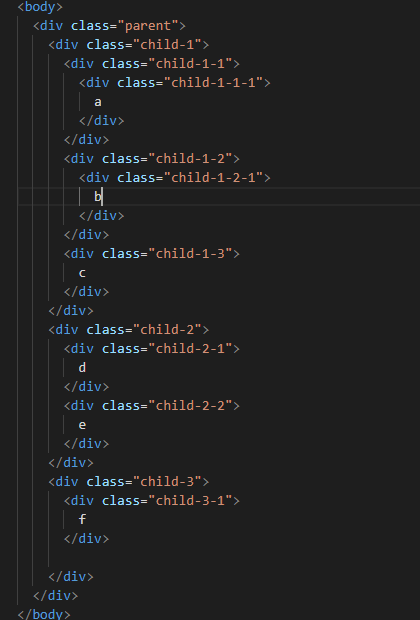

Daily-Interview-Question 1-10
===

<!-- TOC -->

- [Daily-Interview-Question 1-10](#daily-interview-question-1-10)
  - [1. 接口如何防刷](#1-接口如何防刷)
  - [2. 求两个日期中间的有效日期](#2-求两个日期中间的有效日期)
  - [3. 写 React / Vue 项目时为什么要在列表组件中写 key，其作用是什么？](#3-写-react--vue-项目时为什么要在列表组件中写-key其作用是什么)
    - [Vue中的key](#vue中的key)
    - [React 中的key](#react-中的key)
  - [4. ['1', '2', '3'].map(parseInt) what & why ?](#4-1-2-3mapparseint-what--why-)
  - [5. 介绍下 Set、Map、WeakSet 和 WeakMap 的区别？](#5-介绍下-setmapweakset-和-weakmap-的区别)
  - [6. 介绍下深度优先遍历和广度优先遍历，如何实现？](#6-介绍下深度优先遍历和广度优先遍历如何实现)
    - [深度优先遍历](#深度优先遍历)
    - [广度优先遍历](#广度优先遍历)
  - [7. 请分别用深度优先思想和广度优先思想实现一个拷贝函数？](#7-请分别用深度优先思想和广度优先思想实现一个拷贝函数)
  - [8. ES5/ES6 的继承除了写法以外还有什么区别？](#8-es5es6-的继承除了写法以外还有什么区别)
  - [9. setTimeout、Promise、Async/Await 的区别](#9-settimeoutpromiseasyncawait-的区别)
  - [10. Async/Await 如何通过同步的方式实现异步](#10-asyncawait-如何通过同步的方式实现异步)
  - [11. 异步笔试题](#11-异步笔试题)
    - [Promise和async中的立即执行](#promise和async中的立即执行)
    - [await做了什么](#await做了什么)
    - [变式一](#变式一)
    - [变式二](#变式二)
    - [变式三](#变式三)

<!-- /TOC -->

## 1. 接口如何防刷
1. referer校验
2. UA校验
3. 频率限制（1s内接口调用次数限制）
4. 把某个key加配料，带上时间戳，加密，请求时带上，过期或解密失败则403。
5. 总调用次数受限制。这个一般是在后端做限制，单位时间内最多可调用次数。
6. 同一客户端次数限制。这个前端的一般使用是给接口调用加锁，在返回结果或者一定时间之后解锁。
7. 网关控制流量洪峰，对在一个时间段内出现流量异常，可以拒绝请求
8. 源ip请求个数限制。对请求来源的ip请求个数做限制
9. http请求头信息校验；（例如host，User-Agent，Referer）
10. 对用户唯一身份uid进行限制和校验。例如基本的长度，组合方式，甚至有效性进行判断。或者uid具有一定的时效性
11. 前后端协议采用二进制方式进行交互或者协议采用签名机制
12. 人机验证，验证码，短信验证码，滑动图片形式，12306形式


## 2. 求两个日期中间的有效日期
```js
function rangeDate(startDate, endDate) {
    let start_ = new Date(startDate).getTime();
    let end_ = new Date(endDate).getTime();
    let day = 24 * 60 * 60 * 1000;
    let arr = [];
    for (let i = start_; i <= end_; i += day) {
        arr.push(i);
    }
    return arr.map(item => {
        let date = new Date(item);
        let year = date.getFullYear();
        let month = (date.getMonth() + 1);
        let day = date.getDate();
        return `${year}-${month}-${day}`;
    });
}

console.log(rangeDate("2019-9-1", "2019-9-10"));
// ["2019-9-1", "2019-9-2", "2019-9-3", "2019-9-4", "2019-9-5", "2019-9-6", "2019-9-7", "2019-9-8", "2019-9-9", "2019-9-10"]
```

```js
function getAllDays(from, to) {
  const res = [];
  let current = Date.parse(from);
  const toTimeStamp = Date.parse(to);
  while((current += 86400000) <= toTimeStamp) {
    res.push(new Date(current).toISOString().split('T')[0]);
  }
  return res;
}
console.log(getAllDays("2019-9-1", "2019-9-10"));
```

## 3. 写 React / Vue 项目时为什么要在列表组件中写 key，其作用是什么？
key是给每一个vnode的唯一id,可以依靠key,更准确, 更快的拿到oldVnode中对应的vnode节点。

1. 更准确  
    因为带key就不是就地复用了，在sameNode函数 a.key === b.key对比中可以避免就地复用的情况。所以会更加准确。
2. 更快  
    利用key的唯一性生成map对象来获取对应节点，比遍历方式更快。(这个观点，就是我最初的那个观点。从这个角度看，map会比遍历更快。)

### Vue中的key
为了给 Vue 一个提示，以便它能跟踪每个节点的身份，从而重用和重新排序现有元素，你需要为每项提供一个唯一 key 属性。理想的 key 值是每项都有唯一 id
```html
<div v-for="item in items" v-bind:key="item.id">
  <!-- 内容 -->
</div>
```
建议尽可能在使用 v-for 时提供 key attribute，除非遍历输出的 DOM 内容非常简单，或者是刻意依赖默认行为以获取性能上的提升。  
因为它是 Vue 识别节点的一个通用机制，key 并不与 v-for 特别关联，key 还具有其他用途

key 的特殊属性主要用在 Vue 的虚拟 DOM 算法，在新旧 nodes 对比时辨识 VNodes。如果不使用 key，Vue 会使用一种最大限度减少动态元素并且尽可能的尝试修复/再利用相同类型元素的算法。使用 key，它会基于 key 的变化重新排列元素顺序，并且会移除 key 不存在的元素。

有相同父元素的子元素必须有独特的 key。重复的 key 会造成渲染错误。

### React 中的key
key帮助React识别哪些项目已更改，已添加或已删除。应该为数组内部的元素赋予键，以使元素具有稳定的标识：
key必须在唯一的
```js
const numbers = [1, 2, 3, 4, 5];
const listItems = numbers.map((number) =>
  <li key={number.toString()}>
    {number}
  </li>
);
```

## 4. ['1', '2', '3'].map(parseInt) what & why ?
```js
['1', '2', '3'].map(parseInt) // [1, NaN, NaN]
['1', '2', '3'].map((item, i)=>parseInt(item, i)) // [1, NaN, NaN]
['1', '2', '3'].map(item => parseInt(item)) // [1, 2, 3]
```

## 5. 介绍下 Set、Map、WeakSet 和 WeakMap 的区别？
* Set
  1. 成员不能重复
  2. 只有健值，没有健名，有点类似数组。
  3. 可以遍历，方法有add, delete,has

* weakSet
    1. 成员都是对象
    2. 成员都是弱引用，随时可以消失。 可以用来保存DOM节点，不容易造成内存泄漏
    3. 不能遍历，方法有add, delete,has

* Map
    1. 本质上是健值对的集合，类似集合
    2. 可以遍历，方法很多，可以干跟各种数据格式转换

* weakMap
    1. 直接受对象作为健名（null除外），不接受其他类型的值作为健名
    2. 健名所指向的对象，不计入垃圾回收机制
    3. 不能遍历，方法同get,set,has,delete

## 6. 介绍下深度优先遍历和广度优先遍历，如何实现？
从dom节点的遍历来理解这个问题的



用深度优先遍历和广度优先遍历对这个dom树进行查找

### 深度优先遍历
深度优先遍历DFS 与树的先序遍历比较类似。   
假设初始状态是图中所有顶点均未被访问，则从某个顶点v出发，首先访问该顶点然后依次从它的各个未被访问的邻接点出发深度优先搜索遍历图，直至图中所有和v有路径相通的顶点都被访问到。若此时尚有其他顶点未被访问到，则另选一个未被访问的顶点作起始点，重复上述过程，直至图中所有顶点都被访问到为止。
```js
/*深度优先遍历三种方式*/
let deepTraversal1 = (node, nodeList = []) => {
  if (node !== null) {
    nodeList.push(node)
    let children = node.children
    for (let i = 0; i < children.length; i++) {
      deepTraversal1(children[i], nodeList)
    }
  }
  return nodeList
}
let deepTraversal2 = (node) => {
    let nodes = []
    if (node !== null) {
      nodes.push(node)
      let children = node.children
      for (let i = 0; i < children.length; i++) {
        nodes = nodes.concat(deepTraversal2(children[i]))
      }
    }
    return nodes
  }
// 非递归
let deepTraversal3 = (node) => {
  let stack = []
  let nodes = []
  if (node) {
    // 推入当前处理的node
    stack.push(node)
    while (stack.length) {
      let item = stack.pop()
      let children = item.children
      nodes.push(item)
      // node = [] stack = [parent]
      // node = [parent] stack = [child3,child2,child1]
      // node = [parent, child1] stack = [child3,child2,child1-2,child1-1]
      // node = [parent, child1-1] stack = [child3,child2,child1-2]
      for (let i = children.length - 1; i >= 0; i--) {
        stack.push(children[i])
      }
    }
  }
  return nodes
}
```

输出结果


### 广度优先遍历
广度优先遍历 BFS  
从图中某顶点v出发，在访问了v之后依次访问v的各个未曾访问过的邻接点，然后分别从这些邻接点出发依次访问它们的邻接点，并使得“先被访问的顶点的邻接点先于后被访问的顶点的邻接点被访问，直至图中所有已被访问的顶点的邻接点都被访问到。 如果此时图中尚有顶点未被访问，则需要另选一个未曾被访问过的顶点作为新的起始点，重复上述过程，直至图中所有顶点都被访问到为止。
```js
let widthTraversal2 = (node) => {
  let nodes = []
  let stack = []
  if (node) {
    stack.push(node)
    while (stack.length) {
      let item = stack.shift()
      let children = item.children
      nodes.push(item)
        // 队列，先进先出
        // nodes = [] stack = [parent]
        // nodes = [parent] stack = [child1,child2,child3]
        // nodes = [parent, child1] stack = [child2,child3,child1-1,child1-2]
        // nodes = [parent,child1,child2]
      for (let i = 0; i < children.length; i++) {
        stack.push(children[i])
      }
    }
  }
  return nodes
}
```

输出结果


## 7. 请分别用深度优先思想和广度优先思想实现一个拷贝函数？
工具函数
```js
// 工具函数
let _toString = Object.prototype.toString
let map = {
  array: 'Array',
  object: 'Object',
  function: 'Function',
  string: 'String',
  null: 'Null',
  undefined: 'Undefined',
  boolean: 'Boolean',
  number: 'Number'
}
let getType = (item) => {
  return _toString.call(item).slice(8, -1)
}
let isTypeOf = (item, type) => {
  return map[type] && map[type] === getType(item)
}
```

深复制 深度优先遍历
```js
let DFSdeepClone = (obj, visitedArr = []) => {
  let _obj = {}
  if (isTypeOf(obj, 'array') || isTypeOf(obj, 'object')) {
    let index = visitedArr.indexOf(obj)
    _obj = isTypeOf(obj, 'array') ? [] : {}
    if (~index) { // 判断环状数据
      _obj = visitedArr[index]
    } else {
      visitedArr.push(obj)
      for (let item in obj) {
        _obj[item] = DFSdeepClone(obj[item], visitedArr)
      }
    }
  } else if (isTypeOf(obj, 'function')) {
    _obj = eval('(' + obj.toString() + ')');
  } else {
    _obj = obj
  }
  return _obj
}
```

广度优先遍历
```js
let BFSdeepClone = (obj) => {
    let origin = [obj],
      copyObj = {},
      copy = [copyObj]
      // 去除环状数据
    let visitedQueue = [],
      visitedCopyQueue = []
    while (origin.length > 0) {
      let items = origin.shift(),
        _obj = copy.shift()
      visitedQueue.push(items)
      if (isTypeOf(items, 'object') || isTypeOf(items, 'array')) {
        for (let item in items) {
          let val = items[item]
          if (isTypeOf(val, 'object')) {
            let index = visitedQueue.indexOf(val)
            if (!~index) {
              _obj[item] = {}
                //下次while循环使用给空对象提供数据
              origin.push(val)
                // 推入引用对象
              copy.push(_obj[item])
            } else {
              _obj[item] = visitedCopyQueue[index]
              visitedQueue.push(_obj)
            }
          } else if (isTypeOf(val, 'array')) {
            // 数组类型在这里创建了一个空数组
            _obj[item] = []
            origin.push(val)
            copy.push(_obj[item])
          } else if (isTypeOf(val, 'function')) {
            _obj[item] = eval('(' + val.toString() + ')');
          } else {
            _obj[item] = val
          }
        }
        // 将已经处理过的对象数据推入数组 给环状数据使用
        visitedCopyQueue.push(_obj)
      } else if (isTypeOf(items, 'function')) {
        copyObj = eval('(' + items.toString() + ')');
      } else {
        copyObj = obj
      }
    }
  return copyObj
}
```

测试
```js
/**测试数据 */
// 输入 字符串String
// 预期输出String
let str = 'String'
var strCopy = DFSdeepClone(str)
var strCopy1 = BFSdeepClone(str)
console.log(strCopy, strCopy1) // String String 测试通过
// 输入 数字 -1980
// 预期输出数字 -1980
let num = -1980
var numCopy = DFSdeepClone(num)
var numCopy1 = BFSdeepClone(num)
console.log(numCopy, numCopy1) // -1980 -1980 测试通过
// 输入bool类型
// 预期输出bool类型
let bool = false
var boolCopy = DFSdeepClone(bool)
var boolCopy1 = BFSdeepClone(bool)
console.log(boolCopy, boolCopy1) //false false 测试通过
// 输入 null
// 预期输出 null
let nul = null
var nulCopy = DFSdeepClone(nul)
var nulCopy1 = BFSdeepClone(nul)
console.log(nulCopy, nulCopy1) //null null 测试通过

// 输入undefined
// 预期输出undefined
let und = undefined
var undCopy = DFSdeepClone(und)
var undCopy1 = BFSdeepClone(und)
console.log(undCopy, undCopy1) //undefined undefined 测试通过
  //输入引用类型obj
let obj = {
  a: 1,
  b: () => console.log(1),
  c: {
    d: 3,
    e: 4
  },
  f: [1, 2],
  und: undefined,
  nul: null
}
var objCopy = DFSdeepClone(obj)
var objCopy1 = BFSdeepClone(obj)
console.log(objCopy === objCopy1) // 对象类型判断 false 测试通过
console.log(obj.c === objCopy.c) // 对象类型判断 false 测试通过
console.log(obj.c === objCopy1.c) // 对象类型判断 false 测试通过
console.log(obj.b === objCopy1.b) // 函数类型判断 false 测试通过
console.log(obj.b === objCopy.b) // 函数类型判断 false 测试通过
console.log(obj.f === objCopy.f) // 数组类型判断 false 测试通过
console.log(obj.f === objCopy1.f) // 数组类型判断 false 测试通过
console.log(obj.nul, obj.und) // 输出null，undefined 测试通过

// 输入环状数据
// 预期不爆栈且深度复制
let circleObj = {
  foo: {
    name: function() {
      console.log(1)
    },
    bar: {
      name: 'bar',
      baz: {
        name: 'baz',
        aChild: null //待会让它指向obj.foo
      }
    }
  }
}
circleObj.foo.bar.baz.aChild = circleObj.foo
var circleObjCopy = DFSdeepClone(circleObj)
var circleObjCopy1 = BFSdeepClone(circleObj)
console.log(circleObjCopy, circleObjCopy1) // 测试通过?
```

## 8. ES5/ES6 的继承除了写法以外还有什么区别？
1. `class` 声明会提升，但不会初始化赋值。Foo 进入暂时性死区，类似于 let、const 声明变量。
    ```js
    const bar = new Bar(); // it's ok
    function Bar() {
      this.bar = 42;
    }

    const foo = new Foo(); // ReferenceError: Foo is not defined
    class Foo {
      constructor() {
        this.foo = 42;
      }
    }
    ```
2. `class` 声明内部会启用严格模式。
    ```js
    // 引用一个未声明的变量
    function Bar() {
      baz = 42; // it's ok
    }
    const bar = new Bar();

    class Foo {
      constructor() {
        fol = 42; // ReferenceError: fol is not defined
      }
    }
    const foo = new Foo();
    ```
3. `class` 的所有方法（包括静态方法和实例方法）都是不可枚举的。
    ```js
    // 引用一个未声明的变量
    function Bar() {
      this.bar = 42;
    }
    Bar.answer = function() {
      return 42;
    };
    Bar.prototype.print = function() {
      console.log(this.bar);
    };
    const barKeys = Object.keys(Bar); // ['answer']
    const barProtoKeys = Object.keys(Bar.prototype); // ['print']

    class Foo {
      constructor() {
        this.foo = 42;
      }
      static answer() {
        return 42;
      }
      print() {
        console.log(this.foo);
      }
    }
    const fooKeys = Object.keys(Foo); // []
    const fooProtoKeys = Object.keys(Foo.prototype); // []
    ```
4. `class` 的所有方法（包括静态方法和实例方法）都没有原型对象 `prototype`，所以也没有`[[construct]]`，不能使用 `new `来调用。
    ```js
    function Bar() {
      this.bar = 42;
    }
    Bar.prototype.print = function() {
      console.log(this.bar);
    };

    const bar = new Bar();
    const barPrint = new bar.print(); // it's ok

    class Foo {
      constructor() {
        this.foo = 42;
      }
      print() {
        console.log(this.foo);
      }
    }
    const foo = new Foo();
    const fooPrint = new foo.print(); // TypeError: foo.print is not a constructor
    ```
5. 必须使用 new 调用 class。
    ```js
    function Bar() {
      this.bar = 42;
    }
    const bar = Bar(); // it's ok

    class Foo {
      constructor() {
        this.foo = 42;
      }
    }
    const foo = Foo(); 
    // TypeError: Class constructor Foo cannot be invoked without 'new'
    ```
6. `class` 内部无法重写类名。
    ```js
    function Bar() {
      Bar = 'Baz'; // it's ok
      this.bar = 42;
    }
    const bar = new Bar();
    // Bar: 'Baz'
    // bar: Bar {bar: 42}  

    class Foo {
      constructor() {
        this.foo = 42;
        Foo = 'Fol'; // TypeError: Assignment to constant variable
      }
    }
    const foo = new Foo();
    Foo = 'Fol'; // it's ok
    ```
7. ES5 和 ES6 子类 this 生成顺序不同。ES5 的继承先生成了子类实例，再调用父类的构造函数修饰子类实例，ES6 的继承先生成父类实例，再调用子类的构造函数修饰父类实例。这个差别使得 ES6 可以继承内置对象。
    ```js
    function MyES5Array() {
      Array.call(this, arguments);
    }

    // it's useless
    const arrayES5 = new MyES5Array(3); // arrayES5: MyES5Array {}

    class MyES6Array extends Array {}

    // it's ok
    const arrayES6 = new MyES6Array(3); // arrayES6: MyES6Array(3) []
    ```
8. es6 `class Sub extends Super {}` 在babel解析中是这样的
    ```js
    function Super(){}
    let Sub = Object.create(Super)

    Sub.__proto__ === Super;//true
    ```
    
    子类可以直接通过 proto 寻址到父类。
    ```js
    function Super() {}
    function Sub() {}

    Sub.prototype = new Super();
    Sub.prototype.constructor = Sub;

    var sub = new Sub();

    Sub.__proto__ === Function.prototype;
    ```

## 9. setTimeout、Promise、Async/Await 的区别
我觉得这题主要是考察这三者在事件循环中的区别，事件循环中分为宏任务队列和微任务队列。

其中settimeout的回调函数放到宏任务队列里，等到执行栈清空以后执行；

promise.then里的回调函数会放到相应宏任务的微任务队列里，等宏任务里面的同步代码执行完再执行；async函数表示函数里面可能会有异步方法，await后面跟一个表达式，async方法执行时，遇到await会立即执行表达式，然后把表达式后面的代码放到微任务队列里，让出执行栈让同步代码先执行。


## 10. Async/Await 如何通过同步的方式实现异步
Async/Await就是一个自执行的generate函数。利用generate函数的特性把异步的代码写成“同步”的形式。
```js
var fetch = require('node-fetch');

function* gen(){  // 这里的*可以看成 async
  var url = 'https://api.github.com/users/github';
  var result = yield fetch(url);  // 这里的yield可以看成 await
  console.log(result.bio);
}
```

```js
var g = gen();
var result = g.next();

result.value.then(function(data){
  return data.json();
}).then(function(data){
  g.next(data);
});
```

## 11. 异步笔试题
> 请写出下面代码的运行结果

```js
//请写出输出内容
async function async1() {
    console.log('async1 start');
    await async2();
    console.log('async1 end');
}
async function async2() {
	console.log('async2');
}

console.log('script start');

setTimeout(function() {
    console.log('setTimeout');
}, 0)

async1();

new Promise(function(resolve) {
    console.log('promise1');
    resolve();
}).then(function() {
    console.log('promise2');
});
console.log('script end');


/* //
script start
async1 start
async2
promise1
script end
async1 end
promise2
setTimeout
*/
```

### Promise和async中的立即执行
我们知道Promise中的异步体现在then和catch中，所以写在Promise中的代码是被当做同步任务立即执行的。而在async/await中，在出现await出现之前，其中的代码也是立即执行的。那么出现了await时候发生了什么呢？

### await做了什么
从字面意思上看await就是等待，await 等待的是一个表达式，这个表达式的返回值可以是一个promise对象也可以是其他值。

很多人以为await会一直等待之后的表达式执行完之后才会继续执行后面的代码，**实际上await是一个让出线程的标志。await后面的表达式会先执行一遍，将await后面的代码加入到microtask中，然后就会跳出整个async函数来执行后面的代码**。

由于因为async await 本身就是promise+generator的语法糖。所以await后面的代码是microtask。所以对于本题中的

```js
async function async1() {
	console.log('async1 start');
	await async2();
	console.log('async1 end');
}
```

等价于

```js
async function async1() {
	console.log('async1 start');
	Promise.resolve(async2()).then(() => {
      console.log('async1 end');
  })
}
```


### 变式一
在第一个变式中我将async2中的函数也变成了Promise函数，代码如下：
```js
async function async1() {
    console.log('async1 start');
    await async2();
    console.log('async1 end');
}
async function async2() {
    //async2做出如下更改：
    new Promise(function(resolve) {
    console.log('promise1');
    resolve();
}).then(function() {
    console.log('promise2');
    });
}
console.log('script start');

setTimeout(function() {
    console.log('setTimeout');
}, 0)
async1();

new Promise(function(resolve) {
    console.log('promise3');
    resolve();
}).then(function() {
    console.log('promise4');
});

console.log('script end');
```

```js
script start
async1 start
promise1
promise3
script end
promise2
async1 end
promise4
setTimeout
```

在第一次macrotask执行完之后，也就是输出`script end`之后，会去清理所有microtask。所以会相继输出`promise2`， `async1 end` ，`promise4`，其余不再多说。


### 变式二
在第二个变式中，我将async1中await后面的代码和async2的代码都改为异步的，代码如下：
```js
async function async1() {
    console.log('async1 start');
    await async2();
    //更改如下：
    setTimeout(function() {
        console.log('setTimeout1')
    },0)
}
async function async2() {
    //更改如下：
	setTimeout(function() {
		console.log('setTimeout2')
	},0)
}
console.log('script start');

setTimeout(function() {
    console.log('setTimeout3');
}, 0)
async1();

new Promise(function(resolve) {
    console.log('promise1');
    resolve();
}).then(function() {
    console.log('promise2');
});
console.log('script end');
```

```js
script start
async1 start
promise1
script end
promise2
setTimeout3
setTimeout2
setTimeout1
```

在输出为promise2之后，接下来会按照加入setTimeout队列的顺序来依次输出，通过代码我们可以看到加入顺序为3 2 1，所以会按3，2，1的顺序来输出。

### 变式三
变式三是我在一篇面经中看到的原题，整体来说大同小异，代码如下：
```js
async function a1 () {
    console.log('a1 start')
    await a2()
    console.log('a1 end')
}
async function a2 () {
    console.log('a2')
}

console.log('script start')

setTimeout(() => {
    console.log('setTimeout')
}, 0)

Promise.resolve().then(() => {
    console.log('promise1')
})

a1()

let promise2 = new Promise((resolve) => {
    resolve('promise2.then')
    console.log('promise2')
})

promise2.then((res) => {
    console.log(res)
    Promise.resolve().then(() => {
        console.log('promise3')
    })
})
console.log('script end')
```

无非是在微任务那块儿做点文章，前面的内容如果你都看懂了的话这道题一定没问题的，结果如下：
```js
script start
a1 start
a2
promise2
script end
promise1
a1 end
promise2.then
promise3
setTimeout
```