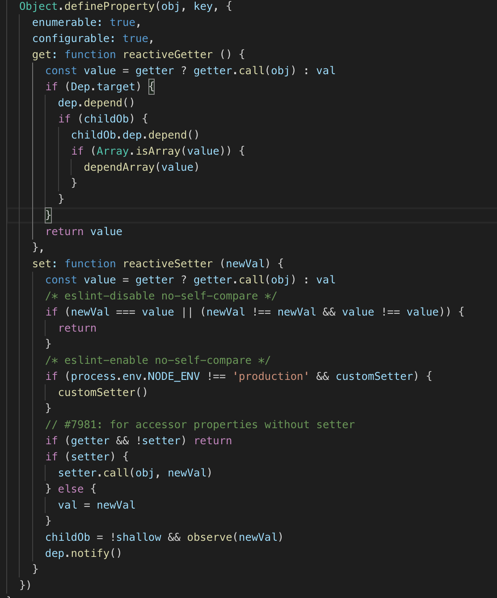

Daily-Interview-Question 21-30
===
<!-- TOC -->

- [Daily-Interview-Question 21-30](#daily-interview-question-21-30)
  - [第 21 题：有以下 3 个判断数组的方法，请分别介绍它们之间的区别和优劣Object.prototype.toString.call() 、 instanceof 以及 Array.isArray()](#第-21-题有以下-3-个判断数组的方法请分别介绍它们之间的区别和优劣objectprototypetostringcall--instanceof-以及-arrayisarray)
    - [1. Object.prototype.toString.call()](#1-objectprototypetostringcall)
    - [2. instanceof](#2-instanceof)
    - [3. Array.isArray()](#3-arrayisarray)
  - [第 22 题：介绍下重绘和回流（Repaint & Reflow），以及如何进行优化](#第-22-题介绍下重绘和回流repaint--reflow以及如何进行优化)
    - [1. 浏览器渲染机制](#1-浏览器渲染机制)
    - [2. 重绘](#2-重绘)
    - [3. 回流](#3-回流)
    - [4. 浏览器优化](#4-浏览器优化)
    - [5. 减少重绘与回流](#5-减少重绘与回流)
  - [第 23 题：介绍下观察者模式和订阅-发布模式的区别，各自适用于什么场景](#第-23-题介绍下观察者模式和订阅-发布模式的区别各自适用于什么场景)
  - [第 24 题：聊聊 Redux 和 Vuex 的设计思想](#第-24-题聊聊-redux-和-vuex-的设计思想)
  - [第 25 题：说说浏览器和 Node 事件循环的区别](#第-25-题说说浏览器和-node-事件循环的区别)
  - [第 26 题：介绍模块化发展历程](#第-26-题介绍模块化发展历程)
  - [第 27 题：全局作用域中，用 const 和 let 声明的变量不在 window 上，那到底在哪里？如何去获取？。](#第-27-题全局作用域中用-const-和-let-声明的变量不在-window-上那到底在哪里如何去获取)
  - [第 28 题：cookie 和 token 都存放在 header 中，为什么不会劫持 token？](#第-28-题cookie-和-token-都存放在-header-中为什么不会劫持-token)
  - [第 29 题：聊聊 Vue 的双向数据绑定，Model 如何改变 View，View 又是如何改变 Model 的](#第-29-题聊聊-vue-的双向数据绑定model-如何改变-viewview-又是如何改变-model-的)

<!-- /TOC -->

## 第 21 题：有以下 3 个判断数组的方法，请分别介绍它们之间的区别和优劣Object.prototype.toString.call() 、 instanceof 以及 Array.isArray()
### 1. Object.prototype.toString.call()
每一个继承 `Object` 的对象都有 `toString` 方法，如果 `toString` 方法没有重写的话，会返回 `[Object type]`，其中 type 为对象的类型。但当除了 Object 类型的对象外，其他类型直接使用 `toString` 方法时，会直接返回都是内容的字符串，所以我们需要使用call或者apply方法来改变toString方法的执行上下文。
```js
const an = ['Hello','An'];
an.toString(); // "Hello,An"
Object.prototype.toString.call(an); // "[object Array]"
```

这种方法对于所有基本的数据类型都能进行判断，即使是 null 和 undefined 。
```js
Object.prototype.toString.call('An') // "[object String]"
Object.prototype.toString.call(1) // "[object Number]"
Object.prototype.toString.call(Symbol(1)) // "[object Symbol]"
Object.prototype.toString.call(null) // "[object Null]"
Object.prototype.toString.call(undefined) // "[object Undefined]"
Object.prototype.toString.call(function(){}) // "[object Function]"
Object.prototype.toString.call({name: 'An'}) // "[object Object]"
```

`Object.prototype.toString.call()` 常用于判断浏览器内置对象时。

### 2. instanceof
`instanceof`  的内部机制是通过判断对象的原型链中是不是能找到类型的 `prototype`。

使用 `instanceof`判断一个对象是否为数组，`instanceof` 会判断这个对象的原型链上是否会找到对应的 `Array` 的原型，找到返回 `true`，否则返回 `false`。
```js
[]  instanceof Array; // true
```

但 `instanceof` 只能用来判断对象类型，原始类型不可以。并且所有对象类型 `instanceof Object` 都是 `true`。
```js
[]  instanceof Object; // true
```

### 3. Array.isArray()
- 功能：用来判断对象是否为数组
- instanceof 与 isArray
    当检测Array实例时，`Array.isArray` 优于 `instanceof` ，因为 `Array.isArray` 可以检测出 `iframes`
    ```js
    var iframe = document.createElement('iframe');
    document.body.appendChild(iframe);
    xArray = window.frames[window.frames.length-1].Array;
    var arr = new xArray(1,2,3); // [1,2,3]

    // Correctly checking for Array
    Array.isArray(arr);  // true
    Object.prototype.toString.call(arr); // true
    // Considered harmful, because doesn't work though iframes
    arr instanceof Array; // false
    ```
- `Array.isArray()` 与 `Object.prototype.toString.call()`
    `Array.isArray()`是ES5新增的方法，当不存在 `Array.isArray()` ，可以用 `Object.prototype.toString.call()` 实现。
    ```js
    if (!Array.isArray) {
      Array.isArray = function(arg) {
        return Object.prototype.toString.call(arg) === '[object Array]';
      };
    }


## 第 22 题：介绍下重绘和回流（Repaint & Reflow），以及如何进行优化
### 1. 浏览器渲染机制
- 浏览器采用流式布局模型（Flow Based Layout）
- 浏览器会把HTML解析成DOM，把CSS解析成CSSOM，DOM和CSSOM合并就产生了渲染树（Render Tree）。
- 有了RenderTree，我们就知道了所有节点的样式，然后计算他们在页面上的大小和位置，最后把节点绘制到页面上。
- 由于浏览器使用流式布局，对Render Tree的计算通常只需要遍历一次就可以完成，**但table及其内部元素除外，他们可能需要多次计算，通常要花3倍于同等元素的时间，这也是为什么要避免使用table布局的原因之一**。

### 2. 重绘
由于节点的几何属性发生改变或者由于样式发生改变而不会影响布局的，称为重绘，例如`outline`, `visibility`, `color`、`background-color`等，重绘的代价是高昂的，因为浏览器必须验证DOM树上其他节点元素的可见性。

### 3. 回流
回流是布局或者几何属性需要改变就称为回流。回流是影响浏览器性能的关键因素，因为其变化涉及到部分页面（或是整个页面）的布局更新。一个元素的回流可能会导致了其所有子元素以及DOM中紧随其后的节点、祖先节点元素的随后的回流。
```html
<body>
  <div class="error">
    <h4>我的组件</h4>
    <p><strong>错误：</strong>错误的描述…</p>
    <h5>错误纠正</h5>
    <ol>
        <li>第一步</li>
        <li>第二步</li>
    </ol>
  </div>
</body>
```

在上面的HTML片段中，对该段落(`<p>`标签)回流将会引发强烈的回流，因为它是一个子节点。这也导致了祖先的回流（div.error和body – 视浏览器而定）。此外，`<h5>`和`<ol>`也会有简单的回流，因为其在DOM中在回流元素之后。**大部分的回流将导致页面的重新渲染**。

**回流必定会发生重绘，重绘不一定会引发回流**。

### 4. 浏览器优化
现代浏览器大多都是通过队列机制来批量更新布局，浏览器会把修改操作放在队列中，至少一个浏览器刷新（即16.6ms）才会清空队列，但当你**获取布局信息的时候，队列中可能有会影响这些属性或方法返回值的操作，即使没有，浏览器也会强制清空队列，触发回流与重绘来确保返回正确的值**。

主要包括以下属性或方法：
- offsetTop、offsetLeft、offsetWidth、offsetHeight
- scrollTop、scrollLeft、scrollWidth、scrollHeight
- clientTop、clientLeft、clientWidth、clientHeight
- width、height
- getComputedStyle()
- getBoundingClientRect()

所以，我们应该避免频繁的使用上述的属性，他们都会强制渲染刷新队列。

### 5. 减少重绘与回流
1. CSS
   - **使用 transform 替代 top**
   - **使用 visibility 替换 display: none** ，因为前者只会引起重绘，后者会引发回流（改变了布局
   - **避免使用table布局**，可能很小的一个小改动会造成整个 table 的重新布局。
   - **尽可能在DOM树的最末端改变class**，回流是不可避免的，但可以减少其影响。尽可能在DOM树的最末端改变class，可以限制了回流的范围，使其影响尽可能少的节点。
   - **避免设置多层内联样式**，CSS 选择符**从右往左**匹配查找，避免节点层级过多。

       ```html
       <div>
         <a> <span></span> </a>
       </div>
       <style>
         span {
           color: red;
         }
         div > a > span {
           color: red;
         }
       </style>
       ```

       对于第一种设置样式的方式来说，浏览器只需要找到页面中所有的 span 标签然后设置颜色，但是对于第二种设置样式的方式来说，浏览器首先需要找到所有的 span 标签，然后找到 span 标签上的 a 标签，最后再去找到 div 标签，然后给符合这种条件的 span 标签设置颜色，这样的递归过程就很复杂。所以我们应该尽可能的避免写过于具体的 CSS 选择器，然后对于 HTML 来说也尽量少的添加无意义标签，保证层级扁平。

   - **将动画效果应用到position属性为absolute或fixed的元素上**，避免影响其他元素的布局，这样只是一个重绘，而不是回流，同时，控制动画速度可以选择 requestAnimationFrame，详见探讨 requestAnimationFrame。

   - **避免使用CSS表达式**，可能会引发回流。

   - **将频繁重绘或者回流的节点设置为图层**，图层能够阻止该节点的渲染行为影响别的节点，例如will-change、video、iframe等标签，浏览器会自动将该节点变为图层。

   - **CSS3 硬件加速（GPU加速）**，使用css3硬件加速，可以让transform、opacity、filters这些动画不会引起回流重绘 。但是对于动画的其它属性，比如background-color这些，还是会引起回流重绘的，不过它还是可以提升这些动画的性能。

2. JavaScript
- **避免频繁操作样式**，最好一次性重写`style`属性，或者将样式列表定义为`class`并一次性更改`class`属性。
- **避免频繁操作DOM**，创建一个`documentFragment`，在它上面应用所有`DOM`操作，最后再把它添加到文档中。
- **避免频繁读取会引发回流/重绘的属性**，如果确实需要多次使用，就用一个变量缓存起来。
- **对具有复杂动画的元素使用绝对定位**，使它脱离文档流，否则会引起父元素及后续元素频繁回流。


## 第 23 题：介绍下观察者模式和订阅-发布模式的区别，各自适用于什么场景
观察者模式中主体和观察者是互相感知的，发布-订阅模式是借助第三方来实现调度的，发布者和订阅者之间互不感知


## 第 24 题：聊聊 Redux 和 Vuex 的设计思想
题目是讨论两者的设计思想，我从共同点和区别方面大致说一下：

- 共同点  
首先两者都是处理全局状态的工具库，大致实现思想都是：全局state保存状态---->dispatch(action)
------>reducer(vuex里的mutation)----> 生成newState; 整个状态为同步操作；

- 区别  
最大的区别在于处理异步的不同，vuex里面多了一步commit操作，在action之后commit(mutation)之前处理异步，而redux里面则是通过中间件处理

适合多人,角色转变,state改变有据可依

知乎上看到的一篇文章：[Vuex、Flux、Redux、Redux-saga、Dva、MobX](https://zhuanlan.zhihu.com/p/53599723)


## 第 25 题：说说浏览器和 Node 事件循环的区别
先上链接：  
[浏览器与Node的事件循环(Event Loop)有何区别?](https://juejin.im/post/5c337ae06fb9a049bc4cd218#heading-12)

浏览器和Node 环境下，microtask 任务队列的执行时机不同
- Node端，microtask 在事件循环的各个阶段之间执行
- 浏览器端，microtask 在事件循环的 macrotask 执行完之后执行
  

其中一个主要的区别在于浏览器的event loop 和nodejs的event loop 在处理异步事件的顺序是不同的,nodejs中有micro event;其中Promise属于micro event 该异步事件的处理顺序就和浏览器不同.nodejs V11.0以上 这两者之间的顺序就相同了.

```js
function test () {
   console.log('start')
    setTimeout(() => {
        console.log('children2')
        Promise.resolve().then(() => {console.log('children2-1')})
    }, 0)
    setTimeout(() => {
        console.log('children3')
        Promise.resolve().then(() => {console.log('children3-1')})
    }, 0)
    Promise.resolve().then(() => {console.log('children1')})
    console.log('end') 
}

test()

// 以上代码在node11以下版本的执行结果(先执行所有的宏任务，再执行微任务)
// start
// end
// children1
// children2
// children3
// children2-1
// children3-1

// 以上代码在node11及浏览器的执行结果(顺序执行宏任务和微任务)
// start
// end
// children1
// children2
// children2-1
// children3
// children3-1
```

## 第 26 题：介绍模块化发展历程
模块化主要是用来抽离公共代码，隔离作用域，避免变量冲突等。

**IIFE**： 使用自执行函数来编写模块化，特点：**在一个单独的函数作用域中执行代码，避免变量冲突**。
```js
(function(){
  return {
	data:[]
  }
})()
```

**AMD**： 使用requireJS 来编写模块化，特点：**依赖必须提前声明好**。
```js
define('./index.js',function(code){
	// code 就是index.js 返回的内容
})
```

**CMD**： 使用seaJS 来编写模块化，特点：**支持动态引入依赖文件**。
```js
define(function(require, exports, module) {  
  var indexCode = require('./index.js');
});
```

**CommonJS**： nodejs 中自带的模块化。
```js
var fs = require('fs');
```

**UMD**：兼容AMD，CommonJS 模块化语法。

**webpack(require.ensure)**：webpack 2.x 版本中的代码分割。

**ES Modules**： ES6 引入的模块化，支持import 来引入另一个 js 。
```js
import a from 'a';
```

## 第 27 题：全局作用域中，用 const 和 let 声明的变量不在 window 上，那到底在哪里？如何去获取？。
在ES5中，顶层对象的属性和全局变量是等价的，var 命令和 function 命令声明的全局变量，自然也是顶层对象。
```js
var a = 12;
function f(){};

console.log(window.a); // 12
console.log(window.f); // f(){}
```

但ES6规定，var 命令和 function 命令声明的全局变量，依旧是顶层对象的属性，但 let命令、const命令、class命令声明的全局变量，不属于顶层对象的属性。
```js
let aa = 1;
const bb = 2;

console.log(window.aa); // undefined
console.log(window.bb); // undefined
```

在哪里？怎么获取？通过在设置断点，看看浏览器是怎么处理的：


通过上图也可以看到，**在全局作用域中，用 let 和 const 声明的全局变量并没有在全局对象中，只是一个块级作用域（Script）中**

怎么获取？在定义变量的块级作用域中就能获取啊，既然不属于顶层对象，那就不加 window（global）呗。
```js
let aa = 1;
const bb = 2;

console.log(aa); // 1
console.log(bb); // 2
```

## 第 28 题：cookie 和 token 都存放在 header 中，为什么不会劫持 token？
1、首先token不是防止XSS的，而是为了防止CSRF的；
2、CSRF攻击的原因是浏览器会自动带上cookie，而浏览器不会自动带上token


**cookie**：登陆后后端生成一个sessionid放在cookie中返回给客户端，并且服务端一直记录着这个sessionid，客户端以后每次请求都会带上这个sessionid，服务端通过这个sessionid来验证身份之类的操作。所以别人拿到了cookie拿到了sessionid后，就可以完全替代你。

**token**：登陆后后端不返回一个token给客户端，客户端将这个token存储起来，然后每次客户端请求都需要开发者手动将token放在header中带过去，服务端每次只需要对这个token进行验证就能使用token中的信息来进行下一步操作了。

**xss**：用户通过各种方式将恶意代码注入到其他用户的页面中。就可以通过脚本获取信息，发起请求，之类的操作。

**csrf**：跨站请求攻击，简单地说，是攻击者通过一些技术手段欺骗用户的浏览器去访问一个自己曾经认证过的网站并运行一些操作（如发邮件，发消息，甚至财产操作如转账和购买商品）。由于浏览器曾经认证过，所以被访问的网站会认为是真正的用户操作而去运行。这利用了web中用户身份验证的一个漏洞：简单的身份验证只能保证请求发自某个用户的浏览器，却不能保证请求本身是用户自愿发出的。csrf并不能够拿到用户的任何信息，它只是欺骗用户浏览器，让其以用户的名义进行操作。

csrf例子：假如一家银行用以运行转账操作的URL地址如下： `http://www.examplebank.com/withdraw?account=AccoutName&amount=1000&for=PayeeName`   
那么，一个恶意攻击者可以在另一个网站上放置如下代码： `">`
如果有账户名为Alice的用户访问了恶意站点，而她之前刚访问过银行不久，登录信息尚未过期，那么她就会损失1000资金。

上面的两种攻击方式，如果被xss攻击了，不管是token还是cookie，都能被拿到，所以对于xss攻击来说，cookie和token没有什么区别。但是对于csrf来说就有区别了。

以上面的csrf攻击为例：
- cookie：用户点击了链接，cookie未失效，导致发起请求后后端以为是用户正常操作，于是进行扣款操作。
- token：用户点击链接，由于浏览器不会自动带上token，所以即使发了请求，后端的token验证不会通过，所以不会进行扣款操作。

这是个人理解的为什么只劫持cookie不劫持token的原因。


## 第 29 题：聊聊 Vue 的双向数据绑定，Model 如何改变 View，View 又是如何改变 Model 的
```html
<div id="content">
  name: {{name}}<br/>
  <input type="text" v-model = 'name'>
</div>
```

```js
<script>
   const el = document.getElementById('content');

   const template = el.innerHTML;
   
   const _data = {
     name: 'mark',
   }

   //new Proxy(target, handler);
   let changeName = new Proxy(_data, {
     set(obj, name, value){
       obj[name] = value;
       render()
     }

   })
   render();
   function render(){
     el.innerHTML = template.replace(/\{\{\w+\}\}/g, str=>{
       str = str.substring(2, str.length-2);
       return _data[str];
     }) 
     Array.from(el.getElementsByTagName('input')).filter(ele => {
       return ele.getAttribute('v-model');
     }).forEach(input=>{
       let name = input.getAttribute('v-model');
       input.value = changeName[name];
       input.oninput = function(){
         changeName[name] = this.value;
       }
     })
   }
 
 </script>
 ```

### efineProperty get
底层就是defineProperty get是读取之前的旧数据，set中如果发现数据没改 直接return 原始值 ，如果改了就直接修改为NewValue
这个是一个简单的demo
```js
<body>
    <div id="app">
        <input type="text" id="model"><br />
        <div id="modelText"></div>
    </div>
    <script>
        var model = document.querySelector("#model");
        var modelText = document.querySelector("#modelText");
        var defaultName = "defaultName";
        var userInfo = {}
        model.value = defaultName;
        Object.defineProperty(userInfo, "name", {
            get: function () {
                return defaultName;
            },
            set: function (value) {
                defaultName = value;
                model.value = value;
                console.log(value);
                modelText.textContent = value;
            }
        })

        userInfo.name = "new value";
        var isEnd = true;

        model.addEventListener("keyup", function () {
            if (isEnd) {
                userInfo.name = this.value;
            }
        }, false)
        //加入监听中文输入事件
        model.addEventListener("compositionstart", function () {
            console.log("开始输入中文");
            isEnd = false;
        })
        model.addEventListener("compositionend", function () {
            isEnd = true;
            console.log("结束输入中文");
        })
    </script>
</body>
```

这个图是 vue源码




### 手写一个数据绑定
```js
<input id="input" type="text" />
<div id="text"></div>

let input = document.getElementById("input");
let text = document.getElementById("text");
let data = { value: "" };
Object.defineProperty(data, "value", {
  set: function(val) {
    text.innerHTML = val;
    input.value = val;
  },
  get: function() {
    return input.value;
  }
});
input.onkeyup = function(e) {
  data.value = e.target.value;
};
```

## 第 30 题：两个数组合并成一个数组
请把两个数组 `['A1', 'A2', 'B1', 'B2', 'C1', 'C2', 'D1', 'D2']` 和 `['A', 'B', 'C', 'D']，合并为 ['A1', 'A2', 'A', 'B1', 'B2', 'B', 'C1', 'C2', 'C', 'D1', 'D2', 'D']`。

```js
function concatArr(arr1, arr2) {
  const arr = [...arr1];
  let currIndex = 0;
  for (let i = 0; i < arr2.length; i++) {
    const RE = new RegExp(arr2[i]);
    while (currIndex < arr.length) {
      ++currIndex;
      if (!RE.test(arr[currIndex])) {
        arr.splice(currIndex, 0, a2[i]);
        break;
      }
    }
  }
  return arr;
}
var a1 = ["A1", "A2", "B1", "B2", "C1", "C2", "D1", "D2"];
var a2 = ["A", "B", "C", "D"];
const arr = concatArr(a1, a2);
console.log(a1); // ['A1', 'A2', 'B1', 'B2', 'C1', 'C2', 'D1', 'D2']
console.log(a2); // ['A', 'B', 'C', 'D']
console.log(arr); // ['A1', 'A2', 'A', B1', 'B2', 'B', C1', 'C2', 'C', D1', 'D2', 'D']
```

```js
const arr1 = ["A1", "A2", "B1", "B2", "C1", "C2", "D1", "D2"];
const arr2 = ["A", "B", "C", "D"];
const ret = [];
let tmp = arr2[0];
let j = 0;
for (let i = 0; i < arr1.length; i++) {
  if (tmp === arr1[i].charAt(0)) {
    ret.push(arr1[i]);
  } else {
    ret.push(tmp);
    ret.push(arr1[i]);
    tmp = arr2[++j];
  }
  if (i === arr1.length - 1) {
    ret.push(tmp);
  }
}
console.log(ret);
```
