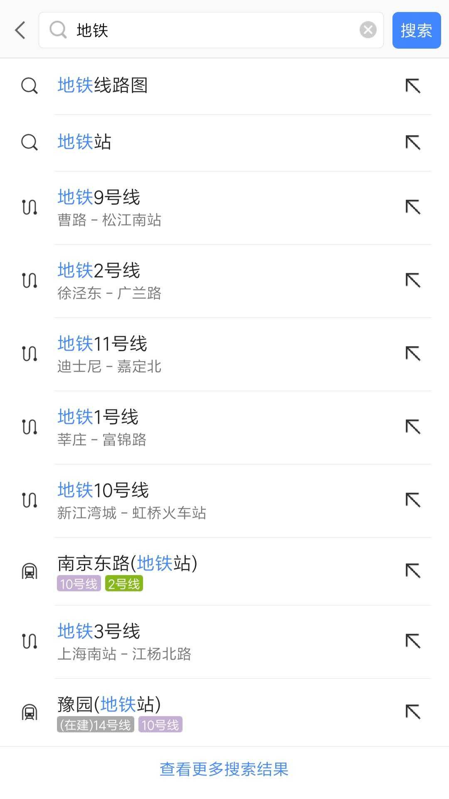

Daily-Interview-Question 81-90
===
<!-- TOC -->

- [Daily-Interview-Question 81-90](#daily-interview-question-81-90)
  - [第 81 题：打印出 1 - 10000 之间的所有对称数](#第-81-题打印出-1---10000-之间的所有对称数)
  - [第 82 题：周一算法题之「移动零」](#第-82-题周一算法题之移动零)
  - [第 83 题：var、let 和 const 区别的实现原理是什么](#第-83-题varlet-和-const-区别的实现原理是什么)
    - [var、let、const的区别](#varletconst的区别)
    - [原理](#原理)
  - [第 84 题：请实现一个 add 函数，满足以下功能。](#第-84-题请实现一个-add-函数满足以下功能)
  - [第 85 题：react-router 里的 `<Link>` 标签和 `<a>` 标签有什么区别](#第-85-题react-router-里的-link-标签和-a-标签有什么区别)
  - [第 86 题：周一算法题之「两数之和」](#第-86-题周一算法题之两数之和)
  - [第 87 题：在输入框中如何判断输入的是一个正确的网址。](#第-87-题在输入框中如何判断输入的是一个正确的网址)
  - [第 88 题：实现 convert 方法，把原始 list 转换成树形结构，要求尽可能降低时间复杂度](#第-88-题实现-convert-方法把原始-list-转换成树形结构要求尽可能降低时间复杂度)
  - [第 89 题：设计并实现 Promise.race()](#第-89-题设计并实现-promiserace)
  - [第 90 题：实现模糊搜索结果的关键词高亮显示](#第-90-题实现模糊搜索结果的关键词高亮显示)

<!-- /TOC -->

## 第 81 题：打印出 1 - 10000 之间的所有对称数
> 例如：121、1331 等

```js
[ ...Array(10000).keys() ].filter(x => {
	return (
		x.toString().length > 1 &&
		x === Number(x.toString().split('').reverse().join(''))
	);
});
```

```js
let result = [];
for (let i = 1; i <= 10000; i++) {
    let reverse = Number(i.toString().split('').reverse().join(''));
    if (i === reverse) {
        result.push(i);
    }
}
```

```js
class Test {
	constructor() {
		this.arr = [];
	}
	symmetry() {
		for (var i = 1; i <= 1000; i++) {
			let flag = true;
			i = String(i);
			let integer = parseInt(i.length / 2);
			for (let j = 0; j < integer; j++) {
				if (i[j] != i[i.length - j - 1]) {
					flag = false;
				}
			}
			if (flag) {
				this.arr.push(Number(i));
			}
		}
		return this.arr;
	}
}
let test = new Test();
console.log(test.symmetry());
```

```js
// 正则
[ ...Array(10000).keys() ].filter((v) => {
	return v === Number((String(v).match(/(^\d)(\d)?\2*\1$/) || [])[0]);
});

// 精简一下;
[ ...Array(10000).keys() ].filter((v) => {
	return (String(v).match(/(^\d)(\d)?\2*\1$/) || [])[0];
});

// 再精简一下;
[ ...Array(1e4).keys() ].filter((v) => (v + '').match(/(^\d)(\d)?\2*\1$/));
```

```js
[...Array(10000).keys()].filter(i => i > 10 && i == [...i + ''].reverse().join(''))
```


## 第 82 题：周一算法题之「移动零」
给定一个数组 nums，编写一个函数将所有 0 移动到数组的末尾，同时保持非零元素的相对顺序。

示例:
```js
输入: [0,1,0,3,12]
输出: [1,3,12,0,0]
```

说明:
1. 必须在原数组上操作，不能拷贝额外的数组。
2. 尽量减少操作次数。

```js
function zeroMove(array) {
	let len = array.length;
	let j = 0;
	for (let i = 0; i < len - j; i++) {
		if (array[i] === 0) {
			array.push(0);
			array.splice(i, 1);
			i--;
			j++;
		}
	}
	return array;
}
```

最优解法
```js
function moveZeroToLast(arr) {
  let index = 0;
  for (let i = 0, length = arr.length; i < length; i++) {
    if (arr[i] === 0) {
      index++;
    } else if (index !== 0) {
      arr[i - index] = arr[i];
      arr[i] = 0;
    }
  }
  return arr;
}
```

```js
// 双指针
function displacement (arr) {
  let i = 0;
  for (let j = 0, len = arr.length; j < len; j++) {
    if (arr[j] !== 0) {
      [arr[i], arr[j]] = [arr[j], arr[i]]
      i++;
    }
  }
  return arr;
}
```

```js
// 复杂度为O(n).应该是最低的了
let arr = [0, 1, 0, 0, 12, 0, 0, 1, 0, 0];

function moveZero(arr) {
  let i = 0;
  let k = 0;
  let j = arr.length - 1;
  while (k < (arr.length - 1)) {
    if (arr[i] == 0) {
      arr.push(arr[i]);
      arr.splice(i, 1);
      j--;
    } else {
      i++;
    }
    k++;
  }
  return arr;
}

console.log(moveZero(arr))
```


## 第 83 题：var、let 和 const 区别的实现原理是什么
### var、let、const的区别
1. var
    - `var` 命令会发生“变量提升”现象，即变量可以在声明之前使用，值为 `undefined` 。
    - 内层变量可能覆盖外层变量
    - 用来计数的循环变量泄露为全局变量
2. let
    - 声明的�全局变量不会挂在顶层对象下面
    - 所声明的变量一定要在声明后使用，否则报错，报错 `ReferenceError`
    - 暂时性死区，只要块级作用域内存在 `let` 命令，它所声明的变量就“绑定”（ `binding` ）这个区域，不再受外部的影响，在代码块内，使用 `let` 命令声明变量之前，该变量都是不可用的。
    - 不允许重复声明
3. const
    - 声明的�全局变量不会挂在顶层对象下面
    - const 声明之后必须马上赋值，否则会报错
    - const 简单类型一旦声明就不能再更改，�复杂类型(数组、对象等)指针指向的地址不能更改，内部数据可以更改。
    - const 一旦声明变量，就必须立即初始化，不能留到以后赋值。
    const 命令声明的常量也是不提升，同样存在暂时性死区，只能在声明的位置后面使用。

### 原理
变量与内存之间的关系，主要由三个部分组成：
1. 变量名
2. 内存地址
3. 内存空间

JS 引擎在读取变量时，先找到变量绑定的内存地址，然后找到地址所指向的内存空间，最后读取其中的内容。当变量改变时，JS 引擎不会用新值覆盖之前旧值的内存空间（虽然从写代码的角度来看，确实像是被覆盖掉了），而是重新分配一个新的内存空间来存储新值，并将新的内存地址与变量进行绑定，JS 引擎会在合适的时机进行 GC，回收旧的内存空间。

const 定义变量（常量）后，变量名与内存地址之间建立了一种不可变的绑定关系，阻隔变量地址被改变，当 const 定义的变量进行重新赋值时，根据前面的论述，JS 引擎会尝试重新分配新的内存空间，所以会被拒绝，便会抛出异常。


## 第 84 题：请实现一个 add 函数，满足以下功能。
```js
add(1); 			// 1
add(1)(2);  	// 3
add(1)(2)(3)；// 6
add(1)(2, 3); // 6
add(1, 2)(3); // 6
add(1, 2, 3); // 6
```

实现 1：
```js
function currying(fn, length) {
  length = length || fn.length; 	// 注释 1
  return function (...args) {			// 注释 2
    return args.length >= length	// 注释 3
    	? fn.apply(this, args)			// 注释 4
      : currying(fn.bind(this, ...args), length - args.length) // 注释 5
  }
}
```
注释: 
1. 第一次调用获取函数 fn 参数的长度，后续调用获取 fn 剩余参数的长度
2. currying 包裹之后返回一个新函数，接收参数为 ...args
3. 新函数接收的参数长度是否大于等于 fn 剩余参数需要接收的长度
4. 满足要求，执行 fn 函数，传入新函数的参数
5. 不满足要求，递归 currying 函数，新的 fn 为 bind 返回的新函数（bind 绑定了 ...args 参数，未执行），新的 length 为 fn 剩余参数的长度


<br />
<br />

实现 2：
```js
const currying = fn =>
    judge = (...args) =>
        args.length >= fn.length
            ? fn(...args)
            : (...arg) => judge(...args, ...arg)
```

实现 3：
```js
function add(){
	let args = [...arguments];
	let addfun = function(){
		args.push(...arguments);
		return addfun;
	}
	addfun.toString = function(){
		return args.reduce((a,b)=>{
			return a + b;
		});
	}
	return addfun;
}
```


实现 4：
```js
function add(){
	if(arguments.length === 0){
		let num = 0;
		add.args.forEach(v=>{
			num += v;
		});
		add.args = null;
		return num;
	}else{
		add.args = add.args ? add.args : [];
		add.args = add.args.concat([...arguments]);
		return add;
	}
}
add(1)(2)(3)();
add(1, 2)(3)(8)();
```

```js
const Curry = fn => {
  return function judge(...firstParma) {
    if (firstParma.length >= fn.length) {
      return fn(...firstParma);
    } else {
      // 这里的 ...secondParma 函数的第二次或者更多次调用时的参数, 
      // ...firstParma 是第一次传入的参数,这里的意思是
      // 当函数只有一个的时候就直接返回一个 rest 参数后的函数
      // 当函数有多个的时候也就是 fn.length > firstParma.length  的时候
      // 这时候就需要把第二个函数的参数和第一个函数参数合起来,然后做递归
      // 这里的 ...secondParma, ...firstParma 两个都可以 rest 的原因是这里他们都已经是值了,不再是参数了
      return (...secondParma) => judge(...secondParma, ...firstParma);
    }
  };
};

// Test
const fn = Curry(function (a, b, c) {
  console.log([a, b, c]);
});

fn(2)(3)(1); // 有三个函数,参数有三个
fn(2, 3, 1); // 只有一个函数,参数也是三个
```


## 第 85 题：react-router 里的 `<Link>` 标签和 `<a>` 标签有什么区别
> 如何禁掉 `<a>` 标签默认事件，禁掉之后如何实现跳转。

先看Link点击事件handleClick部分源码
```js
if (_this.props.onClick) _this.props.onClick(event);

if (!event.defaultPrevented && // onClick prevented default
  event.button === 0 && // ignore everything but left clicks
  !_this.props.target && // let browser handle "target=_blank" etc.
  !isModifiedEvent(event) // ignore clicks with modifier keys
) {
  event.preventDefault();

  var history = _this.context.router.history;
  var _this$props = _this.props,
    replace = _this$props.replace,
    to = _this$props.to;


  if (replace) {
    history.replace(to);
  } else {
    history.push(to);
  }
}
```

Link做了3件事情：
1. 有onclick那就执行onclick
2. click的时候阻止a标签默认事件（这样子点击<a href="/abc">123</a>就不会跳转和刷新页面）
3. 再取得跳转href（即是to），用history（前端路由两种方式之一，history & hash）跳转，此时只是链接变了，并没有刷新页面


**禁掉 a 标签的默认事件，可以在点击事件中执行 event.preventDefault();**

**禁掉默认事件的 a 标签 可以使用 `history.pushState()` 来改变页面 url，这个方法还会触发页面的 `hashchange` 事件，Router 内部通过捕获监听这个事件来处理对应的跳转逻辑**。


## 第 86 题：周一算法题之「两数之和」
给定一个整数数组和一个目标值，找出数组中和为目标值的两个数。

你可以假设每个输入只对应一种答案，且同样的元素不能被重复利用。

示例：
```js
给定 nums = [2, 7, 11, 15], target = 9

因为 nums[0] + nums[1] = 2 + 7 = 9
所以返回 [0, 1]
```

```js
function twoSum(nums, target) {
  const map = {} // 创建一个对象
  for (let i = 0; i < nums.length; i++) {
    const num = nums[i]
    if (map[target - num] != null) { // 判断 map 中是否存在 target - num 的值
      return [map[target - num], i]
    }
    map[num] = i // 给对象添加的属性，属性为 num，值为 index
  }
}
```

双循环
```js
var twoSum = function (nums, target) {
  const res = []
  // loop:
    for (let i = 0; i < nums.length - 1; i++) {
      for (let j = i + 1; j < nums.length; j++) {
        if (nums[i] + nums[j] === target) {
          res.push(i, j)
          break loop
        }
      }
    }
  return res
};
```

空间换时间
```js
var twoSum = function(nums, target) {
  if (!Array.isArray(nums) || typeof target !== 'number') {
    return undefined;
  }
  
  var len = nums.length;
  var map = new Map();
  
  for(var i = 0; i < len; i++) {
    const diff = target - nums[i];
    if (map.has(diff)) {
      return [map.get(diff), i];
    }
    
    map.set(nums[i], i);
  }
};
```


## 第 87 题：在输入框中如何判断输入的是一个正确的网址。
```js
const isUrl = urlStr => {
  try {
    const {
      href,
      origin,
      host,
      hostname,
      pathname,
      protocol
    } = new URL(urlStr)
    return href && origin && host && hostname && pathname && protocol && true
  } catch (e) {
    return false
  }
}
```

```js
/^(?:(https?):)?(?:\/\/)?([^\/?#:]+)?(?::(\d+))?([^?#]*)(?:\?([^#]*))?(?:#(.*))?$/
```


## 第 88 题：实现 convert 方法，把原始 list 转换成树形结构，要求尽可能降低时间复杂度
以下数据结构中，id 代表部门编号，name 是部门名称，parentId 是父部门编号，为 0 代表一级部门，现在要求实现一个 convert 方法，把原始 list 转换成树形结构，parentId 为多少就挂载在该 id 的属性 children 数组下，结构如下：
```js
// 原始 list 如下
let list =[
    {id:1,name:'部门A',parentId:0},
    {id:2,name:'部门B',parentId:0},
    {id:3,name:'部门C',parentId:1},
    {id:4,name:'部门D',parentId:1},
    {id:5,name:'部门E',parentId:2},
    {id:6,name:'部门F',parentId:3},
    {id:7,name:'部门G',parentId:2},
    {id:8,name:'部门H',parentId:4}
];
const result = convert(list, ...);

// 转换后的结果如下
let result = [
    {
      id: 1,
      name: '部门A',
      parentId: 0,
      children: [
        {
          id: 3,
          name: '部门C',
          parentId: 1,
          children: [
            {
              id: 6,
              name: '部门F',
              parentId: 3
            }, {
              id: 16,
              name: '部门L',
              parentId: 3
            }
          ]
        },
        {
          id: 4,
          name: '部门D',
          parentId: 1,
          children: [
            {
              id: 8,
              name: '部门H',
              parentId: 4
            }
          ]
        }
      ]
    },
  ···
];
```

```js
function convert(list) {
	const res = [];
	const map = list.reduce((res, v) => ((res[v.id] = v), res), {});
	for (const item of list) {
		if (item.parentId === 0) {
			res.push(item);
			continue;
		}
		if (item.parentId in map) {
			const parent = map[item.parentId];
			parent.children = parent.children || [];
			parent.children.push(item);
		}
	}
	return res;
}
```

```js
function convert(arr) {
  const obj = {}
  const res = []
  list.forEach(item => {
    obj[item.id] = item
  })
  list.forEach(item => {
    if (item.parentId !== 0) {
      obj[item.parentId]['children'] ? obj[item.parentId]['children'].push(item) : obj[item.parentId]['children'] = [item]
    } else {
      res.push(item)
    }
  })
  return res
}
```

```js
let list = [
    { id: 1, name: '部门A', parentId: 0 },
    { id: 2, name: '部门B', parentId: 0 },
    { id: 3, name: '部门C', parentId: 1 },
    { id: 4, name: '部门D', parentId: 1 },
    { id: 5, name: '部门E', parentId: 2 },
    { id: 6, name: '部门F', parentId: 3 },
    { id: 7, name: '部门G', parentId: 2 },
    { id: 8, name: '部门H', parentId: 4 }
];
function convert(array) {
    let reslutArray = array.filter((item) => {
        let children = array.filter((child) => {
           return item.id === child.parentId
        })   
        item.children = children       
        return item.parentId === 0
    })
    return reslutArray
}
let res = convert(list)
console.log(res) 
```

```js
// 基于DFS来写
function convert(source, parentId = 0){
    let trees = [];
    for (let item of source) {
      if(item.parentId === parentId) {
        let children = convert(source, item['id']);
        if(children.length) {
          item.children = children
        }
        trees.push(item);
      }
    }
    return trees;
  }

let list =[
    {id:1,name:'部门A',parentId:0},
    {id:2,name:'部门B',parentId:0},
    {id:3,name:'部门C',parentId:1},
    {id:4,name:'部门D',parentId:1},
    {id:5,name:'部门E',parentId:2},
    {id:6,name:'部门F',parentId:3},
    {id:7,name:'部门G',parentId:2},
    {id:8,name:'部门H',parentId:4}
];

const result = convert(list);
```


## 第 89 题：设计并实现 Promise.race()
```js
Promise._race = promises => new Promise((resolve, reject) => {
  promises.forEach(promise => {
    promise.then(resolve, reject)
  })
})
```

```js
Promise.miniRace = function (promises) {

  return new Promise((rs, rj) => {
    try {
      // 检查输入值是否可迭代
      iteratorCheck(promises)

      const len = promises.length;
      let promiseStatusChanged = false;

      for (let i = 0; i < len; i++) {
        if (promiseStatusChanged)
          break;
        // 使用 Promise.resolve 包装 thenable 和 非thenable 值
        Promise.resolve(promises[i]).then(rs).catch(rj).finally(() => {
          promiseStatusChanged = true
        })
      }

    } catch (e) {
      rj(e)
    }

  })
}

function iteratorCheck(data) {
  if (!data[Symbol.iterator] || typeof data[Symbol.iterator] !== 'function') {
    const simpleType = typeof data;
    let errMsg = simpleType
    if (['number', 'boolean'].includes(simpleType) || data === null) {
      errMsg += ` ${String(data)}`
    }

    throw new TypeError(`${errMsg} is not iterable (cannot read property Symbol(Symbol.iterator))`)
  }
}
```

```js
const PromiseRace = (iterable) => {
  return new Promise((resolve, reject) => {
    for (const p of iterable) {
      Promise.resolve(p).then(resolve).catch(reject)
    }
  })
}
```


## 第 90 题：实现模糊搜索结果的关键词高亮显示


考虑节流、缓存。其实还可以上列表diff+定时清理缓存

```html
<!DOCTYPE html>
<html lang="en">
<head>
  <meta charset="UTF-8">
  <meta name="viewport" content="width=device-width, initial-scale=1.0">
  <meta http-equiv="X-UA-Compatible" content="ie=edge">
  <title>auto complete</title>
  <style>
    bdi {
      color: rgb(0, 136, 255);
    }

    li {
      list-style: none;
    }
  </style>
</head>
<body>
  <input class="inp" type="text">
  <section>
    <ul class="container"></ul>
  </section>
</body>
<script>

  function debounce(fn, timeout = 300) {
    let t;
    return (...args) => {
      if (t) {
        clearTimeout(t);
      }
      t = setTimeout(() => {
        fn.apply(fn, args);
      }, timeout);
    }
  }

  function memorize(fn) {
    const cache = new Map();
    return (name) => {
      if (!name) {
        container.innerHTML = '';
        return;
      }
      if (cache.get(name)) {
        container.innerHTML = cache.get(name);
        return;
      }
      const res = fn.call(fn, name).join('');
      cache.set(name, res);
      container.innerHTML = res;
    }
  }

  function handleInput(value) {
    const reg = new RegExp(`\(${value}\)`);
    const search = data.reduce((res, cur) => {
      if (reg.test(cur)) {
        const match = RegExp.$1;
        res.push(`<li>${cur.replace(match, '<bdi>$&</bdi>')}</li>`);
      }
      return res;
    }, []);
    return search;
  }
  
  const data = ["上海野生动物园", "上饶野生动物园", "北京巷子", "上海中心", "上海黄埔江", "迪士尼上海", "陆家嘴上海中心"]
  const container = document.querySelector('.container');
  const memorizeInput = memorize(handleInput);
  document.querySelector('.inp').addEventListener('input', debounce(e => {
    memorizeInput(e.target.value);
  }))
</script>
</html>
```

```html
<div class="input">
    <input type="text" oninput="search(event)">
    <ul class="options"></ul>
</div>

<script>
    const list = ['上海', '上海市', '上海海昌海洋公园', '上海市徐汇区', '上海自来水来自海上'];

    function setList(value) {
      const ul = document.querySelector('.options');
      ul.innerHTML = '';
      if (!value) {
        ul.innerHTML = '';
        return;
      }
      list.forEach((item, index) => {
        if (item.indexOf(value) !== -1) {
          const li = document.createElement('li');
          const innerHtml = item.replace(value, `<span style="color:red">${value}</span>`);
          console.log(innerHtml)
          li.innerHTML = innerHtml;
          li.setAttribute('key', index);
          ul.appendChild(li);
        }
      })
    }

    function search(e) {
      const value = e.target.value;
      setList(value)
    }
</script>
```

```html
<!DOCTYPE html>
<html lang="en">
<head>
    <meta charset="UTF-8">
    <meta name="viewport" content="width=device-width, initial-scale=1.0">
    <meta http-equiv="X-UA-Compatible" content="ie=edge">
    <title>Document</title>
</head>
<body>
    <div id='app'>   
    </div>
</body>
<script src="https://cdn.jsdelivr.net/npm/vue"></script>
<script>
    var myitem = {
        template:`<div class='item'>
            <p v-html="info.name"></p>
        </div>`,
        props:{
            info:{
                type:Object,
                default:()=>{return {}},
            }
        }

    }
    var vm = new Vue({
        el:'#app',
        template:`
        <div>
            <input @input='inputSearchText'>
            <myitem v-for='info in results' :key='info.name' :info='info'></item>
        </div>
        `,
        data(){
            return {
                infos:[
                    {name:'地铁1',},
                    {name:'地铁6',},
                    {name:'地铁7',},
                    {name:'地铁10',},
                    {name:'地铁11',},
                    {name:'公交112',},
                    {name:'公交597',},
                    {name:'公交593',}, 
                ],
                results:[],
            }
        },
        created() {
            this.results = JSON.parse(JSON.stringify(this.infos));
        },
        methods: {
            inputSearchText : (function(timeout){
                var timer;
                return function(e){
                    if(timer){
                        clearTimeout(timer);
                    }
                    timer = setTimeout(() => {
                        this.search(e.target.value);
                        //this.search_text = e.target.value
                    }, timeout);
                }
            })(1000),
            search(text){
                var reg = RegExp(`(${text})`);
                var results = JSON.parse(JSON.stringify(this.infos));
                var matches = results.filter(info=>info.name.match(reg));
                matches.forEach(info=>{
                    info.name = info.name.replace(reg,`<span class='highlight'>$1</span>`
                )});
                this.results = matches;
                console.log(this.results);
            }
        },
        components:{
            myitem,
        },
    })
</script>
<style>
.highlight{
    color:red;
}
</style>
</html>
```
