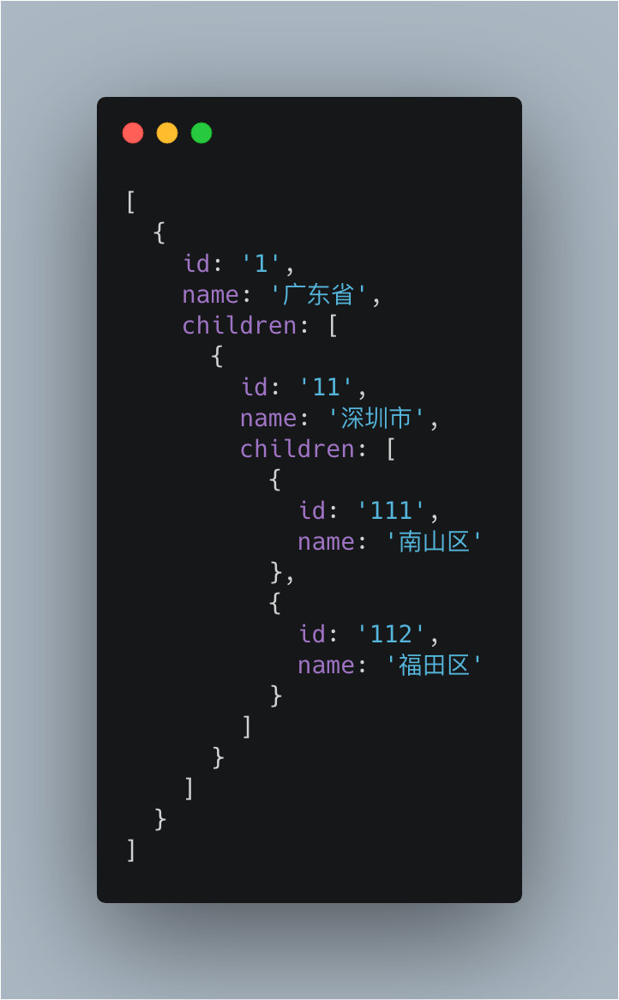

Daily-Interview-Question 91-100
===
<!-- TOC -->

- [第 91 题：介绍下 HTTPS 中间人攻击](#第-91-题介绍下-https-中间人攻击)
- [第 92 题：已知数据格式，实现一个函数 fn 找出链条中所有的父级 id](#第-92-题已知数据格式实现一个函数-fn-找出链条中所有的父级-id)
- [第 93 题：给定两个大小为 m 和 n 的有序数组 nums1 和 nums2。请找出这两个有序数组的中位数。要求算法的时间复杂度为 O(log(m+n))。](#第-93-题给定两个大小为-m-和-n-的有序数组-nums1-和-nums2请找出这两个有序数组的中位数要求算法的时间复杂度为-ologmn)
- [第 94 题：vue 在 v-for 时给每项元素绑定事件需要用事件代理吗？为什么？](#第-94-题vue-在-v-for-时给每项元素绑定事件需要用事件代理吗为什么)
- [第 95 题：模拟实现一个深拷贝，并考虑对象相互引用以及 Symbol 拷贝的情况](#第-95-题模拟实现一个深拷贝并考虑对象相互引用以及-symbol-拷贝的情况)
- [第 96 题：介绍下前端加密的常见场景和方法](#第-96-题介绍下前端加密的常见场景和方法)
  - [场景-密码传输](#场景-密码传输)
  - [场景-数据包加密](#场景-数据包加密)
  - [场景-展示成果加密](#场景-展示成果加密)
- [第 97 题：React 和 Vue 的 diff 时间复杂度从 O(n^3) 优化到 O(n) ，那么 O(n^3) 和 O(n) 是如何计算出来的？](#第-97-题react-和-vue-的-diff-时间复杂度从-on^3-优化到-on-那么-on^3-和-on-是如何计算出来的)
- [第 98 题：写出如下代码的打印结果](#第-98-题写出如下代码的打印结果)
- [第 99 题：编程算法题](#第-99-题编程算法题)
- [第 100 题：请写出如下代码的打印结果](#第-100-题请写出如下代码的打印结果)

<!-- /TOC -->

## 第 91 题：介绍下 HTTPS 中间人攻击
https协议由 http + ssl 协议构成，具体的链接过程可参考SSL或TLS握手的概述

中间人攻击过程如下：
1. 服务器向客户端发送公钥。
2. 攻击者截获公钥，保留在自己手上。
3. 然后攻击者自己生成一个【伪造的】公钥，发给客户端。
4. 客户端收到伪造的公钥后，生成加密hash值发给服务器。
5. 攻击者获得加密hash值，用自己的私钥解密获得真秘钥。
6. 同时生成假的加密hash值，发给服务器。
7. 服务器用私钥解密获得假秘钥。
8. 服务器用加秘钥加密传输信息


防范方法：
- 服务端在发送浏览器的公钥中加入CA证书，浏览器可以验证CA证书的有效性


## 第 92 题：已知数据格式，实现一个函数 fn 找出链条中所有的父级 id
```js
const value = '112'
const fn = (value) => {
  ...
}

fn(value) // 输出 [1， 11， 112]
```



思路是找到子节点，再回溯找父节点

复杂度是O(n)，循环n次子节点，但是需要额外空间记录父节点引用
```js
let list = [{
  id: '1',
  children: [{
    id: '11',
    children: [{
      id: '111'
    }, {
      id: '112'
    }]
  }]
}];

function fn(value) {
  // 回溯的标记
  let _p = Symbol('parent');
  // 找到子节点
  let result;

  function _fn(arr, p) {
    for (let i = 0; i < arr.length; i++) {
      arr[i][_p] = p;
      if (arr[i].id === value) {
        result = arr[i];
        return;
      }!result && arr[i].children && _fn(arr[i].children, arr[i])
    }
    if (result) return;
  }
  _fn(list, null);
  let tmp = [];
  if (!result) return null;
  while (result) {
    tmp.unshift(result.id);
    result = result[_p];
  }
  return tmp;
}
```

- bfs利用队列实现，循环中做的是push => shift => push => shift
- dfs利用栈实现，循环中做的是push => pop => push => pop

刚刚好，中间仅仅差了一个数组方法：
```js
function bfs(target, id) {
  const quene = [...target]
  do {
    const current = quene.shift()
    if (current.children) {
      quene.push(...current.children.map(x => ({
        ...x,
        path: (current.path || current.id) + '-' + x.id
      })))
    }
    if (current.id === id) {
      return current
    }
  } while (quene.length)
  return undefined
}

function dfs(target, id) {
  const stask = [...target]
  do {
    const current = stask.pop()
    if (current.children) {
      stask.push(...current.children.map(x => ({
        ...x,
        path: (current.path || current.id) + '-' + x.id
      })))
    }
    if (current.id === id) {
      return current
    }
  } while (stask.length)
  return undefined
}

// 公共的搜索方法，默认bfs
function commonSearch(target, id, mode) {
  const staskOrQuene = [...target]
  do {
    const current = staskOrQuene[mode === 'dfs' ? 'pop' : 'shift']()
    if (current.children) {
      staskOrQuene.push(...current.children.map(x => ({
        ...x,
        path: (current.path || current.id) + '-' + x.id
      })))
    }
    if (current.id === id) {
      return current
    }
  } while (staskOrQuene.length)
  return undefined
}
```


## 第 93 题：给定两个大小为 m 和 n 的有序数组 nums1 和 nums2。请找出这两个有序数组的中位数。要求算法的时间复杂度为 O(log(m+n))。
示例 1：
```js
nums1 = [1, 3]
nums2 = [2]
中位数是 2.0
```

示例 2：
```js
nums1 = [1, 2]
nums2 = [3, 4]
中位数是(2 + 3) / 2 = 2.5
```


```js
function findMedianSortedArrays(arr1, arr2) {
  const tmp = arr1.concat(arr2).sort((a, b) => a - b);
  const tmp2 = tmp.slice(
    Math.ceil(tmp.length / 2) - 1,
    Math.floor(tmp.length / 2) + 1
  ); // 切出来的长度为1或者2
  let num = 0;
  tmp2.map(item => (num += item));
  return num / tmp2.length;
}
```

1. 合并排序；
2. 根据数组的奇偶数，套用公式
```js
var findMedianSortedArrays = function(nums1, nums2) {
  let arr = nums1.concat(nums2).sort((a, b) => a - b);
  let l = arr.length % 2;
  let odd = arr[(arr.length + 1) / 2 - 1];
  let even = (arr[arr.length / 2 - 1] + arr[arr.length / 2]) / 2;
  if (l) return odd;
  return even;
};
```


## 第 94 题：vue 在 v-for 时给每项元素绑定事件需要用事件代理吗？为什么？
事件代理作用主要是 2 个
1. 将事件处理程序代理到父节点，减少内存占用率
2. 动态生成子节点时能自动绑定事件处理程序到父节点

这里我生成了十万个 span 节点，通过 performance monitor 来监控内存占用率和事件监听器的数量，对比以下 3 种情况

react 是委托到 document 上, 然后自己生成了合成事件, 冒泡到 document 的时候进入合成事件, 然后他通过 getParent() 获取该事件源的所有合成事件, 触发完毕之后继续冒泡

vue本身不做事件代理
1. 普通html元素和在组件上挂了.native修饰符的事件。最终EventTarget.addEventListener()挂载事件
2. 组件上的，vue组件实例上的自定义事件（不包括.native）会调用原型上的$on,$emit（包括一些其他api $off,$once等等）


## 第 95 题：模拟实现一个深拷贝，并考虑对象相互引用以及 Symbol 拷贝的情况
```js
export function deepCopy (obj, cache = []) {
  // just return if obj is immutable value
  if (obj === null || typeof obj !== 'object') {
    return obj
  }

  // if obj is hit, it is in circular structure
  const hit = find(cache, c => c.original === obj)
  if (hit) {
    return hit.copy
  }

  const copy = Array.isArray(obj) ? [] : {}
  // put the copy into cache at first
  // because we want to refer it in recursive deepCopy
  cache.push({
    original: obj,
    copy
  })

  Object.keys(obj).forEach(key => {
    copy[key] = deepCopy(obj[key], cache)
  })

  return copy
}
```

1. 如果obj是null, 或者不是函数也不是object(即为包括Symbol在内的基本类型）则直接返回obj;
2. 如果obj是Date或RegExp就返回对应的新实例；
3. 在map中查找，找到则返回；
4. 以上都不是，则通过`new obj.constructor()`或`eval(obj.toString())`创建一个新实例temp，并保存进map，通过`Object.getOwnPropertyNames`和`Object.getOwnPropertySymbols`遍历obj的所有属性名，递归调用deepClone完成temp上所有属性的声明和赋值，最后返回temp
5. 函数拷贝的情况太复杂了，所以就直接用了`eval(obj.toString())`
```js
function deepClone(obj, map = new WeakMap()) {
  const type = typeof obj;

  if (obj === null || type !== 'function' && type !== 'object') return obj;
  if (obj instanceof Date) return Date(obj);
  if (obj instanceof RegExp) return RegExp(obj);
  if (map.has(obj)) return map.get(obj);

  const temp = type === 'function' ? eval(obj.toString()) : new obj.constructor();
  map.set(obj, temp);

  Object.getOwnPropertyNames(obj)
    .concat(Object.getOwnPropertySymbols(obj))
    .forEach((i) => {
      temp[i] = deepClone(obj[i], map);
    });

  return temp;
}
```

## 第 96 题：介绍下前端加密的常见场景和方法
首先，加密的目的，简而言之就是将明文转换为密文、甚至转换为其他的东西，用来隐藏明文内容本身，防止其他人直接获取到敏感明文信息、或者提高其他人获取到明文信息的难度。
通常我们提到加密会想到密码加密、HTTPS 等关键词，这里从场景和方法分别提一些我的个人见解。

### 场景-密码传输
前端密码传输过程中如果不加密，在日志中就可以拿到用户的明文密码，对用户安全不太负责。
这种加密其实相对比较简单，可以使用 PlanA-前端加密、后端解密后计算密码字符串的MD5/MD6存入数据库；也可以 PlanB-直接前端使用一种稳定算法加密成唯一值、后端直接将加密结果进行MD5/MD6，全程密码明文不出现在程序中。

- PlanA
    使用 Base64 / Unicode+1 等方式加密成非明文，后端解开之后再存它的 MD5/MD6 。
- PlanB
    直接使用 MD5/MD6 之类的方式取 Hash ，让后端存 Hash 的 Hash 。


### 场景-数据包加密
应该大家有遇到过：打开一个正经网站，网站底下蹦出个不正经广告——比如X通的流量浮层，X信的插入式广告……（我没有针对谁）   
但是这几年，我们会发现这种广告逐渐变少了，其原因就是大家都开始采用 HTTPS 了。   
被人插入这种广告的方法其实很好理解：你的网页数据包被抓取->在数据包到达你手机之前被篡改->你得到了带网页广告的数据包->渲染到你手机屏幕。   
而 HTTPS 进行了包加密，就解决了这个问题。严格来说我认为从手段上来看，它不算是一种前端加密场景；但是从解决问题的角度来看，这确实是前端需要知道的事情。

- Plan
    全面采用 HTTPS


### 场景-展示成果加密
经常有人开发网页爬虫爬取大家辛辛苦苦一点一点发布的数据成果，有些会影响你的竞争力，有些会降低你的知名度，甚至有些出于恶意爬取你的公开数据后进行全量公开……比如有些食谱网站被爬掉所有食谱，站点被克隆；有些求职网站被爬掉所有职位，被拿去卖信息；甚至有些小说漫画网站赖以生存的内容也很容易被爬取。

- Plan
将文本内容进行展示层加密，利用字体的引用特点，把拿给爬虫的数据变成“乱码”。   
举个栗子：正常来讲，当我们拥有一串数字“12345”并将其放在网站页面上的时候，其实网站页面上显示的并不是简单的数字，而是数字对应的字体的“12345”。这时我们打乱一下字体中图形和字码的对应关系，比如我们搞成这样：
> 图形：1 2 3 4 5   
> 字码：2 3 1 5 4

这时，如果你想让用户看到“12345”，你在页面中渲染的数字就应该是“23154”。这种手段也可以算作一种加密。

具体的实现方法可以看一下《[Web 端反爬虫技术方案](https://juejin.im/post/5b6d579cf265da0f6e51a7e0)》。


## 第 97 题：React 和 Vue 的 diff 时间复杂度从 O(n^3) 优化到 O(n) ，那么 O(n^3) 和 O(n) 是如何计算出来的？
我认为react做了三种优化来降低复杂度：
1. 如果父节点不同，放弃对子节点的比较，直接删除旧节点然后添加新的节点重新渲染；
2. 如果子节点有变化，Virtual DOM不会计算变化的是什么，而是重新渲染，
3. 通过唯一的key策略


## 第 98 题：写出如下代码的打印结果
```js
function changeObjProperty(o) {
  o.siteUrl = "http://www.baidu.com"
  o = new Object()
  o.siteUrl = "http://www.google.com"
} 
let webSite = new Object();
changeObjProperty(webSite);
console.log(webSite.siteUrl);
```

```js
// 这里把o改成a
// webSite引用地址的值copy给a了
function changeObjProperty(a) {
  // 改变对应地址内的对象属性值
  a.siteUrl = "http://www.baidu.com"
  // 变量a指向新的地址 以后的变动和旧地址无关
  a = new Object()
  a.siteUrl = "http://www.google.com"
  a.name = 456
} 
var webSite = new Object();
webSite.name = '123'
changeObjProperty(webSite);
console.log(webSite); // {name: 123, siteUrl: 'http://www.baidu.com'}
```
传进函数的是原对象的地址(或者说引用)，这个地址赋值给了形参(形参看做局部变量)，形参变量此时指向原对象，后面o=new object的时候，形参变量保存的是新对象的地址，指向的是新的对象，所以第二次的o.siteUrl 也是给这个新对象属性的赋值，和旧对象无关。最后打印website.SiteUrl 的时候，访问的是旧对象，因为前面的改动都只涉及到形参变量，和website无关，website依然保存着旧对象的引用。

```js
function changeObjProperty(o) { // 指向内存中的对象，在这里叫做引用o1， o是函数内的一个声明的对象，与下面传进来的webSite的引用相同
  o.siteUrl = "http://www.baidu.com" // 引用在引用o1上加属性
  o = new Object() // 这里是引用o2，与下面webSite的引用不同了
  o.siteUrl = "http://www.google.com" // 引用o2上加属性
} 
let webSite = new Object(); // webSite的引用一直是o1，没改变过
changeObjProperty(webSite);
console.log(webSite.siteUrl); // 所以是baidu.com
```


## 第 99 题：编程算法题
> 用 JavaScript 写一个函数，输入 int 型，返回整数逆序后的字符串。如：输入整型 1234，返回字符串“4321”。要求必须使用递归函数调用，不能用全局变量，输入函数必须只有一个参数传入，必须返回字符串。

```js
function fun(num){
    let num1 = num / 10;
    let num2 = num % 10;
    if(num1<1){
        return num;
    }else{
        num1 = Math.floor(num1)
        return `${num2}${fun(num1)}`
    }
}
var a = fun(12345)
console.log(a)
console.log(typeof a)
```

```js
function numberReverse(num) {
	const str = num.toString();
	return str.length === 1
		? str
		: numberReverse(str.substring(1)) + str.substring(0, 1);
}
```


## 第 100 题：请写出如下代码的打印结果
```js
function Foo() {
  Foo.a = function () {
    console.log(1)
  }
  this.a = function () {
    console.log(2)
  }
}
Foo.prototype.a = function () {
  console.log(3)
}
Foo.a = function () {
  console.log(4)
}
Foo.a();
let obj = new Foo();
obj.a();
Foo.a();
```


输出顺序是 4 2 1 .
```js
function Foo() {
    Foo.a = function() {
        console.log(1)
    }
    this.a = function() {
        console.log(2)
    }
}
// 以上只是 Foo 的构建方法，没有产生实例，此刻也没有执行

Foo.prototype.a = function() {
    console.log(3)
}
// 现在在 Foo 上挂载了原型方法 a ，方法输出值为 3

Foo.a = function() {
    console.log(4)
}
// 现在在 Foo 上挂载了直接方法 a ，输出值为 4

Foo.a();
// 立刻执行了 Foo 上的 a 方法，也就是刚刚定义的，所以
// # 输出 4

let obj = new Foo();
/* 这里调用了 Foo 的构建方法。Foo 的构建方法主要做了两件事：
1. 将全局的 Foo 上的直接方法 a 替换为一个输出 1 的方法。
2. 在新对象上挂载直接方法 a ，输出值为 2。
*/

obj.a();
// 因为有直接方法 a ，不需要去访问原型链，所以使用的是构建方法里所定义的 this.a，
// # 输出 2

Foo.a();
// 构建方法里已经替换了全局 Foo 上的 a 方法，所以
// # 输出 1
```
