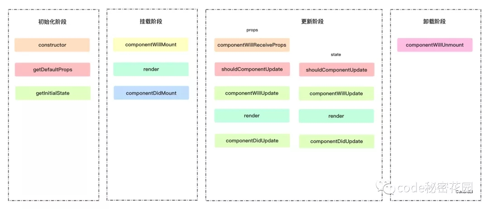
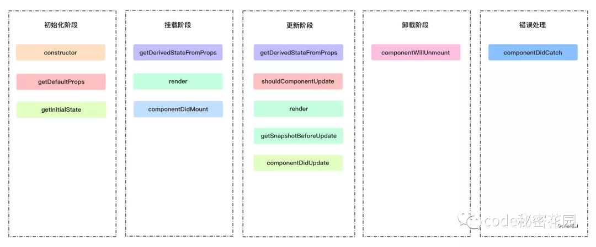
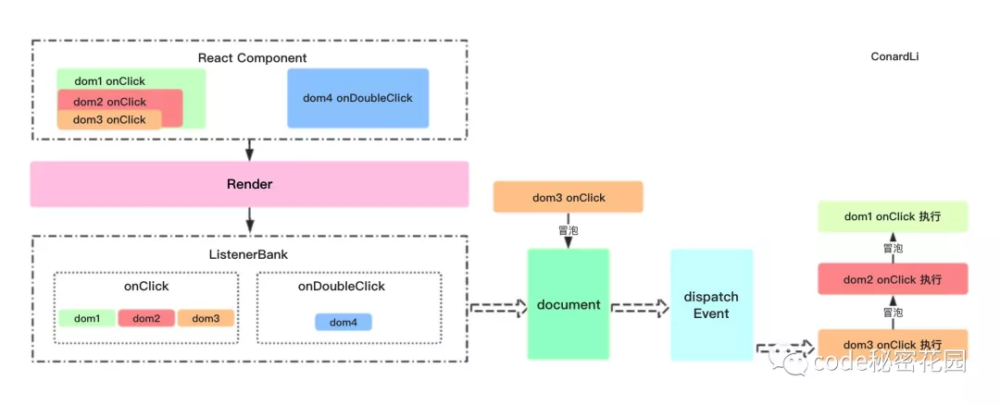
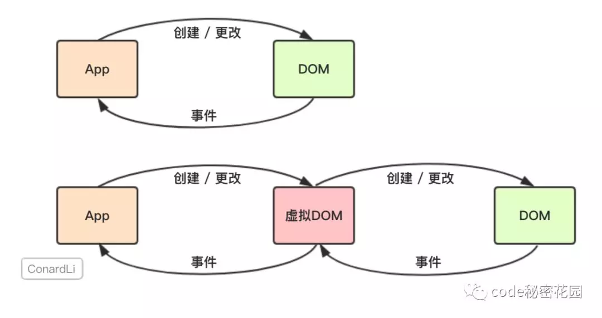
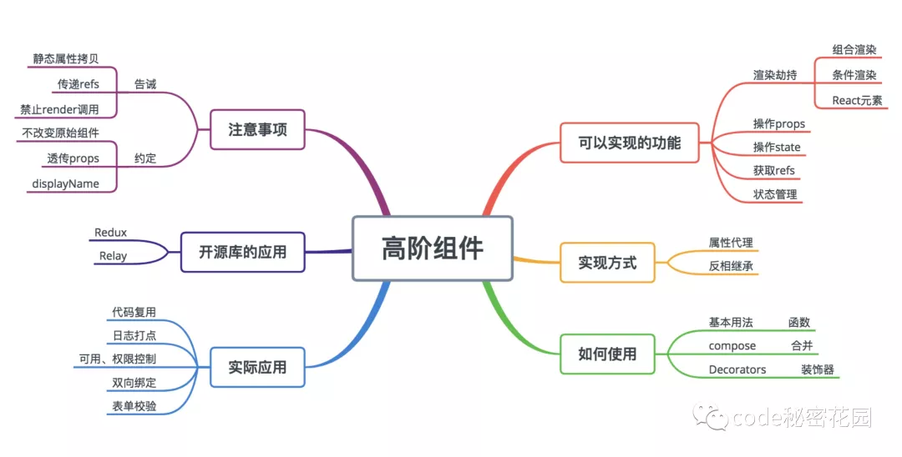

React高频面试题
===
<!-- TOC -->

- [1.React生命周期有哪些，16版本生命周期发生了哪些变化？](#1react生命周期有哪些16版本生命周期发生了哪些变化)
  - [15生命周期](#15生命周期)
  - [16生命周期](#16生命周期)
- [2.setState是同步的还是异步的？](#2setstate是同步的还是异步的)
  - [生命周期和合成事件中](#生命周期和合成事件中)
  - [异步代码和原生事件中](#异步代码和原生事件中)
  - [最佳实践](#最佳实践)
- [3.为什么有时连续多次setState只有一次生效？](#3为什么有时连续多次setstate只有一次生效)
- [4.React如何实现自己的事件机制？](#4react如何实现自己的事件机制)
  - [组件挂载、更新时：](#组件挂载更新时)
  - [事件初始化：](#事件初始化)
  - [触发事件时：](#触发事件时)
- [5.为何React事件要自己绑定this？](#5为何react事件要自己绑定this)
- [6.原生事件和React事件的区别？](#6原生事件和react事件的区别)
- [7.React的合成事件是什么？](#7react的合成事件是什么)
- [8.React和原生事件的执行顺序是什么？可以混用吗？](#8react和原生事件的执行顺序是什么可以混用吗)
- [9.虚拟Dom是什么？](#9虚拟dom是什么)
- [10.虚拟Dom比普通Dom更快吗？](#10虚拟dom比普通dom更快吗)
- [11.虚拟Dom中的$$typeof属性的作用是什么？](#11虚拟dom中的typeof属性的作用是什么)
- [12.React组件的渲染流程是什么？](#12react组件的渲染流程是什么)
- [13.为什么代码中一定要引入React？](#13为什么代码中一定要引入react)
- [14.为什么React组件首字母必须大写？](#14为什么react组件首字母必须大写)
- [15.React在渲染真实Dom时做了哪些性能优化？](#15react在渲染真实dom时做了哪些性能优化)
- [16.什么是高阶组件？如何实现？](#16什么是高阶组件如何实现)
- [17.HOC在业务场景中有哪些实际应用场景？](#17hoc在业务场景中有哪些实际应用场景)
- [18.高阶组件(HOC)和Mixin的异同点是什么？](#18高阶组件hoc和mixin的异同点是什么)
- [19.Hook有哪些优势？](#19hook有哪些优势)

<!-- /TOC -->

## 1.React生命周期有哪些，16版本生命周期发生了哪些变化？
### 15生命周期



* 初始化阶段
    - `constructor` 构造函数
    - `getDefaultProps props`默认值
    - `getInitialState state`默认值

* 挂载阶段
    - `componentWillMount` 组件初始化渲染前调用
    - `render` 组件渲染
    - `componentDidMount`组件挂载到 `DOM`后调用

* 更新阶段
    - `componentWillReceiveProps` 组件将要接收新 props前调用
    - `shouldComponentUpdate` 组件是否需要更新
    - `componentWillUpdate` 组件更新前调用
    - `render` 组件渲染
    - `componentDidUpdate` 组件更新后调用

* 卸载阶段
    - `componentWillUnmount` 组件卸载前调用

### 16生命周期


* 初始化阶段
    - `constructor` 构造函数
    - `getDefaultProps props`默认值
    - `getInitialState state`默认值

* 挂载阶段
    - `staticgetDerivedStateFromProps(props,state)`
    - `render`
    - `componentDidMount`

    > `getDerivedStateFromProps`：组件每次被 `rerender`的时候，包括在组件构建之后(虚拟 `dom`之后，实际 `dom`挂载之前)，每次获取新的 `props`或 `state`之后；每次接收新的`props`之后都会返回一个对象作为新的 `state`，返回null则说明不需要更新 `state`；配合 `componentDidUpdate`，可以覆盖 `componentWillReceiveProps`的所有用法

* 更新阶段
    - `staticgetDerivedStateFromProps(props,state)`
    - `shouldComponentUpdate`
    - `render`
    - `getSnapshotBeforeUpdate(prevProps,prevState)`
    - `componentDidUpdate`

    > `getSnapshotBeforeUpdate`：触发时间: `update`发生的时候，在 `render`之后，在组件 `dom`渲染之前；返回一个值，作为 `componentDidUpdate`的第三个参数；配合 `componentDidUpdate`, 可以覆盖 `componentWillUpdate`的所有用法

* 卸载阶段
    - componentWillUnmount

* 错误处理
    - componentDidCatch

**React16**新的生命周期弃用了 `componentWillMount`、`componentWillReceivePorps`，`componentWillUpdate`新增了 `getDerivedStateFromProps`、`getSnapshotBeforeUpdate`来代替弃用的三个钩子函数。

> **React16**并没有删除这三个钩子函数，但是不能和新增的钩子函数混用， **React17**将会删除这三个钩子函数，新增了对错误的处理（ `componentDidCatch`）


## 2.setState是同步的还是异步的？
### 生命周期和合成事件中
在 React的生命周期和合成事件中， React仍然处于他的更新机制中，这时无论调用多少次 setState，都不会立即执行更新，而是将要更新的`·`存入 `_pendingStateQueue`，将要更新的组件存入 `dirtyComponent`。

当上一次更新机制执行完毕，以生命周期为例，所有组件，即最顶层组件 `didmount`后会将批处理标志设置为 false。这时将取出 `dirtyComponent`中的组件以及 `_pendingStateQueue`中的 `state`进行更新。这样就可以确保组件不会被重新渲染多次。

```js
componentDidMount(){
	this.setState({
		index: this.state.index + 1
	});

	console.log('state', this.state.index);
}
```

所以，如上面的代码，当我们在执行 setState后立即**去获取 state，这时是获取不到更新后的 state的，因为处于 React的批处理机制中， state被暂存起来，待批处理机制完成之后，统一进行更新**。

所以。**setState本身并不是异步的，而是 React的批处理机制给人一种异步的假象**。

### 异步代码和原生事件中
```js
componentDidMount () {
  setTimeout(() => {
    console.log('调用setState');
    this.setState({
      index: this.state.index + 1
    });
    console.log("state", this.state.index);
  }, 0)
}
```

如上面的代码，当我们在异步代码中调用 `setState`时，根据 `JavaScript`的异步机制，会将异步代码先暂存，等所有同步代码执行完毕后在执行，这时 `React`的批处理机制已经走完，处理标志设被设置为 `false`，这时再调用 `setState`即可立即执行更新，拿到更新后的结果。

**在原生事件中调用 `setState`并不会出发 React的批处理机制，所以立即能拿到最新结果**。

### 最佳实践
`setState`的第二个参数接收一个函数，该函数会在 `React`的批处理机制完成之后调用，所以你想在调用 `setState`后立即获取更新后的值，请在该回调函数中获取。

```js
this.setState({
  index: this.state.index + 1 
}, () => {
  console.log(this.state.index);    
})
```  

## 3.为什么有时连续多次setState只有一次生效？
例如下面的代码，两次打印出的结果是相同的：
```js
  componentDidMount() {
    this.setState(
      { index: this.state.index + 1 },
      () => {
        console.log(this.state.index);
      }
    );

    this.setState(
      { index: this.state.index + 1 },
      () => {
        console.log(this.state.index);
      }
    );
  }
```

原因就是 **React会批处理机制中存储的多个 setState进行合并**，来看下 React源码中的 _assign函数，类似于 Object的 assign：

```js
_assign(
  nextState,
  typeof partial === "function"
    ? partial.call(inst, nextState, props, context)
    : partial
);
```

如果传入的是对象，很明显会被合并成一次，所以上面的代码两次打印的结果是相同的：

```js
Object.assign(
  nextState,
  { index: state.index + 1 },
  { index: state.index + 1 }
);
```

注意， `assign`函数中对函数做了特殊处理，处理第一个参数传入的是函数，函数的参数 `preState`是前一次合并后的结果，所以计算结果是准确的：

```js
  componentDidMount() {
    this.setState(
      (state, props) => ({
        index: state.index + 1
      }),
      () => {
        console.log(this.state.index);
      }
    );

    this.setState(
      (state, props) => ({
        index: state.index + 1
      }),
      () => {
        console.log(this.state.index);
      }
    );
  }
```

所以上面的代码两次打印的结果是不同的。

**最佳实践**

React会对多次连续的 setState进行合并，如果你想立即使用上次 setState后的结果进行下一次 setState，可以让 setState 接收一个函数而不是一个对象。这个函数用上一个 state 作为第一个参数，将此次更新被应用时的 props 做为第二个参数。


## 4.React如何实现自己的事件机制？
React事件并没有绑定在真实的 Dom节点上，而是通过事件代理，在最外层的 document上对事件进行统一分发。



### 组件挂载、更新时：
- 通过 `lastProps`、 `nextProps`判断是否新增、删除事件分别调用事件注册、卸载方法。
- 调用 `EventPluginHub`的 `enqueuePutListener`进行事件存储
- 获取 `document`对象。
- 根据事件名称（如 `onClick`、 `onCaptureClick`）判断是进行冒泡还是捕获。
- 判断是否存在 `addEventListener`方法，否则使用 `attachEvent`（兼容IE）。
- 给 `document`注册原生事件回调为 `dispatchEvent`(统一的事件分发机制）。

### 事件初始化：
- `EventPluginHub`负责管理 `React`合成事件的 `callback`，它将 `callback`存储在 `listenerBank`中，另外还存储了负责合成事件的 `Plugin`。
- 获取绑定事件的元素的唯一标识 `key`。
- 将 `callback`根据事件类型，元素的唯一标识 `key`存储在 `listenerBank`中。
- `listenerBank`的结构是： `listenerBank[registrationName][key]`。

### 触发事件时：
- 触发 `document`注册原生事件的回调 `dispatchEvent`
- 获取到触发这个事件最深一级的元素
- 遍历这个元素的所有父元素，依次对每一级元素进行处理。
- 构造合成事件。
- 将每一级的合成事件存储在 `eventQueue`事件队列中。
- 遍历 `eventQueue`。
- 通过 `isPropagationStopped`判断当前事件是否执行了阻止冒泡方法。
- 如果阻止了冒泡，停止遍历，否则通过 executeDispatch执行合成事件。
- 释放处理完成的事件。

> React在自己的合成事件中重写了 `stopPropagation`方法，将 `isPropagationStopped`设置为 `true`，然后在遍历每一级事件的过程中根据此遍历判断是否继续执行。`这就是 React自己实现的冒泡机制`。


## 5.为何React事件要自己绑定this？
在上面提到的事件处理流程中， React在 document上进行统一的事件分发， `dispatchEvent`通过循环调用所有层级的事件来模拟事件冒泡和捕获。

在 React源码中，当具体到某一事件处理函数将要调用时，将调用 `invokeGuardedCallback`方法。

```js
function invokeGuardedCallback(name, func, a) {
  try {
    func(a);
  } catch (x) {
    if (caughtError === null) {
      caughtError = x;
    }
  }
}
```

可见，**事件处理函数是直接调用的，并没有指定调用的组件，所以不进行手动绑定的情况下直接获取到的 this是不准确的，所以我们需要手动将当前组件绑定到 this上**。


## 6.原生事件和React事件的区别？
- React 事件使用驼峰命名，而不是全部小写。
- 通过 JSX , 你传递一个函数作为事件处理程序，而不是一个字符串。
- 在 React 中你不能通过返回 `false` 来阻止默认行为。必须明确调用 `preventDefault`。


## 7.React的合成事件是什么？
React 根据 W3C 规范定义了每个事件处理函数的参数，即合成事件。

事件处理程序将传递 `SyntheticEvent` 的实例，这是一个跨浏览器原生事件包装器。它具有与浏览器原生事件相同的接口，包括 `stopPropagation()` 和 `preventDefault()`，在所有浏览器中他们工作方式都相同。

React合成的 `SyntheticEvent`采用了事件池，这样做可以大大节省内存，而不会频繁的创建和销毁事件对象。

另外，不管在什么浏览器环境下，浏览器会将该事件类型统一创建为合成事件，从而达到了浏览器兼容的目的。


## 8.React和原生事件的执行顺序是什么？可以混用吗？
`React`的所有事件都通过 `document`进行统一分发。当真实 Dom触发事件后冒泡到 `document`后才会对 `React`事件进行处理。

所以原生的事件会先执行，然后执行 `React`合成事件，最后执行真正在 `document`上挂载的事件

`React`事件和原生事件最好不要混用。原生事件中如果执行了 `stopPropagation`方法，则会导致其他 `React`事件失效。因为所有元素的事件将无法冒泡到 `document`上，导致所有的 `React`事件都将无法被触发。。


## 9.虚拟Dom是什么？


在原生的 JavaScript程序中，我们直接对 DOM进行创建和更改，而 DOM元素通过我们监听的事件和我们的应用程序进行通讯。

而 React会先将你的代码转换成一个 JavaScript对象，然后这个 JavaScript对象再转换成真实 DOM。这个 JavaScript对象就是所谓的虚拟 DOM。

当我们需要创建或更新元素时， React首先会让这个 `VitrualDom`对象进行创建和更改，然后再将 `VitrualDom`对象渲染成真实DOM。

当我们需要对 DOM进行事件监听时，首先对 `VitrualDom`进行事件监听， `VitrualDom`会代理原生的 DOM事件从而做出响应。


## 10.虚拟Dom比普通Dom更快吗？
很多文章说 `VitrualDom`可以提升性能，这一说法实际上是很片面的。

直接操作 DOM是非常耗费性能的，这一点毋庸置疑。但是 React使用 `VitrualDom`也是无法避免操作 DOM的。

如果是首次渲染， `VitrualDom`不具有任何优势，甚至它要进行更多的计算，消耗更多的内存。

`VitrualDom`的优势在于 React的 `Diff`算法和批处理策略， React在页面更新之前，提前计算好了如何进行更新和渲染 `DOM`。实际上，这个计算过程我们在直接操作 `DOM`时，也是可以自己判断和实现的，但是一定会耗费非常多的精力和时间，而且往往我们自己做的是不如 React好的。所以，在这个过程中 React帮助我们"提升了性能"。

所以，我更倾向于说， `VitrualDom`帮助我们提高了开发效率，在重复渲染时它帮助我们计算如何更高效的更新，而不是它比 `DOM`操作更快。


## 11.虚拟Dom中的$$typeof属性的作用是什么？
`ReactElement`中有一个 `$$typeof`属性，它被赋值为 `REACT_ELEMENT_TYPE`：

```js
var REACT_ELEMENT_TYPE =
  (typeof Symbol === "function" && Symbol.for && Symbol.for("react.element")) ||
  0xeac7;
```

可见， `$$typeof`是一个 `Symbol`类型的变量，这个变量可以防止 `XSS`。

如果你的服务器有一个漏洞，允许用户存储任意 `JSON`对象， 而客户端代码需要一个字符串，这可能会成为一个问题：

```js
// json
let expectedTextButGotJSON = {
  type: "div",
  props: {
    dangerouslySetInnerHTML: {
      __html: "/* put your exploit here */"
    }
  }
};

let message = {
  text: expectedTextButGotJSON
};

<p>{message.text}</p>;
```

`JSON`中不能存储 `Symbol`类型的变量。

`ReactElement.isValidElement`函数用来判断一个 React组件是否是有效的，下面是它的具体实现。

```js
ReactElement.isValidElement = function(object) {
  return typeof object === "object" &&
    object !== null &&
    object.$$typeof === REACT_ELEMENT_TYPE;
};
```

可见 `React`渲染时会把没有 `$$typeof`标识，以及规则校验不通过的组件过滤掉。

当你的环境不支持 `Symbol`时， `$$typeof`被赋值为 `0xeac7`，至于为什么， React开发者给出了答案：

> `0xeac7`看起来有点像 `React`。


## 12.React组件的渲染流程是什么？
- 使用 `React.createElement`或 `JSX`编写 React组件，实际上所有的 JSX代码最后都会转换成 `React.createElement(...)`， Babel帮助我们完成了这个转换的过程。
- `createElement`函数对 `key`和 `ref`等特殊的 `props`进行处理，并获取 `defaultProps`对默认 `props`进行赋值，并且对传入的孩子节点进行处理，最终构造成一个 `ReactElement`对象（所谓的虚拟 DOM）。
- `ReactDOM.render`将生成好的虚拟 `DOM`渲染到指定容器上，其中采用了批处理、事务等机制并且对特定浏览器进行了性能优化，最终转换为真实 `DOM`。


## 13.为什么代码中一定要引入React？
`JSX`只是为 `React.createElement(component,props,...children)`方法提供的语法糖。

所有的 `JSX`代码最后都会转换成 `React.createElement(...)`， `Babel`帮助我们完成了这个转换的过程。

所以使用了 `JSX`的代码都必须引入 `React`。


## 14.为什么React组件首字母必须大写？
babel在编译时会判断 JSX中组件的首字母，当首字母为小写时，其被认定为原生 DOM标签， `createElement`的第一个变量被编译为字符串；当首字母为大写时，其被认定为自定义组件， `createElement`的第一个变量被编译为对象；


## 15.React在渲染真实Dom时做了哪些性能优化？
在 IE（8-11）和 Edge浏览器中，一个一个插入无子孙的节点，效率要远高于插入一整个序列化完整的节点树。

`React`通过 `lazyTree`，在 IE（8-11）和 Edge中进行单个节点依次渲染节点，而在其他浏览器中则首先将整个大的 DOM结构构建好，然后再整体插入容器。

并且，在单独渲染节点时， React还考虑了 `fragment`等特殊节点，这些节点则不会一个一个插入渲染。


## 16.什么是高阶组件？如何实现？
**高阶组件可以看作 React对装饰模式的一种实现，高阶组件就是一个函数，且该函数接受一个组件作为参数，并返回一个新的组件**。

> 高阶组件（ `HOC` ）是 `React`中的高级技术，用来重用组件逻辑。但高阶组件本身并不是 `ReactAPI`。它只是一种模式，这种模式是由 `React`自身的组合性质必然产生的。

```js
function visible ( WrappedComponent ) {
  return class extends  Component {
    render() {
      const { visible, ...props } = this.props;
      if(visible === alse) return null;
      return <WrappedComponent {...props} />;
    }
  }
}
```

上面的代码就是一个 `HOC`的简单应用，函数接收一个组件作为参数，并返回一个新组件，新组建可以接收一个 `visible props`，根据 `visible`的值来判断是否渲染Visible。



我们可以通过以下两种方式实现高阶组件：
1. 属性代理  
    函数返回一个我们自己定义的组件，然后在 `render`中返回要包裹的组件，这样我们就可以代理所有传入的 `props`，并且决定如何渲染，实际上 ，这种方式生成的高阶组件就是原组件的父组件，上面的函数 `visible`就是一个 HOC属性代理的实现方式。

    ```js
    function proxyHOC ( WrappedComponent ) {
      return class extends  Component {
        render() {
          return <WrappedComponent {...props} />;
        }
      }
    }
    ```

    对比原生组件增强的项：
    - 可操作所有传入的 `props`
    - 可操作组件的生命周期
    - 可操作组件的 `static`方法
    - 获取 `refs`

2. 反向继承
    返回一个组件，继承原组件，在 render中调用原组件的 render。由于继承了原组件，能通过this访问到原组件的 生命周期、props、state、render等，相比属性代理它能操作更多的属性。

    ```js
    function inheritHOC ( WrappedComponent ) {
      return class extends  Component {
        render() {
          return super.render();
        }
      }
    }
    ```

    对比原生组件增强的项：
    - 可操作所有传入的 `props`
    - 可操作组件的生命周期
    - 可操作组件的 `static`方法
    - 获取 `refs`
    - 可操作 `state`
    - 可以渲染劫持


## 17.HOC在业务场景中有哪些实际应用场景？
HOC可以实现的功能：
- 组合渲染
- 条件渲染
- 操作 props
- 获取 refs
- 状态管理
- 操作 state
- 渲染劫持

HOC在业务中的实际应用场景：
- 日志打点
- 权限控制
- 双向绑定
- 表单校验


## 18.高阶组件(HOC)和Mixin的异同点是什么？
`Mixin`和 `HOC`都可以用来解决 React的代码复用问题。


- Mixin 可能会相互依赖，相互耦合，不利于代码维护
- 不同的 Mixin中的方法可能会相互冲突
- Mixin非常多时，组件是可以感知到的，甚至还要为其做相关处理，这样会给代码造成滚雪球式的复杂性

而 HOC的出现可以解决这些问题：
- 高阶组件就是一个没有副作用的纯函数，各个高阶组件不会互相依赖耦合
- 高阶组件也有可能造成冲突，但我们可以在遵守约定的情况下避免这些行为
- 高阶组件并不关心数据使用的方式和原因，而被包裹的组件也不关心数据来自何处。高阶组件的增加不会为原组件增加负担


## 19.Hook有哪些优势？
1. 减少状态逻辑复用的风险
    Hook和 Mixin在用法上有一定的相似之处，但是 Mixin引入的逻辑和状态是可以相互覆盖的，而多个 Hook之间互不影响，这让我们不需要在把一部分精力放在防止避免逻辑复用的冲突上。在不遵守约定的情况下使用 HOC也有可能带来一定冲突，比如 props覆盖等等，使用 Hook则可以避免这些问题。
2. 避免地狱式嵌套
    大量使用 HOC的情况下让我们的代码变得嵌套层级非常深，使用 HOC，我们可以实现扁平式的状态逻辑复用，而避免了大量的组件嵌套。
3. 让组件更容易理解
    在使用 class组件构建我们的程序时，他们各自拥有自己的状态，业务逻辑的复杂使这些组件变得越来越庞大，各个生命周期中会调用越来越多的逻辑，越来越难以维护。使用 Hook，可以让你更大限度的将公用逻辑抽离，将一个组件分割成更小的函数，而不是强制基于生命周期方法进行分割。
4. 使用函数代替class
    相比函数，编写一个 class可能需要掌握更多的知识，需要注意的点也越多，比如 this指向、绑定事件等等。另外，计算机理解一个 class比理解一个函数更快。Hooks让你可以在 classes之外使用更多 React的新特性。
